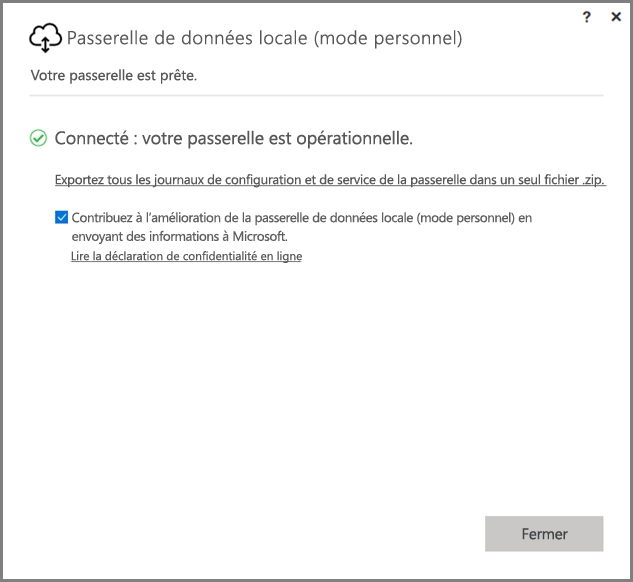
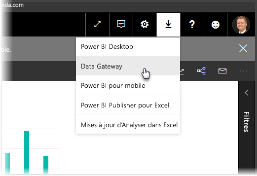
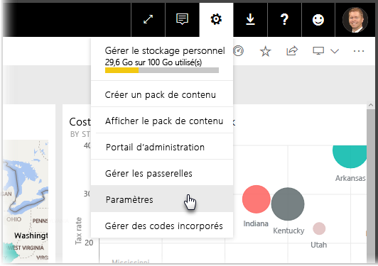
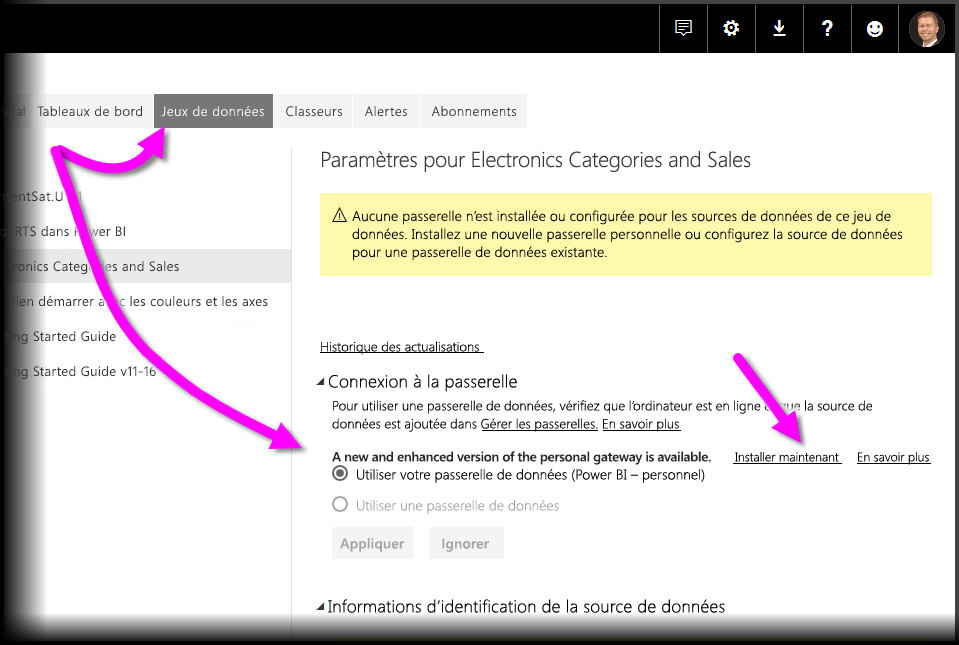
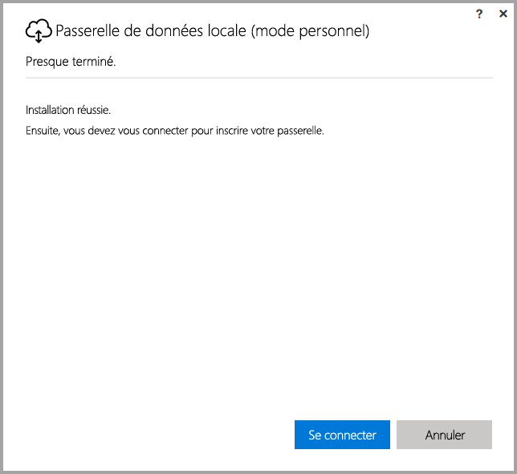
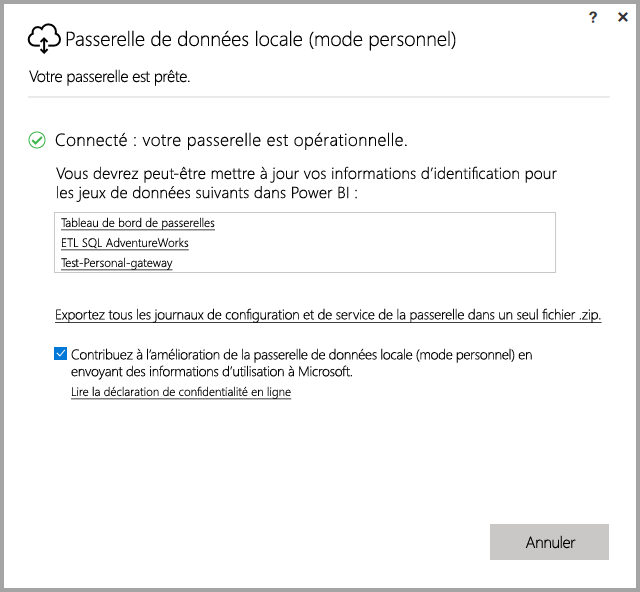

# <a name="on-premises-data-gateway-personal-mode"></a>Passerelle de données locale (mode personnel)
Vous pouvez utiliser des sources de données locales et créer des rapports et des tableaux de bord Power BI à l’aide d’une passerelle. Une **passerelle** est un logiciel qui facilite l’accès aux données stockées sur un réseau local privé, puis vous permet d’utiliser ces données dans les services en ligne comme le **service Power BI**. La **passerelle de données locale (mode personnel)** est une mise à jour récemment publiée de la passerelle Power BI qui permet aux utilisateurs d’installer une passerelle sur leur propre ordinateur et d’accéder aux données locales.



> [!NOTE]
> La **passerelle de données locale (mode personnel)** remplace la version précédente de la passerelle personnelle, appelée **Power BI Gateway - Personal**. La passerelle personnelle précédente fonctionnera jusqu’au 31 juillet 2017. Consultez les sections ci-dessous pour plus d’informations sur la mise à jour vers la nouvelle version.
> 
> 

## <a name="features-of-the-on-premises-data-gateway-personal-mode"></a>Caractéristiques de la passerelle de données locale (mode personnel)
Avec la publication de la **passerelle de données locale (mode personnel)**, de nombreuses améliorations et fonctionnalités sont à présent disponibles. Dans la version précédente de la passerelle personnelle (appelée **Passerelle Power BI - Personal**), son implémentation imposait certaines limitations. Comme pour de nombreux produits Power BI, nous avons pris en compte les besoins et les demandes des clients et analysé l’utilisation qu’ils faisaient du produit. Par conséquent, la **passerelle de données locale (mode personnel)** a été totalement repensée et comprend les améliorations et les fonctionnalités suivantes :

* **Amélioration de la fiabilité** : la nouvelle version de la passerelle personnelle gagne en fiabilité par rapport à la version antérieure, grâce à des améliorations dans le code et dans la structure.
* **Amélioration de l’extensibilité** : dans le cadre des améliorations logicielles structurelles, des fonctionnalités supplémentaires peuvent facilement être ajoutées à la passerelle personnelle dès qu’elles sont disponibles.
* **Supprimer la passerelle personnelle à partir du service Power BI** : avec la nouvelle version, vous pouvez maintenant supprimer votre passerelle personnelle depuis le **service Power BI**.
* **Journaux de configuration et de service** : la nouvelle version vous permet d’exporter facilement les journaux de configuration et de service dans un fichier .zip, en un seul clic.

## <a name="installing-on-premises-data-gateway-personal-mode"></a>Installation de la passerelle de données locale (mode personnel)
Pour installer la **passerelle de données locale (mode personnel)** sans disposer de la version précédente de la passerelle, sélectionnez l’icône d’engrenage dans le **service Power BI** et sélectionnez **Passerelle de données**.



Vous pouvez également télécharger la passerelle sur [cet emplacement](https://go.microsoft.com/fwlink/?LinkId=820925&clcid=0x409). Vous pouvez suivre les étapes d’installation, et étant donné que le processus d’installation vous permet d’installer n’importe quelle version de la passerelle (la passerelle standard, qui peut être partagée avec d’autres personnes, ou le mode personnel), sélectionnez bien **passerelle de données locale (mode personnel)** lorsque vous êtes invité à choisir la version de la passerelle que vous souhaitez installer.

### <a name="updating-from-the-previous-personal-gateway"></a>Mise à jour à partir de la passerelle personnelle précédente
Si la **Passerelle Power BI - Personal** est déjà installée, vous êtes invité à installer la nouvelle version de la passerelle personnelle lorsque vous affichez **Jeux de données** sous **Paramètres** dans le **service Power BI**.



Lorsque vous sélectionnez un jeu de données, puis que vous sélectionnez **Connexion à la passerelle**, vous êtes averti qu’une nouvelle version de la passerelle personnelle est disponible. Sélectionnez **Installer maintenant**.



> [!NOTE]
> Si vous utilisez la version précédente de **Power BI Gateway - Personal**  comme processus avec élévation de privilèges, veillez à démarrer le processus d’installation de la nouvelle passerelle avec l’élévation de privilèges, afin que les informations d’identification de votre jeu de données puissent être automatiquement mises à jour. Sinon, vous devez mettre à jour manuellement les informations d’identification du jeu de données.
> 
> 

Vous êtes alors guidé dans le processus de mise à jour, à la suite duquel vous voyez que l’installation a réussi. Ne fermez pas encore la passerelle, il reste une dernière étape.



La voici. Une fois la nouvelle passerelle personnelle installée (le dernier écran d’installation restant encore visible), connectez-vous au **service Power BI** et attendez de voir que la passerelle est en ligne, comme présenté dans l’image suivante.



Si vous avez mis à jour la passerelle personnelle sur l’ordinateur sur lequel la passerelle précédente est installée, vos informations d’identification sont automatiquement mises à jour et toutes les activités d’actualisation passent par la nouvelle passerelle. Si la passerelle précédente a été installée sur un autre ordinateur, vous êtes invité à mettre à jour vos informations d’identification sur certains jeux de données. Dans l’image précédente, notez la liste des jeux de données dans la fenêtre : cette liste contient les jeux de données qui nécessitent une mise à jour éventuelle des informations d’identification. Chaque jeu de données répertorié est un lien direct sur lequel vous cliquez pour mettre à jour vos informations d’identification.

C’est tout - ou presque. Une fois la nouvelle passerelle installée, vous n’avez plus besoin de la version précédente sur votre ordinateur. Vous pouvez donc la désinstaller. Recherchez **Passerelle Power BI - Personal** sur votre ordinateur et désinstallez cette version.

### <a name="determining-which-version-of-the-personal-gateway-you-have-installed"></a>Détermination de la version de la passerelle personnelle installée
Pour déterminer la version de la passerelle personnelle actuellement installée, procédez comme suit :

* La version précédente de la passerelle personnelle est appelée **Passerelle Power BI - Personal** et utilise l’icône Power BI dans sa boîte de dialogue d’installation.
* La nouvelle version de la passerelle personnelle est appelée **passerelle de données locale (mode personnel)** et utilise l’icône de la passerelle (il s’agit d’un nuage avec une flèche vers le bas).

Vous pouvez ouvrir **Ajout/Suppression de programmes** et voir si **Passerelle Power BI - Personal** s’affiche dans la liste. Si c’est le cas, vous disposez de la version précédente de la passerelle personnelle.

## <a name="using-fast-combine-with-the-personal-gateway"></a>Utilisation de Fast Combine avec la passerelle personnelle
Si vous utilisiez **Fast Combine** avec la passerelle précédente, vous devez procéder comme suit pour réactiver **Fast Combine** pour que ce composant fonctionne avec la **passerelle de données locale (mode personnel)** :

1. À l’aide de l’Explorateur de fichiers, ouvrez le fichier suivant :
   
   ```
   %localappdata%\Microsoft\On-premises data gateway (personal mode)\Microsoft.PowerBI.DataMovement.Pipeline.GatewayCore.dll.config
   ```
2. En bas du fichier, ajoutez le texte suivant :
   
       ```
       <setting name="EnableFastCombine" serializeAs="String">```
       <value>true</value>
       </setting>
       ```
3. Une fois que vous avez effectué cette opération, le paramètre est actif environ une minute plus tard. Pour vérifier s’il fonctionne correctement, essayez une actualisation à la demande dans le **service Power BI** pour vérifier si **Fast Combine** fonctionne.

## <a name="limitations-and-considerations"></a>Considérations et limitations
Il existe quelques points à prendre en compte lorsque vous utilisez la **passerelle de données locale (mode personnel)**, comme décrit dans la liste suivante.

* Si vous utilisez **Windows Hello** ou un code confidentiel pour vous connecter à Windows, vous pouvez rencontrer l’erreur suivante : 
  * *Le compte d’utilisateur que vous avez sélectionné ne correspond pas à la configuration requise de l’application. Veuillez utiliser un autre compte.*
  * Pour corriger cette erreur, sélectionnez *Utiliser un autre compte* et connectez-vous à nouveau. 

Les sources de données suivantes ne sont actuellement pas prises en charge par la **passerelle de données locale (mode personnel)** :

* ADO.NET 
* CurrentWorkbook
* FTP
* HDFS
* SAP BusinessObjects         
* Spark

La prise en charge de Spark est prévue pour la seconde moitié de l’année 2017.

## <a name="frequently-asked-questions-faq"></a>Forum Aux Questions
* Puis-je exécuter la **passerelle de données locale (mode personnel)** côte à côte avec la **passerelle de données locale** (version Enterprise de la passerelle) ?
  
  * **Réponse** : Oui, avec la nouvelle version, ces deux versions peuvent fonctionner simultanément.
* Est-il possible d’utiliser la **passerelle de données locale (mode personnel)** en tant que service ?
  
  * **Réponse** : Non. La **passerelle de données locale (mode personnel)** peut uniquement être exécutée en tant qu’application. Si vous devez utiliser la passerelle en tant que service et/ou en mode administrateur, utilisez la [**passerelle de données locale** ](service-gateway-onprem.md) (version Enterprise de la passerelle).
* Quelle est la fréquence de mise à jour de la **passerelle de données locale (mode personnel)** ?
  
  * **Réponse** : Nous prévoyons de mettre à jour la passerelle tous les mois.
* Pourquoi suis-je invité à mettre à jour mes informations d’identification ?
  
  * **Réponse** : Plusieurs situations peuvent déclencher une demande d’informations d’identification. La plus courante est que vous avez réinstallé la **passerelle de données locale (mode personnel)** sur un ordinateur différent de celui sur lequel vous avez installé votre **Passerelle Power BI - Personal**. Il peut également s’agir d’un problème dans la source de données et Power BI n’a pas pu effectuer le test de connexion, le délai d’attente a été dépassé ou une erreur système s’est produite. Vous pouvez mettre à jour vos informations d’identification dans le **service Power BI** en accédant à l’**icône d’engrenage** et en sélectionnant **Paramètres**, puis **Jeux de données**. Recherchez ensuite le jeu de données en question et cliquez sur *Mettre à jour les informations d’identification*.
* Pendant combien de temps ma passerelle personnelle est-elle hors connexion pendant la mise à niveau ?
  
  * **Réponse** : La mise à niveau de la passerelle personnelle vers la nouvelle version ne doit prendre que quelques minutes. 
* Que se passe-t-il si je ne migre pas vers la nouvelle passerelle personnelle avant le 31 juillet 2017 ?
  
  * **Réponse** : Si vous actualisez vos rapports avec la passerelle actuelle, vos actualisations s’arrêteront. La seule façon de créer une nouvelle planification d’actualisation sera d’installer et de configurer la nouvelle passerelle.
* J’utilise des scripts R. Est-ce qu’ils sont pris en charge ?
  
  * **Réponse** : Nous prévoyons d’ajouter la prise en charge des scripts R pour bientôt.
* Pourquoi est-ce que je ne vois pas le message pour mettre à jour la passerelle dans le **service Power BI** ?
  
  * **Réponse** : Ceci est vraisemblablement dû au fait que vous avez un ou plusieurs jeux de données qui incluent une source de données non prise en charge.

## <a name="next-steps"></a>Étapes suivantes
[Configuration des paramètres de proxy pour les passerelles Power BI](service-gateway-proxy.md)  
D’autres questions ? [Posez vos questions à la communauté Power BI](http://community.powerbi.com/)

