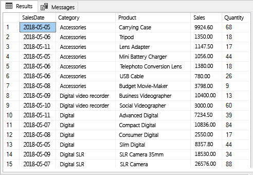
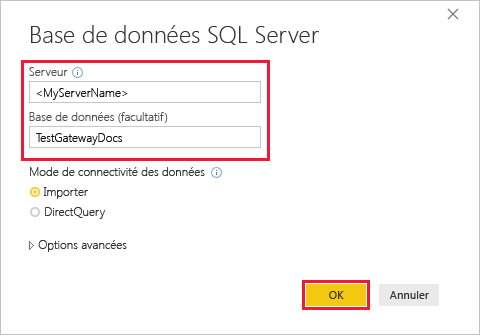
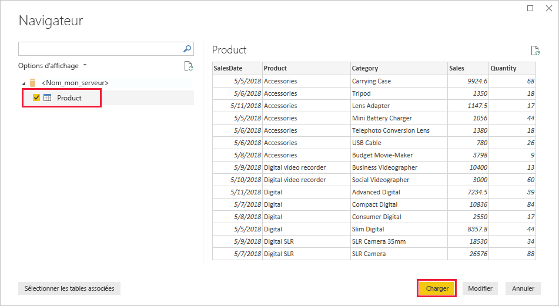
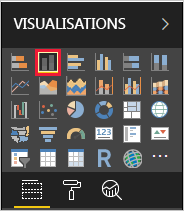
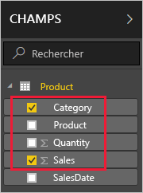
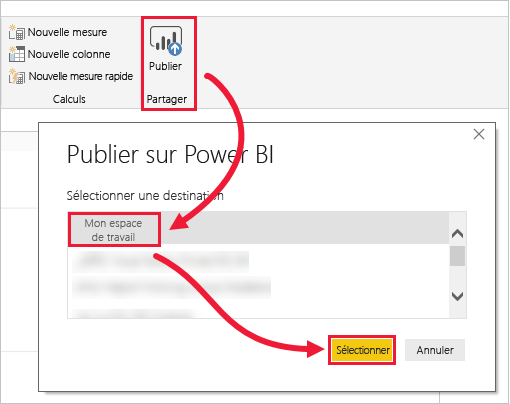
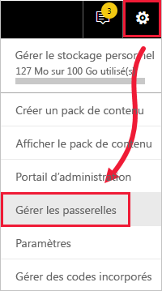
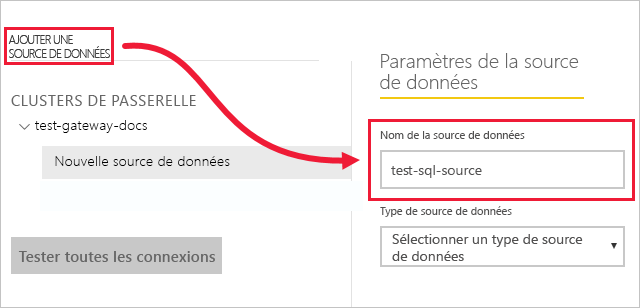
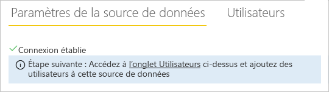
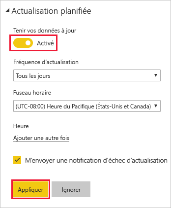

# <a name="tutorial-connect-to-on-premises-data-in-sql-server"></a>Tutoriel : Se connecter à des données locales dans SQL Server

Une passerelle de données locale est un logiciel qui s’installe sur un réseau local et facilite l’accès aux données de ce réseau. Dans ce tutoriel, vous générez un rapport dans Power BI Desktop à partir des données importées depuis SQL Server. Vous publiez ensuite le rapport sur le service Power BI et configurez une passerelle afin que le service puisse accéder aux données locales. Cet accès signifie que le service peut actualiser les données pour maintenir le rapport à jour.

Dans ce tutoriel, vous allez découvrir comment :
> [!div class="checklist"]
> * Créer un rapport à partir des données dans SQL Server
> * Publier le rapport dans le service Power BI
> * Ajouter SQL Server comme source de données de passerelle
> * Actualiser les données dans le rapport

Si vous n’êtes pas inscrit à Power BI, [inscrivez-vous à un essai gratuit](https://app.powerbi.com/signupredirect?pbi_source=web) avant de commencer.


## <a name="prerequisites"></a>Conditions préalables

* [Installer Power BI Desktop](https://powerbi.microsoft.com/desktop/)
* [Installer SQL Server](https://docs.microsoft.com/sql/database-engine/install-windows/install-sql-server) sur un ordinateur local 
* [Installer une passerelle de données locale](service-gateway-install.md) sur le même ordinateur local (en production, généralement un autre ordinateur)


## <a name="set-up-sample-data"></a>Configurer les exemples de données

Vous commencez par ajouter des exemples de données à SQL Server afin de les utiliser dans le reste de ce tutoriel.

1. Dans SQL Server Management Studio (SSMS), connectez-vous à votre instance SQL Server et créez une base de données de test.

    ```sql
    CREATE DATABASE TestGatewayDocs
    ```

2. Dans la base de données que vous avez créée, ajoutez une table et insérez des données.

    ```sql
    USE TestGatewayDocs

    CREATE TABLE Product (
        SalesDate DATE,
        Category  VARCHAR(100),
        Product VARCHAR(100),
        Sales MONEY,
        Quantity INT
    )

    INSERT INTO Product VALUES('2018-05-05','Accessories','Carrying Case',9924.60,68)
    INSERT INTO Product VALUES('2018-05-06','Accessories','Tripod',1350.00,18)
    INSERT INTO Product VALUES('2018-05-11','Accessories','Lens Adapter',1147.50,17)
    INSERT INTO Product VALUES('2018-05-05','Accessories','Mini Battery Charger',1056.00,44)
    INSERT INTO Product VALUES('2018-05-06','Accessories','Telephoto Conversion Lens',1380.00,18)
    INSERT INTO Product VALUES('2018-05-06','Accessories','USB Cable',780.00,26)
    INSERT INTO Product VALUES('2018-05-08','Accessories','Budget Movie-Maker',3798.00,9)
    INSERT INTO Product VALUES('2018-05-09','Digital video recorder','Business Videographer',10400.00,13)
    INSERT INTO Product VALUES('2018-05-10','Digital video recorder','Social Videographer',3000.00,60)
    INSERT INTO Product VALUES('2018-05-11','Digital','Advanced Digital',7234.50,39)
    INSERT INTO Product VALUES('2018-05-07','Digital','Compact Digital',10836.00,84)
    INSERT INTO Product VALUES('2018-05-08','Digital','Consumer Digital',2550.00,17)
    INSERT INTO Product VALUES('2018-05-05','Digital','Slim Digital',8357.80,44)
    INSERT INTO Product VALUES('2018-05-09','Digital SLR','SLR Camera 35mm',18530.00,34)
    INSERT INTO Product VALUES('2018-05-07','Digital SLR','SLR Camera',26576.00,88)
    ```

3. Sélectionnez les données de la table afin de les vérifier.

    ```sql
    SELECT * FROM Product
    ```

    


## <a name="build-and-publish-a-report"></a>Générer et publier un rapport

Maintenant que vous avez des exemples de données exploitables, vous vous connectez à SQL Server dans Power BI Desktop et générez un rapport basé sur ces données. Vous publiez ensuite ce rapport dans le service Power BI.

1. Dans Power BI Desktop, sous l’onglet **Accueil**, sélectionnez **Obtenir les données** > **SQL Server**.

2. Sous **Serveur**, entrez le nom de votre serveur, puis sous **Base de données**, entrez « TestGatewayDocs ». Sélectionnez **OK**. 

    

3. Vérifiez vos informations d’identification, puis sélectionnez **Se connecter**.

4. Sous **Navigator**, sélectionnez la table **Product**, puis **Charger**.

    

5. Dans la vue **Rapport** de Power BI Desktop, dans le volet **Visualisations**, sélectionnez l’option **Histogramme empilé**.

        

6. Avec l’histogramme sélectionné dans le canevas du rapport, dans le volet **Champs**, sélectionnez les champs **Catégorie** et **Ventes**.  

    

    L’histogramme devrait maintenant ressembler à ce qui suit.

    

    Notez que **SLR Camera** représente actuellement les meilleures ventes. Cette valeur changera lorsque vous mettrez à jour les données et actualiserez le rapport ultérieurement dans ce tutoriel.

7. Enregistrez le rapport sous le nom « TestGatewayDocs.pbix ».

8. Sous l’onglet **Accueil**, sélectionnez **Publier** > **Mon espace de travail** > **Sélectionner**. Connectez-vous au service Power BI si vous êtes invité à le faire. 

    

9. Dans l’écran **Opération réussie**, sélectionnez **Ouvrir 'TestGatewayDocs.pbix' dans Power BI**.


## <a name="add-sql-server-as-a-gateway-data-source"></a>Ajouter SQL Server comme source de données de passerelle

Dans Power BI Desktop, vous vous connectez directement à SQL Server, mais le service Power BI requiert une passerelle pour agir comme un pont. Vous ajoutez maintenant votre instance SQL Server en tant que source de données pour la passerelle que vous avez créée dans un article précédent (dans la section [Conditions préalables](#prereqisites)). 

1. Dans l’angle supérieur droit du service Power BI, sélectionnez l’ > **Gérer les passerelles**.

    

2. Sélectionnez **Ajouter une source de données**, puis entrez « test-sql-source » dans le champ **Nom de la source de données**.

    

3. Sélectionnez un **type de source de données** **SQL Server**, puis entrez les autres valeurs, comme indiqué.

    

    | Option | Value |
    | ---    | ---   |
    | **Nom de la source de données**       | test-sql-source      |
    | **Type de source de données**       | SQL Server      |
    | **Serveur**       |  Le nom de votre instance SQL Server (doit être identique à celui que vous avez spécifié dans Power BI Desktop)    |
    | **Base de données**       | TestGatewayDocs      |
    | **Méthode d'authentification**       | Windows      |
    | **Nom d’utilisateur**        |  Le compte, par exemple michael@contoso.com, que vous utilisez pour vous connecter à SQL Server     |
    | **Mot de passe**       |  Le mot de passe du compte que vous utilisez pour vous connecter à SQL Server    |

4. Sélectionnez **Ajouter**. Le message *Connexion établie* apparaît si l’opération réussit.

    

    Vous pouvez maintenant utiliser cette source de données pour inclure des données provenant de SQL Server dans vos tableaux de bord Power BI et vos rapports.


## <a name="configure-and-use-data-refresh"></a>Configurer et utiliser l’actualisation des données

Vous avez publié un rapport sur le service Power BI et configuré la source de données SQL Server. Ces éléments en place, vous allez maintenant apporter une modification dans la table Product, et cette modification transitera via la passerelle jusqu’au rapport publié. Vous configurez également l’actualisation planifiée pour gérer toutes les modifications ultérieures.

1. Dans SSMS, mettez à jour les données de la table Product.

    ```sql
    UPDATE Product
    SET Sales = 32508, Quantity = 252
    WHERE Product='Compact Digital'     

    ```

2. Dans le volet de navigation de gauche du service Power BI, sélectionnez **Mon espace de travail**.

3. Sous **Jeux de données**, pour le jeu de données **TestGatewayDocs**, sélectionnez **plus** (**...** ) > **Actualiser maintenant**.

    

4. Sélectionnez **Mon espace de travail** > **Rapports** > **TestGatewayDocs**. Vous constatez que la mise à jour a été transmise et que la meilleure vente est désormais **Compact Digital**. 

    

5. Sélectionnez **Mon espace de travail** > **Rapports** > **TestGatewayDocs**. Sélectionnez **plus** (**. . .**) > **Planifier l’actualisation**.

6. Sous **Planifier l’actualisation**, définissez la valeur Actualiser sur **On**, puis sélectionnez **Appliquer**. Le jeu de données est actualisé quotidiennement par défaut.

    

## <a name="clean-up-resources"></a>Nettoyer les ressources
Si vous ne souhaitez plus utiliser les exemples de données, exécutez `DROP DATABASE TestGatewayDocs` dans SSMS. Si vous ne souhaitez pas utiliser la source de données SQL Server, [supprimez la source de données](service-gateway-manage.md#remove-a-data-source). 


## <a name="next-steps"></a>Étapes suivantes
Dans ce tutoriel, vous avez découvert comment :
> [!div class="checklist"]
> * Créer un rapport à partir des données dans SQL Server
> * Publier le rapport dans le service Power BI
> * Ajouter SQL Server comme source de données de passerelle
> * Actualiser les données dans le rapport

Passez à l’article suivant pour en savoir plus
> [!div class="nextstepaction"]
> [Gérer une passerelle Power BI](service-gateway-manage.md)

