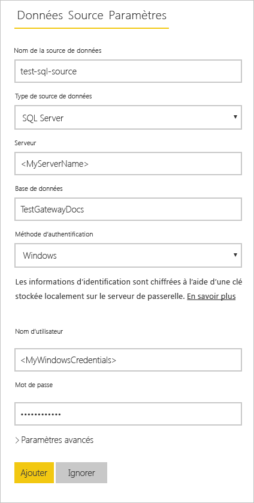
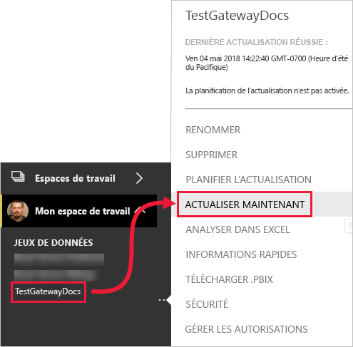

# <a name="refresh-data-from-an-on-premises-sql-server-database"></a>Actualiser des données à partir d’une base de données SQL Server locale

Dans ce tutoriel, vous allez découvrir comment actualiser un jeu de données Power BI à partir d’une base de données relationnelle située sur votre réseau local. Plus précisément, ce tutoriel utilise un exemple de base de données SQL Server auquel Power BI doit accéder par le biais d’une passerelle de données locale.

Ce tutoriel vous montre comment effectuer les étapes suivantes :

> [!div class="checklist"]
> * Créer et publier un fichier Power BI Desktop (.pbix) qui importe des données à partir d’une base de données SQL Server locale
> * Configurer les paramètres de la source de données et du jeu de données dans Power BI pour établir la connectivité à SQL Server par le biais d’une passerelle de données
> * Configurer une planification d’actualisation pour vérifier que votre jeu de données Power BI dispose de données récentes
> * Effectuer une actualisation à la demande de votre jeu de données
> * Passer en revue l’historique des actualisations pour analyser les résultats des cycles d’actualisation précédents
> * Nettoyer les ressources en supprimant les artefacts créés dans ce tutoriel

## <a name="prerequisites"></a>Conditions préalables

- Si ce n’est pas déjà fait, inscrivez-vous à un [essai gratuit de Power BI](https://app.powerbi.com/signupredirect?pbi_source=web) avant de commencer.
- [Installez Power BI Desktop](https://powerbi.microsoft.com/desktop/) sur un ordinateur local.
- [Installez SQL Server](/sql/database-engine/install-windows/install-sql-server) sur un ordinateur local et restaurez l’[exemple de base de données à partir d’une sauvegarde](https://github.com/Microsoft/sql-server-samples/releases/download/adventureworks/AdventureWorksDW2017.bak). Pour plus d’informations sur AdventureWorks, consultez [Installation et configuration d’AdventureWorks](/sql/samples/adventureworks-install-configure).
- [Installez une passerelle de données locale](service-gateway-install.md) sur le même ordinateur local que SQL Server (en production, il s’agit généralement d’un autre ordinateur).

> [!NOTE]
> Si vous n’êtes pas administrateur de passerelle et que vous ne souhaitez pas installer vous-même une passerelle, contactez un administrateur de passerelle de votre organisation. Il peut créer la définition de source de données nécessaire pour connecter votre jeu de données à votre base de données SQL Server.

## <a name="create-and-publish-a-power-bi-desktop-file"></a>Créer et publier un fichier Power BI Desktop

Utilisez la procédure suivante pour créer un rapport Power BI de base à l’aide de l’exemple de base de données AdventureWorksDW. Publiez le rapport sur le service Power BI pour obtenir un jeu de données dans Power BI que vous pourrez ensuite configurer et actualiser au cours des étapes suivantes.

1. Dans Power BI Desktop, sous l’onglet **Accueil**, sélectionnez **Obtenir des données** \> **SQL Server**.

2. Dans la boîte de dialogue **Base de données SQL Server**, renseignez les champs **Serveur** et **Base de données (facultatif)** , veillez à choisir **Importer** comme **Mode de connectivité des données**, puis sélectionnez **OK**.

    

3. Vérifiez vos **informations d’identification**, puis sélectionnez **Se connecter**.

    > [!NOTE]
    > Si vous ne parvenez pas à vous authentifier, veillez à sélectionner la méthode d’authentification appropriée et à utiliser un compte ayant accès à la base de données. Dans les environnements de test, vous pouvez utiliser l’authentification de base de données avec un nom d’utilisateur et un mot de passe explicites. Dans les environnements de production, vous utilisez généralement l’authentification Windows. Pour obtenir une assistance supplémentaire, consultez les [scénarios de résolution de problèmes liés à l’actualisation](refresh-troubleshooting-refresh-scenarios.md) et contactez votre administrateur de base de données.

1. Si une boîte de dialogue **Prise en charge du chiffrement** apparaît, sélectionnez **OK**.

2. Dans la boîte de dialogue **Navigateur**, sélectionnez la table **DimProduct**, puis **Charger**.

    

3. Dans la vue **Rapport** de Power BI Desktop, dans le volet **Visualisations**, sélectionnez l’option **Histogramme empilé**.

    

4. Après avoir sélectionné l’histogramme dans le canevas du rapport, dans le volet **Champs**, sélectionnez les champs **EnglishProductName** et **ListPrice**.

    

5. Faites glisser **EndDate** sur **Filtres au niveau du rapport** puis, sous **Filtrage de base**, cochez seulement la case **(Vide)** .

    

    L’histogramme devrait maintenant ressembler à ce qui suit.

    

    Notez que les cinq produits **Road-250** sont listés avec le prix catalogue le plus élevé. Cette valeur changera quand vous mettrez à jour les données et actualiserez le rapport ultérieurement dans ce tutoriel.

6. Enregistrez le rapport sous le nom « AdventureWorksProducts.pbix ».

7. Sous l’onglet **Accueil**, sélectionnez **Publier** \> **Mon espace de travail** \> **Sélectionner**. Connectez-vous au service Power BI si vous êtes invité à le faire.

8. Dans l’écran **Opération réussie**, sélectionnez **Ouvrir 'AdventureWorksProducts.pbix' dans Power BI**.

    [Publier sur Power BI](./media/service-gateway-sql-tutorial/publish-to-power-bi.png)

## <a name="connect-a-dataset-to-a-sql-server-database"></a>Connecter un jeu de données à une base de données SQL Server

Dans Power BI Desktop, vous vous êtes connecté directement à votre base de données SQL Server locale, mais le service Power BI nécessite une passerelle de données pour servir de pont entre le cloud et votre réseau local. Suivez ces étapes pour ajouter votre base de données SQL Server locale en tant que source de données à une passerelle, puis connecter votre jeu de données à cette source de données.

1. Connectez-vous à Power BI. En haut à droite, sélectionnez l’icône en forme d’engrenage, puis sélectionnez **Paramètres**.

    

2. Sous l’onglet **Jeux de données**, sélectionnez le jeu de données **AdventureWorksProducts** pour pouvoir vous connecter à votre base de données SQL Server locale par le biais d’une passerelle de données.

3. Développez **Connexion à la passerelle** et vérifiez qu’au moins une passerelle est listée. Si vous n’avez pas de passerelle, consultez la section [Prérequis](#prerequisites) plus haut dans ce tutoriel pour obtenir un lien vers la documentation du produit sur l’installation et la configuration d’une passerelle.

    

4. Sous **Actions**, développez le bouton bascule pour afficher les sources de données et sélectionnez le lien **Ajouter à la passerelle**.

    

    > [!NOTE]
    > Si vous n’êtes pas administrateur de passerelle et que vous ne souhaitez pas installer vous-même une passerelle, contactez un administrateur de passerelle de votre organisation. Il peut créer la définition de source de données nécessaire pour connecter votre jeu de données à votre base de données SQL Server.

5. Dans la page de gestion **Passerelles**, sous l’onglet **Paramètres de la source de données**, entrez et vérifiez les informations suivantes, puis sélectionnez **Ajouter**.

    | Option | Valeur |
    | --- | --- |
    | Nom de la source de données | AdventureWorksProducts |
    | Type de source de données | SQL Server |
    | Serveur | Nom de votre instance SQL Server, par exemple SQLServer01 (doit être identique au nom spécifié dans Power BI Desktop). |
    | Base de données | Nom de votre base de données SQL Server, par exemple AdventureWorksDW (doit être identique au nom spécifié dans Power BI Desktop). |
    | Méthode d’authentification | Windows ou De base (généralement Windows). |
    | Nom d’utilisateur | Compte d’utilisateur utilisé pour vous connecter à SQL Server. |
    | Mot de passe | Mot de passe du compte utilisé pour vous connecter à SQL Server |

    

6. Sous l’onglet **Jeux de données**, redéveloppez la section **Connexion à la passerelle**. Sélectionnez la passerelle de données que vous avez configurée (son **État** doit indiquer En cours d’exécution sur l’ordinateur où vous l’avez installée), puis sélectionnez **Appliquer**.

    

## <a name="configure-a-refresh-schedule"></a>Configurer une planification d’actualisation

Maintenant que vous avez connecté votre jeu de données dans Power BI à votre base de données SQL Server locale par le biais d’une passerelle de données, effectuez les étapes suivantes pour configurer une planification d’actualisation. L’actualisation de votre jeu de données selon une planification permet de garantir que vos rapports et tableaux de bord disposent des données les plus récentes.

1. Dans le volet de navigation de gauche, ouvrez **Mon espace de travail** \> **Jeux de données**. Sélectionnez les points de suspension ( **. . .** ) pour le jeu de données **AdventureWorksProducts**, puis **Planifier l’actualisation**.

    > [!NOTE]
    > Veillez à sélectionner les points de suspension associés au jeu de données **AdventureWorksProducts**, et non ceux associés au rapport du même nom. Le menu contextuel du rapport **AdventureWorksProducts** n’inclut pas l’option **Planifier l’actualisation**.

2. Dans la section **Actualisation planifiée** sous **Tenir vos données à jour**, **activez** la planification.

3. Sélectionnez une **Fréquence d’actualisation** appropriée (**Tous les jours** dans cet exemple), puis sous **Heure**, sélectionnez **Ajouter un autre horaire** pour spécifier l’heure d’actualisation de votre choix (6:30 et 18:30 dans cet exemple).

    

    > [!NOTE]
    > Vous pouvez configurer jusqu’à 8 créneaux horaires quotidiens si votre jeu de données est en capacité partagée ou 48 créneaux horaires dans Power BI Premium.

4. Laissez la case **M’envoyer des e-mails de notification d’échec d’actualisation** cochée et sélectionnez **Appliquer**.

## <a name="perform-an-on-demand-refresh"></a>Effectuer une actualisation à la demande

Maintenant que vous avez configuré une planification d’actualisation, Power BI actualise votre jeu de données à la prochaine heure d’actualisation planifiée avec une marge de 15 minutes. Si vous souhaitez actualiser les données plus tôt, par exemple pour tester votre passerelle et la configuration de la source de données, effectuez une actualisation à la demande en utilisant l’option **Actualiser maintenant** dans le menu Jeu de données du volet de navigation gauche. Les actualisations à la demande n’affectent pas la prochaine heure d’actualisation planifiée, mais sont comptabilisées dans la limite des actualisations quotidiennes, comme indiqué dans la section précédente.

À titre d’illustration, simulez un changement de l’exemple de données en mettant à jour la table DimProduct de la base de données AdventureWorksDW à l’aide de SSMS (SQL Server Management Studio).

```sql

UPDATE [AdventureWorksDW].[dbo].[DimProduct]
SET ListPrice = 5000
WHERE EnglishProductName ='Road-250 Red, 58'

```

Suivez maintenant ces étapes pour que les données mises à jour puissent transiter par la connexion à la passerelle jusqu’au jeu de données et aux rapports dans Power BI.

1. Dans le volet de navigation de gauche du service Power BI, sélectionnez et développez **Mon espace de travail**.

2. Sous **Jeux de données**, pour le jeu de données **AdventureWorksProducts**, sélectionnez les points de suspension ( **. . .** ), puis **Actualiser maintenant**.

    

    Notez en haut à droite que Power BI se prépare à effectuer à l’actualisation demandée.

3. Sélectionnez **Mon espace de travail \> Rapports \> AdventureWorksProducts**. Examinez la façon dont les données mises à jour ont transité. Le produit avec le prix catalogue le plus élevé est maintenant **Road-250 Red, 58**.

    

## <a name="review-the-refresh-history"></a>Passer en revue l’historique des actualisations

Il est judicieux de vérifier régulièrement les résultats des cycles d’actualisation précédents dans l’historique des actualisations. Les informations d’identification de la base de données peuvent arriver à expiration ou la passerelle sélectionnée peut être hors connexion au moment d’une actualisation prévue. Suivez ces étapes pour examiner l’historique des actualisations et rechercher les problèmes.

1. En haut à droite de l’interface utilisateur de Power BI, sélectionnez l’icône en forme d’engrenage, puis sélectionnez **Paramètres**.

2. Passez à **Jeux de données** et sélectionnez le jeu de données à examiner (par exemple, **AdventureWorksProducts**).

3. Sélectionnez le lien **Historique des actualisations** pour ouvrir la boîte de dialogue **Historique des actualisations**.

    

4. Sous l’onglet **Planifié**, notez les actualisations planifiées et à la demande précédemment effectuées avec leurs heures de **Début** et de **Fin** ainsi que leur **État** **Terminé** (indiquant que les actualisations ont réussi dans Power BI). Pour les actualisations ayant échoué, un message d’erreur s’affiche accompagné de détails sur l’erreur.

    

    > [!NOTE]
    > L’onglet OneDrive concerne uniquement les jeux de données connectés à des fichiers Power BI Desktop, à des classeurs Excel ou à des fichiers CSV sur OneDrive ou SharePoint Online, comme expliqué en détail dans [Actualisation des données dans Power BI](refresh-data.md).

## <a name="clean-up-resources"></a>Nettoyer les ressources

Si vous ne souhaitez plus utiliser l’exemple de données, supprimez la base de données dans SSMS (SQL Server Management Studio). Pour ne pas utiliser la source de données SQL Server, supprimez-la de votre passerelle de données. Pensez également à désinstaller la passerelle de données si vous l’avez installée uniquement dans le but de suivre ce tutoriel. Vous devez également supprimer le jeu de données AdventureWorksProducts et le rapport AdventureWorksProducts créés par Power BI lors du chargement du fichier AdventureWorksProducts.pbix.

## <a name="next-steps"></a>Étapes suivantes

Dans ce tutoriel, vous avez vu comment importer des données à partir d’une base de données SQL Server locale dans un jeu de données Power BI et comment actualiser ce jeu de données de manière planifiée et à la demande pour tenir à jour les rapports et tableaux de bord utilisant ce jeu de données dans Power BI. Vous pouvez désormais apprendre à gérer des passerelles de données et des sources de données dans Power BI. Nous vous recommandons également de consulter l’article conceptuel Actualisation des données dans Power BI.

- [Gérer une passerelle locale Power BI](service-gateway-manage.md)
- [Gérer votre source de données - Importation/actualisation planifiée](service-gateway-enterprise-manage-scheduled-refresh.md)
- [Actualisation des données dans Power BI](refresh-data.md)
