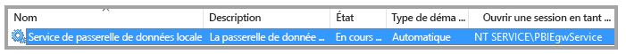
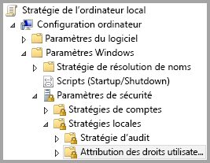
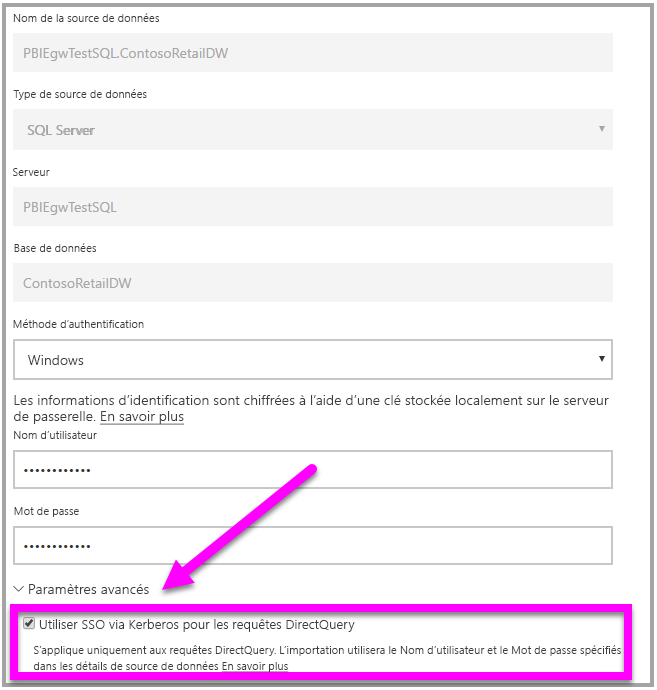

# <a name="use-resource-based-kerberos-for-single-sign-on-sso-from-power-bi-to-on-premises-data-sources"></a>Utiliser Kerberos basé sur les ressources pour l’authentification unique (SSO) de Power BI à des sources de données locales

Utilisez la [délégation contrainte Kerberos basée sur les ressources](/windows-server/security/kerberos/kerberos-constrained-delegation-overview) pour activer la connectivité d’authentification unique pour Windows Server 2012 et versions ultérieures, autorisant les services front-end et back-end à se trouver dans des domaines différents. Pour ce faire, le domaine de service back-end doit approuver le domaine du service front-end.

## <a name="preparing-for-resource-based-kerberos-constrained-delegation"></a>Préparation d’une délégation contrainte Kerberos basée sur les ressources

Plusieurs éléments doivent être configurés pour qu’une délégation Kerberos contrainte fonctionne correctement, dont les _noms de principal du service_ (SPN) et les paramètres de délégation sur les comptes de service.

### <a name="prerequisite-1-operating-system-requirements"></a>Prérequis 1 : Configuration du système d’exploitation requise

La délégation contrainte basée sur les ressources ne peut être configurée que sur un contrôleur de domaine exécutant Windows Server 2012 R2 ou Windows Server 2012 ou version ultérieure.

### <a name="prerequisite-2-install-and-configure-the-on-premises-data-gateway"></a>Prérequis 2 : Installer et configurer la passerelle de données locale

La passerelle de données locale prend en charge la mise à niveau sur place et la _prise de contrôle des paramètres_ de passerelles existantes.

### <a name="prerequisite-3-run-the-gateway-windows-service-as-a-domain-account"></a>Prérequis 3 : Exécuter le service Windows de passerelle en tant que compte de domaine

Dans une installation standard, la passerelle s’exécute en tant que compte de service local de machine (en particulier, _NT Service\PBIEgwService_) comme illustré dans l’image suivante :



Pour activer une **délégation Kerberos contrainte, la passerelle doit opérer en tant que compte de domaine, sauf si votre annuaire Azure AD est déjà synchronisé avec votre annuaire Active Directory local (à l’aide d’Active Directory DirSync/Connect). Si vous devez changer de compte au profit d’un compte de domaine, consultez [Changer le compte de service de passerelle](/data-integration/gateway/service-gateway-service-account).

Si Azure AD DirSync / Connect est configuré et que les comptes d’utilisateur sont synchronisés, le service de passerelle n’a pas besoin d’effectuer des recherches Active Directory locales lors de l’exécution. Vous pouvez utiliser le SID de service local (au lieu d’exiger un compte de domaine) pour le service de passerelle. Les étapes de configuration de la délégation Kerberos contrainte décrites dans cet article sont les mêmes que celles de cette configuration (elles sont simplement appliquées à l’objet ordinateur de la passerelle dans Active Directory, au lieu du compte de domaine).

### <a name="prerequisite-4-have-domain-admin-rights-to-configure-spns-setspn-and-kerberos-constrained-delegation-settings"></a>Prérequis 4 : Obtenir des droits d’administrateur de domaine pour configurer les noms de principal du service (SetSPN) et les paramètres de délégation Kerberos contrainte

S’il est techniquement possible pour un administrateur de domaine ne disposant pas de droits d’administrateur de domaine d’accorder temporairement ou définitivement à quelqu’un d’autre les droits de configurer des noms de principal du service et une délégation Kerberos, cette approche n’est pas recommandée. La section suivante décrit en détail les étapes de configuration nécessaires pour la **Condition préalable 3**.

## <a name="configuring-kerberos-constrained-delegation-for-the-gateway-and-data-source"></a>Configuration de la délégation Kerberos contrainte pour la passerelle et la source de données

Pour configurer correctement le système, nous devons configurer ou valider les deux éléments suivants :

* Si nécessaire, configurez un nom de principal du service pour le compte de domaine du service de passerelle.

* Configurez les paramètres de délégation sur le compte de domaine du service de passerelle.

Notez que, pour effectuer ces deux étapes de configuration, vous devez être administrateur de domaine.

Les sections suivantes décrivent ces étapes successivement.

### <a name="configure-an-spn-for-the-gateway-service-account"></a>Configurer un nom de principal du service pour le compte de service de passerelle

Déterminez d’abord si un nom de principal du service a déjà été créé pour le compte de domaine utilisé comme compte de service de passerelle en suivant ces étapes :

1. En tant qu’administrateur de domaine, lancez **Utilisateurs et ordinateurs Active Directory**.

1. Cliquez avec le bouton droit sur le domaine, sélectionnez **Rechercher**, puis tapez le nom du compte de service de passerelle.

1. Dans la zone de recherche, cliquez avec le bouton droit sur le compte de service de passerelle, puis sélectionnez **Propriétés**.

1. Si l’onglet **Délégation** est visible dans la boîte de dialogue **Propriétés**, cela signifie qu’un nom de principal du service a déjà été créé et que vous pouvez passer directement à la sous-section suivante relative à la [configuration des paramètres de délégation](#configure-delegation-settings).

    Si aucun onglet **Délégation** ne figure dans la boîte de dialogue **Propriétés**, vous pouvez créer manuellement un nom de principal du service sur ce compte, ce qui a pour effet d’ajouter l’onglet **Délégation** (il s’agit de la façon la plus simple de configurer les paramètres de délégation). Il est possible de créer un nom de principal du service à l’aide de l’[outil setspn](https://technet.microsoft.com/library/cc731241.aspx) qui est fourni avec Windows (pour ce faire, vous avez besoin de droits d’administrateur de domaine).

    Par exemple, imaginez que le compte de service de passerelle est « PBIEgwTest\GatewaySvc », et que le nom de la machine sur lequel s’exécute le service de passerelle est **Machine1**. Dans cet exemple, pour définir le nom de principal du service pour le compte de service de passerelle pour cette machine, vous exécuteriez la commande suivante :

      

    Cette étape étant terminée, nous pouvons passer à la configuration des paramètres de délégation.

### <a name="configure-delegation-settings"></a>Configurer les paramètres de délégation

Dans les étapes suivantes, nous supposons un environnement local comprenant deux machines dans différents domaines : une machine de passerelle et un serveur de base de données exécutant SQL Server. Nous supposons également les paramètres et noms suivants :

* Nom de la machine de la passerelle : **PBIEgwTestGW**
* Compte de service de passerelle : **PBIEgwTestFrontEnd\GatewaySvc** (nom complet du compte : Gateway Connector)
* Nom de la machine source de données SQL Server : **PBIEgwTestSQL**
* Compte de service de source de données SQL Server : **PBIEgwTestBackEnd\SQLService**

Étant donné ces exemples de noms et de paramètres, utilisez les étapes de configuration suivantes :

1. À l’aide de **Active Directory Users and Computers**, qui est un composant logiciel enfichable Microsoft Management Console (MMC), sur le contrôleur de domaine pour le domaine **PBIEgwTestFront-end**, assurez-vous qu’aucun paramètres de délégation n’est appliqué pour le compte de service de passerelle.

    

1. À l’aide de **Active Directory Users and Computers**, sur le contrôleur de domaine pour le domaine **PBIEgwTestBack-end**, assurez-vous qu’aucun paramètres de délégation n’est appliqué pour le compte de service back-end. En outre, assurez-vous que l’attribut « msDS-AllowedToActOnBehalfOfOtherIdentity » pour ce compte n’est pas non plus défini. Vous pouvez trouver cet attribut dans « Éditeur d’attributs », comme illustré dans l’image suivante :

    

1. Créez un groupe dans **Active Directory Users and Computers**, sur le contrôleur de domaine pour le domaine **PBIEgwTestBack-end**. Ajoutez le compte de service de passerelle à ce groupe comme indiqué dans l’image suivante. L’image montre un nouveau groupe appelé _ResourceDelGroup_ et le compte de service de passerelle **GatewaySvc** ajouté à ce groupe.

    

1. Ouvrez une invite de commandes et exécutez les commandes suivantes dans le contrôleur de domaine pour le domaine **PBIEgwTestBack-end** pour mettre à jour l’attribut msDS-AllowedToActOnBehalfOfOtherIdentity du compte de service back-end :

    ```powershell
    $c = Get-ADGroup ResourceDelGroup
    Set-ADUser SQLService -PrincipalsAllowedToDelegateToAccount $c
    ```

1. Vous pouvez vérifier que la mise à jour est répercutée dans l’onglet « Éditeur d’attributs » dans les propriétés du compte de service back-end dans **Active Directory Users and Computers.**

Enfin, sur la machine exécutant le service de passerelle (**PBIEgwTestGW** dans notre exemple), la stratégie locale « Emprunter l’identité d’un client après l’authentification » doit être affectée au compte de service de passerelle. Vous pouvez effectuer/vérifier cela dans l’Éditeur d’objets de stratégie de groupe (**gpedit**).

1. Sur la machine de passerelle, exécutez _gpedit.msc_.

1. Accédez à **Stratégie de l’ordinateur local > Configuration ordinateur > Paramètres Windows > Paramètres de sécurité > Stratégies locales > Attribution des droits utilisateur**, comme illustré dans l’image suivante.

    

1. Dans la liste des stratégies sous **Attribution des droits utilisateur**, sélectionnez **Emprunter l’identité d’un client après l’authentification**.

    

1. Cliquez avec le bouton droit et ouvrez **Propriétés** pour **Emprunter l’identité d’un client après l’authentification**, puis vérifiez la liste des comptes. Elle doit inclure le compte de service de passerelle ( **PBIEgwTestFront-end**  **\GatewaySvc** ).

1. Dans la liste des stratégies sous **Attribution des droits utilisateur**, sélectionnez **Agir en tant que partie du système d’exploitation (SeTcbPrivilege)** . Assurez-vous que le compte de service de passerelle est également inclus dans la liste des comptes.

1. Redémarrez le processus de service **Passerelle de données locale**.

## <a name="running-a-power-bi-report"></a>Exécution d’un rapport Power BI

Après accomplissement de toutes les étapes de configuration décrites précédemment dans cet article, vous pouvez utiliser la page **Gérer la passerelle** dans Power BI pour configurer la source de données. Ensuite, sous **Paramètres avancés**, activez l’authentification unique, puis publiez les rapports et jeux de données dépendant de cette source de données.



Cette configuration ne fonctionne pas dans la plupart des cas. Toutefois, avec Kerberos, il peut y avoir différentes configurations en fonction de votre environnement. Si le rapport ne se charge toujours pas, vous devez contacter votre administrateur de domaine pour approfondir la question.

## <a name="next-steps"></a>Étapes suivantes

Pour plus d’informations sur la **Passerelle de données locale** et **DirectQuery**, consultez les ressources suivantes :

* [Qu’est-ce qu’une passerelle de données locale ?](/data-integration/gateway/service-gateway-onprem.md)
* [DirectQuery dans Power BI](desktop-directquery-about.md)
* [Sources de données prises en charge par DirectQuery](desktop-directquery-data-sources.md)
* [DirectQuery et SAP BW](desktop-directquery-sap-bw.md)
* [DirectQuery et SAP HANA](desktop-directquery-sap-hana.md)
