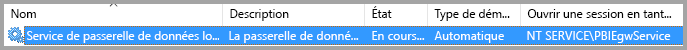
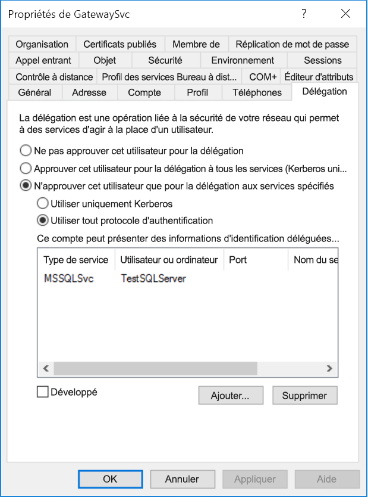
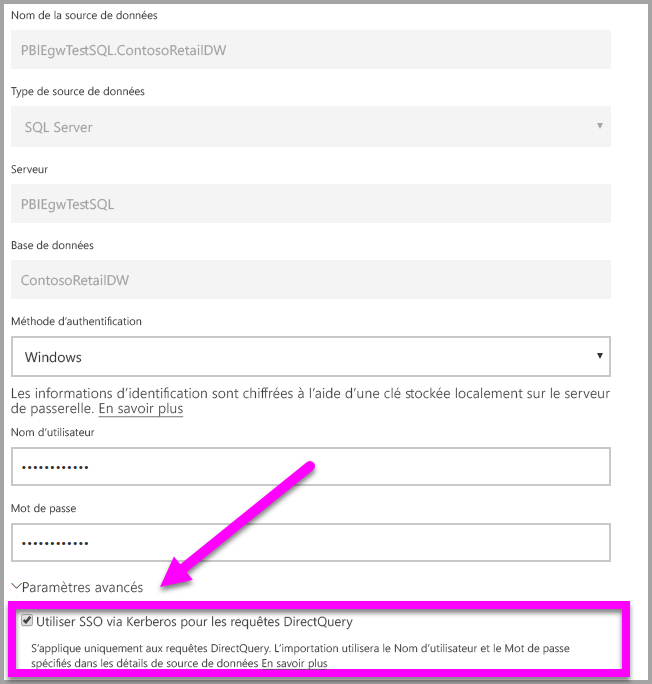
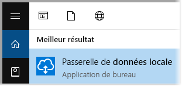
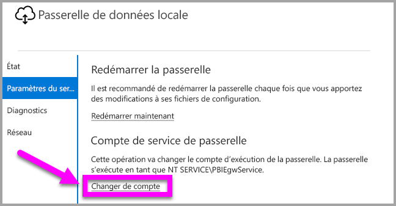
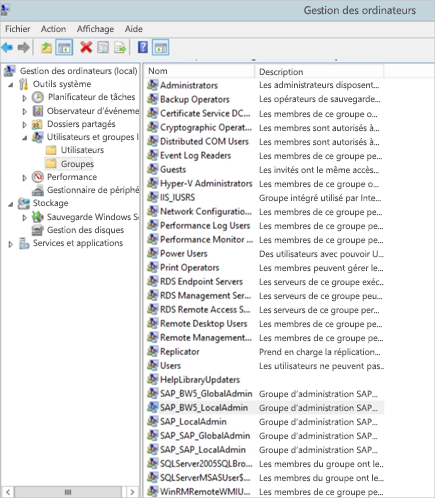
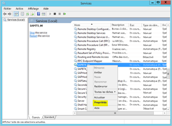
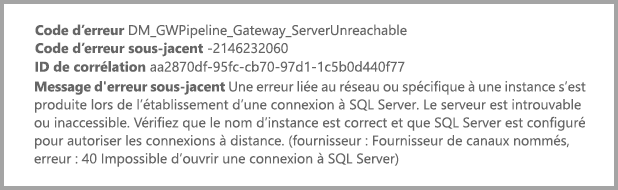

# <a name="use-kerberos-for-single-sign-on-sso-from-power-bi-to-on-premises-data-sources"></a>Utiliser Kerberos pour l’authentification unique (SSO) de Power BI à des sources de données locales

Utilisez la [délégation Kerberos contrainte](/windows-server/security/kerberos/kerberos-constrained-delegation-overview) pour activer la connectivité d’authentification unique fluide. L’activation de SSO permet aux rapports et tableaux de bord Power BI d’actualiser les données à partir des sources locales plus facilement.

## <a name="supported-data-sources"></a>Sources de données prises en charge

Nous prenons en charge les sources de données suivantes :

* SQL Server
* SAP HANA
* SAP BW
* Teradata
* Spark
* Impala

Nous prenons également en charge SAP HANA avec [SAML (Security Assertion Markup Language)](service-gateway-sso-saml.md).

### <a name="sap-hana"></a>SAP HANA

Pour activer l’authentification unique pour SAP HANA, suivez tout d’abord ces étapes :

* Vérifiez que le serveur SAP HANA exécute la version minimale requise, qui dépend du niveau de la plateforme de votre serveur SAP HANA :
  * [HANA 2 SPS 01 Rev 012.03](https://launchpad.support.sap.com/#/notes/2557386)
  * [HANA 2 SPS 02 Rev 22](https://launchpad.support.sap.com/#/notes/2547324)
  * [HANA 1 SP 12 Rev 122.13](https://launchpad.support.sap.com/#/notes/2528439)
* Sur l’ordinateur de la passerelle, installez le pilote ODBC HANA SAP le plus récent.  La version minimale est HANA ODBC 2.00.020.00 datant d’août 2017.

Pour plus d’informations sur la configuration de l’authentification unique pour SAP HANA à l’aide de Kerberos, consultez la rubrique [Authentification unique à l’aide de Kerberos](https://help.sap.com/viewer/b3ee5778bc2e4a089d3299b82ec762a7/2.0.03/en-US/1885fad82df943c2a1974f5da0eed66d.html) dans le Guide de sécurité SAP HANA et les liens de cette page, notamment SAP Note 1837331 – HOWTO HANA DBSSO Kerberos/Active Directory].

## <a name="preparing-for-kerberos-constrained-delegation"></a>Préparation d’une délégation Kerberos contrainte

Plusieurs éléments doivent être configurés pour qu’une délégation Kerberos contrainte fonctionne correctement, dont les *noms de principal du service* (SPN) et les paramètres de délégation sur les comptes de service.

### <a name="prerequisite-1-install--configure-the-on-premises-data-gateway"></a>Prérequis 1 : Installer et configurer la passerelle de données locale

Cette version de la passerelle de données locale prend en charge une mise à niveau locale, ainsi qu’une prise de contrôle des paramètres de passerelles existantes.

### <a name="prerequisite-2-run-the-gateway-windows-service-as-a-domain-account"></a>Prérequis 2 : Exécuter le service Windows de passerelle en tant que compte de domaine

Dans une installation standard, la passerelle s’exécute en tant que compte de service local de machine (en particulier, *NT Service\PBIEgwService*) comme illustré dans l’image suivante :



Pour activer une **délégation Kerberos contrainte**, la passerelle doit opérer en tant que compte de domaine, sauf si votre annuaire Azure AD est déjà synchronisé avec votre annuaire Active Directory local (à l’aide d’Active Directory DirSync/Connect). Si vous avez besoin de changer de compte au profit d’un compte de domaine, consultez [Basculement de la passerelle vers un compte de domaine](#switching-the-gateway-to-a-domain-account) plus loin dans cet article.

> [!NOTE]
> Si Azure AD DirSync/Connect est configuré et que des comptes d’utilisateurs sont synchronisés, le service de passerelle n’a pas besoin d’effectuer de recherches Active Directory locales durant l’exécution, et vous pouvez utiliser le SID du service local (au lieu d’exiger un compte de domaine) pour le service de passerelle. Les étapes de configuration de la délégation Kerberos contrainte décrites dans cet article sont les mêmes que celles de cette configuration (elles sont simplement appliquées à l’objet ordinateur de la passerelle dans Active Directory, au lieu du compte de domaine).

### <a name="prerequisite-3-have-domain-admin-rights-to-configure-spns-setspn-and-kerberos-constrained-delegation-settings"></a>Prérequis 3 : Obtenir des droits d’administrateur de domaine pour configurer les noms de principal du service (SetSPN) et les paramètres de délégation Kerberos contrainte

S’il est techniquement possible pour un administrateur de domaine ne disposant pas de droits d’administrateur de domaine d’accorder temporairement ou définitivement à quelqu’un d’autre les droits de configurer des noms de principal du service et une délégation Kerberos, cette approche n’est pas recommandée. La section suivante décrit en détail les étapes de configuration nécessaires pour la **Condition préalable 3**.

## <a name="configuring-kerberos-constrained-delegation-for-the-gateway-and-data-source"></a>Configuration de la délégation Kerberos contrainte pour la passerelle et la source de données

Pour configurer correctement le système, nous devons configurer ou valider les deux éléments suivants :

1. Si nécessaire, configurez un nom de principal du service pour le compte de domaine du service de passerelle.

2. Configurez les paramètres de délégation sur le compte de domaine du service de passerelle.

Notez que, pour effectuer ces deux étapes de configuration, vous devez être administrateur de domaine.

Les sections suivantes décrivent ces étapes successivement.

### <a name="configure-an-spn-for-the-gateway-service-account"></a>Configurer un nom de principal du service pour le compte de service de passerelle

Tout d’abord, déterminez si un nom de principal du service a déjà été créé pour le compte de domaine utilisé en tant que compte de service de passerelle, mais en procédant comme suit :

1. En tant qu’administrateur de domaine, lancez **Utilisateurs et ordinateurs Active Directory**.

2. Cliquez avec le bouton droit sur le domaine, sélectionnez **Trouver**, puis tapez le nom du compte de service de passerelle.

3. Dans la zone de recherche, cliquez avec le bouton droit sur le compte de service de passerelle, puis sélectionnez **Propriétés**.

4. Si l’onglet **Délégation** est visible dans la boîte de dialogue **Propriétés**, cela signifie qu’un nom de principal du service a déjà été créé et que vous pouvez passer directement à la sous-section suivante relative à la configuration des paramètres de délégation.

    Si aucun onglet **Délégation** ne figure dans la boîte de dialogue **Propriétés**, vous pouvez créer manuellement un nom de principal du service sur ce compte, ce qui a pour effet d’ajouter l’onglet **Délégation** (il s’agit de la façon la plus simple de configurer les paramètres de délégation). Il est possible de créer un nom de principal du service à l’aide de l’[outil setspn](https://technet.microsoft.com/library/cc731241.aspx) qui est fourni avec Windows (pour ce faire, vous avez besoin de droits d’administrateur de domaine).

    Par exemple, imaginez que le compte de service de passerelle est « PBIEgwTest\GatewaySvc », et que le nom de la machine sur lequel s’exécute le service de passerelle est **Machine1**. Dans cet exemple, pour définir le nom de principal du service pour le compte de service de passerelle pour cette machine, vous exécuteriez la commande suivante :

    

    Cette étape étant terminée, nous pouvons passer à la configuration des paramètres de délégation.

### <a name="configure-delegation-settings-on-the-gateway-service-account"></a>Configurer les paramètres de délégation sur le compte de service de passerelle

La deuxième exigence de configuration a trait aux paramètres de délégation sur le compte de service de passerelle. Différents outils permettent d’accomplir ces étapes. Dans cet article, nous allons utiliser **Utilisateurs et ordinateurs Active Directory**, composant logiciel enfichable de Microsoft Management Console (MMC) que vous pouvez utiliser pour administrer et publier des informations dans l’annuaire. Il est disponible par défaut sur les contrôleurs de domaine. Vous pouvez également l’activer via une configuration de **fonctionnalité Windows** sur d’autres machines.

Nous devons configurer une **délégation Kerberos contrainte** avec transit de protocole. Avec une délégation contrainte, vous devez être explicite concernant les services auxquels vous souhaitez déléguer. Par exemple, seul votre serveur SQL Server ou votre serveur SAP HANA accepte les appels de délégation du compte de service de passerelle.

Cette section suppose que vous avez déjà configuré des noms de principal du service pour vos sources de données sous-jacentes (par exemple, SQL Server, SAP HANA, Teradata, Spark, etc.). Pour savoir comment configurer ces noms de principal du service de serveur de source de données, reportez-vous à la documentation technique du serveur de base de données concerné. Vous pouvez également consulter le billet de blog qui décrit le [*nom de principal du service dont votre application a besoin*](https://blogs.msdn.microsoft.com/psssql/2010/06/23/my-kerberos-checklist/).

Dans les étapes suivantes, nous supposons un environnement local comprenant deux machines : une machine de passerelle et un serveur de base de données exécutant SQL Server. Nous supposons également les paramètres et noms suivants :

* Nom de la machine de la passerelle : **PBIEgwTestGW**
* Compte de service de passerelle : **PBIEgwTest\GatewaySvc** (nom complet du compte : Gateway Connector)
* Nom de la machine source de données SQL Server : **PBIEgwTestSQL**
* Compte de service de source de données SQL Server : **PBIEgwTest\SQLService**

Étant donné ces exemples de noms et de paramètres, les étapes de configuration sont les suivantes :

1. Avec des droits d’administrateur de domaine, lancez **Utilisateurs et ordinateurs Active Directory**.

2. Cliquez avec le bouton droit sur le compte de service de passerelle (**PBIEgwTest\GatewaySvc**), puis sélectionnez **Propriétés**.

3. Sélectionnez l’onglet **Délégation**.

4. Sélectionnez **N’approuver cet ordinateur que pour la délégation aux services spécifiés**.

5. Sélectionnez **Utiliser tout protocole d’authentification**.

6. Sous **Ce compte peut présenter des informations d’identification déléguées à ces services**, sélectionnez **Ajouter**.

7. Dans la boîte de dialogue Nouveau, sélectionnez **Utilisateurs ou ordinateurs**.

8. Entrez le compte de service pour le service de base de données SQL Server (**PBIEgwTest\SQLService**), puis sélectionnez **OK**.

9. Sélectionnez le nom de principal du service que vous avez créé pour le serveur de base de données. Dans notre exemple, le nom de principal du service commence par **MSSQLSvc**. Si vous avez ajouté le nom de domaine complet (FQDN) et le nom de principal du service NetBIOS pour votre service de base de données, sélectionnez les deux. Vous ne pouvez en voir qu’un.

10. Sélectionnez **OK**. Le nom de principal du service devrait à présent figurer dans la liste.

11. Vous pouvez également sélectionner **Développé** pour afficher à la fois le nom de domaine complet (FQDN) et le nom de principal du service NetBIOS.

12. Si vous avez sélectionné **Développé**, la boîte de dialogue doit ressembler à ceci. Sélectionnez **OK**.

    

Enfin, sur la machine exécutant le service de passerelle (**PBIEgwTestGW** dans notre exemple), la stratégie locale « Emprunter l’identité d’un client après l’authentification » doit être affectée au compte de service de passerelle. Vous pouvez effectuer/vérifier cela dans l’Éditeur d’objets de stratégie de groupe (**gpedit**).

1. Sur la machine de passerelle, exécutez *gpedit.msc*.

1. Accédez à **Stratégie de l’ordinateur local > Configuration ordinateur > Paramètres Windows > Paramètres de sécurité > Stratégies locales > Attribution des droits utilisateur**, comme illustré dans l’image suivante.

    

1. Dans la liste des stratégies sous **Attribution des droits utilisateur**, sélectionnez **Emprunter l’identité d’un client après l’authentification**.

    

    Cliquez avec le bouton droit et ouvrez **Propriétés** pour **Emprunter l’identité d’un client après l’authentification**, puis vérifiez la liste des comptes. Elle doit inclure le compte de service de passerelle (**PBIEgwTest\GatewaySvc**).

1. Dans la liste des stratégies sous **Attribution des droits utilisateur**, sélectionnez **Agir en tant que partie du système d’exploitation (SeTcbPrivilege)**. Assurez-vous que le compte de service de passerelle est également inclus dans la liste des comptes.

1. Redémarrez le processus de service **Passerelle de données locale**.

Si vous utilisez SAP HANA, nous vous recommandons de suivre les étapes supplémentaires ci-après, qui peuvent améliorer les performances légèrement.

1. Dans le répertoire d’installation de la passerelle, recherchez et ouvrez ce fichier de configuration : *Microsoft.PowerBI.DataMovement.Pipeline.GatewayCore.dll.config*.

1. Recherchez la propriété *FullDomainResolutionEnabled* et définissez sa valeur sur *True*.

    ```xml
    <setting name=" FullDomainResolutionEnabled " serializeAs="String">
          <value>True</value>
    </setting>
    ```

## <a name="running-a-power-bi-report"></a>Exécution d’un rapport Power BI

Après accomplissement de toutes les étapes de configuration décrites précédemment dans cet article, vous pouvez utiliser la page **Gérer la passerelle** dans Power BI pour configurer la source de données. Ensuite, sous **Paramètres avancés**, activez l’authentification unique, puis publiez les rapports et jeux de données dépendant de cette source de données.



Cette configuration ne fonctionne pas dans la plupart des cas. Toutefois, avec Kerberos, il peut y avoir différentes configurations en fonction de votre environnement. Si le rapport ne se charge toujours pas, vous devez contacter votre administrateur de domaine pour approfondir la question.

## <a name="switching-the-gateway-to-a-domain-account"></a>Basculement de la passerelle vers un compte de domaine

Plus haut dans cet article, nous avons abordé le basculement de la passerelle à partir d’un compte de service local vers une exécution en tant que compte de domaine à l’aide de l’interface utilisateur **Passerelle de données locale**. Les étapes nécessaires à cette fin sont les suivantes.

1. Lancez l’outil de configuration **Passerelle de données locale**.

   

2. Sélectionnez le bouton **Connexion** sur la page principale, puis connectez-vous avec votre compte Power BI.

3. Une fois la connexion établie, sélectionnez l’onglet **Paramètre de service**.

4. Sélectionnez **Modifier le compte** pour démarrer la procédure pas à pas, comme illustré dans l’image suivante.

   

## <a name="configuring-sap-bw-for-sso"></a>Configuration de SAP BW pour l’authentification unique

Comme vous comprenez maintenant comment fonctionne Kerberos avec une passerelle, vous pouvez configurer l’authentification unique pour votre système SAP BW (SAP Business Warehouse). Les étapes suivantes supposent que vous avez déjà [préparé la délégation Kerberos contrainte](#preparing-for-kerberos-constrained-delegation), comme décrit précédemment dans cet article.

Ce guide tente d’être aussi complet que possible. Si vous avez déjà effectué certaines étapes, vous pouvez les ignorer : Par exemple, vous avez déjà créé un utilisateur de service pour votre serveur BW et y avez mappé un SPN, ou bien vous avez déjà installé la bibliothèque gsskrb5.

### <a name="setup-gsskrb5-on-client-machines-and-the-bw-server"></a>Installer gsskrb5 sur les machines clientes et le serveur BW

> [!NOTE]
> gsskrb5 n’est plus activement pris en charge par SAP. Pour plus d’informations, consultez [SAP Note 352295](https://launchpad.support.sap.com/#/notes/352295). Notez également que gsskrb5 n’autorise pas les connexions d’authentification unique de la passerelle de données aux serveurs de messages BW. Seules les connexions aux serveurs d’applications BW sont possibles.

gsskrb5 doit être utilisé par le client et par le serveur pour établir une connexion à authentification unique via la passerelle. La bibliothèque Common Crypto Library (sapcrypto) n’est actuellement pas prise en charge.

1. Téléchargez gsskrb5/gx64krb5 à partir de la page [Note SAP 2115486](https://launchpad.support.sap.com/) (compte super utilisateur SAP requis). Assurez-vous d’avoir au moins la version 1.0.11.x de gsskrb5.dll et gx64krb5.dll.

1. Placez la bibliothèque sur votre machine de passerelle à un emplacement accessible par votre instance de passerelle (et également par l’interface graphique utilisateur SAP, si vous souhaitez tester la connexion de l’authentification unique à l’aide de SAP GUI/Logon).

1. Placez une autre copie sur votre machine serveur BW à un emplacement accessible par le serveur BW.

1. Sur les machines cliente et serveur, définissez les variables d’environnement SNC\_LIB et SNC\_LIB\_64 afin qu’elles pointent vers les emplacements de gsskrb5.dll et gx64krb5.dll, respectivement.

### <a name="create-a-bw-service-user-and-enable-snc-communication-using-gsskrb5-on-the-bw-server"></a>Créer un utilisateur de Service BW et activer la communication SNC à l’aide de gsskrb5 sur le serveur BW

Outre la configuration de la passerelle que vous avez déjà effectuée, il existe quelques étapes supplémentaires, propres à SAP BW. La section [**Configurer les paramètres de délégation sur le compte de service de passerelle**](#configure-delegation-settings-on-the-gateway-service-account) de la documentation suppose que vous avez déjà configuré des SPN pour vos sources de données sous-jacentes. Pour effectuer cette configuration pour SAP BW :

1. Sur un serveur de contrôleur de domaine Active Directory, créez un utilisateur de service (initialement un utilisateur Active Directory normal) pour votre serveur d’applications BW dans votre environnement Active Directory. Ensuite, affectez-lui un SPN.

    SAP recommande de démarrer le SPN avec SAP/, mais il est certainement également possible d’utiliser d’autres préfixes, tels que HTTP/. Ce qui vient après SAP/ ne dépend que de vous ; vous pouvez, par exemple, utiliser le nom de l’utilisateur de service du serveur BW. Ainsi, si vous créez BWServiceUser@\<DOMAIN\> comme utilisateur de service, vous pouvez utiliser le SPN SAP/BWServiceUser. Pour définir le mappage du SPN, vous pouvez recourir à la commande setspn. Par exemple, pour définir le SPN sur l’utilisateur de service que nous venons de créer, vous devez exécuter la commande suivante à partir d’une fenêtre cmd sur une machine de contrôleur de domaine : `setspn -s SAP/ BWServiceUser DOMAIN\ BWServiceUser`. Pour plus d’informations, consultez la documentation de SAP BW.

1. Accordez à l’utilisateur du service l’accès à votre serveur d’applications BW :

    1. Sur la machine serveur BW, ajoutez l’utilisateur de service au groupe d’administrateurs local pour votre serveur BW : ouvrez le programme Gestion des ordinateurs, puis double-cliquez sur le groupe d’administrateurs local pour votre serveur.

        

    1. Double-cliquez sur le groupe d’administrateurs local, puis sélectionnez **Ajouter** pour y ajouter votre utilisateur de service BW. Utilisez le bouton **Vérifier les noms** pour vérifier que vous avez tapé le nom correctement. Sélectionnez **OK**.

1. Définissez l’utilisateur de service du serveur BW en tant qu’utilisateur qui démarre le service du serveur BW sur la machine serveur BW.

    1. Ouvrez le programme « Exécuter », puis tapez « Services.msc ». Recherchez le service correspondant à votre instance de serveur d’applications BW. Cliquez dessus avec le bouton droit, puis sélectionnez **Propriétés**.

        

    1. Activez l’onglet **Connexion** et définissez l’utilisateur sur votre utilisateur de service BW, tel que spécifié plus haut. Entrez le mot de passe de l’utilisateur, puis sélectionnez **OK**.

1. Connectez-vous à votre serveur dans SAP GUI/Logon et définissez les paramètres de profil suivants à l’aide de la transaction RZ10 :

    1. Définissez le paramètre de profil snc/identity/as sur p:\<l’utilisateur de service BW que vous avez créé\>, par exemple p:BWServiceUser@MYDOMAIN.COM. Notez le p: qui précède l'UPN de l'utilisateur du Service ; ce n'est pas p:CN= comme lorsque Common Crypto Lib est utilisé comme bibliothèque SNC.

    1. Définissez le paramètre de profil snc/gssapi\_lib sur \<chemin de gsskrb5.dll/gx64krb5.dll sur la machine serveur (la bibliothèque que vous allez utiliser dépend du nombre de bits du système d’exploitation)\>. N’oubliez pas de placer la bibliothèque à un emplacement accessible au serveur d’Application BW.

    1. Définissez également les paramètres de profil supplémentaires suivants, en changeant les valeurs en fonction de vos besoins. Notez que les cinq dernières options permettent aux clients de se connecter au serveur BW à l’aide de SAP Logon/GUI sans que SNC soit configuré.

        | **Paramètre** | **Valeur** |
        | --- | --- |
        | snc/data\_protection/max | 3 |
        | snc/data\_protection/min | 1 |
        | snc/data\_protection/use | 9 |
        | snc/accept\_insecure\_cpic | 1 |
        | snc/accept\_insecure\_gui | 1 |
        | snc/accept\_insecure\_r3int\_rfc | 1 |
        | snc/accept\_insecure\_rfc | 1 |
        | snc/permit\_insecure\_start | 1 |

    1. Définissez la propriété snc/enable sur 1.

1. Après avoir défini ces paramètres de profil, ouvrez la console de gestion SAP sur la machine serveur et redémarrez l’instance de BW. Si le serveur ne démarre pas, vérifiez que vous avez correctement défini les paramètres de profil. Pour plus d’informations sur les paramètres de profil, consultez la [documentation SAP](https://help.sap.com/saphelp_nw70ehp1/helpdata/en/e6/56f466e99a11d1a5b00000e835363f/frameset.htm). Vous pouvez également consulter nos informations de dépannage plus loin dans cette section si vous rencontrez des problèmes.

### <a name="map-a-bw-user-to-an-active-directory-user"></a>Mapper un utilisateur BW à un utilisateur Active Directory

Mappez un utilisateur Active Directory à un utilisateur du serveur d’applications SAP BW et testez la connexion SSO dans SAP GUI/Logon.

1. Connectez-vous à votre serveur BW à l’aide de SAP GUI/Logon. Exécutez la transaction SU01.

1. Dans le champ **User** (Utilisateur), entrez l’utilisateur BW pour lequel vous souhaitez activer des connexions SSO (dans la capture d’écran ci-dessus, nous définissons des autorisations pour BIUSER). Sélectionnez l’icône **Modifier** (image en forme de stylo) près de l’angle supérieur gauche de la fenêtre SAP Logon.

    

1. Sélectionnez l’onglet **SNC**. Dans la zone de texte SNC name (Nom SNC), entrez p:\<votre utilisateur Active Directory\>@\<votre domaine\>. Notez que « p: » doit absolument précéder l’UPN de l’utilisateur Active Directory. L’utilisateur Active Directory que vous spécifiez doit appartenir à la personne ou à l’organisation pour laquelle vous souhaitez activer l’accès SSO au serveur d’applications BW. Par exemple, si vous souhaitez activer l’accès SSO pour l’utilisateur [testuser@TESTDOMAIN.COM](mailto:testuser@TESTDOMAIN.COM), entrez p:testuser@TESTDOMAIN.COM.

    

1. Sélectionnez l’icône d’enregistrement (disquette près de l’angle supérieur gauche de l’écran).

### <a name="test-sign-in-using-sso"></a>Tester la connexion à l’aide de l’authentification unique

Vérifiez que vous pouvez vous connecter au serveur à l’aide SAP Logon/SAP GUI via l’authentification unique en tant qu’utilisateur Active Directory pour lequel vous venez d’activer l’accès SSO.

1. Connectez-vous à une machine sur laquelle SAP Logon est installé *en tant qu’utilisateur Active Directory pour lequel vous venez d’activer l’accès SSO* et lancez SAP GUI/Logon. Créez une connexion.

1. Dans la fenêtre **Create New System Entry** (Créer une entrée système), sélectionnez **User Specified System** (Système spécifié par l’utilisateur) et sélectionnez **Next** (Suivant).

    

1. Renseignez les informations appropriées dans la page suivante, notamment le serveur d’applications, le numéro d’instance et l’ID du système, puis sélectionnez **Finish** (Terminer).

1. Cliquez avec le bouton droit sur la nouvelle connexion, puis sélectionnez **Properties** (Propriétés). Sélectionnez l’onglet **Réseau**. Dans la fenêtre **SNC Name** (Nom SNC), entrez p:\<l’UPN de l’utilisateur du service BW\>, par exemple p:BWServiceUser@MYDOMAIN.COM, puis sélectionnez **OK**.

    

1. Double-cliquez sur la connexion que vous venez de créer pour tenter une connexion SSO à votre serveur BW. Si cette connexion réussit, passez à l’étape suivante. Sinon, passez en revue les étapes antérieures dans ce document pour vous assurer de les avoir effectuées correctement, ou consultez la section de dépannage ci-après. Notez que si vous ne pouvez pas vous connecter au serveur BW via l’authentification unique dans ce contexte, vous ne pouvez pas non plus le faire dans le contexte de la passerelle.

### <a name="troubleshoot-installation-and-connections"></a>Résoudre les problèmes d’installation et de connexion

Si vous rencontrez des problèmes, suivez ces étapes pour corriger l’installation de gsskrb5 et les connexions SSO à partir de SAP GUI/Logon.

1. La consultation des journaux de serveur (...work\dev\_w0 sur la machine serveur) peut être utile pour résoudre les erreurs rencontrées au cours des étapes de configuration de gsskrb5, en particulier si le serveur BW ne démarre pas après la modification des paramètres de profil.

1. Si vous ne parvenez pas à démarrer le service BW en raison d’un échec d’ouverture de session, il est possible que vous ayez indiqué un mauvais mot de passe durant la définition de l’utilisateur qui démarre le service BW. Vérifiez le mot de passe en vous connectant à une machine dans votre environnement Active Directory en tant qu’utilisateur de service BW.

1. Si vous obtenez des erreurs indiquant que les informations d’identification SQL empêchent le démarrage du serveur, vérifiez que vous avez accordé à l’utilisateur de service l’accès à la base de données BW.

1. « (GSS-API) La cible spécifiée est inconnue ou inaccessible » : cela signifie généralement que vous avez spécifié un nom SNC incorrect. Veillez à utiliser « p: » uniquement, pas « p:CN= » ou autre chose dans l’application cliente que l’UPN de l’utilisateur de service.

1. « (GSS-API) Un nom non valide a été fourni » : vérifiez que « p: » est dans la valeur du paramètre de profil d’identité du serveur SNC.

1. « (Erreur SNC) Le module spécifié est introuvable » : cela est généralement dû au fait que gsskrb5.dll/gx64krb5.dll se trouve à un emplacement dont l’accès requiert des privilèges élevés (droits d’administrateur).

### <a name="add-registry-entries-to-the-gateway-machine"></a>Ajouter des entrées de Registre à la machine de passerelle

Ajoutez les entrées de registre requises au registre de la machine sur laquelle est installée la passerelle.

1. Dans une fenêtre cmd, exécutez les commandes suivantes :

    1. REG ADD HKLM\SOFTWARE\Wow6432Node\SAP\gsskrb5 /v ForceIniCredOK /t REG\_DWORD /d 1 /f

    1. REG ADD HKLM\SOFTWARE\SAP\gsskrb5 /v ForceIniCredOK /t REG\_DWORD /d 1 /f

### <a name="set-configuration-parameters-on-the-gateway-machine"></a>Définir des paramètres de configuration sur la machine de passerelle

Il existe deux options permettant de définir des paramètres de configuration, selon que vous avez ou non configuré Azure AD DirSync de manière que les utilisateurs puissent se connecter au service Power BI en tant qu’un utilisateur Azure Ad.

Si vous avez configuré Azure AD DirSync, procédez comme suit.

1. Ouvrez le fichier de configuration de la passerelle principale, *Microsoft.PowerBI.DataMovement.Pipeline.GatewayCore.dll*. Par défaut, ce fichier est stocké à l’emplacement *C:\Program Files\On-premises data gateway*.

1. Vérifiez que la propriété **FullDomainResolutionEnabled** est définie sur True et que **SapHanaSsoRemoveDomainEnabled** est définie sur False.

1. Enregistrez le fichier de configuration.

1. Redémarrez le service de passerelle par le biais de l’onglet Services du Gestionnaire des tâches (cliquez avec le bouton droit, puis choisissez Redémarrer)

    

Si vous n’avez pas configuré Azure AD DirSync, suivez ces étapes pour **chaque utilisateur du service Power BI que vous souhaitez mapper à un utilisateur Azure AD**. Ces étapes lient manuellement un utilisateur du service Power BI à un utilisateur Active Directory avec l’autorisation de se connecter à BW.

1. Ouvrez le fichier de configuration de la passerelle principale, Microsoft.PowerBI.DataMovement.Pipeline.GatewayCore.dll. Par défaut, ce fichier est stocké à l’emplacement C:\Program Files\On-premises data gateway.

1. Définissez **ADUserNameLookupProperty** sur msDS-cloudExtensionAttribute1 et **ADUserNameReplacementProperty** sur SAMAccountName. Enregistrez le fichier de configuration.

1. Redémarrez le service de passerelle par le biais de l’onglet **Services** du Gestionnaire des tâches (cliquez avec le bouton droit, puis choisissez **Redémarrer**).

    

1. Définissez la propriété msDS-cloudExtensionAttribute1 de l’utilisateur Active Directory que vous avez mappé à un utilisateur BW sur l’utilisateur de service Power BI pour lequel vous souhaitez activer l’authentification unique Kerberos. Parmi les méthodes utilisables pour définir la propriété msDS-cloudExtensionAttribute1, vous pouvez recourir au composant logiciel enfichable MMC Utilisateurs et ordinateurs Active Directory.

    1. Connectez-vous à une machine de contrôleur de domaine en tant qu’administrateur.

    1. Ouvrez le dossier **Utilisateurs** dans la fenêtre du composant logiciel enfichable, puis double-cliquez sur l’utilisateur Active Directory que vous avez mappé à un utilisateur BW.

    1. Sélectionnez l’onglet **Éditeur d’attributs**.

        Si vous ne voyez pas cet onglet, vous devez rechercher des instructions pour savoir comment l’activer, ou utiliser une autre méthode pour définir la propriété msDS-cloudExtensionAttribute1. Sélectionnez un des attributs, puis appuyez sur la touche « m » pour accéder aux propriétés Active Directory qui commencent par la lettre « m ». Recherchez la propriété msDS-cloudExtensionAttribute1 et double-cliquez dessus. Définissez la valeur sur le nom d’utilisateur dont vous vous servez pour vous connecter au service Power BI dans le formulaire YourUser@YourDomain.

    1. Sélectionnez **OK**.

        

    1. Sélectionnez **Appliquer**. Vérifiez que la valeur correcte a été définie dans la colonne Valeur.

### <a name="add-a-new-bw-application-server-data-source-to-the-power-bi-service"></a>Ajouter une nouvelle source de données de serveur d’applications BW au service Power BI

Ajoutez la source de données BW à votre passerelle : Suivez les instructions indiquées plus haut dans cet article au sujet de [l’exécution d’un rapport](#running-a-power-bi-report).

1. Dans la fenêtre de la configuration de la source de données, entrez le **Nom d’hôte**, le **Numéro système**, et l’**ID client** du serveur d’applications que vous utiliseriez pour vous connecter à votre serveur BW à partir de Power BI Desktop. Pour la **Méthode d’authentification**, sélectionnez **Windows**.

1. Dans le champ **nom du partenaire SNC**, entrez p: \<le SPN que vous avez mappé à votre utilisateur de Service BW\>. Par exemple, si le SPN est SAP/BWServiceUser@MYDOMAIN.COM, vous devez entrer p:SAP/BWServiceUser@MYDOMAIN.COM dans le champ **Nom du partenaire SNC**.

1. Pour la bibliothèque SNC, sélectionnez SNC\_LIB ou SNC\_LIB\_64.

1. Les **Nom d’utilisateur** et **Mot de passe** doivent correspondre aux nom d’utilisateur et mot de passe d’un utilisateur Active Directory autorisé à se connecter au serveur via l’authentification unique (utilisateur Active Directory qui a été mappé à un utilisateur BW par le biais de la transaction SU01). Ces informations d’identification ne sont utilisées que si la case **Utiliser SSO via Kerberos pour les requêtes DirectQuery** *n’est pas* cochée.

1. Sélectionnez la case **Utiliser SSO via Kerberos pour les requêtes DirectQuery**, puis sélectionnez **Appliquer**. Si le test de la connexion échoue, vérifiez que vous avez correctement effectué les étapes d’installation et de configuration précédentes.

    La passerelle utilise toujours les informations d'identification entrées pour établir une connexion de test avec le serveur et effectuer des actualisations planifiées des rapports basés sur l'importation. La passerelle ne tente d’établir une connexion à l’authentification unique que si **Utiliser SSO via Kerberos pour les requêtes DirectQuery** est sélectionné, et l’utilisateur accède à un rapport ou à un jeu de données direct basé sur une requête.

### <a name="test-your-setup"></a>Tester votre installation

Publiez un rapport DirectQuery à partir de Power BI Desktop sur Power BI Desktop pour tester votre installation. Vérifiez que vous êtes connecté au service Power BI soit en tant qu’utilisateur Azure AD, soit en tant qu’utilisateur que vous avez mappé à la propriété msDS-cloudExtensionAttribute1 d’un utilisateur Azure AD. Si l’installation a été effectuée correctement, vous devez pouvoir créer un rapport basé sur le jeu de données publié dans le service Power BI et extraire des données via les visuels du rapport.

### <a name="troubleshooting-gateway-connectivity-issues"></a>Résolution des problèmes de connectivité de la passerelle

1. Consultez les journaux de la passerelle. Ouvrez l’application Configuration de la passerelle, sélectionnez **Diagnostics**, puis **Exporter les journaux**. Les erreurs les plus récentes apparaissent en bas de tous les fichiers journaux que vous examinez.

    

1. Activez le suivi de BW et examinez les fichiers journaux générés. Différents types de suivi de BW sont disponibles. Pour plus d’informations, consultez la documentation SAP.

## <a name="errors-from-an-insufficient-kerberos-configuration"></a>Erreurs d’une configuration insuffisante de Kerberos

Si le serveur de base de données sous-jacent et la passerelle ne sont pas configurés correctement pour une **délégation Kerberos contrainte**, il se peut que vous receviez le message d’erreur suivant :


Et les détails techniques associés au message d’erreur (DM_GWPipeline_Gateway_ServerUnreachable) peuvent se présenter comme suit :



Le résultat est que la passerelle n’a pas pu emprunter l’identité de l’utilisateur d’origine correctement et que la tentative de connexion de base de données a échoué.

## <a name="next-steps"></a>Étapes suivantes

Pour plus d’informations sur la **Passerelle de données locale** et **DirectQuery**, voir les ressources suivantes :

* [Passerelle de données locale](service-gateway-onprem.md)
* [DirectQuery dans Power BI](desktop-directquery-about.md)
* [Sources de données prises en charge par DirectQuery](desktop-directquery-data-sources.md)
* [DirectQuery et SAP BW](desktop-directquery-sap-bw.md)
* [DirectQuery et SAP HANA](desktop-directquery-sap-hana.md)