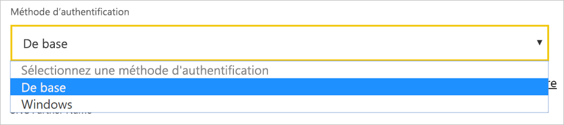

# <a name="use-kerberos-for-single-sign-on-sso-from-power-bi-to-on-premises-data-sources"></a>Utiliser Kerberos pour l’authentification unique (SSO) de Power BI à des sources de données locales

Utilisez la [délégation Kerberos contrainte](/windows-server/security/kerberos/kerberos-constrained-delegation-overview) pour activer la connectivité d’authentification unique (SSO) sans interruption. L’activation de SSO permet aux rapports et tableaux de bord Power BI d’actualiser les données à partir des sources locales plus facilement.

## <a name="supported-data-sources"></a>Sources de données prises en charge

Nous prenons en charge les sources de données suivantes :

* SQL Server
* SAP HANA
* SAP BW
* Teradata
* Spark
* Impala

Nous prenons également en charge SAP HANA avec [SAML (Security Assertion Markup Language)](service-gateway-sso-saml.md).

### <a name="sap-hana"></a>SAP HANA

Pour activer l’authentification unique pour SAP HANA, suivez tout d’abord ces étapes :

* Vérifiez que le serveur SAP HANA exécute la version minimale requise, qui dépend du niveau de la plateforme de votre serveur SAP HANA :
  * [HANA 2 SPS 01 Rev 012.03](https://launchpad.support.sap.com/#/notes/2557386)
  * [HANA 2 SPS 02 Rev 22](https://launchpad.support.sap.com/#/notes/2547324)
  * [HANA 1 SP 12 Rev 122.13](https://launchpad.support.sap.com/#/notes/2528439)
* Sur l’ordinateur de la passerelle, installez le pilote ODBC HANA SAP le plus récent.  La version minimale est HANA ODBC 2.00.020.00 datant d’août 2017.

Pour plus d’informations sur la configuration de l’authentification unique pour SAP HANA à l’aide de Kerberos, consultez [Single Sign-on Using Kerberos](https://help.sap.com/viewer/b3ee5778bc2e4a089d3299b82ec762a7/2.0.03/1885fad82df943c2a1974f5da0eed66d.html) dans le Guide de sécurité SAP HANA. Consultez également les liens de cette page, notamment SAP Note 1837331 – HOWTO HANA DBSSO Kerberos/Active Directory.

## <a name="prepare-for-kerberos-constrained-delegation"></a>Préparer les éléments nécessaires à une délégation Kerberos contrainte

Pour qu’une délégation Kerberos contrainte fonctionne correctement, vous devez configurer plusieurs éléments , parmi lesquels les *noms de principal du service* (SPN) et les paramètres de délégation sur les comptes de service.

### <a name="prerequisite-1-install-and-configure-the-microsoft-on-premises-data-gateway"></a>Prérequis 1 : Installer et configurer la passerelle de données locale Microsoft

Cette version de la passerelle de données locale prend en charge une mise à niveau sur place, ainsi qu’une prise de contrôle des paramètres de passerelles existantes.

### <a name="prerequisite-2-run-the-gateway-windows-service-as-a-domain-account"></a>Prérequis 2 : Exécuter le service Windows de passerelle en tant que compte de domaine

Dans une installation standard, la passerelle s’exécute en tant que compte de service local sur une machine (en particulier, *NT Service\PBIEgwService*).


Pour activer une délégation Kerberos contrainte, la passerelle doit s’exécuter en tant que compte de domaine, sauf si votre instance Azure Active Directory (Azure AD) est déjà synchronisée avec votre instance Active Directory locale (par le biais d’Azure AD DirSync/Connect). Pour passer à un compte de domaine, consultez [Changer le compte de service de passerelle](/data-integration/gateway/service-gateway-service-account).

> [!NOTE]
> Si Azure AD Connect est configuré, et que les comptes d’utilisateur sont synchronisés, le service de passerelle n’a pas besoin d’effectuer des recherches Active AD locales au moment de l’exécution. Vous pouvez utiliser le SID de service local (au lieu d’exiger un compte de domaine) pour le service de passerelle. Les étapes de configuration de la délégation Kerberos contrainte décrites dans cet article sont les mêmes que celle de cette configuration. La différence est qu’elles s’appliquent à l’ordinateur de la passerelle dans Azure AD au lieu du compte de domaine.

### <a name="prerequisite-3-have-domain-admin-rights-to-configure-spns-setspn-and-kerberos-constrained-delegation-settings"></a>Prérequis 3 : Obtenir des droits d’administrateur de domaine pour configurer les noms de principal du service (SetSPN) et les paramètres de délégation Kerberos contrainte

Nous ne recommandons pas qu’un administrateur de domaine accorde de façon temporaire ou permanente à d’autres utilisateurs qui n’ont pas de droits d’administrateur de domaine l’autorisation de configurer des noms de principal de service et une délégation Kerberos. La section suivante explique plus en détail les étapes de configuration recommandées.

## <a name="configure-kerberos-constrained-delegation-for-the-gateway-and-data-source"></a>Configurer la délégation Kerberos contrainte pour la passerelle et la source de données

En tant qu’administrateur de domaine, vous configurez un nom de principal de service pour le compte de domaine du service de passerelle et vous configurez ensuite les paramètres de la délégation sur ce compte.

### <a name="configure-an-spn-for-the-gateway-service-account"></a>Configurer un nom de principal du service pour le compte de service de passerelle

Tout d’abord, déterminez si un nom de principal du service a déjà été créé pour le compte de domaine utilisé comme compte de service de passerelle :

1. En tant qu’administrateur de domaine, ouvrez **Utilisateurs et ordinateurs Active Directory**.

2. Cliquez avec le bouton droit sur le domaine, sélectionnez **Trouver**, puis entrez le nom du compte de service de passerelle.

3. Dans les résultats de la recherche, cliquez avec le bouton droit sur le compte de service de passerelle, puis sélectionnez **Propriétés**.

4. Si l’onglet **Délégation** est visible dans la boîte de dialogue **Propriétés**, cela signifie qu’un nom de principal du service a déjà été créé. Vous pouvez alors passer directement à l’étape de configuration des paramètres de délégation.

    S’il n’y a pas d’onglet **Délégation** dans la boîte de dialogue **Propriétés**, vous pouvez créer manuellement un nom de principal du service sur ce compte. Cela a pour effet d’ajouter l’onglet **Délégation**. Utilisez l’[outil setspn](https://technet.microsoft.com/library/cc731241.aspx) qui est fourni avec Windows (vous devez avoir des droits d’administrateur de domaine pour créer le nom de principal du service).

    Par exemple, imaginez que le compte de service de passerelle est « PBIEgwTest\GatewaySvc », et que le nom de la machine sur lequel s’exécute le service de passerelle est **Machine1**. Dans cet exemple, pour définir le nom de principal du service pour le compte de service de passerelle sur cette machine, exécutez la commande suivante :

    

    Cette étape étant terminée, nous pouvons passer à la configuration des paramètres de délégation.

### <a name="configure-delegation-settings-on-the-gateway-service-account"></a>Configurer les paramètres de délégation sur le compte de service de passerelle

La deuxième exigence de configuration a trait aux paramètres de délégation sur le compte de service de passerelle. Différents outils permettent d’accomplir ces étapes. Ici, nous allons utiliser Utilisateurs et ordinateurs Active Directory, un composant logiciel enfichable de Microsoft Management Console (MMC), pour administrer et publier des informations dans l’annuaire. Il est disponible par défaut sur les contrôleurs de domaine. Vous pouvez également l’activer par le biais d’une configuration de fonctionnalité Windows sur d’autres machines.

Nous devons configurer une délégation Kerberos contrainte avec transit de protocole. Avec une délégation contrainte, vous devez être explicite concernant les services auxquels vous souhaitez déléguer. Par exemple, seul le serveur SQL Server ou votre serveur SAP HANA accepte les appels de délégation du compte de service de passerelle.

Cette section suppose que vous avez déjà configuré les noms de principal du service pour vos sources de données sous-jacentes (par exemple, SQL Server, SAP HANA, Teradata et Spark). Pour savoir comment configurer ces noms de principal du service de serveur de source de données, reportez-vous à la documentation technique du serveur de base de données concerné. Vous pouvez également consulter la section *What SPN does your app require?* du billet de blog [My Kerberos Checklist](https://techcommunity.microsoft.com/t5/SQL-Server-Support/My-Kerberos-Checklist-8230/ba-p/316160).

Dans les étapes suivantes, nous supposons un environnement local comprenant deux machines : une machine de passerelle et un serveur de base de données exécutant SQL Server. Nous supposons également les paramètres et noms suivants :

* Nom de la machine de la passerelle : **PBIEgwTestGW**
* Compte de service de passerelle : **PBIEgwTest\GatewaySvc** (nom complet du compte : Gateway Connector)
* Nom de la machine source de données SQL Server : **PBIEgwTestSQL**
* Compte de service de source de données SQL Server : **PBIEgwTest\SQLService**

Voici comment configurer les paramètres de délégation :

1. Avec des droits d’administrateur de domaine, ouvrez **Utilisateurs et ordinateurs Active Directory**.

2. Cliquez avec le bouton droit sur le compte de service de passerelle (**PBIEgwTest\GatewaySvc**), puis sélectionnez **Propriétés**.

3. Sélectionnez l’onglet **Délégation**.

4. Sélectionnez **N’approuver cet ordinateur que pour la délégation aux services spécifiés** > **Utiliser tout protocole d’authentification**.

5. Sous **Ce compte peut présenter des informations d’identification déléguées à ces services**, sélectionnez **Ajouter**.

6. Dans la boîte de dialogue Nouveau, sélectionnez **Utilisateurs ou ordinateurs**.

7. Entrez le compte de service pour la source de données ; par exemple, une source de données SQL Server peut avoir un compte de service comme **PBIEgwTest\SQLService**. Une fois le compte ajouté, sélectionnez **OK**.

8. Sélectionnez le nom de principal du service que vous avez créé pour le serveur de base de données. Dans notre exemple, le nom de principal du service commence par **MSSQLSvc**. Si vous avez ajouté le nom de domaine complet (FQDN) et le nom de principal du service NetBIOS pour votre service de base de données, sélectionnez les deux. Vous pouvez n’en voir qu’un.

9. Sélectionnez **OK**. Le nom de principal du service devrait à présent figurer dans la liste.

    Vous pouvez également sélectionner **Développé** pour afficher à la fois le nom de domaine complet (FQDN) et le nom de principal du service NetBIOS. Si vous avez sélectionné **Développé**, la boîte de dialogue doit ressembler à ceci. Sélectionnez **OK**.

    

Enfin, sur la machine exécutant le service de passerelle (**PBIEgwTestGW** dans notre exemple), vous devez attribuer la stratégie locale **Emprunter l’identité d’un client après l’authentification** et **Agir en tant que partie du système d’exploitation (SeTcbPrivilege)** au compte de service de passerelle. Vous pouvez effectuer et vérifier cette configuration dans l’Éditeur de stratégie de groupe locale (**gpedit**).

1. Sur la machine de passerelle, exécutez *gpedit.msc*.

1. Accédez à **Stratégie de l’ordinateur local** > **Configuration ordinateur** > **Paramètres Windows** > **Paramètres de sécurité** > **Stratégies locales** > **Attribution des droits utilisateur**.

    

1. Sous **Attribution des droits utilisateur**, dans la liste des stratégies, sélectionnez **Emprunter l’identité d’un client après l’authentification**.

    

    Cliquez avec le bouton droit et ouvrez **Propriétés**. Vérifiez la liste des comptes. Elle doit inclure le compte de service de passerelle (**PBIEgwTest\GatewaySvc**).

1. Sous **Attribution des droits utilisateur**, dans la liste des stratégies, sélectionnez **Agir en tant que partie du système d’exploitation (SeTcbPrivilege)** . Assurez-vous que le compte de service de passerelle est également inclus dans la liste des comptes.

1. Redémarrez le processus de service **Passerelle de données locale**.

Si vous utilisez SAP HANA, nous vous recommandons de suivre les étapes supplémentaires ci-après, qui peuvent améliorer les performances légèrement.

1. Dans le répertoire d’installation de la passerelle, recherchez et ouvrez ce fichier de configuration : *Microsoft.PowerBI.DataMovement.Pipeline.GatewayCore.dll.config*.

1. Recherchez la propriété *FullDomainResolutionEnabled* et définissez sa valeur sur *True*.

    ```xml
    <setting name=" FullDomainResolutionEnabled " serializeAs="String">
          <value>True</value>
    </setting>
    ```

## <a name="run-a-power-bi-report"></a>Générer un rapport Power BI

Une fois que vous avez terminé toutes les étapes de configuration, vous pouvez utiliser la page **Gérer la passerelle** dans Power BI pour configurer la source de données. Ensuite, sous **Paramètres avancés**, activez l’authentification unique, puis publiez les rapports et jeux de données dépendant de cette source de données.


Cette configuration est appropriée dans la plupart des cas. Toutefois, avec Kerberos, il peut y avoir différentes configurations en fonction de votre environnement. Si vous ne parvenez pas à charger le rapport, contactez votre administrateur de domaine pour résoudre le problème.

## <a name="configure-sap-bw-for-sso-using-commoncryptolib"></a>Configurer SAP BW pour l’authentification unique à l’aide de CommonCryptoLib

Comme vous comprenez maintenant comment fonctionne Kerberos avec une passerelle, vous pouvez configurer l’authentification unique pour votre système SAP BW (SAP Business Warehouse). Les étapes suivantes supposent que vous avez déjà [préparé la délégation Kerberos contrainte](#prepare-for-kerberos-constrained-delegation), comme décrit précédemment dans cet article.

> [!NOTE]
> Ces instructions couvrent la configuration de l’authentification unique pour les serveurs d’**applications** SAP BW. Actuellement, Microsoft ne prend pas en charge les connexions SSO aux serveurs de **messages** SAP BW.

1. Vérifiez que votre serveur BW est correctement configuré pour l’authentification unique Kerberos. Si c’est le cas, vous devez être en mesure d’utiliser l’authentification unique pour accéder à votre serveur BW à l’aide d’un outil SAP tel que SAP GUI. Pour plus d’informations sur les étapes de configuration, consultez [Authentification unique SAP : S’authentifier avec Kerberos/SPNEGO](https://blogs.sap.com/2017/07/27/sap-single-sign-on-authenticate-with-kerberosspnego/). Votre serveur BW doit utiliser CommonCryptoLib comme bibliothèque SNC et avoir un nom SNC commençant par « CN= », par exemple « CN=BW1 ». Pour plus d’informations sur les conditions requises pour les noms SNC, consultez [Paramètres SNC pour la configuration de Kerberos](https://help.sap.com/viewer/df185fd53bb645b1bd99284ee4e4a750/3.0/en-US/360534094511490d91b9589d20abb49a.html) (le paramètre snc/identity/as).

1. Si vous ne l’avez pas déjà fait, suivez les étapes de la section [Préparer les éléments nécessaires à une délégation Kerberos contrainte](https://docs.microsoft.com/power-bi/service-gateway-sso-kerberos#prepare-for-kerberos-constrained-delegation). Vérifiez que votre utilisateur de service de passerelle est configuré pour présenter les informations d’identification déléguées à l’utilisateur de service qui représente votre serveur d’applications BW dans votre environnement Active Directory.

1. Si vous ne l’avez pas déjà fait, installez la version 64 bits du [connecteur SAP .NET](https://support.sap.com/en/product/connectors/msnet.html) sur l’ordinateur sur lequel la passerelle a été installée. Vous pouvez vérifier si le composant a été installé en tentant de vous connecter à votre serveur BW dans Power BI Desktop. Si vous ne pouvez pas vous connecter à l’aide de l’implémentation 2.0, le connecteur .NET n’est pas installé.

1. Assurez-vous que le client de connexion sécurisée SAP n’est pas en cours d’exécution sur l’ordinateur sur lequel la passerelle est installée. SLC met en cache les tickets Kerberos d’une façon pouvant interférer avec la capacité de la passerelle à utiliser Kerberos pour l’authentification unique. Si SLC est installé, désinstallez-le ou assurez-vous de quitter le client de connexion sécurisée SAP : faites un clic droit sur l’icône dans la barre d’état système et sélectionnez Se déconnecter et quitter avant de tenter une connexion SSO à l’aide de la passerelle. SLC n’est pas pris en charge pour une utilisation sur des machines Windows Server. Pour plus d’informations, consultez [SAP Note 2780475](https://launchpad.support.sap.com/#/notes/2780475) (utilisateur-s requis).

    

    Si vous désinstallez SLC ou sélectionnez **Se déconnecter** et **Quitter**, ouvrez une fenêtre de commande et entrez `klist purge` pour effacer tous les tickets Kerberos mis en cache avant de tenter une connexion SSO via la passerelle.

1. Téléchargez CommonCryptoLib (sapcrypto.dll) (version **8.5.25 ou ultérieure**) à partir de SAP Launchpad, puis copiez-le dans un dossier sur votre machine passerelle. Dans le même répertoire que celui où vous avez copié sapcrypto.dll, créez un fichier nommé sapcrypto.ini, avec le contenu suivant :

    ```
    ccl/snc/enable_kerberos_in_client_role = 1
    ```

    Le fichier .ini contient les informations de configuration requises par CommonCryptoLib pour activer l’authentification unique dans le scénario de passerelle.

    > [!NOTE]
    > Ces fichiers doivent être stockés au même emplacement. En d’autres termes, _/path/to/sapcrypto/_ doit contenir à la fois sapcrypto.ini et sapcrypto.dll.

    L’utilisateur du service de passerelle et l’utilisateur Active Directory (AD) dont l’utilisateur du service emprunte l’identité ont besoin des autorisations de lecture et d’exécution pour les deux fichiers. Nous vous recommandons d’accorder des autorisations aux fichiers .ini et .dll au groupe des utilisateurs authentifiés. À des fins de test, vous pouvez également accorder explicitement ces autorisations à l’utilisateur du service de passerelle et à l’utilisateur impersonné. Dans la capture d’écran ci-dessous, nous avons accordé au groupe des utilisateurs authentifiés les autorisations **Lecture&amp; Exécuter** pour sapcrypto. dll:

    

1. Si vous n’avez pas de source de données SAP Business Warehouse Server, sur la page **Gérer les passerelles** dans le service Power BI, ajoutez une source de données. Si vous disposez déjà d’une source de données BW associée à la passerelle au sein de laquelle vous souhaitez que la connexion SSO circule, préparez-la pour la modifier.

    Dans le cas d’une **bibliothèque SNC**, sélectionnez la variable d’environnement **SNC\_LIB ou SNC\_LIB\_64** ou **personnalisée**. Si vous sélectionnez l’option**SNC\_LIB**, vous devez définir la valeur de la variable d’environnement SNC\_LIB\_64 sur la machine passerelle sur le chemin d’accès absolu de la copie de sapcrypto.dll sur la machine passerelle, tel que C:\Users\Test\Desktop\sapcrypto.dll. Si vous choisissez **Personnalisé**, collez le chemin d’accès absolu au fichier sapcrypto.dll dans le champ Chemin d’accès personnalisé de la bibliothèque SNC qui s’affiche sur la page **Gérer les passerelles**.

    Sous **Paramètres avancés**, vérifiez que la case à cocher **Utiliser l’authentification unique via Kerberos pour les requêtes DirectQuery** est activée. Le nom d’utilisateur que vous entrez doit avoir l’autorisation de se connecter au serveur BW et est principalement utilisé pour tester la connexion à la source de données une fois que vous l’avez créée. L’utilisateur est également utilisé pour actualiser les rapports créés à partir de jeux de données basés sur l’importation, le cas échéant. Si vous sélectionnez l’authentification **de base**, vous devez fournir un utilisateur BW. Si vous sélectionnez l’authentification **Windows**, vous devez spécifier un utilisateur Windows Active Directory mappé à un utilisateur BW par le biais de la transaction SU01 dans l’interface utilisateur graphique SAP. Les autres champs (**numéro du système **,** ID client **,** nom de partenaire SNC**, etc.) doivent correspondre aux informations que vous entrez dans Power BI Desktop pour vous connecter à votre serveur BW via SSO. Sélectionnez **Appliquer** et assurez-vous que le test de connexion a réussi.

    

1. Créez une variable d’environnement du système CCL\_PROFILE et pointez-la sur sapcrypto.ini :

    

    N’oubliez pas que les fichiers sapcrypto.dll et .ini doivent se trouver au même emplacement. Dans l’exemple ci-dessus, où sapcrypto.ini se trouve sur le bureau, sapcrypto.dll doit également se trouver sur le bureau.

1. Redémarrez le service de passerelle :

    

1. Publiez un rapport BW **basé sur DirectQuery** à partir de Power BI Desktop. Ce rapport doit utiliser des données qui sont accessibles à l’utilisateur BW mappé à l’utilisateur Azure Active Directory (AAD) qui se connecte au service Power BI. Vous devez utiliser DirectQuery au lieu de l’importation, en raison du fonctionnement de l’actualisation. Lors de l’actualisation des rapports basés sur l’importation, la passerelle utilise les informations d’identification que vous avez entrées dans les champs **Nom d’utilisateur** et **Mot de passe** lors de la création de la source de données BW. En d’autres termes, l’authentification unique Kerberos n’est **pas** utilisée. En outre, lors de la publication, veillez à sélectionner la passerelle que vous avez configurée pour l’authentification unique (SSO) BW si vous avez plusieurs passerelles. Dans le service Power BI, vous devez maintenant être en mesure d’actualiser le rapport ou d’en créer un nouveau basé sur le jeu de données publié.

### <a name="troubleshooting"></a>Résolution des problèmes

Si vous ne parvenez pas à actualiser le rapport dans le service Power BI, vous pouvez utiliser le suivi de la passerelle, le traçage CPIC et le traçage CommonCryptoLib pour aider à diagnostiquer le problème. Le traçage CPIC et CommonCryptoLib étant des produits SAP, Microsoft ne peut pas fournir de support direct pour eux. Pour les utilisateurs Active Directory disposant d’un accès SSO à BW, certaines configurations Active Directory peuvent nécessiter que les utilisateurs soient membres du groupe Administrateurs sur la machine sur lequel la passerelle est installée.

1. **Journaux de passerelle :** Il vous suffit de reproduire le problème, d’ouvrir [l’application de passerelle](https://docs.microsoft.com/data-integration/gateway/service-gateway-app), d’accéder à l’onglet **Diagnostics** et de sélectionner **Exporter les journaux** :

    

1. **Traçage CPIC :** Pour activer le traçage CPIC, définissez deux variables d’environnement : CPIC\_TRACE et CPIC\_TRACE\_DIR. La première variable définit le niveau de suivi, et la deuxième variable définit le répertoire des fichiers de trace. Le répertoire doit être un emplacement dans lequel les membres du groupe des utilisateurs authentifiés peuvent écrire. Configurez CPIC\_TRACE à 3 et CPIC\_TRACE\_DIR au répertoire dans lequel vous souhaitez effectuer le suivi des fichiers écrits.

    

    Reproduisez le problème et vérifiez que CPIC\_TRACE\_DIR contient des fichiers de trace.

1. **Traçage CommonCryptoLib :** Activez le traçage CommonCryptoLib en ajoutant deux lignes au fichier sapcrypto.ini créé précédemment :

    ```
    ccl/trace/level=5
    ccl/trace/directory=<drive>:\logs\sectrace
    ```

    Veillez à définir l’option _ccl/trace/directory_ sur un emplacement dans lequel les membres du groupe des utilisateurs authentifiés peuvent écrire. Vous pouvez également créer un nouveau fichier .ini pour modifier ce comportement. Dans le même répertoire que les fichiers sapcrypto.dll et sapcrypto.ini, créez un fichier nommé sectrace.ini, avec le contenu suivant.  Remplacez l’option DIRECTORY par un emplacement sur votre machine sur lequel l’utilisateur authentifié peut écrire :

    ```
    LEVEL = 5
    
    DIRECTORY = <drive>:\logs\sectrace
    ```

    À présent, reproduisez le problème et vérifiez que l’emplacement désigné par DIRECTORY contient des fichiers de trace. Lorsque vous avez terminé, veillez à désactiver CPIC et le traçage CCL.

    Pour plus d’informations sur le traçage CommonCryptoLib, consultez [Note SAP 2491573](https://launchpad.support.sap.com/#/notes/2491573) (utilisateur-s requis).

## <a name="configure-sap-bw-for-sso-using-gsskrb5gx64krb5"></a>Configurer SAP BW pour l’authentification unique à l’aide de gsskrb5/gx64krb5

Si vous ne parvenez pas à utiliser CommonCryptoLib comme bibliothèque SNC, vous pouvez utiliser gsskrb5/gx64krb5 à la place. Toutefois, les étapes de configuration sont beaucoup plus complexes et SAP n’offre plus de prise en charge pour gsskrb5.

Ce guide tente d’être aussi complet que possible. Si vous avez déjà effectué certaines étapes, vous pouvez les ignorer. Par exemple, vous avez peut-être déjà créé un utilisateur de service pour votre serveur SAP BW et mappé un nom de principal de service, ou bien vous avez peut-être déjà installé la bibliothèque `gsskrb5`.

### <a name="set-up-gsskrb5gx64krb5-on-client-machines-and-the-sap-bw-server"></a>Installer gsskrb5/gx64krb5 sur les machines clientes et le serveur SAP BW

> [!NOTE]
> `gsskrb5/gx64krb5` n’est plus activement pris en charge par SAP. Pour plus d’informations, consultez [SAP Note 352295](https://launchpad.support.sap.com/#/notes/352295). Notez également que `gsskrb5/gx64krb5` n’autorise pas les connexions d’authentification unique de la passerelle de données aux serveurs de messages SAP BW. Seules les connexions aux serveurs d’applications SAP BW sont possibles. Il est maintenant possible d’utiliser sapcrypto/CommonCryptoLib comme bibliothèque SNC qui simplifie le processus d’installation. 

`gsskrb5` doit être utilisé par le client et par le serveur pour établir une connexion d’authentification unique par le biais de la passerelle.

1. Téléchargez `gsskrb5` ou `gx64krb5` en fonction du nombre de bits souhaité à partir de [SAP Note 2115486](https://launchpad.support.sap.com/) (S-user SAP nécessaire). Veillez à disposer de la version 1.0.11.x au moins.

1. Placez la bibliothèque sur votre machine de passerelle à un emplacement accessible par votre instance de passerelle (et également par l’interface graphique utilisateur SAP si vous souhaitez tester la connexion d’authentification unique à l’aide de SAP Logon).

1. Placez une autre copie sur votre machine serveur SAP BW à un emplacement accessible par le serveur SAP BW.

1. Sur les machines clientes et serveur, définissez les variables d’environnement `SNC_LIB` ou `SNC_LIB_64` afin qu’elles pointent vers les emplacements de gsskrb5.dll ou gx64krb5.dll, respectivement. Notez que vous avez besoin d’une seule de ces bibliothèques, et non pas des deux.

### <a name="create-a-sap-bw-service-user-and-enable-snc-communication"></a>Créer un utilisateur du service SAP BW et activer la communication SNC

Outre la configuration de la passerelle que vous avez déjà effectuée, il existe quelques étapes supplémentaires propres à SAP BW. La section [Configurer les paramètres de délégation sur le compte de service de passerelle](#configure-delegation-settings-on-the-gateway-service-account) de la documentation suppose que vous avez déjà configuré des SPN pour vos sources de données sous-jacentes. Pour effectuer cette configuration pour SAP BW :

1. Sur un serveur de contrôleur de domaine Active Directory, créez un utilisateur de service (initialement un utilisateur Active Directory standard) pour votre serveur d’applications SAP BW dans votre environnement Active Directory. Ensuite, affectez-lui un SPN.

    SAP recommande de commencer le SPN par `SAP/`, mais il est certainement également possible d’utiliser d’autres préfixes, tels que `HTTP/`. Après le préfixe `SAP/`, indiquez un nom de votre choix. Une possibilité est d’utiliser le nom de l’utilisateur du service du serveur SAP BW. Par exemple, si vous créez `BWServiceUser@\<DOMAIN\>` comme utilisateur du service, vous pouvez utiliser le SPN `SAP/BWServiceUser`. Pour définir le mappage du SPN, vous pouvez recourir à la commande setspn. Par exemple, pour définir le SPN sur l’utilisateur de service que nous venons de créer, vous devez exécuter la commande suivante à partir d’une fenêtre cmd sur une machine de contrôleur de domaine : `setspn -s SAP/ BWServiceUser DOMAIN\ BWServiceUser`. Pour plus d’informations, consultez la documentation de SAP BW.

1. Accordez à l’utilisateur du service l’accès à votre serveur d’applications SAP BW :

    1. Sur la machine serveur SAP BW, ajoutez l’utilisateur du service au groupe d’administrateurs local pour votre serveur SAP BW. Ouvrez le programme Gestion des ordinateurs, puis double-cliquez sur le groupe d’administrateurs local pour votre serveur.

        

    1. Double-cliquez sur le groupe d’administrateurs local, puis sélectionnez **Ajouter** pour y ajouter votre utilisateur du service. Sélectionnez **Vérifier les noms** pour vérifier que vous avez entré le nom correctement. Sélectionnez **OK**.

1. Définissez l’utilisateur du service du serveur SAP BW en tant qu’utilisateur qui démarre le service du serveur SAP BW sur la machine serveur SAP BW.

    1. Ouvrez **Exécuter**, puis entrez « Services.msc ». Recherchez le service correspondant à votre instance du serveur d’applications SAP BW. Cliquez dessus avec le bouton droit, puis sélectionnez **Propriétés**.

        

    1. Accédez à l’onglet **Connexion** et changez l’utilisateur par votre utilisateur du service SAP BW. Entrez le mot de passe de l’utilisateur, puis sélectionnez **OK**.

1. Connectez-vous à votre serveur dans SAP Logon et définissez les paramètres de profil suivants à l’aide de la transaction RZ10 :

    1. Définissez le paramètre de profil snc/identity/as sur p:\<utilisateur du service SAP BW que vous avez créé\>, par exemple p:BWServiceUser@MYDOMAIN.COM. Notez la présence de « p: » avant l’UPN de l’utilisateur du service. Ce n’est pas « p:CN= » comme lorsque vous utilisez Common Crypto Lib comme bibliothèque SNC.

    1. Définissez le paramètre de profil snc/gssapi\_lib sur \<chemin de gsskrb5.dll/gx64krb5.dll sur la machine serveur (la bibliothèque que vous allez utiliser dépend du nombre de bits du système d’exploitation)\>. N’oubliez pas de placer la bibliothèque à un emplacement accessible par le serveur d’applications SAP BW.

    1. Définissez également les paramètres de profil supplémentaires suivants, en changeant les valeurs en fonction de vos besoins. Notez que les cinq dernières options permettent aux clients de se connecter au serveur SAP BW à l’aide de SAP Logon, sans avoir besoin de configurer un SNC.

        | **Paramètre** | **Valeur** |
        | --- | --- |
        | snc/data\_protection/max | 3 |
        | snc/data\_protection/min | 1 |
        | snc/data\_protection/use | 9 |
        | snc/accept\_insecure\_cpic | 1 |
        | snc/accept\_insecure\_gui | 1 |
        | snc/accept\_insecure\_r3int\_rfc | 1 |
        | snc/accept\_insecure\_rfc | 1 |
        | snc/permit\_insecure\_start | 1 |

    1. Définissez la propriété snc/enable sur 1.

1. Après avoir défini ces paramètres de profil, ouvrez la console de gestion SAP sur la machine serveur et redémarrez l’instance SAP BW. Si le serveur ne démarre pas, vérifiez que vous avez correctement défini les paramètres de profil. Pour plus d’informations sur les paramètres de profil, consultez la [documentation SAP](https://help.sap.com/saphelp_nw70ehp1/helpdata/en/e6/56f466e99a11d1a5b00000e835363f/frameset.htm). Vous pouvez également consulter les informations de dépannage plus loin dans cette section si vous rencontrez des problèmes.

### <a name="map-a-sap-bw-user-to-an-active-directory-user"></a>Mapper un utilisateur SAP BW à un utilisateur Active Directory

Mappez un utilisateur Active Directory à un utilisateur du serveur d’applications SAP BW et testez la connexion SSO dans SAP Logon.

1. Connectez-vous au serveur SAP BW à l’aide de SAP Logon. Exécutez la transaction SU01.

1. Dans le champ **User** (Utilisateur), entrez l’utilisateur SAP BW pour lequel vous souhaitez activer des connexions SSO (dans la capture d’écran précédente, les autorisations sont définies pour BIUSER). Sélectionnez l’icône **Modifier** (image en forme de stylo) près de l’angle supérieur gauche de la fenêtre SAP Logon.

    

1. Sélectionnez l’onglet **SNC**. Dans la zone de texte « SNC name » (Nom SNC), entrez p:\<votre utilisateur Active Directory\>@\<votre domaine\>. Notez que « p: » doit absolument précéder l’UPN de l’utilisateur Active Directory. L’utilisateur Active Directory que vous indiquez doit appartenir à la personne ou à l’organisation pour laquelle vous souhaitez activer l’accès SSO au serveur d’applications SAP BW. Par exemple, si vous voulez activer l’accès SSO pour l’utilisateur testuser\@TESTDOMAIN.COM, entrez p:testuser@TESTDOMAIN.COM.

    

1. Sélectionnez l’icône **Enregistrer** (image de disquette) près de l’angle supérieur gauche de l’écran.

### <a name="test-sign-in-by-using-sso"></a>Tester la connexion à l’aide de l’authentification unique

Vérifiez que vous pouvez vous connecter au serveur. Utilisez SAP Logon via l’authentification unique en tant qu’utilisateur Active Directory pour lequel vous venez d’activer l’accès SSO.

1. En tant qu’utilisateur Active Directory pour lequel vous venez d’activer l’accès SSO, connectez-vous à une machine sur laquelle SAP Logon est installé. Lancez SAP Logon et créez une connexion.

1. Dans l’écran **Create New System Entry** (Créer une entrée système), sélectionnez **User Specified System** > **Next** (Système spécifié par l’utilisateur > Suivant).

    

1. Renseignez les informations appropriées dans l’écran suivant, y compris le serveur d’applications, le numéro d’instance et l’ID du système. Ensuite, sélectionnez **Finish** (Terminer).

1. Cliquez avec le bouton droit sur la nouvelle connexion, puis sélectionnez **Properties** (Propriétés). Sélectionnez l’onglet **Réseau**. Dans la zone de texte **SNC Name** (Nom SNC), entrez p:\<UPN de l’utilisateur du service SAP BW\>, par exemple p:BWServiceUser@MYDOMAIN.COM. Sélectionnez ensuite **OK**.

    

1. Double-cliquez sur la connexion que vous venez de créer pour tenter une connexion SSO à votre serveur SAP BW. Si cette connexion réussit, passez à l’étape suivante. Sinon, passez en revue les étapes antérieures dans ce document pour vous assurer de les avoir effectuées correctement, ou consultez la section de dépannage ci-après. Notez que si vous ne réussissez pas à vous connecter au serveur SAP BW par le biais de l’authentification unique dans ce contexte, vous ne pouvez pas non plus le faire dans le contexte de la passerelle.

### <a name="troubleshoot-installation-and-connections"></a>Résoudre les problèmes d’installation et de connexion

Si vous rencontrez des problèmes, suivez ces étapes pour corriger l’installation de gsskrb5 et les connexions SSO à partir de SAP Logon.

* La consultation des journaux du serveur (...work\dev\_w0 sur la machine serveur) peut être utile pour résoudre les erreurs rencontrées au cours des étapes de configuration de gsskrb5. En particulier, cela est utile si le serveur SAP BW ne démarre pas après la modification des paramètres de profil.

* Si vous ne parvenez pas à démarrer le service SAP BW en raison d’un échec de connexion, il est possible que vous ayez indiqué un mauvais mot de passe durant la définition de l’utilisateur qui démarre le service SAP BW. Vérifiez le mot de passe en vous connectant à une machine dans votre environnement Active Directory en tant qu’utilisateur du service SAP BW.

* Si vous obtenez des erreurs indiquant que les informations d’identification SQL empêchent le démarrage du serveur, vérifiez que vous avez accordé à l’utilisateur du service l’accès à la base de données SAP BW.

* Vous pouvez obtenir le message suivant : « (GSS-API) La cible spécifiée est inconnue ou inaccessible. » Cela signifie généralement que vous avez spécifié un nom SNC incorrect. Veillez à utiliser « p: » uniquement, et pas « p:CN= » ou autre chose dans l’application cliente que l’UPN de l’utilisateur du service.

* Vous pouvez obtenir le message suivant : « (GSS-API) Un nom non valide a été fourni. » Vérifiez que vous avez spécifié « p: » dans la valeur du paramètre de profil d’identité SNC du serveur.

* Vous pouvez obtenir le message suivant : « (Erreur SNC) Le module spécifié est introuvable. » Cette erreur se produit généralement quand vous placez `gsskrb5.dll/gx64krb5.dll` à un emplacement dont l’accès requiert des privilèges élevés (droits d’administrateur).

### <a name="add-registry-entries-to-the-gateway-machine"></a>Ajouter des entrées de Registre à la machine de passerelle

Ajoutez les entrées de registre nécessaires au registre de l’ordinateur sur lequel la passerelle est installée, ainsi qu’aux ordinateurs destinés à se connecter à partir de Power BI Desktop. Voici les commandes à exécuter :

1. REG ADD HKLM\SOFTWARE\Wow6432Node\SAP\gsskrb5 /v ForceIniCredOK /t REG\_DWORD /d 1 /f

1. REG ADD HKLM\SOFTWARE\SAP\gsskrb5 /v ForceIniCredOK /t REG\_DWORD /d 1 /f

### <a name="set-configuration-parameters-on-the-gateway-machine"></a>Définir des paramètres de configuration sur la machine de passerelle

Il existe deux options permettant de définir des paramètres de configuration, selon que vous avez ou non configuré Azure AD Connect de manière à ce que les utilisateurs puissent se connecter au service Power BI en tant qu’utilisateurs Azure AD.

Si vous avez configuré Azure AD Connect, effectuez les étapes suivantes.

1. Ouvrez le fichier de configuration de la passerelle principale, `Microsoft.PowerBI.DataMovement.Pipeline.GatewayCore.dll`. Par défaut, ce fichier est stocké à l’emplacement C:\Program Files\On-premises data gateway.

1. Vérifiez que la propriété **FullDomainResolutionEnabled** est définie sur **True** et que la propriété **SapHanaSsoRemoveDomainEnabled** est définie sur **False**.

1. Enregistrez le fichier de configuration.

1. Sous l’onglet **Services** du Gestionnaire des tâches, cliquez avec le bouton droit sur le service de passerelle, puis sélectionnez **Redémarrer**.

    

Si vous n’avez pas configuré Azure AD Connect, suivez ces étapes pour chaque utilisateur du service Power BI que vous souhaitez mapper à un utilisateur Azure AD. Ces étapes vous permettent de lier manuellement un utilisateur du service Power BI à un utilisateur Active Directory qui a l’autorisation de se connecter à SAP BW.

1. Ouvrez le fichier de configuration de la passerelle principale, `Microsoft.PowerBI.DataMovement.Pipeline.GatewayCore.dll`. Par défaut, ce fichier est stocké à l’emplacement C:\Program Files\On-premises data gateway.

1. Définissez **ADUserNameLookupProperty** sur `msDS-cloudExtensionAttribute1`, et **ADUserNameReplacementProperty** sur `SAMAccountName`. Enregistrez le fichier de configuration.

1. Sous l’onglet **Services** du Gestionnaire des tâches, cliquez avec le bouton droit sur le service de passerelle, puis sélectionnez **Redémarrer**.

    

1. Définissez la propriété `msDS-cloudExtensionAttribute1` de l’utilisateur Active Directory. Il s’agit de l’utilisateur que vous avez mappé à un utilisateur SAP BW. Définissez la propriété sur l’utilisateur du service Power BI pour lequel vous souhaitez activer l’authentification unique Kerberos. L’une des méthodes possibles est de définir la propriété `msDS-cloudExtensionAttribute1` à l’aide du composant logiciel enfichable Utilisateurs et ordinateurs Active Directory de MMC. (D’autres méthodes existent.)

    1. Connectez-vous à une machine de contrôleur de domaine en tant qu’administrateur.

    1. Ouvrez le dossier **Utilisateurs** dans la fenêtre du composant logiciel enfichable, puis double-cliquez sur l’utilisateur Active Directory que vous avez mappé à un utilisateur SAP BW.

    1. Sélectionnez l’onglet **Éditeur d’attributs**.

        Si vous ne voyez pas cet onglet, essayez de trouver des conseils pour savoir comment l’activer, ou utilisez une autre méthode pour définir la propriété. Sélectionnez un des attributs, puis appuyez sur la touche M pour accéder aux propriétés Active Directory qui commencent par la lettre m. Recherchez la propriété `msDS-cloudExtensionAttribute1`, puis double-cliquez dessus. Définissez la valeur sur le nom d’utilisateur dont vous vous servez pour vous connecter au service Power BI dans le formulaire YourUser@YourDomain.

    1. Sélectionnez **OK**.

        

    1. Sélectionnez **Appliquer**. Vérifiez que la valeur correcte a été définie dans la colonne **Valeur**.

### <a name="add-a-new-sap-bw-application-server-data-source-to-the-power-bi-service"></a>Ajouter une nouvelle source de données du serveur d’applications SAP BW au service Power BI

Ajoutez la source de données SAP BW à votre passerelle en suivant les instructions indiquées plus haut dans cet article au sujet de la [génération d’un rapport](#run-a-power-bi-report).

1. Dans la fenêtre de configuration de la source de données, entrez le **Nom d’hôte**, le **Numéro système** et l’**ID client** du serveur d’applications que vous utilisez pour vous connecter à votre serveur SAP BW à partir de Power BI Desktop.

1. Dans le champ **Nom du partenaire SNC**, entrez « p: \<SPN que vous avez mappé à votre utilisateur du service SAP BW\> ». Par exemple, si le SPN est SAP/BWServiceUser@MYDOMAIN.COM, vous devez entrer p:SAP/BWServiceUser@MYDOMAIN.COM dans le champ **Nom du partenaire SNC**.

1. Pour la bibliothèque SNC, sélectionnez **SNC_LIB** ou **SNC_LIB_64**. Utilisez **SNC_LIB** pour les scénarios 32 bits et **SNC_LIB_64** pour les scénarios 64 bits. Vérifiez que ces variables d’environnement pointent respectivement vers gsskrb5.dll ou gx64krb5.dll, selon le nombre de bits.

1. Si vous avez sélectionné **Windows** comme **Méthode d’authentification**, le **Nom d’utilisateur** et le **Mot de passe** doivent correspondre au nom d’utilisateur et au mot de passe de l’utilisateur Active Directory qui a l’autorisation de se connecter au serveur SAP BW avec l’authentification unique. Autrement dit, il doit s’agir du nom d’utilisateur et du mot de passe d’un utilisateur Active Directory ayant été mappé à un utilisateur SAP BW par le biais de la transaction SU01. Si vous avez sélectionné **De base**, le **Nom d’utilisateur** et le **Mot de passe** doivent être définis respectivement sur le nom et le mot de passe d’un utilisateur de SAP BW. Ces informations d’identification sont utilisées uniquement si la case **Utiliser SSO via Kerberos pour les requêtes DirectQuery** n’est pas cochée.

1. Cochez la case **Utiliser SSO via Kerberos pour les requêtes DirectQuery**, puis sélectionnez **Appliquer**. Si le test de la connexion échoue, vérifiez que vous avez correctement effectué les étapes d’installation et de configuration précédentes.

    La passerelle utilise toujours les informations d’identification entrées pour établir une connexion de test avec le serveur et effectuer les actualisations planifiées des rapports basés sur l’importation. La passerelle ne tente d’établir une connexion à l’authentification unique que si **Utiliser SSO via Kerberos pour les requêtes DirectQuery** est sélectionné, et l’utilisateur accède à un rapport ou à un jeu de données direct basé sur une requête.

### <a name="test-your-setup"></a>Tester votre installation

Pour tester votre installation, publiez un rapport DirectQuery à partir de Power BI Desktop sur le service Power BI. Vérifiez que vous êtes connecté au service Power BI soit en tant qu’utilisateur Azure AD, soit en tant que l’utilisateur que vous avez mappé à la propriété `msDS-cloudExtensionAttribute1` d’un utilisateur Azure AD. Si l’installation a été effectuée correctement, vous devez pouvoir créer un rapport à partir du jeu de données publié dans le service Power BI, mais aussi extraire des données à l’aide de visuels dans le rapport.

### <a name="troubleshoot-gateway-connectivity-issues"></a>Résoudre les problèmes de connectivité de la passerelle

1. Consultez les journaux de la passerelle. Ouvrez l’application de configuration de la passerelle, puis sélectionnez **Diagnostics** > **Exporter les journaux**. Les erreurs les plus récentes apparaissent en bas des fichiers journaux que vous examinez.

    

1. Activez le suivi de SAP BW et examinez les fichiers journaux générés. Différents types de suivi de SAP BW sont disponibles. Pour plus d’informations, consultez la documentation SAP.

## <a name="errors-from-an-insufficient-kerberos-configuration"></a>Erreurs d’une configuration insuffisante de Kerberos

Si le serveur de base de données sous-jacent et la passerelle ne sont pas configurés correctement pour une délégation Kerberos contrainte, vous pouvez obtenir le message d’erreur suivant, qui indique l’échec du chargement des données :


Les détails techniques liés au message d’erreur (DM_GWPipeline_Gateway_ServerUnreachable) peuvent se présenter comme suit :


Le résultat est que la passerelle ne peut pas emprunter l’identité de l’utilisateur initial de manière appropriée, ce qui se solde par l’échec de la tentative de connexion à la base de données.

## <a name="next-steps"></a>Étapes suivantes

Pour plus d’informations sur la **Passerelle de données locale** et **DirectQuery**, consultez les ressources suivantes :

* [Qu’est-ce qu’une passerelle de données locale ?](/data-integration/gateway/service-gateway-onprem)
* [DirectQuery dans Power BI](desktop-directquery-about.md)
* [Sources de données prises en charge par DirectQuery](desktop-directquery-data-sources.md)
* [DirectQuery et SAP BW](desktop-directquery-sap-bw.md)
* [DirectQuery et SAP HANA](desktop-directquery-sap-hana.md)
