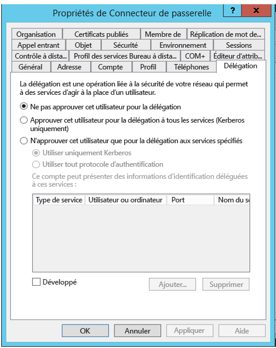
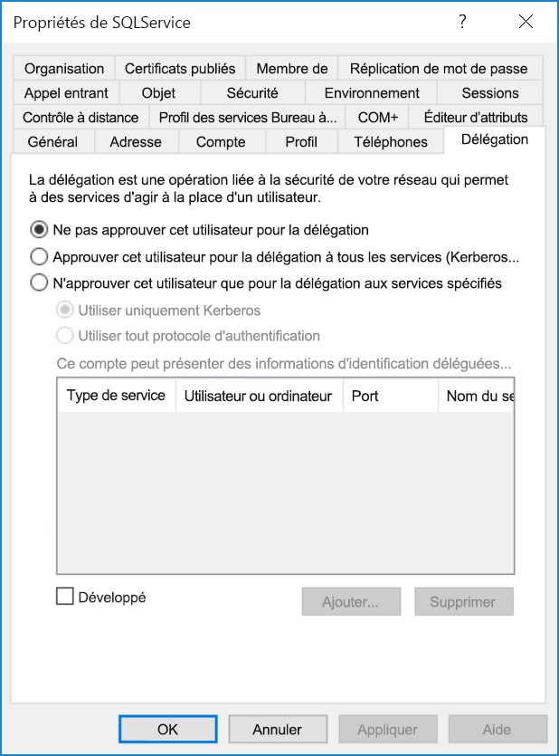

# <a name="configure-kerberos-based-sso-from-power-bi-service-to-on-premises-data-sources"></a>Configurer l’authentification unique basée sur Kerberos du service Power BI vers des sources de données locales

Quand l’authentification unique est activée, les rapports et les tableaux de bord Power BI actualisent facilement les données à partir des sources locales, tout en respectant les autorisations de niveau utilisateur qui sont configurées sur ces sources. Utilisez la [délégation Kerberos contrainte](/windows-server/security/kerberos/kerberos-constrained-delegation-overview) pour activer la connectivité d’authentification unique sans interruption. 

## <a name="prerequisites"></a>Conditions préalables

Plusieurs éléments doivent être configurés pour qu’une délégation Kerberos contrainte fonctionne correctement, notamment les _noms de principal du service_ (SPN) et les paramètres de délégation sur les comptes de service.

### <a name="install-and-configure-the-microsoft-on-premises-data-gateway"></a>Installer et configurer la passerelle de données locale Microsoft

La passerelle de données locale prend en charge la mise à niveau sur place et la _prise de contrôle des paramètres_ de passerelles existantes.

### <a name="run-the-gateway-windows-service-as-a-domain-account"></a>Exécuter le service Windows de passerelle en tant que compte de domaine

Dans une installation standard, la passerelle s’exécute en tant que compte de service local à la machine, **NT Service\PBIEgwService**.


Pour activer une délégation Kerberos contrainte, la passerelle doit s’exécuter en tant que compte de domaine, sauf si votre instance Azure Active Directory (Azure AD) est déjà synchronisée avec votre instance Active Directory locale (avec Azure AD DirSync/Connect). Pour passer à un compte de domaine, consultez [Changer le compte de service de passerelle](/data-integration/gateway/service-gateway-service-account).

> [!NOTE]
> Si Azure AD Connect est configuré, et que les comptes d’utilisateur sont synchronisés, le service de passerelle n’a pas besoin d’effectuer des recherches Active AD locales au moment de l’exécution. Au lieu de cela, vous pouvez simplement utiliser le SID du service local pour le service de passerelle afin d’effectuer toutes les configurations nécessaires dans Azure AD. Les étapes de configuration de la délégation Kerberos contrainte décrites dans cet article sont les mêmes que les étapes de configuration nécessaires dans le contexte Azure AD. La différence est qu’elles s’appliquent à l’objet d’ordinateur de la passerelle (identifié par le SID du service local) dans Azure AD au lieu du compte de domaine.

## <a name="obtain-domain-admin-rights-to-configure-spns-setspn-and-kerberos-constrained-delegation-settings"></a>Obtenir des droits d’administrateur de domaine pour configurer les noms de principal du service (SetSPN) et les paramètres de la délégation Kerberos contrainte

Pour configurer les noms de principal du service et les paramètres de la délégation Kerberos, un administrateur de domaine doit éviter d’accorder des droits à une personne qui ne dispose pas de droits d’administrateur de domaine. La section suivante explique plus en détail les étapes de configuration recommandées.

## <a name="configure-kerberos-constrained-delegation-for-the-gateway-and-data-source"></a>Configurer la délégation Kerberos contrainte pour la passerelle et la source de données

Si nécessaire, configurez un nom de principal de service pour le compte de domaine du service de passerelle en tant qu’administrateur de domaine et configurez ensuite les paramètres de la délégation sur ce compte.

### <a name="configure-an-spn-for-the-gateway-service-account"></a>Configurer un nom de principal du service pour le compte de service de passerelle

Tout d’abord, déterminez si un nom de principal du service a déjà été créé pour le compte de domaine utilisé comme compte de service de passerelle :

1. En tant qu’administrateur de domaine, lancez le composant MMC (Microsoft Management Console) **Utilisateurs et ordinateurs Active Directory**.

2. Dans le volet gauche, cliquez avec le bouton droit sur le domaine, sélectionnez **Rechercher**, puis entrez le nom du compte du service de passerelle.

3. Dans les résultats de la recherche, cliquez avec le bouton droit sur le compte de service de passerelle, puis sélectionnez **Propriétés**.

4. Si l’onglet **Délégation** est visible dans la boîte de dialogue **Propriétés**, cela signifie qu’un nom de principal du service a déjà été créé et que vous pouvez passer directement à [Décider du type de délégation Kerberos contrainte à utiliser](#decide-on-the-type-of-kerberos-constrained-delegation-to-use).

5. S’il n’y a pas d’onglet **Délégation** dans la boîte de dialogue **Propriétés**, vous pouvez créer manuellement un nom de principal du service sur le compte pour l’activer. Utilisez l’[outil setspn](https://technet.microsoft.com/library/cc731241.aspx) qui est fourni avec Windows (vous devez avoir des droits d’administrateur de domaine pour créer le nom de principal du service).

   Par exemple, supposez que le compte de service de passerelle est **Contoso\GatewaySvc** et que le service de passerelle s’exécute sur la machine nommée **MyGatewayMachine**. Pour définir le nom de principal du service pour le compte de service de passerelle, exécutez la commande suivante :

   ```setspn -a gateway/MyGatewayMachine Contoso\GatewaySvc```

   Vous pouvez aussi définir le nom de principal du service en utilisant le composant logiciel enfichable MMC **Utilisateurs et ordinateurs Active Directory**.

### <a name="decide-on-the-type-of-kerberos-constrained-delegation-to-use"></a>Décider du type de délégation Kerberos contrainte à utiliser

Vous pouvez configurer les paramètres de délégation pour la délégation Kerberos standard ou pour la délégation Kerberos contrainte basée sur les ressources. Utilisez la délégation basée sur les ressources (nécessite Windows Server 2012 ou ultérieur) si votre source de données appartient à un domaine différent de celui de votre passerelle. Pour plus d’informations sur les différences entre les deux approches de la délégation, consultez [Vue d’ensemble de la délégation Kerberos contrainte](/windows-server/security/kerberos/kerberos-constrained-delegation-overview).

 Selon l’approche que vous voulez utiliser, passez à une des sections suivantes. N’effectuez pas les actions des deux sections :
 - [Configurer le compte de service de passerelle pour la délégation Kerberos contrainte standard](#configure-the-gateway-service-account-for-standard-kerberos-constrained-delegation)
- [Configurer le compte de service de passerelle pour la délégation Kerberos contrainte basée sur les ressources](#configure-the-gateway-service-account-for-resource-based-kerberos-constrained-delegation). 

## <a name="configure-the-gateway-service-account-for-standard-kerberos-constrained-delegation"></a>Configurer le compte de service de passerelle pour la délégation Kerberos contrainte standard

> [!NOTE]
> Effectuez les étapes de cette section si vous voulez activer la [délégation Kerberos contrainte standard](/windows-server/security/kerberos/kerberos-constrained-delegation-overview). Sinon, si vous voulez activer la délégation Kerberos contrainte basée sur les ressources, effectuez les étapes de [Configurer le compte de service de passerelle pour la délégation Kerberos contrainte basée sur les ressources](#configure-the-gateway-service-account-for-resource-based-kerberos-constrained-delegation).

Nous allons maintenant définir les paramètres de délégation pour le compte de service de passerelle. Différents outils permettent d’accomplir ces étapes. Ici, nous allons utiliser le composant MMC **Utilisateurs et ordinateurs Active Directory** pour administrer et publier des informations dans l’annuaire. Il est disponible par défaut sur les contrôleurs de domaine, mais vous pouvez également l’activer via la configuration des fonctionnalités de Windows.

Nous devons configurer une délégation Kerberos contrainte avec transit de protocole. Avec une délégation contrainte, vous devez être explicite quant aux services pour lesquels vous autorisez la passerelle à présenter les informations d’identification déléguées. Par exemple, seul le serveur SQL Server ou votre serveur SAP HANA accepte les appels de délégation du compte de service de passerelle.

Cette section suppose que vous avez déjà configuré les noms de principal du service pour vos sources de données sous-jacentes (par exemple, SQL Server, SAP HANA, SAP BW, Teradata ou Spark). Pour découvrir comment configurer ces noms de principal du service de serveur source de données, reportez-vous à la documentation technique du serveur de base de données concerné et consultez la section *What SPN does your app require?* dans le billet de blog [My Kerberos Checklist](https://techcommunity.microsoft.com/t5/SQL-Server-Support/My-Kerberos-Checklist-8230/ba-p/316160).

Dans les étapes suivantes, nous supposons un environnement local comprenant deux machines dans le même domaine : une machine de passerelle et un serveur de base de données exécutant SQL Server déjà configuré pour l’authentification unique basée sur Kerberos. Les étapes peuvent être adoptées pour une des autres sources de données prises en charge, tant que la source de données a déjà été configurée pour l’authentification unique basée sur Kerberos. Pour cet exemple, nous allons utiliser les paramètres suivants :

* Domaine Active Directory (NetBIOS) : **Contoso**
* Nom de la machine de la passerelle : **MyGatewayMachine**
* Compte de service de passerelle : **Contoso\GatewaySvc**
* Nom de la machine source de données SQL Server : **TestSQLServer**
* Compte de service de source de données SQL Server : **Contoso\SQLService**

Voici comment configurer les paramètres de délégation :

1. Avec des droits d’administrateur de domaine, ouvrez le composant MMC **Utilisateurs et ordinateurs Active Directory**.

2. Cliquez avec le bouton droit sur le compte de service de passerelle (**Contoso\GatewaySvc**), puis sélectionnez **Propriétés**.

3. Sélectionnez l’onglet **Délégation**.

4. Sélectionnez **N’approuver cet ordinateur que pour la délégation aux services spécifiés** > **Utiliser tout protocole d’authentification**.

5. Sous **Ce compte peut présenter des informations d’identification déléguées à ces services**, sélectionnez **Ajouter**.

6. Dans la boîte de dialogue Nouveau, sélectionnez **Utilisateurs ou ordinateurs**.

7. Entrez le compte de service pour la source de données, puis sélectionnez **OK**.

   Par exemple, une source de données SQL Server peut avoir un compte de service comme *Contoso\SQLService*. Un nom de principal de service (SPN) approprié pour la source de données doit déjà avoir été défini sur ce compte. 

8. Sélectionnez le nom de principal du service que vous avez créé pour le serveur de base de données. 

   Dans notre exemple, le nom de principal du service commence par *MSSQLSvc*. Si vous avez ajouté le nom de domaine complet (FQDN) et le nom de principal du service NetBIOS pour votre service de base de données, sélectionnez les deux. Vous n’en voyez peut-être qu’un seul.

9. Sélectionnez **OK**. 

   Vous devez maintenant voir le SPN dans la liste des services auxquels le compte de service de passerelle peut présenter des informations d’identification déléguées.

    

10. Pour continuer le processus de configuration, passez à [Accorder au compte du service de passerelle les droits de stratégie locaux sur la machine de passerelle](#grant-the-gateway-service-account-local-policy-rights-on-the-gateway-machine).

## <a name="configure-the-gateway-service-account-for-resource-based-kerberos-constrained-delegation"></a>Configurer le compte de service de passerelle pour la délégation Kerberos contrainte basée sur les ressources

> [!NOTE]
> Effectuez les étapes de cette section si vous voulez activer la [délégation Kerberos contrainte basée sur les ressources](/windows-server/security/kerberos/kerberos-constrained-delegation-overview#resource-based-constrained-delegation-across-domains). Sinon, si vous voulez activer la délégation Kerberos contrainte standard, effectuez les étapes décrites dans [Configurer le compte de service de passerelle pour la délégation Kerberos contrainte standard](#configure-the-gateway-service-account-for-standard-kerberos-constrained-delegation).

Vous utilisez la [délégation contrainte Kerberos basée sur les ressources](/windows-server/security/kerberos/kerberos-constrained-delegation-overview#resource-based-constrained-delegation-across-domains) pour activer la connectivité d’authentification unique pour Windows Server 2012 et ultérieur. Ce type de délégation permet aux services front-end et back-end de se trouver dans des domaines différents. Pour qu’elle fonctionne, le domaine du service back-end doit approuver le domaine du service front-end.

Dans les étapes suivantes, nous supposons un environnement local comprenant deux machines dans différents domaines : une machine de passerelle et un serveur de base de données exécutant SQL Server déjà configuré pour l’authentification unique basée sur Kerberos. Ces étapes peuvent être adoptées pour une des autres sources de données prises en charge, tant que la source de données a déjà été configurée pour l’authentification unique basée sur Kerberos. Pour cet exemple, nous allons utiliser les paramètres suivants :

* Domaine du front-end Active Directory (NetBIOS) : **ContosoFrontEnd**
* Domaine du back-end Active Directory (NetBIOS) : **ContosoBackEnd**
* Nom de la machine de la passerelle : **MyGatewayMachine**
* Compte de service de passerelle : **ContosoFrontEnd\GatewaySvc**
* Nom de la machine source de données SQL Server : **TestSQLServer**
* Compte de service de source de données SQL Server : **ContosoBackEnd\SQLService**

Effectuez les étapes de configuration suivantes :

1. Utilisez le composant MMC **Utilisateurs et ordinateurs Active Directory** sur le contrôleur de domaine pour le domaine **ContosoFrontEnd** et vérifiez qu’aucun paramètre de délégation n’est appliqué pour le compte de service de passerelle.

    

2. Utilisez **Utilisateurs et ordinateurs Active Directory** sur le contrôleur de domaine pour le domaine **ContosoBackEnd** et vérifiez qu’aucun paramètre de délégation n’est appliqué pour le compte de service back-end.

    

3. Sous l’onglet **Éditeur d’attribut** des propriétés du compte, vérifiez que l’attribut **msDS-AllowedToActOnBehalfOfOtherIdentity** n’est pas défini.

    

4. Dans **Utilisateurs et ordinateurs Active Directory**, créez un groupe sur le contrôleur de domaine pour le domaine **ContosoBackEnd**. Ajoutez le compte de service de passerelle **GatewaySvc** au groupe **ResourceDelGroup**. 

    

5. Ouvrez une invite de commandes et exécutez les commandes suivantes dans le contrôleur de domaine pour le domaine **ContosoBackEnd** pour mettre à jour l’attribut **msDS-AllowedToActOnBehalfOfOtherIdentity** du compte de service back-end :

    ```powershell
    $c = Get-ADGroup ResourceDelGroup
    Set-ADUser SQLService -PrincipalsAllowedToDelegateToAccount $c
    ```

6. Dans **Utilisateurs et ordinateurs Active Directory**, vérifiez que la mise à jour est répercutée sous l’onglet **Éditeur d’attribut** dans les propriétés du compte de service back-end. 

## <a name="grant-the-gateway-service-account-local-policy-rights-on-the-gateway-machine"></a>Accorder au compte du service de passerelle les droits de stratégie locaux sur la machine de passerelle

Enfin, sur la machine exécutant le service de passerelle (dans notre exemple, **MyGatewayMachine**), attribuez au compte de service de passerelle les stratégies locales **Emprunter l’identité d’un client après l’authentification** et **Agir en tant que partie du système d’exploitation (SeTcbPrivilege)** . Effectuez cette configuration avec l’Éditeur de stratégie de groupe locale (**gpedit.mscx**).

1. Sur la machine de la passerelle, exécutez **gpedit.msc**.

2. Accédez à **Stratégie de l’ordinateur local** &gt; **Configuration ordinateur** &gt; **Paramètres Windows** &gt; **Paramètres de sécurité** &gt; **Stratégies locales** &gt; **Attribution des droits utilisateur**.

    

3. Sous **Attribution des droits utilisateur**, dans la liste des stratégies, sélectionnez **Emprunter l’identité d’un client après l’authentification**.

    
    
4. Cliquez avec le bouton droit sur la stratégie, ouvrez **Propriétés**, puis visualisez la liste des comptes. 

    La liste doit inclure le compte de service de passerelle (**Contoso\GatewaySvc** ou **ContosoFrontEnd\GatewaySvc**, en fonction du type de la délégation contrainte).

5. Sous **Attribution des droits utilisateur**, sélectionnez **Agir en tant que partie du système d’exploitation (SeTcbPrivilege)** dans la liste des stratégies. Vérifiez que le compte de service de passerelle est inclus dans la liste des comptes.

6. Redémarrez le processus de service **Passerelle de données locale**.

### <a name="set-user-mapping-configuration-parameters-on-the-gateway-machine-if-necessary"></a>Définir les paramètres de configuration de mappage d’utilisateur sur la machine de la passerelle (si nécessaire)

Si vous n’avez pas Azure AD Connect configuré, procédez comme suit pour mapper un utilisateur du service Power BI à un utilisateur Active Directory local. Chaque utilisateur Active Directory mappé de cette manière doit disposer des autorisations d’authentification unique pour votre source de données. Pour plus d’informations, consultez cette [vidéo de Guy in a Cube](https://www.youtube.com/watch?v=NG05PG9aiRw).

1. Ouvrez le fichier de configuration de la passerelle principale, Microsoft.PowerBI.DataMovement.Pipeline.GatewayCore.dll. Par défaut, ce fichier est stocké à l’emplacement C:\Program Files\On-premises data gateway.

1. Définissez **ADUserNameLookupProperty** sur un attribut Active Directory inutilisé. Nous allons utiliser `msDS-cloudExtensionAttribute1` dans les étapes qui suivent. Cet attribut est disponible seulement dans Windows Server 2012 et ultérieur. 

1. Définissez **ADUserNameReplacementProperty** sur `SAMAccountName`, puis enregistrez le fichier de configuration.

1. Sous l’onglet **Services** du Gestionnaire des tâches, cliquez avec le bouton droit sur le service de passerelle, puis sélectionnez **Redémarrer**.

    

1. Pour chaque utilisateur du service Power BI pour lequel vous voulez activer l’authentification unique Kerberos, définissez la propriété `msDS-cloudExtensionAttribute1` d’un utilisateur Active Directory local (avec l’autorisation d’authentification unique sur votre source de données) sur le nom d’utilisateur complet (UPN) de l’utilisateur du service Power BI. Par exemple, si vous vous connectez au service Power BI en tant que test@contoso.com et que vous voulez mapper cet utilisateur à un utilisateur Active Directory local avec des autorisations d’authentification unique, par exemple test@LOCALDOMAIN.COM, définissez l’attribut `msDS-cloudExtensionAttribute1` de cet utilisateur sur test@contoso.com.

    Vous pouvez définir la propriété `msDS-cloudExtensionAttribute1` avec le composant MMC Utilisateurs et ordinateurs Active Directory :
    
    1. En tant qu’administrateur de domaine, lancez **Utilisateurs et ordinateurs Active Directory**.
    
    1. Cliquez avec le bouton droit sur le nom de domaine, sélectionnez **Rechercher**, puis entrez le nom de compte de l’utilisateur local Active Directory à mapper.
    
    1. Sélectionnez l’onglet **Éditeur d’attributs**.
    
        Recherchez la propriété `msDS-cloudExtensionAttribute1`, puis double-cliquez dessus. Définissez la valeur sur le nom complet de l’utilisateur (UPN) dont vous vous servez pour vous connecter au service Power BI.
    
    1. Sélectionnez **OK**.
    
        
    
    1. Sélectionnez **Appliquer**. Vérifiez que la valeur correcte a été définie dans la colonne **Valeur**.

## <a name="complete-data-source-specific-configuration-steps"></a>Effectuer les étapes de configuration spécifiques à la source de données

SAP HANA et SAP BW ont des exigences de configuration supplémentaires spécifiques à la source de données et des prérequis que vous devez satisfaire avant de pouvoir établir une connexion avec authentification unique via la passerelle à ces sources de données. Pour plus d’informations, consultez [Configuration de SAP HANA](service-gateway-sso-kerberos-sap-hana.md) et [la page de configuration de SAP BW - CommonCryptoLib (sapcrypto.dll)](service-gateway-sso-kerberos-sap-bw-commoncryptolib.md). Bien qu’il soit également possible de [configurer SAP BW pour une utilisation avec la bibliothèque SNC gx64krb5](service-gateway-sso-kerberos-sap-bw-gx64krb.md), cette bibliothèque n’est pas recommandée, car elle n’est plus prise en charge par SAP. Vous devez utiliser CommonCryptoLib _ou_ gx64krb5 comme bibliothèque SNC. N’effectuez pas les étapes de configuration pour les deux bibliothèques.

> [!NOTE]
> D’autres bibliothèques SNC peuvent également fonctionner pour l’authentification unique BW, mais elles ne sont pas officiellement prises en charge par Microsoft.

## <a name="run-a-power-bi-report"></a>Générer un rapport Power BI

Une fois que vous avez terminé toutes les étapes de configuration, utilisez la page **Gérer la passerelle** dans Power BI pour configurer la source de données à utiliser pour l’authentification unique. Si vous avez plusieurs passerelles, assurez-vous de sélectionner la passerelle que vous avez configurée pour l’authentification unique Kerberos. Ensuite, sous **Paramètres avancés** pour la source de données, vérifiez que l’option **Utiliser SSO via Kerberos pour les requêtes DirectQuery** est cochée.


 Publiez un rapport basé sur DirectQuery à partir de Power BI Desktop. Ce rapport doit utiliser des données qui sont accessibles à l’utilisateur mappé à l’utilisateur (Azure) Active Directory qui se connecte au service Power BI. En raison du fonctionnement de l’actualisation, vous devez utiliser DirectQuery au lieu de l’importation. Quand la passerelle actualise des rapports basés sur l’importation, elle utilise les informations d’identification que vous avez entrées dans les champs **Nom d’utilisateur** et **Mot de passe** lors de la création de la source de données. En d’autres termes, l’authentification unique Kerberos n’est *pas* utilisée. Quand vous publiez, sélectionnez la passerelle que vous avez configurée pour l’authentification unique si vous avez plusieurs passerelles. Dans le service Power BI, vous pouvez maintenant actualiser le rapport ou en créer un basé sur le jeu de données publié.

Cette configuration est appropriée dans la plupart des cas. Toutefois, avec Kerberos, il peut y avoir différentes configurations en fonction de votre environnement. Si vous ne parvenez pas à charger le rapport, contactez votre administrateur de domaine pour résoudre le problème. Si votre source de données est SAP BW, reportez-vous aux sections de résolution des problèmes des pages de configuration spécifiques à la source de données pour [CommonCryptoLib](service-gateway-sso-kerberos-sap-bw-commoncryptolib.md#troubleshooting) et [gx64krb5/gsskrb5](service-gateway-sso-kerberos-sap-bw-gx64krb.md#troubleshooting), en fonction de la bibliothèque SNC que vous avez choisie.

## <a name="next-steps"></a>Étapes suivantes

Pour plus d’informations sur la passerelle de données locale et DirectQuery, consultez les ressources suivantes :

* [Qu’est-ce qu’une passerelle de données locale ?](/data-integration/gateway/service-gateway-onprem)
* [DirectQuery dans Power BI](desktop-directquery-about.md)
* [Sources de données prises en charge par DirectQuery](desktop-directquery-data-sources.md)
* [DirectQuery et SAP BW](desktop-directquery-sap-bw.md)
* [DirectQuery et SAP HANA](desktop-directquery-sap-hana.md)
