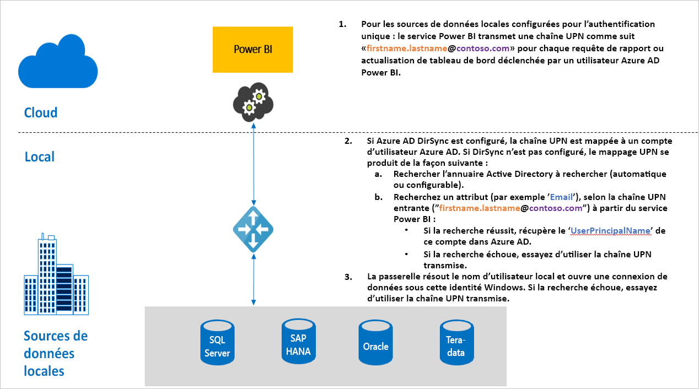

# Vue d’ensemble de l’authentification unique (SSO) pour les passerelles dans Power BI

Vous pouvez bénéficier d’une connectivité avec authentification unique fluide qui permet de mettre à jour des rapports et des tableaux de bord Power BI à partir de données locales, en configurant la passerelle de données locale. Vous avez la possibilité de configurer votre passerelle avec la délégation [Kerberos](service-gateway-sso-kerberos.md) contrainte ou avec [SAML](service-gateway-sso-saml.md). La passerelle de données locale prend en charge l’authentification unique avec [DirectQuery](desktop-directquery-about.md), qu’elle utilise pour se connecter à des sources de données locales.

Power BI prend en charge les sources de données suivantes :

* SQL Server (Kerberos)
* SAP HANA (Kerberos et SAML)
* Serveur d’applications SAP BW (Kerberos)
* Serveur de messages SAP BW (Kerberos) - Préversion publique
* Oracle(Kerberos) - Préversion publique
* Teradata (Kerberos)
* Spark (Kerberos)
* Impala (Kerberos)

L’authentification unique pour [M-extensions](https://github.com/microsoft/DataConnectors/blob/master/docs/m-extensions.md) n’est pas prise en charge.

Quand un utilisateur interagit avec un rapport DirectQuery dans le service Power BI, chaque opération de filtrage croisé, de découpage, de tri et de modification de rapport peut entraîner l’envoi de requêtes actives à la source de données locale sous-jacente. Quand vous configurez l’authentification unique pour la source de données, les requêtes s’exécutent sous l’identité de l’utilisateur qui interagit avec Power BI via l’expérience web ou des applications mobiles Power BI. Par conséquent, chaque utilisateur voit précisément dans la source de données sous-jacente les données pour lesquelles il dispose d’autorisations. Une fois l’authentification unique configurée, la mise en cache des données n’est pas partagée entre les utilisateurs.

## Étapes d’une requête durant l’exécution de l’authentification unique

Une requête exécutée avec une authentification unique comprend trois étapes, comme illustré dans le diagramme suivant.

Voici des détails supplémentaires sur chacune des ces étapes :

1. Pour chaque requête, le service Power BI spécifie le *nom d’utilisateur principal ou UPN* (nom d’utilisateur complet de l’utilisateur actuellement connecté au service Power BI) quand il envoie une demande de requête à la passerelle configurée.

2. La passerelle doit mapper l’UPN Active Directory Azure à une identité Active Directory locale :

   a. Si Azure AD DirSync (également appelé *Azure AD Connect*) est configuré, le mappage fonctionne automatiquement dans la passerelle.

   b.  Autrement, la passerelle peut rechercher et mapper l’UPN Azure AD à un utilisateur AD local en effectuant une recherche dans le domaine Active Directory local.

3. Le processus du service de passerelle emprunte l’identité de l’utilisateur local mappé, ouvre la connexion à la base de données sous-jacente, puis envoie la requête. Il n’est pas nécessaire d’installer la passerelle sur la même machine que la base de données.

## Étapes suivantes

Maintenant que vous savez comment activer l’authentification unique via la passerelle, vous pouvez approfondir vos connaissances sur Kerberos et SAML :

* [Authentification unique (SSO) - Kerberos](service-gateway-sso-kerberos.md)
* [Authentification unique (SSO) - SAML](service-gateway-sso-saml.md)
