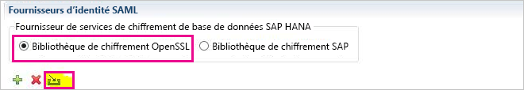
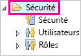
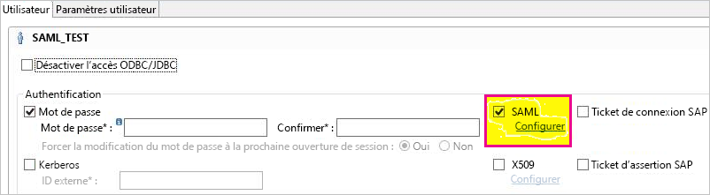
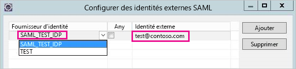
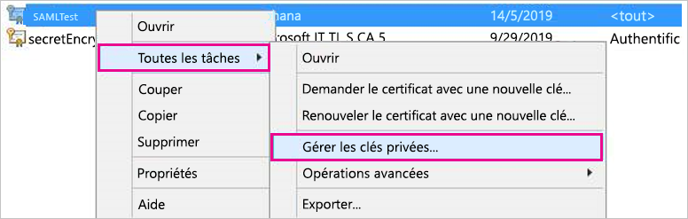

# <a name="use-security-assertion-markup-language-saml-for-sso-from-power-bi-to-on-premises-data-sources"></a>Utiliser SAML (Security Assertion Markup Language) pour l’authentification unique de Power BI sur des sources de données locales

Quand l’authentification unique est activée, les rapports et les tableaux de bord Power BI actualisent facilement les données à partir des sources locales, tout en respectant les autorisations de niveau utilisateur qui sont configurées sur ces sources. Utilisez [SAML (Security Assertion Markup Language)](https://www.onelogin.com/pages/saml) pour permettre une connectivité d’authentification unique fluide. 

## <a name="supported-data-sources"></a>Sources de données prises en charge

Nous prenons en charge SAP HANA avec SAML. Pour plus d’informations sur la configuration de l’authentification unique pour SAP HANA à l’aide de SAML, consultez [SAML SSO for BI Platform to HANA](https://wiki.scn.sap.com/wiki/display/SAPHANA/SAML+SSO+for+BI+Platform+to+HANA) (Authentification unique SAML pour la plateforme BI dans HANA).

Nous prenons en charge des sources de données supplémentaires avec [Kerberos](service-gateway-sso-kerberos.md) (dont SAP HANA).

Pour SAP HANA, il est recommandé d’activer le chiffrement avant d’établir une connexion avec authentification unique SAML. Pour activer le chiffrement, configurez le serveur HANA pour qu’il accepte les connexions chiffrées et configurez la passerelle afin qu’elle utilise le chiffrement pour communiquer avec votre serveur HANA. Le pilote ODBC HANA n’étant pas en mesure de chiffrer les assertions SAML par défaut, l’assertion SAML signée est envoyée à partir de la passerelle au serveur HANA *en clair* et peut donc être interceptée et réutilisée par des tiers. Pour obtenir des instructions sur l’activation du chiffrement pour HANA à l’aide de la bibliothèque OpenSSL, consultez [Activer le chiffrement pour SAP HANA](/power-bi/desktop-sap-hana-encryption).

## <a name="configuring-the-gateway-and-data-source"></a>Configuration de la passerelle et de la source de données

Pour utiliser SAML, vous devez établir une relation d’approbation entre les serveurs HANA pour lesquels vous souhaitez activer l’authentification unique et la passerelle. Dans ce scénario, la passerelle joue le rôle de fournisseur d’identité SAML. Pour établir cette relation, vous pouvez, par exemple, importer le certificat x509 du fournisseur d’identité de la passerelle dans le magasin d’approbations des serveurs HANA ou faire signer le certificat X509 de la passerelle par une autorité de certification racine approuvée par les serveurs HANA. Nous décrivons cette dernière approche dans ce guide, mais vous pouvez utiliser une autre approche si elle est plus pratique.

Ce guide utilise OpenSSL comme fournisseur de chiffrement du serveur HANA. Cependant, SAP recommande d’utiliser la bibliothèque de chiffrement SAP (également appelé CommonCryptoLib ou sapcrypto) au lieu d’OpenSSL pour effectuer les étapes de configuration correspondant à l’établissement de la relation d’approbation. Pour plus d’informations, consultez la documentation SAP officielle.

Les étapes suivantes décrivent comment établir une relation d’approbation entre un serveur HANA et le fournisseur d’identité de la passerelle en signant le certificat X509 du fournisseur d’identité de la passerelle à l’aide d’une autorité de certification racine approuvée par le serveur HANA. Vous allez créer cette autorité de certification racine :

1. Créez la clé privée et le certificat X509 de l’autorité de certification racine. Par exemple, pour créer la clé privée et le certificat X509 de l’autorité de certification racine au format .pem, entrez la commande suivante :

   ```
   openssl req -new -x509 -newkey rsa:2048 -days 3650 -sha256 -keyout CA_Key.pem -out CA_Cert.pem -extensions v3_ca
   ```

    Assurez-vous que la clé privée de l’autorité de certification racine est correctement sécurisée. Si elle est récupérée par un tiers, celui-ci peut l’utiliser pour accéder au serveur HANA de façon non autorisée. 

 1. Ajoutez le certificat (par exemple, CA_Cert.pem) au magasin d’approbations du serveur HANA pour que celui-ci approuve les certificats signés par l’autorité de certification racine que vous avez créée. 

    Vous pouvez connaître l’emplacement du magasin d’approbations de votre serveur HANA en examinant le paramètre de configuration **ssltruststore**. Si vous avez suivi les instructions de la documentation SAP couvrant la configuration d’OpenSSL, il se peut que votre serveur HANA approuve déjà une autorité de certification racine réutilisable. Pour plus d’informations, consultez [How to Configure Open SSL for SAP HANA Studio to SAP HANA Server](https://archive.sap.com/documents/docs/DOC-39571) (Guide pratique pour configurer Open SSL pour les communications entre SAP HANA Studio et le serveur SAP HANA). Si vous souhaitez activer l’authentification unique SAML pour plusieurs serveurs HANA, vérifiez que chacun des serveurs approuve cette autorité de certification racine.

1. Créez le certificat X509 du fournisseur d’identité de la passerelle. 

   Par exemple, pour créer une demande de signature de certificat (IdP_Req.pem) et une clé privée (IdP_Key.pem) qui sont valides pendant un an, exécutez la commande suivante :

   ```
   openssl req -newkey rsa:2048 -days 365 -sha256 -keyout IdP_Key.pem -out IdP_Req.pem -nodes
   ```

 1. Signez la demande de signature de certificat à l’aide de l’autorité de certification racine dont vous avez configuré l’approbation par vos serveurs HANA. 

    Par exemple, pour signer IdP_Req.pem à l’aide de CA_Cert.pem et CA_Key.pem (le certificat et la clé de l’autorité de certification racine), exécutez la commande suivante :

    ```
    openssl x509 -req -days 365 -in IdP_Req.pem -sha256 -extensions usr_cert -CA CA_Cert.pem -CAkey CA_Key.pem -CAcreateserial -out IdP_Cert.pem
    ```

     Le certificat de fournisseur d’identité obtenu est valide pendant un an (voir l’option -days). 

Importez le certificat de votre fournisseur d’identité dans HANA Studio pour créer un fournisseur d’identité SAML.

1. Dans SAP HANA Studio, cliquez avec le bouton droit sur le nom de votre serveur SAP HANA, puis accédez à **Security** &gt; **Open Security Console** &gt; **SAML Identity Provider** &gt; **OpenSSL Cryptographic Library** (Sécurité > Ouvrir la console de sécurité > Fournisseur d’identité SAML > Bibliothèque de chiffrement OpenSSL).

    

1. Sélectionnez **Import**, accédez à IdP_Cert.pem, puis importez-le.

1. Dans SAP HANA Studio, sélectionnez le dossier **Security**.

    

1. Développez **Users**, puis sélectionnez l’utilisateur auquel vous souhaitez associer votre utilisateur Power BI.

1. Sélectionnez **SAML**, puis sélectionnez **Configure**.

    

1. Sélectionnez le fournisseur d’identité que vous avez créé à l’étape 2. Sous **External Identity**, entrez l’UPN de l’utilisateur Power BI (en général, l’adresse e-mail avec laquelle l’utilisateur se connecte à Power BI), puis sélectionnez **Add**. Si vous avez configuré votre passerelle pour utiliser l’option de configuration *ADUserNameReplacementProperty*, entrez la valeur qui remplacera l’UPN d’origine de l’utilisateur Power BI. 

   Par exemple, si vous définissez *ADUserNameReplacementProperty* avec la valeur **SAMAccountName**, vous devez entrer le **SAMAccountName** de l’utilisateur.

    

Le certificat et l’identité de la passerelle étant maintenant configurés, convertissez le certificat dans un format pfx et configurez la passerelle pour qu’elle utilise le certificat :

1. Convertissez le certificat au format pfx en exécutant la commande suivante. Cette commande nomme le fichier. pfx obtenu samlcert.pfx et définit *root* comme mot de passe :

    ```
    openssl pkcs12 -export -out samltest.pfx -in IdP_Cert.pem -inkey IdP_Key.pem -passin pass:root -passout pass:root
    ```

1. Copiez le fichier pfx sur la machine de passerelle :

    1. Double-cliquez sur samltest.pfx, puis sélectionnez **Ordinateur local** &gt; **Suivant**.

    1. Entrez le mot de passe, puis sélectionnez **Suivant**.

    1. Sélectionnez **Placer tous les certificats dans le magasin suivant**, puis sélectionnez **Parcourir** &gt; **Personnel** &gt; **OK**.

    1. Sélectionnez **Suivant**, puis **Terminer**.

       

1. Octroyez au compte de service de passerelle l’accès à la clé privée du certificat :

    1. Sur la machine de passerelle, exécutez la console MMC (Microsoft Management Console).

        

    1. Sous **Fichier**, sélectionnez **Ajouter/Supprimer un composant logiciel enfichable**.

        

    1. Sélectionnez **Certificats** &gt; **Ajouter**, puis sélectionnez **Un compte d’ordinateur** &gt; **Suivant**.

    1. Sélectionnez **Ordinateur local** &gt; **Terminer** &gt; **OK**.

    1. Développez **Certificats** &gt; **Personnel** &gt; **Certificats**, puis recherchez le certificat.

    1. Cliquez avec le bouton droit sur le certificat, puis accédez à **Toutes les tâches** &gt; **Gérer les clés privées**.

        

    1. Ajoutez le compte de service de passerelle à la liste. Par défaut, le compte est **NT SERVICE\PBIEgwService**. Vous pouvez déterminer le compte qui exécute le service de passerelle en exécutant **services.msc** et en recherchant **Service de passerelle de données locale**.

        

Enfin, suivez les étapes ci-après pour ajouter l’empreinte de certificat à la configuration de la passerelle :

1. Exécutez la commande PowerShell suivante pour lister les certificats présents sur votre ordinateur :

    ```powershell
    Get-ChildItem -path cert:\LocalMachine\My
    ```

1. Copiez l’empreinte du certificat que vous avez créé.

1. Accédez au répertoire de la passerelle qui, par défaut, est C:\Program Files\On-premises data gateway.

1. Ouvrez PowerBI.DataMovement.Pipeline.GatewayCore.dll.config, puis recherchez la section *SapHanaSAMLCertThumbprint*. Collez l’empreinte que vous avez copiée.

1. Redémarrez le service de passerelle.

## <a name="running-a-power-bi-report"></a>Exécution d’un rapport Power BI

Vous pouvez maintenant utiliser la page **Gérer la passerelle** dans Power BI pour configurer la source de données SAP HANA. Sous **Paramètres avancés**, activez l’authentification unique avec SAML. Ceci vous permet de publier des rapports et des jeux de données liés à cette source de données.

   

## <a name="troubleshooting"></a>Résolution des problèmes

Après avoir configuré l’authentification unique SAML, vous risquez de voir l’erreur suivante dans le portail Power BI : *Impossible d’utiliser les informations d’identification fournies pour la source SapHana.* Cette erreur indique que les informations d’identification SAML ont été refusées par SAP HANA.

Les traces d’authentification côté serveur fournissent des informations détaillées pour résoudre les problèmes d’informations d’identification sur SAP HANA. Suivez ces étapes pour configurer le traçage de votre serveur SAP HANA :

1. Sur le serveur SAP HANA, activez la trace d’authentification en exécutant la requête suivante :

    ```
    ALTER SYSTEM ALTER CONFIGURATION ('indexserver.ini', 'SYSTEM') set ('trace', 'authentication') = 'debug' with reconfigure 
    ```

1. Reproduisez le problème.

1. Dans HANA Studio, ouvrez la console d’administration et sélectionnez l’onglet **Fichiers de diagnostic**.

1. Ouvrez la dernière trace du serveur d’index et recherchez *SAMLAuthenticator.cpp*.

    Vous devriez trouver un message d’erreur détaillé qui indique la cause racine, par exemple :

    ```
    [3957]{-1}[-1/-1] 2018-09-11 21:40:23.815797 d Authentication   SAMLAuthenticator.cpp(00091) : Element '{urn:oasis:names:tc:SAML:2.0:assertion}Assertion', attribute 'ID': '123123123123123' is not a valid value of the atomic type 'xs:ID'.
    [3957]{-1}[-1/-1] 2018-09-11 21:40:23.815914 i Authentication   SAMLAuthenticator.cpp(00403) : No valid SAML Assertion or SAML Protocol detected
    ```

1. Une fois le problème résolu, désactivez la trace d’authentification en exécutant la requête suivante :

    ```
    ALTER SYSTEM ALTER CONFIGURATION ('indexserver.ini', 'SYSTEM') UNSET ('trace', 'authentication');
    ```

## <a name="next-steps"></a>Étapes suivantes

Pour plus d’informations sur la passerelle de données locale et DirectQuery, consultez les ressources suivantes :

* [Qu’est-ce qu’une passerelle de données locale ?](/data-integration/gateway/service-gateway-onprem)
* [DirectQuery dans Power BI](desktop-directquery-about.md)
* [Sources de données prises en charge par DirectQuery](desktop-directquery-data-sources.md)
* [DirectQuery et SAP BW](desktop-directquery-sap-bw.md)
* [DirectQuery et SAP HANA](desktop-directquery-sap-hana.md)
