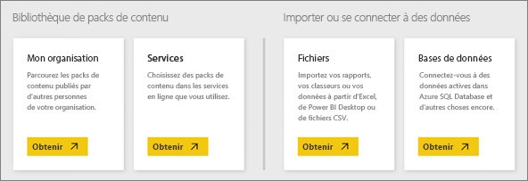

# Sources de données pour le service Power BI
Les données sont au cœur de Power BI. Chaque fois que vous explorez des données, créez des graphiques et tableaux de bord, posez des questions avec les Q&A, toutes les visualisations et les réponses que vous voyez tirent réellement leurs données sous-jacentes d’un jeu de données. Mais d’où provient ce jeu de données ? D’une source de données.

Dans cet article, nous allons passez en revue les différents types de sources de données auxquelles vous pouvez vous connecter à partir du service Power BI. N’oubliez pas qu’il existe de nombreux autres types de sources de données à partir desquels vous pouvez obtenir des données. Mais ceux-ci peuvent nécessiter l’utilisation préalable des fonctionnalités avancées de modélisation et de requêtes de données d’Excel ou Power BI Desktop. Nous aborderons cela plus en détail ultérieurement. Pour l’instant, examinons les différents types de sources de données auxquelles vous pouvez vous connecter directement depuis le site de service Power BI.

Vous pouvez obtenir des données à partir d’une de ces sources de données dans Power BI en cliquant sur **Mon espace de travail** > **Obtenir des données**.

## Fichiers

**Excel** (.xlsx, xlxm) : Excel est unique dans la mesure où un classeur peut comporter des données que vous avez saisies vous-même dans des feuilles de calcul, et vous pouvez interroger et charger des données à partir de sources de données externes à l’aide de Power Query (Obtenir et transformer dans Excel 2016) ou Power Pivot. Vous pouvez importer des données provenant de tableaux dans des feuilles de calcul (les données *doivent* être situées dans un tableau) ou importer des données qui sont chargées dans un modèle de données. Pour plus d’informations, consultez [Obtenir des données à partir d’Excel](service-get-data-from-files.md).

**Power BI Desktop** (.pbix) : vous pouvez utiliser Power BI Desktop pour interroger et charger des données à partir de sources de données externes, étendre votre modèle de données avec des mesures et des relations, et créer des rapports. Vous pouvez importer votre fichier Power BI Desktop dans votre site Power BI. Power BI Desktop est idéal pour les utilisateurs plus expérimentés qui ont une bonne compréhension de leurs sources de données, de la transformation et des requêtes de données et des concepts de modélisation des données. Pour en savoir plus, consultez [Se connecter à des données dans Power BI Desktop](desktop-connect-to-data.md).

**Comma Separated Value** (.csv) : il s’agit de fichiers texte simples avec des lignes de données. Chaque ligne peut contenir une ou plusieurs valeurs, séparées par une virgule. Par exemple, dans un fichier .csv contenant des données liées à des noms et des adresses et un certain nombre de lignes, chaque ligne possède des valeurs pour le prénom, le nom, l’adresse postale, la ville, l’État et ainsi de suite. Vous ne pouvez pas importer des données dans un fichier .csv, mais de nombreuses applications, comme Excel, peuvent enregistrer des données de tableaux simples dans un fichier .csv.

Pour les autres types de fichiers comme les tableaux XML (.xml) ou les fichiers textes (.txt), vous pouvez utiliser Obtenir et transformer pour d’abord interroger, transformer et charger les données dans un fichier Excel ou Power BI Desktop. Vous pouvez ensuite importer le fichier Excel ou Power BI Desktop dans Power BI.

De plus, l’endroit où vous stockez vos fichiers peut faire une grosse différence. OneDrive Entreprise offre davantage de souplesse et une meilleure intégration avec Power BI. Vous pouvez conserver vos fichiers sur votre lecteur local. Toutefois, si vous avez devez actualiser vos données, quelques étapes supplémentaires sont nécessaires. Les articles associés contiennent plus de détails.

## Packs de contenu

Les packs de contenu contiennent toutes les données et tous les rapports dont vous avez besoin, déjà prêts. Dans Power BI, il existe deux types de packs de contenu : ceux des services tels que Google Analytics, Marketo ou Salesforce et ceux créés et partagés par d’autres utilisateurs dans votre organisation.

**Services** : il existe des douzaines de services avec des packs de contenu pour Power BI et de nouveaux packs sont constamment ajoutés. La plupart des services nécessitent de posséder un compte. Pour plus d’informations, consultez [Se connecter aux services](service-connect-to-services.md).

**Organisationnel** : si vous et d’autres utilisateurs de l’organisation possédez un compte Power BI Pro, vous pouvez créer, partager et utiliser des packs de contenu. Pour plus d’informations, consultez [Packs de contenu organisationnels](service-organizational-content-pack-introduction.md).

## Bases de données

**Bases de données dans le cloud** : depuis le service Power BI, vous pouvez vous connecter en direct à Azure SQL Database, Azure SQL Data Warehouse, Spark sur Azure HD Insight et SQL Server Analysis Services avec DirectQuery. Les connexions à ces bases de données effectuées depuis Power BI sont actives. Cela signifie que lorsque vous vous connectez à Azure SQL Database, par exemple, et commencez à explorer ses données en créant des rapports dans Power BI, chaque fois que vous découpez vos données ou ajoutez un autre champ à une visualisation, une requête est envoyée directement à la base de données. Pour en savoir plus, consultez [Azure et Power BI](service-azure-and-power-bi.md).

**Bases de données locales** : depuis le service Power BI, vous pouvez vous connecter directement à des bases de données model tabulaires SQL Server Analysis Services. Une passerelle d’entreprise Power BI est requise. Si vous ne savez pas comment vous connecter à la base de données model tabulaire de votre organisation, contactez votre administrateur ou le service informatique. Pour en savoir plus, consultez [Données tabulaires SQL Server Analysis dans Power BI](sql-server-analysis-services-tabular-data.md).

Pour les autres types de bases de données de votre organisation, vous devez tout d’abord utiliser Power BI Desktop ou Excel pour vous connecter aux données d’un modèle de données, les interroger et les charger. Vous pouvez ensuite importer votre fichier dans Power BI où un jeu de données est créé. Si vous configurez l’actualisation planifiée, Power BI utilise les informations de connexion du fichier, ainsi que les paramètres d’actualisation que vous configurez pour vous connecter directement à la source de données et rechercher des mises à jour. Ces mises à jour sont ensuite chargées dans le jeu de données dans Power BI. Pour en savoir plus, consultez [Se connecter à des données dans Power BI Desktop](desktop-connect-to-data.md).

## Et si mes données proviennent d’une source différente ?
Il existe des centaines de sources de données différentes que vous pouvez utiliser avec Power BI. Mais, quelle que soit la source de vos données, ces données doivent se trouver dans un format permettant à Power BI de créer des rapports et tableaux de bord, de répondre aux questions via Q&A et ainsi de suite.

Les données de certaines sources de données sont déjà dans un format prêt pour le service Power BI, comme les packs de contenu de fournisseurs de services tels que Google Analytics et Twilio. Les bases de données model tabulaires SQL Server Analysis Services sont également prêtes. Et vous pouvez vous connecter en direct aux bases de données dans le cloud, comme Azure SQL Database et Spark on HDInsight.

Dans d’autres cas, il peut être nécessaire d’interroger et charger les données dans un fichier. Par exemple, supposons que des données logistiques se trouvent dans une base de données de l’entrepôt de données sur un serveur de votre organisation. Dans le service Power BI, vous ne pouvez pas vous connecter directement à cette base de données et commencer à explorer ses données (sauf s’il s’agit d’une base de données model tabulaire). Toutefois, vous pouvez utiliser Power BI Desktop ou Excel pour interroger et charger ces données logistiques dans un modèle de données que vous enregistrez en tant que fichier. Vous pouvez ensuite importer ce fichier dans Power BI où un jeu de données est créé.

Vous pensez probablement « mais les données logistiques sur cette base de données changent tous les jours. Comment m’assurer que mon jeu de données dans Power BI est actualisé ? » Les informations de connexion du fichier Power BI Desktop ou Excel sont importées dans le jeu de données, avec les données. Si vous configurez l’actualisation planifiée ou effectuez une actualisation manuelle sur le jeu de données, Power BI utilise les informations de connexion du jeu de données, ainsi que quelques autres paramètres, pour se connecter directement à la base de données, rechercher des mises à jour et charger ces mises à jour dans le jeu de données. Une passerelle Power BI sera probablement requise pour sécuriser les transferts de données entre votre serveur local et Power BI. Les visualisations dans les rapports et tableaux de bord sont automatiquement actualisées.

Le fait de ne pas pouvoir se connecter à la source de données directement depuis le service Power BI ne signifie pas nécessairement que vous ne pouvez pas obtenir les données dans Power BI. Cela peut simplement nécessiter quelques étapes supplémentaires et le concours du service informatique. Pour en savoir plus, consultez [Sources de données dans Power BI Desktop](desktop-data-sources.md).

## Informations complémentaires
Les termes Jeu de données et Source de données sont souvent utilisés dans Power BI. Ils sont souvent employés comme synonymes, mais en réalité, il s’agit de deux éléments complètement différents, bien que liés.

Un ***jeu de données*** est automatiquement créé dans Power BI lorsque vous utilisez la fonctionnalité Obtenir des données pour vous connecter à des données et les importer à partir d’un pack de contenu ou d’un fichier, ou lorsque vous vous connectez à une source de données active. Un jeu de données contient des informations sur les sources de données, les informations d’identification associées et, dans de nombreux cas, un sous-ensemble de données copié depuis la source de données. Dans la plupart des cas, lorsque vous créez des visualisations dans les rapports et tableaux de bord, vous examinez des données dans le jeu de données.

Une ***source de données*** est l’emplacement d’où proviennent réellement les données d’un jeu de données. Par exemple, un service en ligne tel que Google Analytics ou QuickBooks, une base de données dans le cloud comme Azure SQL Database ou encore une base de données ou un fichier sur un ordinateur local ou un serveur de votre organisation.

### Actualisation des données
Si vous enregistrez vos fichiers sur votre lecteur local ou un lecteur au sein de votre organisation, une passerelle Power BI peut être requise pour pouvoir actualiser le jeu de données dans Power BI. Et, l’ordinateur sur lequel est enregistré le fichier doit être allumé lors de l’actualisation. Vous pouvez également importer de nouveau le fichier ou utiliser l’option Publier depuis Excel ou Power BI Desktop. Cependant, ces processus ne sont pas automatisés.

Si vous enregistrez vos fichiers sur OneDrive Entreprise ou SharePoint – Sites d’équipe et que vous vous y connectez ou les importez dans Power BI, votre jeu de données, les rapports et les tableaux de bord seront toujours à jour. OneDrive et Power BI sont tous deux dans le cloud. Power BI peut donc se connecter directement au fichier enregistré, environ toutes les heures, et rechercher les mises à jour. S’il en existe, le jeu de données et toutes les visualisations sont actualisés automatiquement.

Les packs de contenu provenant des services sont automatiquement mis à jour. Dans la plupart des cas, la mise à jour a lieu une fois par jour. Vous pouvez actualiser manuellement. Toutefois, l’affichage des données mises à jour dépend du fournisseur de service. Les packs de contenu d’autres personnes de votre organisation dépendent des sources de données utilisées et de la méthode d’actualisation du créateur du pack de contenu.

Azure SQL Database, Azure SQL Data Warehouse et Spark on Azure HDInsight sont uniques dans le sens où il s’agit de sources de données dans le cloud. Étant donné que le service Power BI est également dans le cloud, Power BI peut s’y connecter en direct, à l’aide de DirectQuery. Ce que vous voyez dans Power BI est toujours synchronisé et il n’est pas nécessaire de configurer l’actualisation.

SQL Server Analysis Services est unique dans la mesure où, lorsque vous vous y connectez à partir de Power BI, il s’agit d’une connexion active, tout comme une base de données Azure dans le cloud, mais la base de données se trouve sur un serveur de votre organisation. Ce type de connexion requiert une passerelle Power BI, qui est généralement configurée par le service informatique.

L’actualisation des données est un élément essentiel de Power BI et beaucoup trop complexe pour pouvoir le détailler ici. Pour mieux comprendre ce processus, consultez [Actualisation des données dans Power BI](refresh-data.md).

## Considérations et limitations
Les considérations et limitations suivantes s’appliquent à toutes les sources de données utilisées dans le service Power BI. D’autres limitations s’appliquent à des fonctionnalités spécifiques, mais la liste suivante s’applique à l’ensemble du service Power BI :

* **Limite de taille du jeu de données** : il existe une limite de 1 Go pour chaque jeu de données dans le service Power BI.
* **Limite du nombre de lignes** : le nombre maximal de lignes dans votre jeu de données (si vous n’utilisez pas DirectQuery) est de 2 milliards et 3 de ces lignes sont réservées (un maximum de 1 999 999 997 lignes sont donc utilisables) ; le nombre maximal de lignes lors de l’utilisation de DirectQuery est 1 million.
* **Limite du nombre de colonnes** : le nombre maximal de colonnes autorisées dans l’ensemble des tables d’un jeu de données est de 16 000 colonnes. Cela s’applique au service Power BI et aux jeux de données utilisés dans Power BI Desktop. Power BI utilise une colonne de numéro de ligne interne par table incluse dans le jeu de données, ce qui signifie que le nombre maximal de colonnes est de 16 000 moins un pour chaque table utilisée dans le jeu de données.

