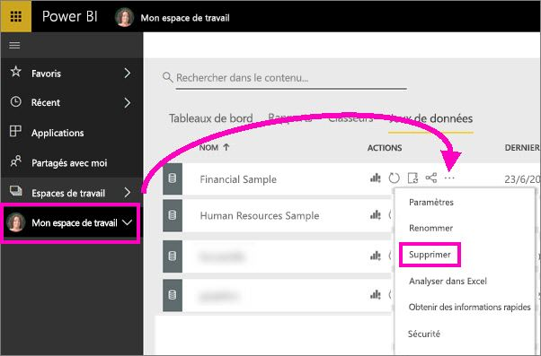

# Tutoriel : Bien démarrer avec le service Power BI (app.powerbi.com)
Ce tutoriel vous aide à bien démarrer avec le *service Power BI*. Pour comprendre comment le service Power BI s’intègre aux autres offres de Power BI, nous vous recommandons de commencer par lire [Qu’est-ce que Power BI ?](power-bi-overview.md).

Ce tutoriel vous montre comment effectuer les étapes suivantes :

> [!div class="checklist"]
> * Rechercher du contenu pour bien démarrer avec le service Power BI
> * Vous connecter à votre compte Power BI en ligne ou vous inscrire si vous n’en avez pas encore un
> * Ouvrir le service Power BI
> * Obtenir des données et les ouvrir dans la vue Rapport
> * Utiliser ces données pour créer des visualisations et les enregistrer sous forme de rapport
> * Créer un tableau de bord en épinglant des vignettes du rapport
> * Ajouter une autre visualisation à votre tableau de bord à l’aide de l’outil de langage naturel de la fonctionnalité Questions et réponses
> * Nettoyer les ressources en supprimant le jeu de données, le rapport et le tableau de bord

## S’inscrire au service Power BI
Si vous n’avez pas de compte Power BI, [inscrivez-vous pour un essai gratuit de Power BI Pro](https://app.powerbi.com/signupredirect?pbi_source=web) avant de commencer.

Une fois que vous avez un compte, entrez *app.powerbi.com* dans votre navigateur pour ouvrir le service Power BI. 

Si vous avez besoin d’aide sur Power BI Desktop, consultez [Bien démarrer avec Power BI Desktop](desktop-getting-started.md). Si vous recherchez de l’aide sur la version mobile de Power BI, consultez la page [Applications Power BI pour appareils mobiles](consumer/mobile/mobile-apps-for-mobile-devices.md).

> [!TIP]
> Vous préférez un cours gratuit à votre rythme à la place ? [Inscrivez-vous à notre cours sur l’analyse et la visualisation des données sur EdX](http://aka.ms/edxpbi).

Visitez notre [sélection sur YouTube](https://www.youtube.com/playlist?list=PL1N57mwBHtN0JFoKSR0n-tBkUJHeMP2cP). La vidéo de *présentation du service Power BI* est un bon point de départ :
> 
> <iframe width="560" height="315" src="https://www.youtube.com/embed/B2vd4MQrz4M" frameborder="0" allowfullscreen></iframe>
> 

## Qu’est-ce que le service Power BI ?
Le service Microsoft Power BI est parfois appelé Power BI en ligne ou app.powerbi.com. Power BI vous aide à rester informé dans les domaines qui vous intéressent. Avec le service Power BI, les *tableaux de bord* vous permettent de prendre le pouls de votre activité à tout moment. Vos tableaux de bord affichent des *vignettes* que vous pouvez sélectionner pour ouvrir des *rapports* qui vous donnent de plus amples détails. Connectez-vous à plusieurs *jeux de données* pour rassembler au même endroit toutes les données pertinentes. Vous avez du mal à comprendre les éléments qui composent Power BI ? Consultez [Fondamentaux pour les concepteurs dans le service Power BI](service-basic-concepts.md).

Si vous avez des données importantes dans des fichiers Excel ou CSV, vous pouvez créer un tableau de bord Power BI pour rester informé où que vous soyez et partager les informations avec d’autres personnes.  Disposez-vous d’un abonnement à une application SaaS comme Salesforce ?  Connectez-vous à Salesforce dès maintenant pour créer automatiquement un tableau de bord à partir de ces données, ou [découvrez toutes les autres applications SaaS](service-get-data.md) auxquelles vous pouvez vous connecter. Si vous faites partie d’une organisation, voyez si des [applications](service-create-distribute-apps.md) ont été publiées pour vous.

En savoir plus sur toutes les autres façons d’[obtenir des données pour Power BI](service-get-data.md).

## Étape 1 : Obtenir les données
Voici un exemple d’obtention de données à partir d’un fichier CSV. Vous souhaitez suivre ce didacticiel ? [Téléchargez le fichier CSV Financial Sample](http://go.microsoft.com/fwlink/?LinkID=521962).

1. [Connectez-vous à Power BI](http://www.powerbi.com/). Vous n’avez pas de compte ? Vous pouvez vous inscrire pour un essai gratuit.
2. Power BI s’ouvre dans votre navigateur. Sélectionnez **Obtenir des données** au bas de la barre de navigation gauche.

    La page **Obtenir des données** s’ouvre.   

3. Sous la section **Créer du contenu**, sélectionnez **Fichiers**. 
   
   
4.  Sélectionnez **Fichier local**.
   
     

5. Recherchez le fichier sur votre ordinateur, puis choisissez **Ouvrir**.

5. Dans ce tutoriel, nous allons sélectionner **Importer** pour ajouter le fichier Excel en tant que jeu de données, puis nous allons l’utiliser pour créer des rapports et des tableaux de bord. Si vous sélectionnez **Charger**, le classeur Excel entier est chargé dans Power BI, où vous pouvez l’ouvrir et le modifier dans Excel en ligne.
   
   
6. Quand votre jeu de données est prêt, sélectionnez **Afficher le jeu de données** pour l’ouvrir dans l’éditeur de rapport. 

    

    Étant donné que nous n’avons pas encore créé de visualisations, le canevas de rapport est vide.

    

7. Notez qu’il existe une option **Mode Lecture** dans la barre de navigation supérieure. Si vous avez cette option, cela signifie que vous êtes actuellement en mode Edition. 

    

    En mode Edition, vous pouvez créer et modifier vos rapports, car vous êtes le *propriétaire* du rapport. Autrement dit, vous en êtes le *créateur*. Lorsque vous partagez votre rapport avec vos collègues, ceux-ci peuvent uniquement interagir avec ce rapport en mode Lecture. Vos collègues sont donc des *consommateurs*. En savoir plus sur les [Mode Lecture et mode Édition](consumer/end-user-reading-view.md).
    
    Un excellent moyen de vous familiariser avec l’éditeur de rapport consiste à [suivre une visite guidée](service-the-report-editor-take-a-tour.md).
 

## Étape 2 : Commencer à explorer le jeu de données
Maintenant que vous êtes connecté aux données, vous pouvez les explorer.  Une fois que vous avez trouvé des informations intéressantes, vous pouvez créer un tableau de bord pour les suivre et voir leur évolution. Voyons comment cela fonctionne.
    
1. Dans l’éditeur de rapport, vous allez utiliser le volet **Champs** sur le côté droit de la page pour créer une visualisation. Cochez les cases en regard de **Gross Sales** (Chiffre d’affaires brut) et de **Date**.
   
   

    Power BI analyse les données et crée une visualisation. Si vous avez sélectionné **Date** en premier, vous verrez un tableau. Si vous avez sélectionné **Gross Sales** (Chiffre d’affaires brut) en premier, vous verrez un graphique. 

2. Modifier le mode d’affichage de vos données. Examinons ces données sous forme de graphique en courbes. Dans le volet **Visualisations**, sélectionnez l’icône de graphique en courbes.
   
   

3. Comme ce graphique semble intéressant, nous allons l’*épingler* à un tableau de bord. Pointez sur la visualisation, puis sélectionnez l’icône en forme d’épingle. Quand vous épinglez cette visualisation, celle-ci est stockée dans votre tableau de bord et mise à jour. Vous pouvez ainsi connaître la valeur la plus récente d’un seul coup d’œil.
   
   

4. Comme ce rapport est nouveau, vous êtes invité à l’enregistrer avant de pouvoir épingler une visualisation à un tableau de bord. Attribuez un nom à votre rapport (par exemple, *Évolution des ventes*), puis sélectionnez **Enregistrer et continuer**. 
   
   
   
5. Nous allons épingler le graphique en courbes à un nouveau tableau de bord et le nommer *Financial sample for tutorial* (Exemple financier pour le tutoriel). 
   
   
   
6. Sélectionnez **Épingler**.
   
    Un message de réussite (en haut à droite) vous indique que la visualisation a été ajoutée sous forme de vignette à votre tableau de bord.
   
    

7. Sélectionnez **Accéder au tableau de bord** pour afficher le graphique en courbes que vous avez épinglé sous forme de vignette sur votre nouveau tableau de bord. Améliorez votre tableau de bord en ajoutant des vignettes de visualisation et en [renommant, redimensionnant, liant et repositionnant les vignettes](service-dashboard-edit-tile.md).
   
   
   
8. Sélectionnez la nouvelle vignette dans votre tableau de bord pour revenir au rapport. Power BI vous renvoie à l’éditeur de rapport en mode Lecture. Pour revenir au mode Edition, sélectionnez **Modifier le rapport** dans la barre de navigation supérieure. Une fois en mode Edition, vous pouvez continuer à explorer et à épingler des vignettes. 

## Étape 3 :  Poursuivre l’exploration avec Questions et réponses (requêtes en langage naturel)
1. Pour une exploration rapide de vos données, posez une question dans la zone Questions et réponses. La zone Questions et réponses se trouve en haut de votre tableau de bord (**Poser une question sur vos données**) et dans la barre de navigation supérieure de votre rapport (**Poser une question**). Par exemple, tapez *quel segment présente le meilleur chiffre d’affaires* dans la zone Questions et réponses.
   
   

2. Questions et réponses recherche une réponse et la présente sous forme de visualisation. Sélectionnez l’icône en forme d’épingle  Pour afficher cette visualisation dans votre tableau de bord.
3. Épinglez la visualisation au tableau de bord **Financial Sample for tutorial** (Exemple financier pour le tutoriel).
   
    

4. Revenez à votre tableau de bord où vous pouvez voir la nouvelle vignette.

   

## Nettoyer les ressources
Maintenant que vous avez terminé le tutoriel, vous pouvez supprimer le jeu de données, le rapport et le tableau de bord. 

1. Dans le volet de navigation de gauche, sélectionnez **Mon espace de travail**.
2. Sélectionnez l’onglet **Jeux de données** et recherchez le jeu de données que vous avez importé pour ce tutoriel.  
3. Sélectionnez les points de suspension (...) > **Supprimer**.

    

    Lorsque vous supprimez le jeu de données, Power BI supprime également le rapport et le tableau de bord. 

## Étapes suivantes

> [!div class="nextstepaction"]
> [Se connecter aux services en ligne que vous utilisez avec Power BI](service-connect-to-services.md)

