# Prise en main du service Power BI (app.powerbi.com)
Ce didacticiel vous aide à bien démarrer avec le ***service Power BI***. Pour comprendre comment le service Power BI s’intègre aux autres offres de Power BI, nous vous recommandons de commencer par lire [Qu’est-ce que Power BI ?](guided-learning/gettingstarted.yml#step-1).

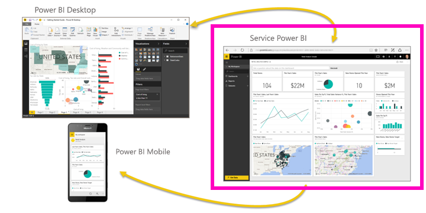

Le service Power BI a une version gratuite et une version Pro. Quelle que soit la version que vous utilisez, *si vous avez déjà un compte*, ouvrez un navigateur et tapez www.powerbi.com pour ouvrir le service Power BI. Si vous êtes un nouvel utilisateur, nous vous recommandons de commencer à l’adresse www.powerbi.com à la place. À partir de là, vous pouvez en savoir plus sur Power BI avant de vous connecter au service.  Lorsque vous êtes prêt à tester le service, sélectionnez le lien **Inscrivez-vous gratuitement** qui s’affiche dans le coin supérieur droit. Si votre administrateur a déjà activé Power BI pour vous, n’utilisez pas le bouton d’inscription gratuite. À la place, accédez directement à app.powerbi.com. 

Si vous avez besoin d’aide sur Power BI Desktop, consultez [Prise en main de Desktop](desktop-getting-started.md). Si vous recherchez de l’aide sur la version mobile de Power BI, consultez la page [Applications Power BI pour appareils mobiles](mobile-apps-for-mobile-devices.md).

> [!TIP]
> Vous préférez un cours gratuit à votre rythme à la place ? [Inscrivez-vous à notre cours sur l’analyse et la visualisation des données sur EdX](http://aka.ms/edxpbi).

Visitez notre [sélection sur YouTube](https://www.youtube.com/playlist?list=PL1N57mwBHtN0JFoKSR0n-tBkUJHeMP2cP). La vidéo de présentation du service Power BI est un bon point de départ :
> 
> <iframe width="560" height="315" src="https://www.youtube.com/embed/B2vd4MQrz4M" frameborder="0" allowfullscreen></iframe>
> 
> 
> 

Microsoft Power BI vous aide à rester informé dans les domaines qui vous intéressent.  Grâce au service Power BI, les ***tableaux de bord*** vous permettent de prendre en permanence le pouls de votre activité.  Vos tableaux de bord affichent des ***vignettes*** sur lesquelles vous pouvez cliquer pour ouvrir des ***rapports*** qui vous donnent de plus amples détails.  Connectez-vous à plusieurs ***jeux de données*** pour rassembler au même endroit toutes les données pertinentes. Vous avez du mal à comprendre les éléments qui composent Power BI ?  Consultez [Power BI – Concepts de base](service-basic-concepts.md).

Si vous avez des données importantes dans des fichiers Excel ou CSV, vous pouvez créer un tableau de bord Power BI pour rester informé où que vous soyez et partager les informations avec d’autres personnes.  Disposez-vous d’un abonnement à une application SaaS comme Salesforce ?  Connectez-vous à Salesforce dès maintenant pour créer automatiquement un tableau de bord à partir de ces données, ou [découvrez toutes les autres applications SaaS](service-get-data.md) auxquelles vous pouvez vous connecter. Si vous faites partie d’une organisation, voyez si des [applications](service-create-distribute-apps.md) ont été publiées pour vous.

En savoir plus sur toutes les autres façons d’[obtenir des données pour Power BI](service-get-data.md).

## Étape 1 : obtenir des données
Voici un exemple d’obtention de données à partir d’un fichier CSV. Vous souhaitez suivre ce didacticiel ? [Téléchargez cet exemple de fichier CSV](http://go.microsoft.com/fwlink/?LinkID=521962)

1. [Connectez-vous à Power BI](http://www.powerbi.com/). Vous n’avez pas de compte ? Vous pouvez vous inscrire gratuitement.
2. Power BI s’ouvre dans votre navigateur. Sélectionnez **Obtenir des données** en bas de la barre de navigation gauche.
   
   
3. Sélectionnez **Fichiers**. 
   
   
4. Recherchez le fichier sur votre ordinateur, puis choisissez **Ouvrir**. Si vous l’avez enregistré dans OneDrive Entreprise, sélectionnez cette option. Si vous l’avez enregistré localement, sélectionnez **Fichier local**. 
   
   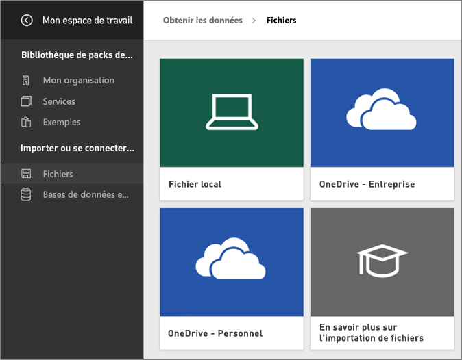
5. Pour ce didacticiel, nous allons sélectionner **Importer** pour ajouter le fichier Excel en tant que jeu de données que nous pouvons ensuite utiliser pour créer des rapports et tableaux de bord. Si vous sélectionnez **Charger**, le classeur Excel entier est chargé vers Power BI où vous pouvez l’ouvrir et le modifier dans Excel en ligne.
   
   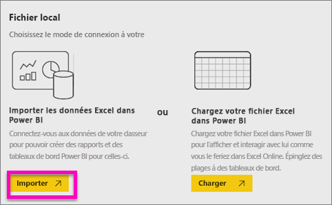
6. Quand votre jeu de données est prêt, sélectionnez **Afficher le jeu de données** pour l’ouvrir dans l’éditeur de rapport. 

    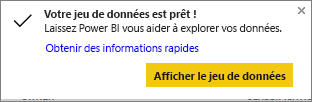

    Étant donné que nous n’avons pas encore créé de visualisations, le canevas de rapport est vide.

    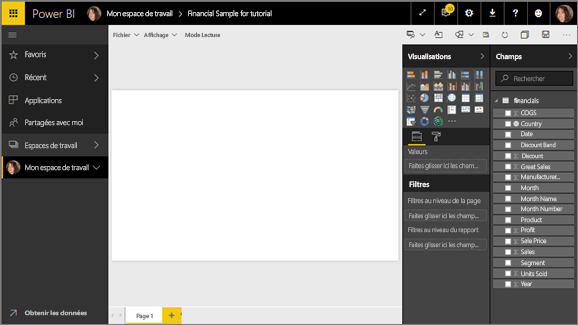

6. Examinez la barre de menus supérieure et notez qu’il existe une option **Mode Lecture**. Étant donné que cette option s’affiche, cela signifie que vous êtes actuellement en **mode Édition**. 

    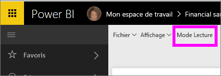

    En mode Édition, vous pouvez créer et modifier vos rapports, car vous êtes le *propriétaire* du rapport ; vous êtes un *créateur*. Lorsque vous partagez votre rapport avec vos collègues, ceux-ci sont seulement en mesure d’interagir avec le rapport en mode Lecture : ils sont des *consommateurs*. En savoir plus sur les [Mode Lecture et mode Édition](service-reading-view-and-editing-view.md).
    
    Un excellent moyen de vous familiariser avec l’éditeur de rapport consiste à [suivre une visite guidée](service-the-report-editor-take-a-tour.md).
   > 
 

## Étape 2 : Commencer à explorer votre jeu de données
Maintenant que vous êtes connecté aux données, vous pouvez les explorer.  Une fois que vous avez trouvé des informations intéressantes, vous pouvez créer un tableau de bord pour les suivre et voir leur évolution. Voyons comment cela fonctionne.
    
1. Dans l’éditeur de rapport, vous allez utiliser le volet **Champs** sur le côté droit de la page pour créer une visualisation.  Cochez les cases en regard de **Gross Sales** (Chiffre d’affaires brut) et **Date**.
   
   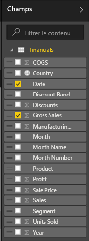

2. Power BI analyse les données et crée une visualisation.  Si vous avez sélectionné **Date** en premier, un tableau s’affiche.  Si vous avez sélectionné **Gross Sales** (Chiffre d’affaires brut) en premier, un graphique s’affiche. Modifier le mode d’affichage de vos données. Examinons ces données sous forme de graphique en courbes. Sélectionnez l’icône de graphique en courbes (également appelé modèle) à partir du **volet Visualisations**.
   
   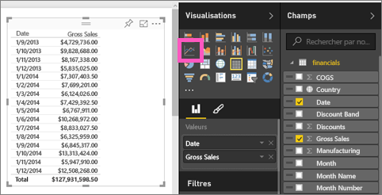

3. Comme ce contenu semble intéressant, nous allons l’*épingler* à un tableau de bord. Pointez sur la visualisation, puis sélectionnez l’icône **Épingler**.  Quand vous épinglez cette visualisation, celle-ci est stockée dans votre tableau de bord et mise à jour. Vous pouvez ainsi suivre la valeur la plus récente en un clin d’œil.
   
   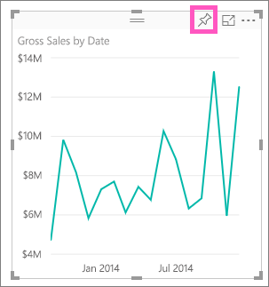

5. Comme il s’agit d’un nouveau rapport, vous êtes invité à l’enregistrer avant de pouvoir épingler une visualisation à un tableau de bord. Attribuez un nom à votre rapport (par exemple, *Ventes dans le temps*), puis sélectionnez **Enregistrer et continuer**. 
   
   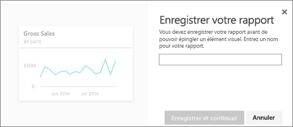
   
6. Nous allons épingler le graphique en courbes à un nouveau tableau de bord et le nommer « Exemple financier pour le didacticiel ». 
   
   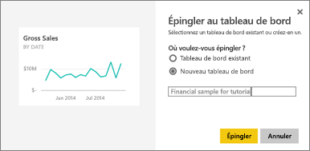
   
 1. Sélectionnez **Épingler**.
   
    Un message de réussite (dans l’angle supérieur droit) vous indique que la visualisation a été ajoutée, sous forme de vignette, à votre tableau de bord.
   
    

8. Sélectionnez **Accéder au tableau de bord** pour afficher le graphique en courbes épinglé, sous forme de vignette, à votre tout nouveau tableau de bord. Améliorez votre tableau de bord en ajoutant des vignettes de visualisation et en [renommant, redimensionnant, liant et repositionnant les vignettes](service-dashboard-edit-tile.md).
   
   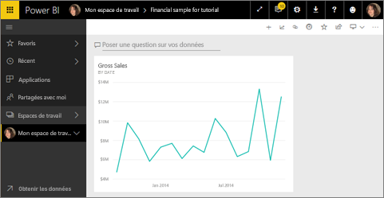
   
   Sélectionnez la nouvelle vignette dans votre tableau de bord pour revenir au rapport à tout moment. Power BI vous renvoie à l’éditeur de rapport en mode Lecture. Pour revenir au mode Édition, sélectionnez **Modifier le rapport** à partir de la barre de menus supérieure. Une fois en mode Édition, continuez l’exploration et épinglez des vignettes. 

## Étape 3 : Poursuivre l’exploration avec Questions et réponses (interrogation en langage naturel)
1. Pour une exploration rapide de vos données, essayez de poser une question dans la zone Questions et réponses. La zone de question Questions et réponses se trouve en haut de votre tableau de bord (**Poser une question sur vos données**) et dans la barre de menus supérieure de votre rapport (**Poser une question**). Par exemple, essayez de taper « quel segment présente le meilleur chiffre d’affaires ».
   
   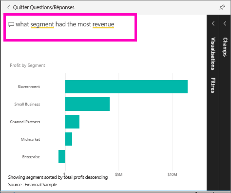

2. Questions et réponses recherche une réponse et la présente sous forme de visualisation. Sélectionnez l’icône en forme d’épingle  pour afficher cette visualisation dans votre tableau de bord également.
3. Épinglez la visualisation au tableau de bord « Exemple financier pour le didacticiel ».
   
    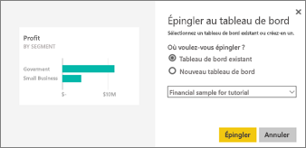

4. Revenez à votre tableau de bord où vous pouvez voir la nouvelle vignette.

   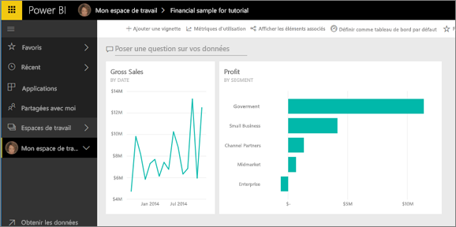

## Étapes suivantes
Prêt à aller plus loin ?  Voici comment poursuivre votre exploration de Power BI de façon intéressante.

* [Connectez-vous à un autre jeu de données](service-get-data.md).
* [Partagez votre tableau de bord](service-share-dashboards.md) avec vos collègues.
* Lisez des [conseils sur la conception des tableaux de bord](service-dashboards-design-tips.md)
* Affichez vos tableaux de bord avec une [application Power BI sur un appareil mobile](mobile-apps-for-mobile-devices.md)

Pas tout à fait prêt pour le grand saut ? Commencez par consulter les rubriques ci-après, conçues pour vous aider à vous sentir à l’aise avec Power BI.

* [Coordination des rapports, jeux de données, tableaux de bord et vignettes](service-basic-concepts.md)
* Visitez notre site de [formation guidée Power BI](guided-learning/index.md) et suivez quelques cours (de très courte durée).
* Regardez des [vidéos Power BI](videos.md).
* [Exemples mis à votre disposition](sample-datasets.md)

### Rester en contact avec Power BI
* Suivre [@MSPowerBI sur Twitter](https://twitter.com/mspowerbi)
* Abonnez-vous à notre [chaîne vidéo YouTube](https://www.youtube.com/channel/UCy--PYvwBwAeuYaR8JLmrfg)
* Regardez nos [webinaires de prise en main de Power BI](webinars.md) à la demande
* Vous ne savez pas où trouver de l’aide ? Consultez la page [10 conseils pour obtenir de l’aide](service-tips-for-finding-help.md).

D’autres questions ? [Essayez d’interroger la communauté Power BI](http://community.powerbi.com/)

