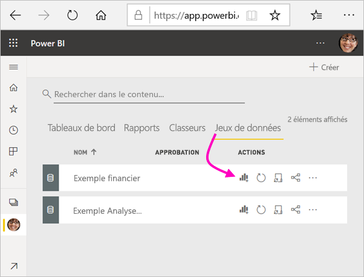
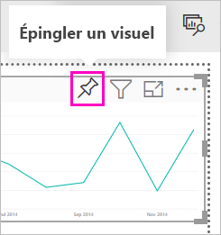
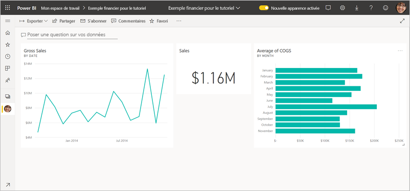
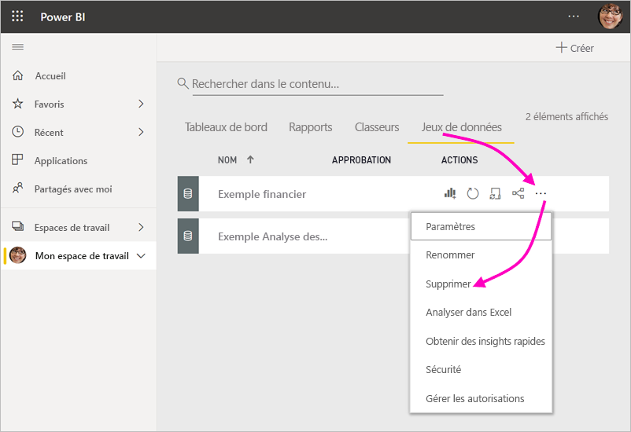

# Tutoriel : Bien démarrer avec le service Power BI
Ce tutoriel présente certaines des fonctionnalités du *service Power BI*. Il vous montre comment vous connecter aux données, créer un rapport et un tableau de bord, et poser des questions sur vos données. Le service Power BI propose bien d’autres fonctionnalités, mais ce tutoriel ne vous en montre qu’un échantillon. Pour comprendre comment le service Power BI s’intègre aux autres offres de Power BI, nous vous recommandons de lire [Qu’est-ce que Power BI](power-bi-overview.md).

Ce tutoriel vous montre comment effectuer les étapes suivantes :

> [!div class="checklist"]
> * Vous connecter à votre compte Power BI en ligne ou en créer un si vous n’en avez pas.
> * Ouvrir le service Power BI
> * Obtenir des données et les ouvrir dans la vue Rapport
> * Utiliser ces données pour créer des visualisations et les enregistrer sous forme de rapport
> * Créer un tableau de bord en épinglant des vignettes du rapport
> * Ajouter d’autres visualisations à votre tableau de bord à l’aide de l’outil Questions et réponses en langage naturel.
> * Redimensionner, réorganiser et utiliser les vignettes sur le tableau de bord.
> * Nettoyer les ressources en supprimant le jeu de données, le rapport et le tableau de bord

> [!TIP]
> Vous préférez un cours gratuit à votre rythme à la place ? [Inscrivez-vous à notre cours sur l’analyse et la visualisation des données sur EdX](http://aka.ms/edxpbi).

## S’inscrire au service Power BI
Si vous n’avez pas de compte Power BI, [inscrivez-vous pour un essai gratuit de Power BI Pro](https://app.powerbi.com/signupredirect?pbi_source=web) avant de commencer.

Une fois que vous avez un compte, entrez *app.powerbi.com* dans votre navigateur pour ouvrir le service Power BI. 

## Étape 1 : Obtenir les données

Souvent, quand vous voulez créer un rapport Power BI, vous utilisez Power BI Desktop. Cette fois, nous allons utiliser le service Power BI pour créer un rapport.

Dans ce tutoriel, nous obtenons des données à partir d’un fichier CSV. Comment procéder ? [Téléchargez le fichier CSV Financial Sample](http://go.microsoft.com/fwlink/?LinkID=521962).

1. [Connectez-vous à Power BI](http://www.powerbi.com/). Vous n’avez pas de compte ? Vous pouvez vous inscrire pour un essai gratuit.
2. Power BI s’ouvre dans votre navigateur. Sélectionnez **Obtenir des données** au bas de la barre de navigation gauche.

    La page **Obtenir des données** s’ouvre.   

3. Sous la section **Créer du contenu**, sélectionnez **Fichiers**. 
   
   
4.  Sélectionnez **Fichier local**.
   
    

5. Recherchez le fichier sur votre ordinateur, puis choisissez **Ouvrir**.

5. Dans ce tutoriel, nous sélectionnons **Importer** pour ajouter le fichier Excel comme jeu de données, que nous utilisons ensuite pour créer des rapports et des tableaux de bord. Si vous sélectionnez **Charger**, le classeur Excel entier est chargé dans Power BI, où vous pouvez l’ouvrir et le modifier dans Excel en ligne.
   
   
6. Quand votre jeu de données est prêt, sélectionnez **Jeux de données**, puis **Créer un rapport** à côté du jeu de données **Financial sample** pour ouvrir l’éditeur de rapport. 

    

    Le canevas de rapport est vide. Nous voyons les volets **Filtres**, **Visualisations** et **Champs** à droite.

    

7. Notez qu’il existe une option **Mode Lecture** dans la barre de navigation supérieure. Si vous avez cette option, cela signifie que vous êtes actuellement en mode Edition. Un excellent moyen de vous familiariser avec l’éditeur de rapport consiste à [suivre une visite guidée](service-the-report-editor-take-a-tour.md).

    

    En mode Edition, vous pouvez créer et modifier vos rapports, car vous êtes le *propriétaire* du rapport. Autrement dit, vous en êtes le *créateur*. Lorsque vous partagez votre rapport avec vos collègues, ceux-ci peuvent uniquement interagir avec ce rapport en mode Lecture. Vos collègues sont donc des *consommateurs*. En savoir plus sur les [Mode Lecture et mode Édition](consumer/end-user-reading-view.md).

## Étape 2 : Créer un graphique dans un rapport
Maintenant que vous êtes connecté aux données, vous pouvez les explorer.  Une fois que vous avez trouvé des informations intéressantes, vous pouvez créer un tableau de bord pour les suivre et voir leur évolution. Voyons comment cela fonctionne.
    
1. Dans l’éditeur de rapport, nous utilisons le volet **Champs** à droite de la page pour créer une visualisation. Cochez les cases en regard de **Gross Sales** (Chiffre d’affaires brut) et de **Date**.
   
   

    Power BI analyse les données et crée une visualisation. Si vous avez sélectionné **Date** en premier, vous verrez un tableau. Si vous avez sélectionné **Gross Sales** (Chiffre d’affaires brut) en premier, vous voyez un histogramme. 

2. Modifier le mode d’affichage de vos données. Examinons ces données sous forme de graphique en courbes. Dans le volet **Visualisations**, sélectionnez l’icône de graphique en courbes.
   
   

3. Comme ce graphique semble intéressant, nous allons l’*épingler* à un tableau de bord. Pointez sur la visualisation, puis sélectionnez l’icône en forme d’épingle. Quand vous épinglez cette visualisation, celle-ci est stockée dans votre tableau de bord et mise à jour. Vous pouvez ainsi connaître la valeur la plus récente d’un seul coup d’œil.
   
   

4. Comme ce rapport est nouveau, vous êtes invité à l’enregistrer avant de pouvoir épingler une visualisation à un tableau de bord. Donnez un nom à votre rapport (par exemple, *Sales over time* (évolution des ventes)), puis sélectionnez **Enregistrer**. 

5. Sélectionnez **Nouveau tableau de bord** et nommez-le *Financial sample for tutorial* (Exemple financier pour le tutoriel). 
   
   
   
6. Sélectionnez **Épingler**.
   
    Un message de réussite (en haut à droite) vous indique que la visualisation a été ajoutée sous forme de vignette à votre tableau de bord.
   
    

7. Sélectionnez **Accéder au tableau de bord** pour voir votre nouveau tableau de bord avec le graphique en courbes que vous avez épinglé sous forme de vignette. 
   
   
   
8. Sélectionnez la nouvelle vignette dans votre tableau de bord pour revenir au rapport. Power BI vous renvoie sur le rapport en mode Lecture. 

1. Pour revenir au mode Edition, sélectionnez les points de suspension (...) dans la barre de navigation supérieure > **Modifier**. Une fois en mode Edition, vous pouvez continuer à explorer et à épingler des vignettes.

    

## Étape 3 : Explorer avec Questions et réponses

Pour une exploration rapide de vos données, essayez de poser une question dans la zone de Questions et réponses. Questions et réponses crée des requêtes en langage naturel sur vos données. Dans un tableau de bord, la zone Questions et réponses est en haut (**Poser une question sur vos données**). Dans un rapport, elle se trouve dans la barre de navigation supérieure (**Poser une question**).

1. Pour revenir au tableau de bord, sélectionnez **Mon espace de travail** dans la barre noire de **Power BI**.

    

1. Sous l’onglet **Tableaux de bord**, sélectionnez votre tableau de bord.

    

1. Sélectionnez **Poser une question sur vos données**. Questions et réponses propose automatiquement un certain nombre de suggestions.

    

    > [!NOTE]
    > Si vous ne voyez pas les suggestions, activez **Nouvelle expérience de Questions et réponses**.

2. Certaines des suggestions renvoient une valeur unique. Par exemple, sélectionnez **maximum sale**.

    Questions et réponses recherche une réponse et la présente sous forme de *carte*.

    

3. Sélectionnez l’icône en forme d’épingle  pour afficher cette visualisation sur le tableau de bord Financial Sample for tutorial.

1. Faites défiler vers le bas la liste **Questions pour vous aider à démarrer** et sélectionnez **average cog for each month**. 

    

1. Épinglez aussi l’histogramme au tableau de bord **Financial Sample for tutorial**.

1. Placez le curseur après *by month* dans la zone Questions et réponses et tapez *en courbes*. Sélectionnez **en courbes (Type de visualisation)**. 

    

4. Sélectionnez **Quitter Questions et réponses** pour revenir sur votre tableau de bord, où vous voyez les nouvelles vignettes que vous avez créées. 

   

   Même si vous avez remplacé le graphique par un graphique en courbes, la vignette continue à montrer un histogramme, car c’est la visualisation que vous avez épinglée à l’origine. 

## Étape 4 : Repositionner les vignettes

Le tableau de bord est large. Nous pouvons réorganiser les vignettes pour optimiser l’utilisation de l’espace du tableau de bord.

1. Faites glisser vers le haut le coin en bas à droite de la vignette du graphique en courbes *Gross Sales*, jusqu’à ce qu’il soit à la même hauteur que la vignette Sales, puis relâchez-le.

    

    À présent, les deux vignettes ont la même hauteur.

    

1. Faites glisser la vignette du graphique en courbes *Average of COGS* jusqu’à ce qu’elle tienne sous le graphique en courbes *Gross Sales*.

    C’est mieux.

    

## Étape 5 : Interagir avec les vignettes

Voici une dernière interaction à observer, avant de commencer à créer vos propres tableaux de bord et rapports. La sélection des différentes vignettes donne des résultats différents. 

1. Commencez par sélectionner la vignette du graphique en courbes *Gross Sales* que vous avez épinglée à partir du rapport. 

    Power BI ouvre le rapport en mode Lecture. 

2. Sélectionnez le bouton précédent du navigateur. 

1. Maintenant, sélectionnez la vignette de l’histogramme *Average of COGS* que vous avez créée dans Questions et réponses. 

    Power BI n’ouvre pas le rapport. Questions et réponses s’ouvre à la place, car c’est là que vous avez créé le graphique.

## Nettoyer les ressources
Maintenant que vous avez terminé le tutoriel, vous pouvez supprimer le jeu de données, le rapport et le tableau de bord. 

1. Dans la barre de navigation de gauche, vérifiez que vous êtes sous **Mon espace de travail**.
2. Sélectionnez l’onglet **Jeux de données** et recherchez le jeu de données que vous avez importé pour ce tutoriel.  
3. Sélectionnez les points de suspension (...) > **Supprimer**.

    

    Quand vous supprimez le jeu de données, vous voyez un avertissement indiquant que **Toutes les vignettes de rapport et de tableau de bord contenant des données de ce jeu de données sont également supprimées**.

4. Sélectionnez **Supprimer**.

## Étapes suivantes

Améliorez vos tableaux de bord en ajoutant des vignettes de visualisation et en les [renommant, redimensionnant, associant et repositionnant](service-dashboard-edit-tile.md).

