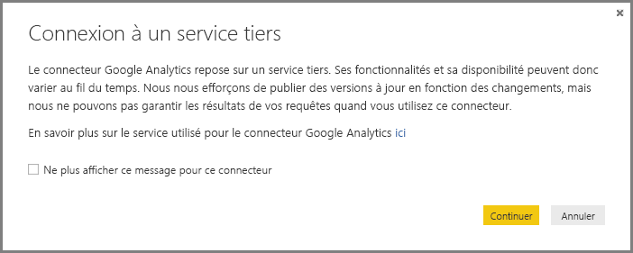

# Connecteur Google Analytics pour Power BI Desktop
> [!NOTE]
> Le pack de contenu et le connecteur Google Analytics de Power BI Desktop s’appuient sur l’API Core Reporting de Google Analytics. Ses fonctionnalités et sa disponibilité peuvent donc varier au fil du temps.

Vous pouvez vous connecter aux données Google Analytics à l’aide du connecteur **Google Analytics**. Pour vous connecter aux données, procédez comme suit :

1. Dans **Power BI Desktop**, sélectionnez **Obtenir des données** dans l’onglet de ruban **Accueil**.
2. Dans la fenêtre **Obtenir des données**, sélectionnez **Services en ligne** parmi les catégories du volet gauche.
3. Sélectionnez **Google Analytics** dans les sélections du volet droit.
4. Au bas de la fenêtre, sélectionnez **Se connecter**.  
   

Une boîte de dialogue s’affiche, expliquant, entre autres éclaircissements, que le connecteur est un service tiers et que la disponibilité et les fonctionnalités de celui-ci peuvent changer avec le temps.  

Quand vous sélectionnez **Continuer**, vous êtes invité à vous connecter à Google Analytics.  

Quand vous entrez vos informations d’identification, une boîte de dialogue vous informe que Power BI souhaite avoir un accès hors connexion. Voici comment utiliser **Power BI Desktop** pour accéder à vos données Google Analytics.  

Lorsque vous acceptez, **Power BI Desktop** indique que vous êtes actuellement connecté.  

Sélectionnez **Se connecter** pour connecter vos données Google Analytics à **Power BI Desktop** et charger les données.  

## Modifications apportées à l’API
Nous nous efforçons de publier des mises à jour en fonction des modifications. Toutefois, il se peut que l’API soit modifiée d’une manière qui affecte les résultats des requêtes que nous générons. Dans certains cas, certaines requêtes peuvent ne plus être prises en charge. En raison de cette dépendance, nous ne pouvons pas garantir les résultats de vos requêtes lors de l’utilisation de ce connecteur.

Pour plus d’informations sur les modifications apportées à l’API Google Analytics, consultez le [journal des modifications](https://developers.google.com/analytics/devguides/changelog)

