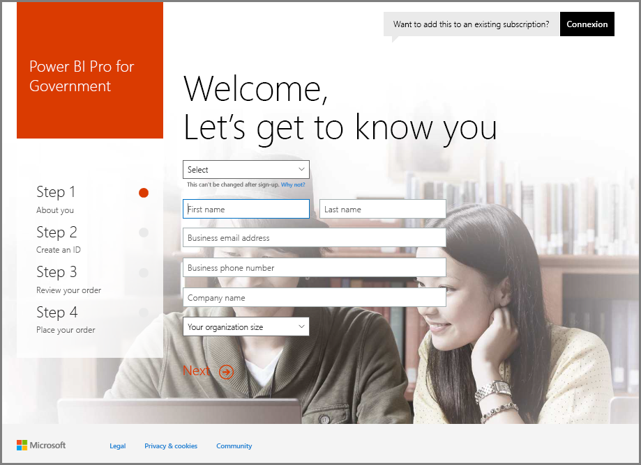
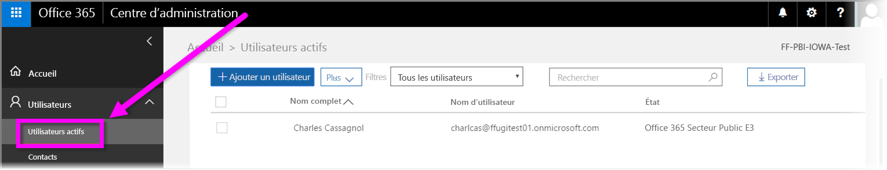

# Inscrire votre organisation US Government au service Power BI
Le **service Power BI** a une version disponible pour les clients US Government dans le cadre des abonnements de la **Communauté Office 365 US Government**. La version du **service Power BI** abordée dans cet article est spécialement conçue pour les clients US Government. Elle est distincte et différente de la version commerciale du **service Power BI**.

Pour plus d’informations sur le **service Power BI** US Government, y compris ses fonctionnalités et limitations, consultez la page [Power BI pour les clients US Government - Vue d’ensemble](service-govus-overview.md).

> [!NOTE]
> Cet article est destiné aux administrateurs qui sont autorisés à inscrire leur organisation US Government à Power BI. Si vous êtes un utilisateur final, contactez votre administrateur à propos de l’obtention d’un abonnement à Power BI US Government.
> 
> 

## Sélectionner le bon processus d’inscription pour votre organisation US Government
Votre organisation US Government n’utilise peut-être pas encore **Office Government Cloud** ou a peut-être déjà un abonnement. Les sections suivantes décrivent les étapes d’inscription en fonction de votre niveau de connaissance d’Office Government Cloud et de Power BI et sont différentes en fonction de votre abonnement existant.

Une fois que vous êtes inscrit à Power BI US Government, il se peut que certaines fonctionnalités ne fonctionnent pas tant que le commercial ou le technicien du support technique n’a pas effectué le processus d’intégration. Pour en savoir plus sur ces fonctionnalités, consultez [Power BI pour les clients US Government - Vue d’ensemble](service-govus-overview.md). Pour terminer le processus d’intégration et activer ces fonctionnalités, contactez votre commercial ou le technicien du support technique.

### Organisations US Government qui sont de nouveaux clients Office Cloud
Si votre organisation est un nouveau client **Office Government Cloud**, procédez comme suit :

> [!NOTE]
> Ces étapes doivent être effectuées par l’administrateur du portail.
>

1. Accédez à [https://products.office.com/en-us/government/office-365-web-services-for-government](https://products.office.com/en-us/government/office-365-web-services-for-government).

>[!NOTE]
>Si vous ne souhaitez pas vous inscrire à Office Government Cloud pour l’instant, contactez votre représentant commercial.
>

2. Sélectionnez Office G3 et remplissez le formulaire pour demander une version d’essai.
3. Une fois que vous êtes client Office Cloud, passez aux étapes ci-dessous « Clients Office Government Cloud existants ».

### Clients Office Government Cloud existants
Si votre organisation est un client **Office Government Cloud** existant mais que vous n’avez pas d’abonnement **Power BI** (gratuit ou autre), procédez comme suit :

> [!NOTE]
> Ces étapes doivent être effectuées par l’administrateur du portail.
> 
> 

1. Connectez-vous à votre compte Office Government Cloud existant et accédez au portail d’administration.
2. Sélectionnez **Facturation**.
3. Sélectionnez **Acheter des services**.
4. Sélectionnez l’option Power BI Pro Government et choisissez **Essayer** ou **Acheter maintenant**.
5. Finalisez votre commande.
6. Affectez des utilisateurs au compte.
   
   
7. Connectez-vous au **service Power BI** pour les clients du secteur public américain à l’adresse [https://app.powerbigov.us](https://app.powerbigov.us)

## Informations supplémentaires relatives à l’inscription
Voici des informations supplémentaires sur l’inscription à **Power BI US Government** dans le cadre de différents types de migrations de licences.

### Intégration directe des clients de l’essai Power BI vers la version Pro
* Cliquez sur Billing > Purchase Service > PowerBI Pro Gov (Facturation > Acheter un service > PowerBI Pro Gov), puis sélectionnez Purchase (Acheter) et non Trial (Essai).
* Renseignez les informations nécessaires pour obtenir les licences.
* Supprimez l’essai Power BI Pro ou supprimez les anciennes licences, puis affectez les nouvelles aux utilisateurs.
* Connexion à [https://app.powerbigov.us](https://app.powerbigov.us)

### Intégration via un revendeur des clients de l’essai Power BI vers la version Pro
Accédez à **Facturation > Abonnements**, puis sélectionnez l’abonnement **Power BI Pro for Government** (Abonnement Power BI Pro pour le secteur public). Vous voyez les indications suivantes :

* Disponibilité
* Assigned (Affecté)
* Liens Assign to users (Affecter aux utilisateurs)
* Si l’essai vous est toujours affecté :
  * Cliquez sur **Assigned** (Affecté) sous l’abonnement Trial (Essai), puis supprimez les utilisateurs que vous souhaitez ajouter à la version payante.
  * Accédez à l’abonnement payant et affectez les utilisateurs en question.

### Instructions pour la mise en liste verte
La *mise en liste verte* est un processus que l’équipe d’ingénierie de Power BI utilise pour migrer des clients de l’environnement cloud commercial vers l’environnement cloud pour le secteur public sécurisé. Cela garantit que les fonctionnalités disponibles dans le cloud pour le secteur public américain cloud opèrent comme prévu. Tous les clients du secteur public des États-Unis existants (ou nouveaux) qui achètent des services **Power BI** pour le secteur public des États-Unis pour la première fois *doivent* initier le processus de mise en liste verte suivant. Le processus doit être accompli avant une configuration ou une migration vers les services **Power BI** pour le secteur public des États-Unis. 

Pour inscrire votre client sur la *liste verte* du cloud US Government, contactez l’équipe des comptes Microsoft afin d’obtenir de l’aide. Notez que seuls des administrateurs peuvent effectuer cette demande. Le processus de *mise en liste verte* prend environ trois semaines, au cours desquelles l’équipe d’ingénierie de Power BI apporte les modifications appropriées pour s’assurer que votre client fonctionne correctement dans le cloud pour le secteur public américain.

Des clients migrant à partir de licences Power BI **gratuites** vers **Power BI US Government**, et par conséquent vers les fonctionnalités de la licence **Pro** décrites précédemment dans cet article, rencontreront les problèmes décrits dans la section suivante de cet article, jusqu’à ce que leur client soit *mis en liste verte* par l’équipe d’ingénierie de Power BI.

### Mélange de licences Gratuites et Pro dans les clients du secteur public américain
Si vous disposez de licences Gratuites et de licences Pro pour le secteur public américain dans votre client, les deux types de licences resteront présents, mais l’un des deux ne fonctionnera pas correctement. Si votre client passe avec succès par le processus de *mise en liste verte*, il se produit ce qui suit :

* Les utilisateurs de licence gratuite ne peuvent plus se connecter à Power BI à l’aide de **Power BI Desktop** et rencontrent certaines lacunes de fonctionnalités décrites dans la section suivante.
* Tous les clients affectés aux licences Pro pour le secteur public américain fonctionnent comme prévu, y compris les passerelles, Power BI Desktop et les applications mobiles.

En cas d’utilisation d’un mélange de licences Gratuites et Pro dans un client du secteur public américain et de passage par le processus de *mise en liste verte*, vous pouvez vous attendre à ce qui suit :

**Avant la *mise en liste verte*** :

* Les utilisateurs disposant de licences gratuites opèrent dans un cloud commercial
* Les licences Pro pour le secteur public américain apparaissent dans le portail, et l’administrateur peut attribuer ces licences à des utilisateurs. Les utilisateurs Pro du secteur public américain ne perdent pas les données associées à leurs licences Gratuites une fois que l’administrateur leur attribue une licence Pro pour le secteur public américain. Les utilisateurs affectés ont accès aux fonctionnalités de Power BI Pro pour les clients du secteur public américain. Toutefois, la liste à puces suivante répertorie les lacunes de fonctionnalités qui persistent jusqu’à ce que le client soit correctement *mis en liste verte* :
  
  * La passerelle, les appareils mobiles et Power BI Desktop ne peuvent pas s’authentifier
  * Vous ne pouvez pas accéder aux sources de données commerciales Azure
  * Les fichiers PBIX doivent être chargés manuellement à partir du service Power BI commercial
  * Les applications mobiles Power BI ne sont pas disponibles

**Après la *mise en liste verte*** :

* Les utilisateurs de la version Gratuite opérant dans le service Power BI commercial peuvent continuer à le faire, mais ils cessent de s’authentifier comme prévu.
* Les utilisateurs de la version Pro opérant dans le cloud pour le secteur public américain peuvent utiliser le service **Power BI pour les clients du secteur public américain** comme prévu.

Pour identifier les utilisateurs qui exécutent la licence Gratuite de Power BI dans votre client, les administrateurs peuvent exécuter le rapport du Gestionnaire de licences, après quoi les utilisateurs de la licence Gratuite apparaissent sous l’intitulé **Power BI Standard**.

## Étapes suivantes
Power BI vous permet d’effectuer des tâches très diverses. Pour obtenir plus d’informations et accéder à des formations, dont un article qui vous montre comment vous inscrire au service, consultez les ressources suivantes :

* [Vue d’ensemble de Power BI for US Government](service-govus-overview.md)
* [Formation guidée sur Power BI](guided-learning/gettingstarted.yml?tutorial-step=1)
* [Prise en main du service Power BI](service-get-started.md)
* [Qu’est-ce que Power BI Desktop ?](desktop-what-is-desktop.md)

