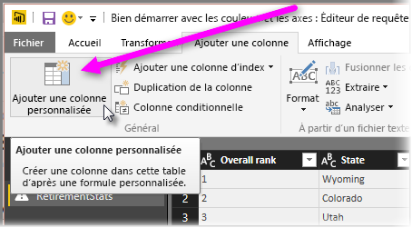

# Histogrammes
Il existe plusieurs façons de construire des histogrammes dans Power BI. Nous allons commencer par la plus simple avant d’examiner les autres.

## Histogrammes simples
Pour commencer, identifiez la requête contenant le champ à utiliser pour créer un histogramme.  Utilisez l’option *Référence* de la requête pour créer une nouvelle requête et nommez-la *Histogramme NomChamp*. Utilisez l’option **Regrouper par** dans le ruban **Transformer** et sélectionnez l’agrégation **Compter les lignes**. Vérifiez que le type de données de la colonne d’agrégation résultante est un nombre. Vous pouvez ensuite visualiser ces données sur la page des rapports. Cette méthode est rapide et facile, mais elle n’est pas très adaptée si vous avez plusieurs points de données. Par ailleurs, elle n’autorise pas le balayage des différents éléments visuels.

## Définition des compartiments pour créer un histogramme
Identifiez la requête contenant le champ à utiliser pour créer un histogramme. Utilisez l’option *Référence* de la requête pour créer une nouvelle requête et nommez-la *NomChamp*.  À présent, définissez les compartiments au moyen d’une règle. Utilisez l’option **Ajouter une colonne personnalisée** du ruban **Ajouter une colonne** et créez une règle personnalisée.

Vérifiez que le type de données de la colonne d’agrégation résultante est un nombre. Vous pouvez maintenant utiliser le groupe à l’aide de la technique décrite dans **Histogrammes simples** (précédemment dans cet article) pour générer l’histogramme. Cette option permet de traiter plus de points de données, mais elle ne prend toujours pas en charge le balayage.

## Définition d’un histogramme prenant en charge le balayage
Si des éléments visuels sont liés entre eux et qu’un utilisateur sélectionne un point de données dans un élément visuel, les autres éléments visuels de la page de rapport mettent en surbrillance ou filtrent les points de données liés à celui sélectionné. Voilà ce qu’on entend par « balayage ».  Étant donné que nous manipulons les données au moment de la requête, nous devons créer une relation entre les tables et déterminer l’élément de détail qui est lié au compartiment dans l’histogramme et vice-versa.

Pour démarrer le processus, identifiez la requête contenant le champ à utiliser pour créer un histogramme, puis sélectionnez l’option *Référence* .  Nommez la nouvelle requête *Compartiments*.  Dans cet exemple, nous allons appeler la requête d’origine *Détails*.  Ensuite, supprimez toutes les colonnes à l’exception de celle que vous allez utiliser comme compartiment pour l’histogramme.  Maintenant, avec le bouton droit de la souris, cliquez sur la colonne et sélectionnez *Supprimer les doublons* pour faire en sorte que les valeurs restantes soient uniques dans la colonne. Si vos données comportent des nombres décimaux, vous pouvez tout d’abord suivre la procédure « Définition de compartiments pour créer un histogramme » afin d’obtenir un ensemble gérable de compartiments.  Examinez à présent les données affichées dans l’aperçu de la requête. Si vous voyez des valeurs vides ou null, vous devez les corriger avant de créer une relation. Consultez la section « Création de relations si les données comprennent des valeurs null ou vides ». Cette approche peut être problématique, car elle nécessite que les données soient triées. Pour que les compartiments trient correctement les données, consultez « Ordre de tri : faire apparaître les catégories dans l’ordre souhaité ». 

> [!NOTE]
> Il est conseillé de réfléchir à l’ordre de tri avant de créer des éléments visuels.   
> 
> 

L’étape suivante du processus consiste à définir une relation entre les requêtes *Compartiments* et *Détails* dans la colonne des compartiments.  Dans le ruban de *Power BI Desktop*, cliquez sur *Gérer les relations* .  Créez une relation dans laquelle *Compartiments* est dans la table de gauche et *Détails* dans la table de droite, puis sélectionnez le champ que vous utilisez pour l’histogramme. 

La dernière étape consiste à créer l’histogramme. Faites glisser le champ Compartiment à partir de la table *Compartiments* . Supprimez le champ par défaut de l’histogramme résultant.  Maintenant, à partir de la table *Détails* , faites glisser le champ de l’histogramme dans le même élément visuel. Dans la zone des champs, spécifiez l’agrégation par défaut Nombre. L’histogramme est généré. Si vous créez un autre élément visuel comme un Treemap à partir de la table Details, sélectionnez un point de données dans Treemap pour mettre en surbrillance l’histogramme et afficher l’histogramme pour le point de données sélectionné par rapport à la tendance de l’ensemble du jeu de données.

