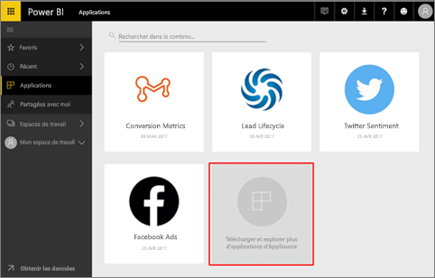
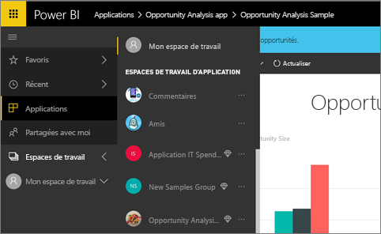
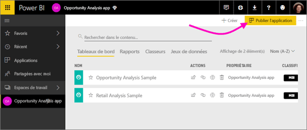
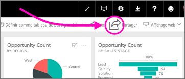

# Comment travailler en collaboration et partager des documents dans Power BI ?

Vous avez créé des tableaux de bord et des rapports. Vous collaborez peut-être dessus avec vos collègues. Puis vous souhaitez les partager avec d’autres utilisateurs. Qu’est la meilleure façon de les distribuer ?

Cet article compare les options de collaboration et de partage dans Power BI : 

* collaborer avec des collègues pour créer des rapports et tableaux de bord éloquents dans des *espaces de travail d’application*;
* regrouper les tableaux de bord et rapports dans des *applications* et les publier pour un groupe plus important ou toute l’organisation ;
* partager des tableaux de bord ou rapports avec quelques personnes, à partir du service ou d’applications mobiles Power BI ;
- imprimer des rapports ;
* publier sur le web pour des sites web publics, où n’importe qui dans le monde entier peut voir et interagir avec l’application.

Quelle que soit l’option choisie, pour partager un tableau de bord, vous avez besoin d’une [licence Power BI Pro](service-free-vs-pro.md) ou le contenu doit être dans une [capacité Premium](service-premium.md). Les besoins en licence varient pour les collègues qui consultent vos tableaux de bord, selon l’option que vous choisissez. Les sections suivantes offrent des informations détaillées. 

*Applications dans le service Power BI*

## Collaborer avec des collègues dans un espace de travail d’application

Quand des équipes travaillent ensemble, elles ont besoin d’accéder aux mêmes documents pour pouvoir collaborer rapidement. Les espaces de travail d’application dans Power BI fournissent l’endroit où les équipes se retrouvent ensemble pour partager la propriété et la gestion des tableaux de bord, des rapports, des jeux de données et des classeurs qui sont importants pour elles. Les utilisateurs Power BI organisent parfois leurs espaces de travail en fonction des structures organisationnelles, et d’autres fois, ils les créent pour des projets spécifiques. D’autres organisations utilisent plusieurs espaces de travail pour stocker différentes versions des rapports ou des tableaux de bord qu’elles utilisent. 

Les espaces de travail d’application fournissent des rôles qui déterminent les autorisations de vos collègues. Vous pouvez utiliser ces rôles pour déterminer qui peut gérer tout l’espace de travail ou seulement lui fournir du contenu.

Certains utilisateurs placent naturellement du contenu dans leur espace Mon espace de travail et le partagent. Les espaces de travail d’application conviennent mieux pour la collaboration que Mon espace de travail, car ils permettent la copropriété du contenu. Vous et toute votre équipe pouvez facilement mettre à jour ou donner un accès à d’autres personnes. Mon espace de travail convient mieux à une utilisation par des personnes individuelles pour du contenu ponctuel ou personnel.

Imaginons que vous avez un tableau de bord terminé, que vous devez partager avec vos collègues. Quel est la meilleure façon de leur donner accès au tableau de bord ? La réponse dépend de plusieurs facteurs. Si un collègue spécifique doit avoir la propriété du tableau de bord et le maintenir à jour, ou s’il a besoin d’accéder à tout le contenu de l’espace de travail d’application, il peut être préférable de les ajouter à l’espace de travail. Si votre collègue doit seulement consulter ce tableau de bord mais pas tout le contenu de l’espace de travail, vous pouvez à nouveau choisir entre différentes possibilités. Si le tableau de bord fait partie d’un ensemble de contenus plus importants que vous devez distribuer à de nombreux collègues, la publication d’une application est probablement le meilleur choix. Cependant, si ce collègue a besoin de ce seul tableau de bord, partager le tableau de bord peut s’avérer être la meilleure solution. 

Pour plus d’informations, consultez [Création d’espaces de travail d’application](service-create-workspaces.md).

**Le saviez-vous ?** Power BI propose une nouvelle expérience d’espace de travail en préversion. Lisez [Créer de nouveaux espaces de travail (préversion)](service-create-the-new-workspaces.md) pour voir comment les espaces de travail seront à l’avenir. 

## Distribuer des données et des insights en créant une application

Supposons que vous souhaitez distribuer votre tableau de bord à un public plus large. Vos collègues et vous avez créé un *espace de travail d’application*, puis créé et affiné des tableaux de bord, des rapports et des jeux de données dans l’espace de travail d’application. Désormais, vous sélectionnez les tableaux de bord et les rapports de votre choix, et vous les publiez en tant qu’application pour un groupe ou pour toute votre organisation. 

Les applications sont faciles à trouver et à installer dans le service Power BI ([https://powerbi.com](https://powerbi.com)). Vous pouvez envoyer à vos utilisateurs professionnels un lien direct vers l’application, ou ceux-ci peuvent rechercher cette dernière dans AppSource. Si votre administrateur Power BI vous y autorise, vous pouvez installer une application automatiquement dans les comptes Power BI de vos collègues. Apprenez-en davantage sur la [publication de vos applications](service-create-distribute-apps.md). 

Après avoir installé une application, ils peuvent l’afficher dans leur navigateur ou sur leur appareil mobile.

Pour que vos utilisateurs puissent voir l’application, ils doivent posséder une licence Power BI Pro, ou l’application doit être stockée dans une capacité Power BI Premium. Pour plus de détails, consultez [Qu’est-ce que Power BI Premium ?](service-premium.md).

Vous pouvez également publier des applications pour des personnes extérieures à votre organisation. Celles-ci peuvent consulter le tableau de bord et interagir avec celui-ci, mais elles ne peuvent pas le partager avec d’autres personnes.

## Partager des tableaux de bord et rapports
Supposons que vous avez finalisé un tableau de bord et un rapport dans votre espace de travail personnel ou dans un espace de travail d’application, et que vous voulez que quelques autres utilisateurs y aient accès. Une des options est de le *partager* avec eux. 

Vous-même et les utilisateurs avec qui vous partagez votre contenu avez besoin d’une licence Power BI Pro, ou bien le contenu doit être dans un espace de travail qui se trouve dans une [capacité Premium](service-premium.md). Quand vous partagez un tableau de bord ou un rapport, les destinataires peuvent le consulter et interagir avec celui-ci, mais ils ne peuvent pas le modifier. Ils voient les mêmes données que vous dans le tableau de bord et les rapports, sauf si la sécurité au niveau des lignes est appliquée au jeu de données sous-jacent. Les collègues avec qui vous partagez le tableau de bord ou rapport peuvent le partager avec leurs collègues si vous les y autorisez. 

Vous pouvez également partager le tableau de bord avec des personnes extérieures à votre organisation. Celles-ci peuvent également consulter le tableau de bord ou le rapport, et interagir avec celui-ci, mais elles ne peuvent pas le partager. 

Découvrez plus en détails le [partage de tableaux de bord et de rapports](service-share-dashboards.md) à partir du service Power BI. Vous pouvez également ajouter un filtre à un lien et [partager une vue filtrée de votre rapport](service-share-reports.md).

## Annoter et partager à partir des applications mobiles Power BI
Dans les applications mobiles Power BI pour les appareils iOS et Android, vous pouvez annoter une vignette, un rapport ou un visuel et le partager avec tout le monde par e-mail. 

Vous partagez une capture instantanée de la vignette, du rapport et du visuel et vos destinataires voient cet élément exactement tel qu’il était quand vous avez envoyé l’e-mail. Le message contient également un lien vers le tableau de bord ou le rapport. Si vos destinataires possèdent une licence Power BI Pro ou que le contenu est dans une [capacité Premium](service-premium.md), et que vous avez déjà partagé l’objet avec eux, ils peuvent l’ouvrir. Vous pouvez envoyer des instantanés de vignettes à tout le monde, pas simplement à vos collègues dans le même domaine de messagerie.

En savoir plus sur l’[annotation et le partage de vignettes, de rapports et de visuels](consumer/mobile/mobile-annotate-and-share-a-tile-from-the-mobile-apps.md) à partir des applications mobiles iOS et Android.

Vous pouvez également [partager une capture instantanée d’une vignette](consumer/mobile/mobile-windows-10-phone-app-get-started.md) à partir de l’application Power BI pour les appareils Windows 10.

## Imprimer ou enregistrer au format PDF ou dans un autre format de fichier statique
Vous pouvez imprimer ou enregistrer au format PDF (ou dans un autre format de fichier statique) un tableau de bord entier, une vignette de tableau de bord, une page de rapport ou une visualisation à partir du service Power BI. Les rapports ne peuvent être imprimés qu’une page à la fois. Vous ne pouvez peut pas imprimer l’intégralité du rapport en une fois. En savoir plus sur l’[impression ou l’enregistrement en tant que fichier statique](service-print.md).

## Publier sur le web

> [!WARNING]
> Utilisez **Publier sur le web** seulement pour partager du contenu publiquement, mais pas pour un partage en interne.

Vous pouvez publiez des rapports Power BI sur le web en incorporant des visualisations interactives dans les billets de blog, les sites web, les réseaux sociaux et d’autres supports de communication en ligne sur n’importe quel appareil. Tous les utilisateurs d’Internet peuvent afficher vos rapports et vous n’avez aucun contrôle sur les personnes qui peuvent voir ce que vous avez publié. Celles-ci n’ont pas besoin d’une licence Power BI. La fonction de publication sur le web n’est disponible que pour les rapports que vous pouvez modifier. Vous ne pouvez pas publier des rapports sur le web s’ils sont partagés avec vous ou s’ils figurent dans une application. Informations complémentaires sur la [publication sur le web](service-publish-to-web.md)

## Étapes suivantes
* [Partager des tableaux de bord avec vos collègues et d’autres utilisateurs](service-share-dashboards.md)
* [Créer et publier une application dans Power BI](service-create-distribute-apps.md)
* Vous voulez donner votre avis ? Accédez au [site de la communauté Power BI](https://community.powerbi.com/) pour effectuer des suggestions.
* D’autres questions ? [Posez vos questions à la Communauté Power BI](http://community.powerbi.com/).

