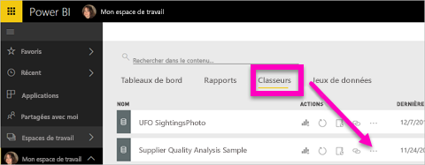
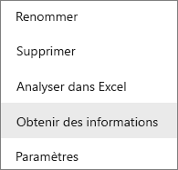
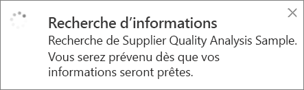
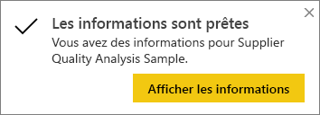
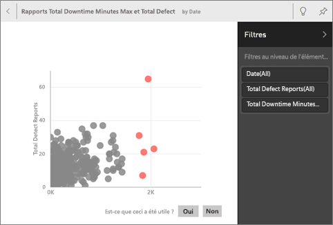
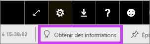
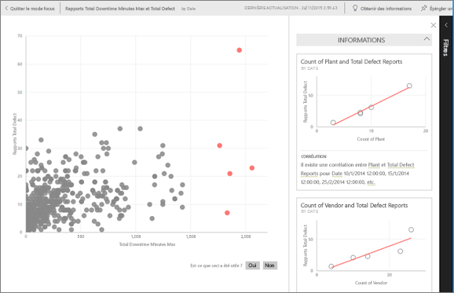
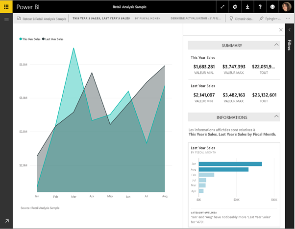

# Générer automatiquement des informations sur les données avec Power BI
Vous disposez d’un jeu de données et vous ne savez pas par quoi commencer ?  Vous voulez créer rapidement un tableau de bord ?  Vous souhaitez rechercher des informations que vous auriez manquées ?

Exécutez un aperçu rapide pour générer des visualisations interactives intéressantes basées sur vos données. L’aperçu rapide peut être exécuté sur un jeu de données entier (aperçu rapide) ou sur une vignette de tableau de bord spécifique (aperçu délimité). Vous pouvez même exécuter un aperçu rapide sur un aperçu !

> **Remarque** : l’aperçu ne fonctionne pas avec DirectQuery (seulement avec les données chargées dans Power BI).
> 
> 

La fonctionnalité d’aperçu repose sur un [ensemble croissant d’algorithmes analytiques avancés](service-insight-types.md) développés conjointement avec Microsoft Research, que nous continuerons d’utiliser pour permettre à davantage de personnes de tirer des informations de leurs données de façon innovante et intuitive.

## Exécuter un aperçu rapide sur un jeu de données
Regardez Amanda exécuter un aperçu rapide sur un jeu de données, ouvrir une information en mode Focus, épingler l’une de ces informations en tant que vignette à son tableau de bord, et obtenir des informations sur une vignette de tableau de bord.

<iframe width="560" height="315" src="https://www.youtube.com/embed/et_MLSL2sA8" frameborder="0" allowfullscreen></iframe>

Maintenant, à vous de jouer. Explorez les informations en vous appuyant sur l’[exemple Analyse de la qualité des fournisseurs](sample-supplier-quality.md).

1. Sous l’onglet **Jeux de données**, sélectionnez les points de suspension (…) puis choisissez **Obtenir des informations**.
   
    
   
    
2. Power BI utilise [différents algorithmes](service-insight-types.md) pour rechercher des tendances dans votre jeu de données.
   
    
3. En quelques secondes, vos informations sont prêtes.  Sélectionnez **Afficher les informations** pour afficher des visualisations.
   
    
   
   > **Remarque** : certains jeux de données ne peuvent pas générer d’informations, car les données ne sont pas significatives d’un point de vue statistique.  Pour en savoir plus, consultez [Optimiser vos données pour obtenir des informations](service-insights-optimize.md).
   > 
   > 
1. Les visualisations s’affichent dans une zone de dessin **Informations rapides** spéciale comprenant jusqu’à 32 cartes d’information distinctes. Chaque carte possède un graphique et une brève description.
   
    

## Interagir avec les cartes d’informations
  

1. Pointez le curseur sur une carte, puis sélectionnez l’icône en forme d’épingle pour ajouter la visualisation à un tableau de bord.
2. Pointez sur une carte, sélectionnez les points de suspension (...) et choisissez **Afficher les informations**. L’aperçu rapide s’affiche en plein écran.
   
    
3. Dans le mode Focus, vous pouvez :
   
   * [Filtrer](service-interact-with-a-report-in-reading-view.md) les visualisations.  Pour afficher les filtres, dans l’angle supérieur droit, sélectionnez la flèche pour développer le volet Filtres.
     
        
   * Épingler la carte d’information à un tableau de bord en sélectionnant l’icône Épingler  ou l’option **Épingler un élément visuel**.
   * Exécuter un aperçu sur la carte elle-même. C’est ce que l’on appelle un **aperçu délimité**. Dans le coin supérieur droit, sélectionnez l’icône en forme d’ampoule  ou **Obtenir des informations**.
     
       
     
     L’aperçu s’affiche à gauche et de nouvelles cartes, basées uniquement sur les données de cet aperçu, s’affichent à droite.
     
       
4. Pour revenir au canevas d’aperçu d’origine, dans le coin supérieur gauche, sélectionnez **Quitter le mode Focus**.

## Exécuter un aperçu sur une vignette de tableau de bord
Au lieu de rechercher des informations dans un jeu de données complet, limitez votre recherche aux données ayant servi à créer une vignette de tableau de bord. Cette opération est également souvent appelée **aperçu délimité**.

1. Ouvrez un tableau de bord.
2. Pointez sur une vignette, sélectionnez les points de suspension (...) et choisissez **Afficher des informations**. La vignette s’ouvre en [mode Focus](service-focus-mode.md), qui présente les cartes d’informations à droite.    
   
        
4. Une information suscite votre intérêt ? Sélectionnez la carte d’informations pour en savoir plus. L’information sélectionnée s’affiche à gauche et les nouvelles cartes d’informations, basées uniquement sur les données de cette information, s’affichent à droite.    
6. Continuez à explorer vos données et, dès que vous trouvez une information intéressante, épinglez-la à votre tableau de bord en sélectionnant **Épingler un élément visuel** en haut à droite.

## Étapes suivantes
Si vous possédez un jeu de données, [optimisez-le pour la fonction Informations rapides](service-insights-optimize.md).

Découvrez les [types d’Informations rapides disponibles](service-insight-types.md).

D’autres questions ? [Posez vos questions à la communauté Power BI](http://community.powerbi.com/)

