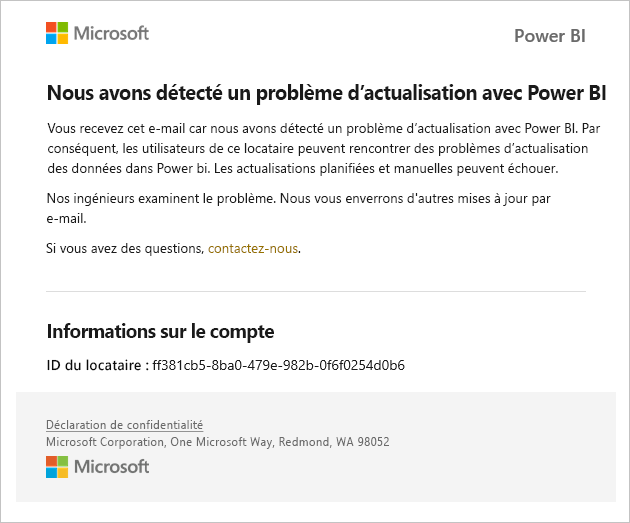
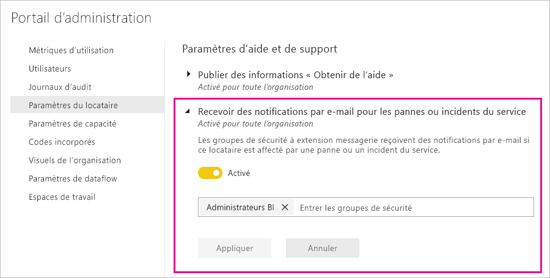

# Notifications d’interruption de service

Il est essentiel d’avoir un aperçu de la disponibilité de vos applications métier stratégiques. Power BI fournit une notification d’incident pour vous permettre de recevoir éventuellement des e-mails en cas de dégradation ou de perturbation du service. Même si le contrat de niveau de service (SLA) de 99,9 % de Power BI rend ces occurrences rares, nous voulons nous assurer que vous êtes tenu informé. La capture d’écran suivante montre le type d’e-mail que vous recevrez si vous activez les notifications :

À l’heure actuelle, nous envoyons des e-mails pour les _scénarios de fiabilité_ suivants :

- Fiabilité des rapports ouverts
- Fiabilité des actualisations de modèles
- Fiabilité des actualisations de requêtes

Des notifications sont envoyées en cas de _délai prolongé_ lors d’opérations telles que l’ouverture de rapports, l’actualisation du jeu de données ou l’exécution de requêtes. Après la résolution d’un incident, vous recevez un e-mail de suivi.

> [!NOTE]
> Cette fonctionnalité est actuellement disponible uniquement pour les capacités dédiées dans Power BI Premium. Elle n’est pas disponible pour la capacité partagée ou embarquée.

## Activer les notifications

Un administrateur de locataire Power BI active les notifications dans le portail d’administration :

1. Identifiez ou créez un groupe de sécurité prenant en charge les e-mails qui doit recevoir des notifications.

1. Dans le portail d’administration, sélectionnez **Paramètres du locataire**. Sous **Paramètres d’aide et de support**, développez **Recevoir des notifications par e-mail pour les pannes ou incidents du service**.

1. Activez les notifications, entrez un groupe de sécurité, puis sélectionnez **Appliquer**.

    

> [!NOTE]
> Power BI envoie des notifications à partir du compte no-reply-powerbi@microsoft.com. Vérifiez que ce compte est inclus dans la liste verte afin que les notifications ne se retrouvent pas dans un dossier de spam ou de courrier indésirable.

## Étapes suivantes

[Options de support Power BI Pro et Power BI Premium](service-support-options.md)

D’autres questions ? [Posez vos questions à la communauté Power BI](https://community.powerbi.com/)
