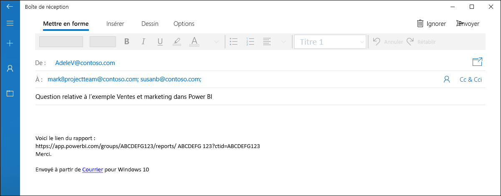
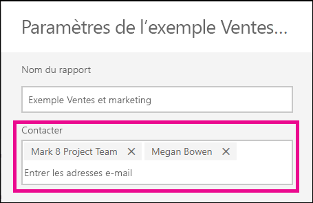

# Définir les informations de contact pour les rapports et les tableaux de bord dans le service Power BI
Cet article vous explique comment définir les informations de contact d'un tableau de bord ou d'un rapport dans le service Power BI.

> [!NOTE]
> Les informations de contact peuvent être définies pour les éléments d'un espace de travail classique ou nouveau. Vous ne pouvez pas définir les informations de contact pour les éléments de votre espace Mon espace de travail. La carte d'information s'affiche lorsque vous ouvrez un rapport ou un tableau de bord dans la [nouvelle apparence](service-new-look.md).

Vous pouvez ajouter plusieurs utilisateurs ou groupes au contact d'un élément. Ce peut être :
* Une personne
* Un groupe Office 365
* Un groupe de sécurité à extension messagerie
* Une liste de distribution

Par défaut, la personne qui crée un rapport ou tableau de bord est la personne à contacter. Si vous définissez une valeur, elle remplace la valeur par défaut. Vous pouvez bien sûr supprimer toutes les personnes ou tous les groupes de la liste de contacts. Dans ce cas, pour les espaces de travail classiques, le groupe Office 365 s’affiche pour l'espace de travail. Pour les espaces de travail de la nouvelle apparence, la liste de [contacts de l'espace de travail](service-create-the-new-workspaces.md#workspace-contact-list) sera utilisée. Si la liste des contacts de l'espace de travail n'est pas définie, les administrateurs de l'espace de travail sont affichés.

Les informations de contact sont affichées aux personnes qui consultent l'élément. 

 

Lorsque vous cliquez sur la liste de contacts, un e-mail est créé et vous permet de poser des questions ou d’obtenir de l'aide. 

 
 
Les informations de la liste de contacts sont également utilisées à d'autres endroits. Par exemple, il s’affiche dans certains scénarios d'erreur dans la boîte de dialogue de l’erreur. Les e-mails automatisés liés à l'élément, notamment les demandes d'accès, sont envoyés à la liste de contacts. 

> [!NOTE]
> Lors de la publication d'une application, les informations de contact sur les éléments individuels sont définies sur la personne qui a publié ou mis à jour l'application. Vous pouvez définir l'URL de support de l'application pour permettre aux utilisateurs de l'application d’obtenir l'aide dont ils ont besoin.

## Définir les informations de contact pour un rapport
1. Dans votre espace de travail, sélectionnez l’onglet **Rapports**.
2. Localisez le rapport souhaité, puis sélectionnez l'icône **Paramètres**.
3. Localisez le champ d’entrée **Contact**, puis définissez une valeur.

     

## Définir les informations de contact pour un tableau de bord
1. Dans votre espace de travail, sélectionnez l’onglet **Tableaux de bord**.
2. Localisez le tableau de bord souhaité, puis sélectionnez l'icône **Paramètres**
3. Localisez le champ d’entrée **Contact**, puis définissez une valeur.

     

## Considérations et limitations
* Le contact est automatiquement défini pour les nouveaux éléments créés dans le service Power BI. Les éléments existants afficheront l'espace de travail par défaut.
* Vous pouvez définir n'importe quel utilisateur ou groupe dans la liste de contacts, mais ils n'auront pas automatiquement l'autorisation d'accéder à l'élément. Utilisez le partage ou donnez à l'utilisateur qui en a besoin l'accès à l'espace de travail en lui attribuant un rôle. 

## Étapes suivantes

D’autres questions ? [Posez vos questions à la communauté Power BI](http://community.powerbi.com/)
