# Machine Learning automatisé dans Power BI

Le Machine Learning automatisé (AutoML) pour les dataflows permet aux analystes métier d’entraîner, de valider et d’appeler des modèles Machine Learning (ML) directement dans Power BI. Il offre une expérience simple pour la création d’un nouveau modèle Machine Learning dans lequel les analystes peuvent utiliser leurs dataflows pour spécifier les données d’entrée pour effectuer l’apprentissage du modèle. Le service extrait automatiquement les caractéristiques les plus pertinentes et sélectionne un algorithme approprié, puis il ajuste et valide le modèle Machine Learning. Après l’entraînement d’un modèle, Power BI génère automatiquement un rapport sur les performances qui comprend les résultats de la validation. Le modèle peut ensuite être appelé sur toutes les données nouvelles ou mises à jour dans le dataflow.

Le Machine Learning automatisé est disponible pour les dataflows hébergés sur les capacités Power BI Premium et Embedded uniquement.

## Utilisation d’AutoML

Les [dataflows Power BI](service-dataflows-overview.md) permettent d’effectuer une préparation des données en libre-service pour le Big Data. AutoML est intégré aux dataflows et permet de tirer parti de votre préparation des données pour créer des modèles Machine Learning directement dans Power BI.

AutoML dans Power BI permet aux analystes de données d’utiliser les dataflows pour créer des modèles Machine Learning avec une expérience simplifiée, en utilisant uniquement des compétences Power BI. La science des données qui est utilisée dans le cadre de la création des modèles ML est en grande partie automatisée par Power BI. Elle comprend des systèmes qui garantissent la qualité du modèle créé, et permet de voir le processus qui est utilisé pour créer votre modèle ML.

AutoML prend en charge la création de modèles de **Prédiction binaire**, de **Classification** et de **Régression** pour les dataflows. Il s’agit de techniques de Machine Learning supervisées qui s’entraînent à partir des résultats connus d’observations passées pour prédire les résultats d’autres observations. Le jeu de données d’entrée pour effectuer l'apprentissage d’un modèle AutoML est un ensemble d’enregistrements **étiquetés** avec les résultats connus.

AutoML dans Power BI intègre le [machine learning automatisé](https://docs.microsoft.com/azure/machine-learning/service/concept-automated-ml) d’[Azure Machine Learning](https://docs.microsoft.com/azure/machine-learning/service/overview-what-is-azure-ml) pour créer vos modèles Machine Learning. Toutefois, vous n’avez pas besoin d’un abonnement Azure pour utiliser AutoML dans Power BI. Le processus de formation et d’hébergement des modèles Machine Learning est géré entièrement par le service Power BI.

Après l’apprentissage d’un modèle Machine Learning, AutoML génère automatiquement un rapport Power BI qui explique les performances probables de votre modèle Machine Learning. AutoML met l’accent sur la facilité d’explication, en mettant en évidence les facteurs d’influence clés parmi les entrées qui influencent les prédictions retournées par votre modèle. Le rapport comprend également des métriques clés pour le modèle.

D’autres pages du rapport généré affichent le résumé statistique du modèle et les détails de la formation. Le résumé statistique présente un intérêt pour les utilisateurs qui souhaitent voir les mesures de science des données standard concernant les performances du modèle. Les détails de la formation résument toutes les itérations exécutées pour créer votre modèle, avec les paramètres de modélisation associés. Ils décrivent également comment chaque entrée a été utilisée pour créer le modèle Machine Learning.

Vous pouvez ensuite appliquer votre modèle Machine Learning à vos données pour scoring. Lorsque le dataflow est actualisé, vos données sont mises à jour avec les prédictions de votre modèle ML. Power BI comprend également une explication individualisée pour chaque prédiction produite par le modèle Machine Learning.

## Créer un modèle Machine Learning

Cette section décrit comment créer un modèle AutoML.

### Préparation des données pour la création d’un modèle Machine Learning

Pour créer un modèle Machine Learning dans Power BI, vous devez d’abord créer un dataflow pour les données comprenant les informations d’historique des résultats, qui sont utilisées pour effectuer l’entraînement du modèle ML. Vous devez également ajouter des colonnes calculées pour toutes les métriques commerciales qui peuvent être des éléments de prédiction forts pour les résultats que vous essayez de prédire. Pour plus d’informations sur la configuration de vos dataflows, consultez [Préparation des données en libre-service dans Power BI](service-dataflows-overview.md).

AutoML a des exigences spécifiques en matière de données pour la formation d’un modèle Machine Learning. Ces exigences sont décrites dans les sections ci-dessous, en fonction des types de modèle respectifs.

### Configuration des entrées du modèle Machine Learning

Pour créer un modèle AutoML, sélectionnez l’icône ML dans la colonne **Actions** de l’entité de dataflow, puis sélectionnez **Ajouter un modèle Machine Learning**.

Une expérience simplifiée est lancée, composée d’un assistant qui vous guide tout au long du processus de création du modèle Machine Learning. L’assistant comprend les étapes simples suivantes.

**1. Sélectionner l’entité avec les données d’historique et le champ de résultat pour lequel vous souhaitez une prédiction**

Le champ de résultat identifie l’attribut d’étiquette pour l’entraînement du modèle Machine Learning, comme illustré dans l’image suivante.

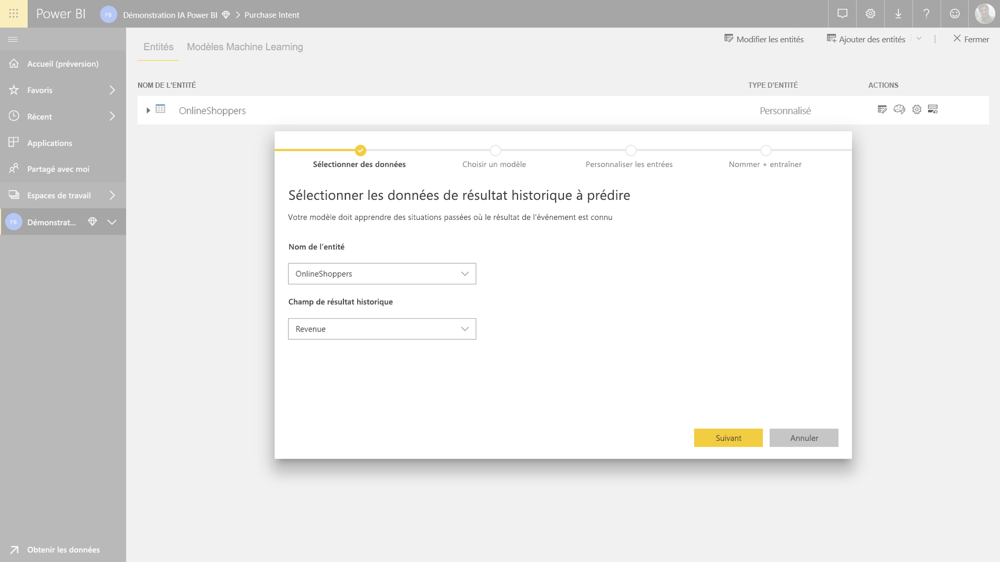

**2. Choisir un type de modèle**

Lorsque vous spécifiez le champ de résultat, AutoML analyse les données d’étiquette pour recommander le type de modèle ML qui a le plus de chances de pouvoir être entraîné. Vous pouvez choisir un autre type de modèle, comme indiqué ci-dessous, en cliquant sur « Sélectionner un autre modèle ».

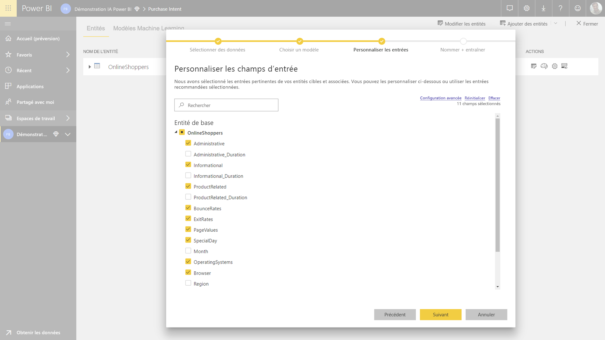

> [!NOTE]
> Certains types de modèles peuvent ne pas être pris en charge pour les données que vous avez sélectionnées, et seront donc désactivés. Dans l’exemple ci-dessus, la régression est désactivée, car une colonne de texte est sélectionnée comme un champ de résultat.

**3. Sélectionner les entrées que vous souhaitez que le modèle utilise comme signaux prédictifs**

AutoML analyse un échantillon de l’entité sélectionnée afin de suggérer les entrées qui peuvent être utilisées pour l’entraînement du modèle Machine Learning. Des explications sont fournies à côté des champs qui ne sont pas sélectionnés. Si un champ a un trop grand nombre de valeurs différentes ou n’a qu’une seule valeur, ou si la corrélation avec le champ de sortie est trop faible ou trop élevée, cette opération n’est pas recommandée.

Les entrées qui sont dépendantes du champ de résultat (ou du champ d’étiquette) ne doivent pas être utilisées pour effectuer l’entraînement du modèle Machine Learning, car elles affectent les performances. Ces champs seront marqués comme ayant une « forte corrélation suspecte avec le champ de sortie ». L’ajout de ces champs dans les données d’entraînement provoque une fuite d’étiquette : le modèle s’exécute correctement sur les données de validation et de test, mais pas dans un contexte de scoring dans un environnement de production. Si les performances du modèle d’entraînement paraissent trop élevées, il est possible qu’une fuite d’étiquette affecte les modèles AutoML.

Cette recommandation de caractéristique est basée sur un échantillon de données. Vous devez donc passer en revue toutes les entrées utilisées. Vous pouvez modifier les sélections pour n’y inclure que les champs que le modèle doit étudier. Vous pouvez également sélectionner tous les champs en cochant la case en regard du nom de l’entité.

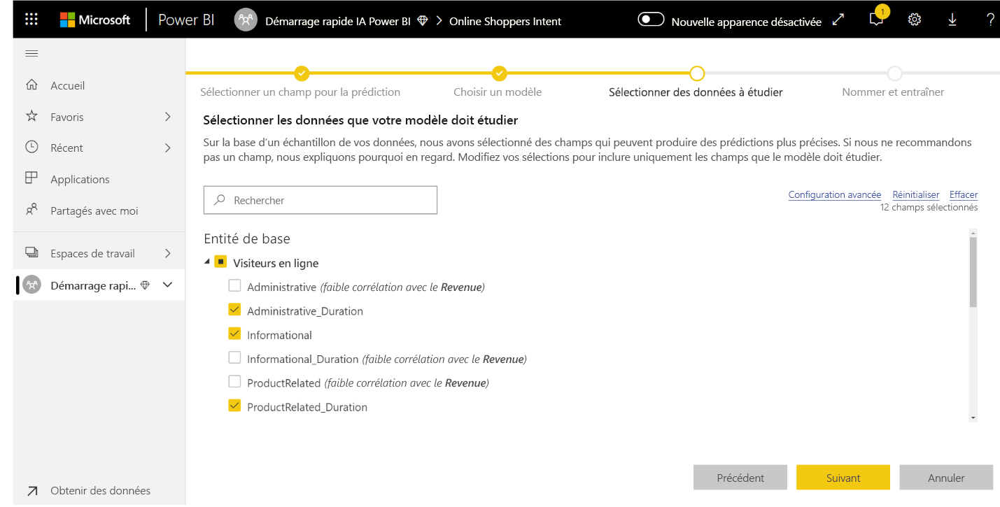

**4. Nommer votre modèle et enregistrez votre configuration**

Dans la dernière étape, vous pouvez nommer le modèle et sélectionner Enregistrer et entraîner pour démarrer l’entraînement du modèle ML. Vous pouvez choisir de réduire la durée d’entraînement pour avoir des résultats rapidement, ou augmenter la durée d’entraînement pour obtenir le meilleur modèle possible.

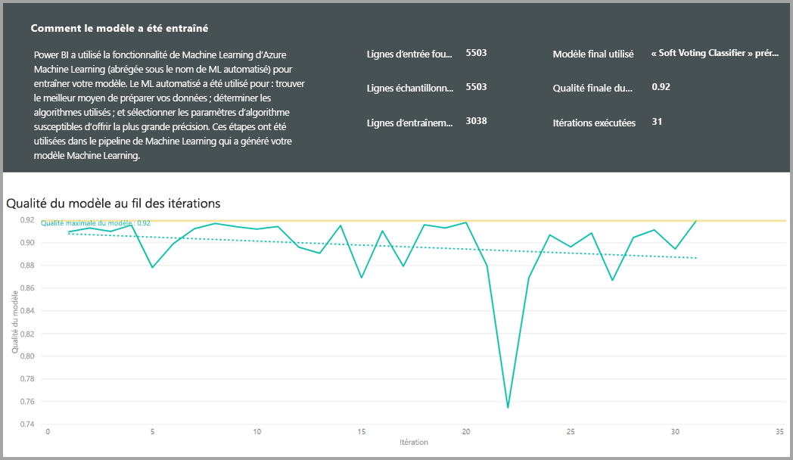

### Formation du modèle Machine Learning

La formation des modèles AutoML fait partie de l’actualisation du dataflow. AutoML prépare tout d’abord vos données pour l’apprentissage.
AutoML répartit les données d’historique que vous fournissez entre les jeux de données d’entraînement et les jeux de données de test. Le jeu de données de test est un ensemble de données d’exclusion utilisé pour valider les performances du modèle après l’apprentissage. Il se présente sous la forme d’entités **Apprentissage et test** dans le dataflow. AutoML utilise la validation croisée pour la validation du modèle.

Ensuite, chaque champ d’entrée est analysé et l’imputation est appliquée, ce qui remplace toutes les valeurs manquantes par des valeurs substituées. Plusieurs stratégies d’imputation sont utilisées par AutoML. Pour les attributs d’entrée traités comme des caractéristiques numériques, la moyenne des valeurs de colonne est utilisée pour l’imputation. Pour les attributs d’entrée traités comme des caractéristiques catégoriques, AutoML utilise le mode des valeurs de colonne pour l’imputation. La moyenne et le mode des valeurs utilisées pour l’imputation sont calculés par le framework AutoML d’après le jeu de données d’entraînement sous-échantillonné.

Ensuite, l’échantillonnage et la normalisation sont appliqués à vos données. Pour les modèles de classification, AutoML exécute les données d’entrée via un échantillonnage stratifié et équilibre les classes pour garantir que celles-ci ont toutes le même nombre de lignes.

AutoML applique plusieurs transformations. Chaque champ d’entrée est sélectionné en fonction de son type de données et de ses propriétés statistiques. AutoML utilise ces transformations pour extraire les fonctionnalités à utiliser lors de la formation de votre modèle Machine Learning.

Le processus d’apprentissage pour les modèles AutoML se compose de jusqu’à 50 itérations avec différents algorithmes de modélisation et des paramètres d’hyperparamètre pour trouver le modèle avec les meilleures performances. L’entraînement peut se terminer tôt avec des itérations moins importantes si AutoML constate que les performances n’ont pas été améliorées. Les performances de chacun de ces modèles sont évaluées par la validation avec le jeu de données d’exclusion de test. Au cours de cette étape de formation, AutoML crée plusieurs pipelines pour effectuer l'apprentissage et la validation de ces itérations. Le processus d’évaluation des performances des modèles peut prendre du temps (entre quelques minutes et quelques heures, jusqu’à la durée configurée dans l’Assistant), en fonction de la taille de votre jeu de données et des ressources de capacité dédiées disponibles.

Dans certains cas, le modèle final généré peut utiliser l’apprentissage conjoint, où plusieurs modèles sont utilisés pour fournir de meilleures performances prédictives.

### Facilité d’explication du modèle AutoML

Une fois le modèle formé, AutoML analyse la relation entre les fonctionnalités d’entrée et la sortie du modèle. Il évalue l’amplitude de la modification apportée à la sortie du modèle pour le jeu de données d’exclusion de test de chaque caractéristique d’entrée. C’est ce que l’on appelle _l’Importance de la fonctionnalité_. Cela se produit dans le cadre de l’actualisation une fois l’entraînement terminé. Par conséquent, votre actualisation peut prendre plus de temps que la durée d’entraînement configurée dans l’Assistant.

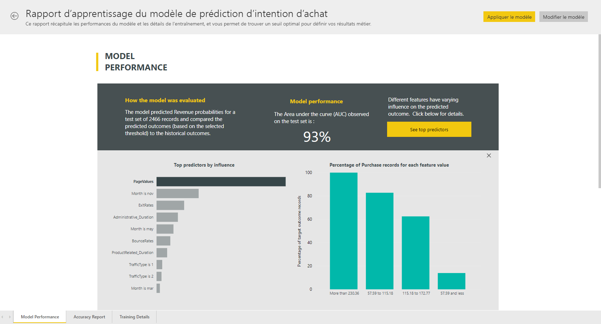

### Rapport sur le modèle AutoML

AutoML génère un rapport Power BI qui résume les performances du modèle pendant la validation, ainsi que l’importance globale des fonctionnalités. Vous pouvez accéder à ce rapport à partir de l’onglet Modèle Machine Learning une fois l’actualisation du dataflow réussie. Le rapport résume les résultats de l’application du modèle Machine Learning aux données d’exclusion de test et de la comparaison des prédictions avec les valeurs de résultat connues.

Vous pouvez consulter le rapport de modèle pour comprendre ses performances. Vous pouvez également vérifier que les influenceurs clés du modèle s’alignent sur les insights métier sur les résultats connus.

Les graphiques et mesures utilisés pour décrire les performances du modèle dans le rapport varient selon le type de modèle. Ces graphiques et mesures de performance sont décrits dans les sections suivantes.

Des pages supplémentaires dans le rapport peuvent décrire des mesures statistiques sur le modèle du point de vue de la science des données. Par exemple, le rapport **Prédiction binaire** comprend un graphique de gain et la courbe ROC pour le modèle.

Les rapports incluent également une page **Détails de l’entraînement** qui comprend une description de la façon dont le modèle a été entraîné, ainsi qu’un graphique décrivant les performances du modèle sur chacune des itérations exécutées.

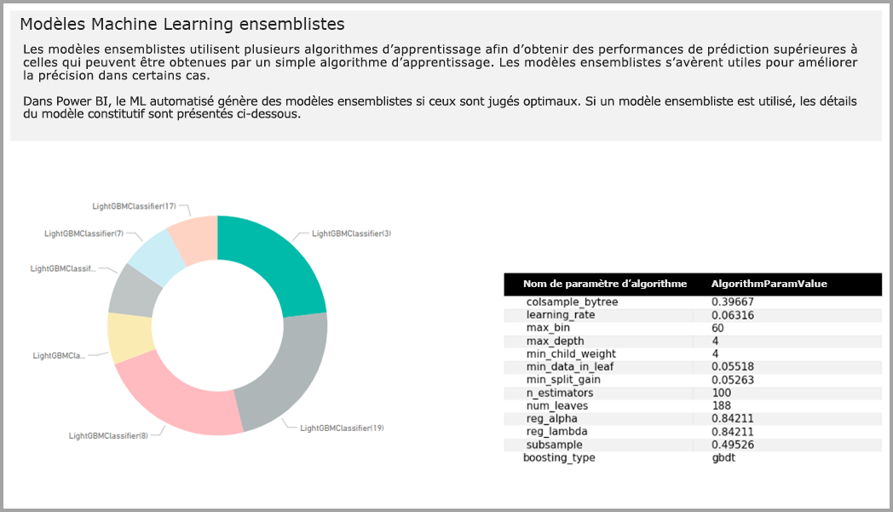

Une autre section de cette page décrit le type du champ d’entrée détecté, ainsi que la méthode d’imputation utilisée pour le remplissage des valeurs manquantes. Elle comprend également les paramètres utilisés par le modèle final.

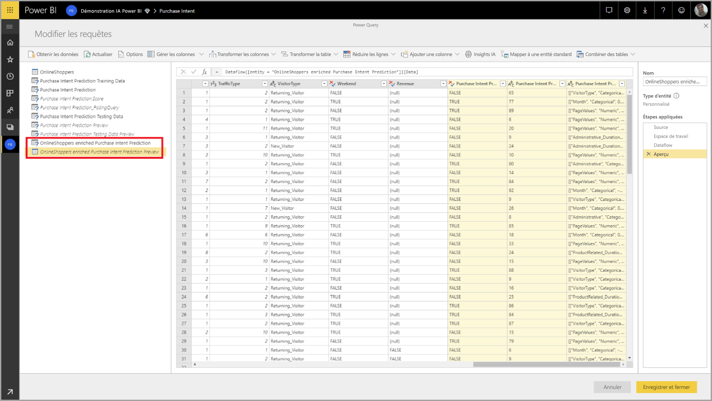

Si le modèle produit utilise l’apprentissage d’ensemble, la page **Détails de l’entraînement** comprend également une section décrivant le poids de chaque modèle constitutif de l’ensemble, ainsi que ses paramètres.

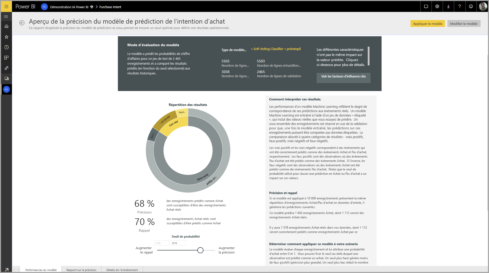

## Application du modèle AutoML

Si vous êtes satisfait des performances du modèle Machine Learning créé, vous pouvez l’appliquer à des données nouvelles ou mises à jour lorsque votre dataflow est actualisé. Vous pouvez effectuer cette opération dans le rapport du modèle, en sélectionnant le bouton **Appliquer** dans le coin supérieur droit, ou le bouton Appliquer le modèle ML situé sous les actions de l’onglet Modèles de Machine Learning.

Pour appliquer le modèle Machine Learning, vous devez spécifier le nom de l’entité à laquelle il doit être appliqué et un préfixe pour les colonnes qui seront ajoutées à cette entité pour la sortie du modèle. Le préfixe par défaut des noms de colonne est le nom du modèle. La fonction _Appliquer_ peut inclure des paramètres supplémentaires spécifiques au type de modèle.

L’application du modèle ML crée deux nouvelles entités de dataflow qui contiennent les prédictions et des explications individualisées pour chaque ligne à laquelle elle attribue un score dans l’entité de sortie. Par exemple, si vous appliquez le modèle _PurchaseIntent_ à l’entité _OnlineShoppers_, la sortie génère les entités **PurchaseIntent enriched OnlineShoppers** et **OnlineShoppers enriched PurchaseIntent explanations**. Pour chaque ligne de l’entité enrichie, les **explications** sont réparties sur plusieurs lignes, en fonction de la caractéristique d’entrée. Une **ExplanationIndex** permet de mapper les lignes de l’entité d’explications enrichie avec celles de l’entité enrichie.

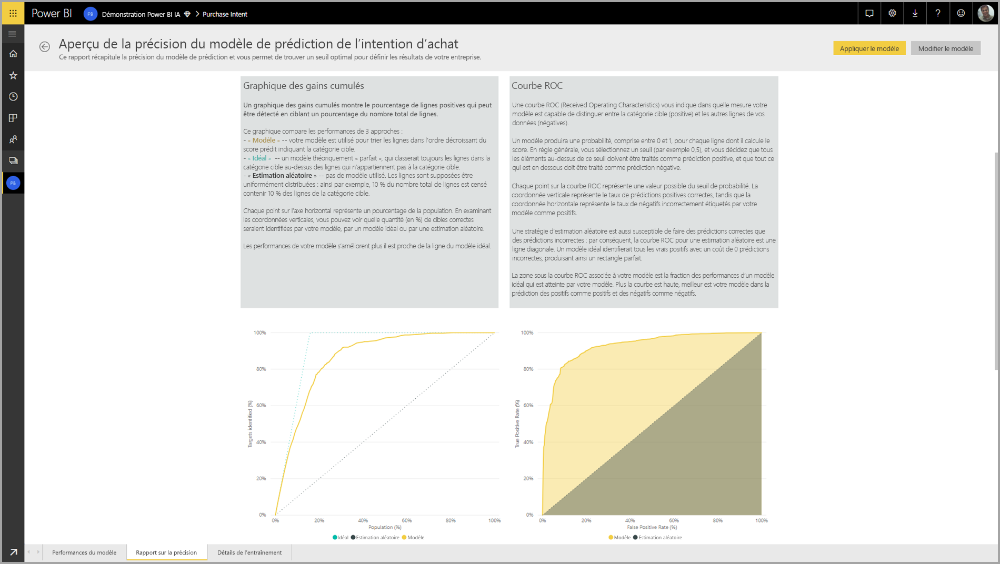

Une fois le modèle appliqué, AutoML garde vos prédictions à jour après chaque actualisation du dataflow.

Pour utiliser les insights et prédictions du modèle Machine Learning dans un rapport Power BI, vous pouvez vous connecter à l’entité de sortie à partir de Power BI Desktop avec le connecteur de **dataflows**.

## Modèles de prédiction binaire

Les modèles de prédiction binaire, plus connus sous le nom de **modèles de classification binaire**, sont utilisés pour classer un jeu de données en deux groupes. Elles sont utilisées pour prédire les événements qui peuvent avoir un résultat binaire. Par exemple si une opportunité de vente sera convertie, si un client ne renouvellera pas, si une facture sera payée à temps, si une transaction sera frauduleuse, et ainsi de suite.

La sortie d’un modèle de prédiction binaire est un score de probabilité, qui identifie la probabilité que le résultat cible soit obtenu.

### Apprentissage d’un modèle de prédiction binaire

Conditions préalables :

- Au moins 20 lignes de données d’historique sont nécessaires pour chaque classe de résultats

Le processus de création d’un modèle de prédiction binaire suit les mêmes étapes que les autres modèles AutoML, décrits dans la section **Configuration des entrées du modèle Machine Learning** ci-dessus. La seule différence se trouve au niveau de l’étape « Choisir un modèle », où vous pouvez sélectionner la valeur de résultat cible qui vous intéresse le plus. Vous pouvez également fournir des étiquettes conviviales pour les résultats à utiliser dans le rapport généré automatiquement qui synthétise les résultats de la validation du modèle.

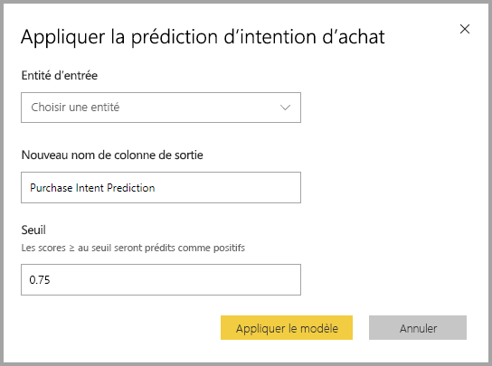

### Rapport de modèle de prédiction binaire

Le modèle de prédiction binaire permet de connaître la probabilité pour qu’un enregistrement atteigne le résultat cible. Le rapport comprend un segment pour le seuil de probabilité, qui détermine la façon dont les scores au-dessus et en dessous du seuil de probabilité sont interprétés.

Le rapport décrit les performances du modèle en termes de _Vrais positifs, Faux positifs, Vrais négatifs et Faux négatifs_. Les vrais positifs et vrais négatifs sont des résultats prédits correctement pour les deux classes dans les données de résultat. Les faux positifs sont des enregistrements pour lesquels il a été prédit qu’ils atteindraient le résultat cible, alors qu’ils ne l’ont pas atteint. À l’inverse, les faux négatifs sont des enregistrements qui ont atteint le résultat cible, mais pour lesquels cela n’avait pas été prédit.

Les mesures, telles que la précision et le rappel, décrivent l’effet du seuil de probabilité sur les résultats prédits. Vous pouvez utiliser le segment de seuil de probabilité pour sélectionner un seuil qui atteint un compromis équilibré entre précision et rappel.

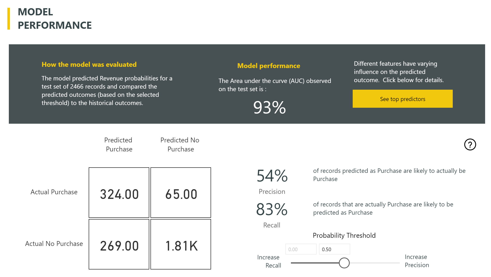

Le rapport comprend également un outil d’analyse coût-avantages permettant d’identifier le sous-ensemble de la population qui doit être ciblé afin d’obtenir les bénéfices les plus élevés. L’analyse coût-avantages tente d’optimiser les bénéfices en se basant sur l’estimation du coût unitaire de ciblage et sur l’avantage unitaire obtenu en atteignant le résultat cible. Vous pouvez utiliser cet outil pour choisir votre seuil de probabilité basé sur le point maximal du graphe en vue d’optimiser les bénéfices. Vous pouvez également utiliser le graphe pour calculer les bénéfices ou les coûts associés à votre choix de seuil de probabilité.

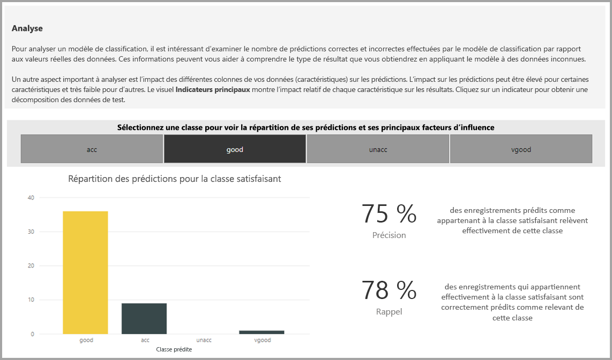

La page **Rapport de précision** du rapport de modèle comprend le graphique _Gains cumulés_ et la courbe ROC pour le modèle. Il s’agit des mesures statistiques des performances du modèle. Les rapports incluent des descriptions des graphiques affichés.

### Application d’un modèle de prédiction binaire

Pour appliquer un modèle de prédiction binaire, vous devez spécifier l’entité avec les données auxquelles vous souhaitez appliquer les prédictions à partir du modèle Machine Learning. Les autres paramètres incluent le préfixe du nom de la colonne de sortie et le seuil de probabilité pour la classification des résultats prédits.

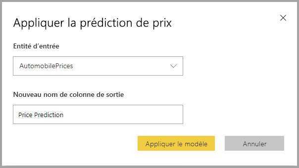

Lorsqu’un modèle de prédiction binaire est appliqué, celui-ci ajoute quatre colonnes de sortie à l’entité de sortie enrichie : **Outcome**, **PredictionScore**, **PredictionExplanation** et **ExplanationIndex**. Le préfixe est spécifié pour les noms de colonnes de l’entité lorsque le modèle est appliqué.

**PredictionScore** est un pourcentage de probabilité correspondant à la probabilité que le résultat cible soit obtenu.

La colonne **Outcome** contient l’étiquette du résultat prédit. Les enregistrements avec des probabilités qui dépassent le seuil sont prédits comme susceptibles d’obtenir le résultat cible et sont étiquetés avec la valeur True. Les enregistrements qui sont en dessous du seuil de probabilité sont prédits comme peu susceptibles d’obtenir le résultat et sont étiquetés avec la valeur False.

La colonne **PredictionExplanation** contient une explication de l’influence spécifique que les fonctionnalités d’entrée avaient sur le **PredictionScore**.

## Modèles de classification

Les modèles de classification sont utilisés pour classer un jeu de données en plusieurs groupes ou classes. Ils sont utilisés pour prédire les événements pouvant avoir l’un des nombreux résultats possibles. Par exemple, si un client est susceptible d’avoir une valeur de durée de vie très élevée, élevée, moyenne ou faible, ou si le risque de défaut est élevé, modéré, faible ou très faible, et ainsi de suite.

La sortie d’un modèle de classification est un score de probabilité qui identifie la probabilité qu’un enregistrement atteigne les critères d’une classe donnée.

### Formation d’un modèle de classification

L’entité d’entrée contenant les données d’entraînement d’un modèle de classification doit avoir un champ de chaîne ou un champ de nombre entier comme champ de résultat, où sont identifiés les résultats passés connus.

Conditions préalables :

- Au moins 20 lignes de données d’historique sont nécessaires pour chaque classe de résultats

Le processus de création d’un modèle de classification suit les mêmes étapes que les autres modèles AutoML, décrits dans la section **Configuration des entrées du modèle Machine Learning** ci-dessus.

### Rapport de modèle de classification

Le rapport de modèle de classification est généré en appliquant le modèle Machine Learning aux données d’exclusion de test et en comparant la classe prédite pour un enregistrement à la classe connue réelle.

Le rapport de modèle contient un graphique qui comprend la répartition des enregistrements correctement et incorrectement classés pour chaque classe connue.

Un autre détail spécifique à la classe permet d’analyser la manière dont les prédictions d’une classe connue sont distribuées. Cela comprend les autres classes dans lesquelles les enregistrements de cette classe connue sont susceptibles d’être mal classifiés.

L’explication du modèle dans le rapport comprend également les meilleures prédictions de chaque classe.

Le rapport de modèle de classification comprend également une page de détails de l’entraînement similaire aux pages pour les autres types de modèles, comme décrit dans la section **Rapport sur le modèle AutoML** plus haut dans cet article.

### Application d’un modèle de classification

Pour appliquer un modèle de classification Machine Learning, vous devez spécifier l’entité avec les données d’entrée et le préfixe du nom de la colonne de sortie.

Lorsqu’un modèle de classification est appliqué, il ajoute cinq colonnes de sortie à l’entité de sortie enrichie : **ClassificationScore**, **ClassificationResult**, **ClassificationExplanation**, **ClassProbabilities** et **ExplanationIndex**. Le préfixe est spécifié pour les noms de colonnes de l’entité lorsque le modèle est appliqué.

La colonne **ClassProbabilities** contient la liste des scores de probabilité pour l’enregistrement de chaque classe possible.

**ClassificationScore** est un pourcentage de probabilité qui indique la probabilité qu’un enregistrement atteigne les critères d’une classe donnée.

La colonne **ClassificationResult** contient la classe prédite comme étant la plus probable pour l’enregistrement.

La colonne **ClassificationExplanation** explique l’influence que les caractéristiques d’entrée ont eu sur **ClassificationScore**.

## Modèles de régression

Les modèles de régression sont utilisés pour prédire une valeur numérique. Par exemple le chiffre d’affaires susceptible d’être réalisé pour un contrat de vente, la valeur de durée de vie d’un client, le montant d’une facture client susceptible d’être payé, la date à laquelle une facture peut être payée, et ainsi de suite.

La sortie d’un modèle de régression est la valeur prédite.

### Formation d’un modèle de régression

L’entité d’entrée contenant les données d’entraînement d’un modèle de régression doit avoir un champ numérique comme champ de résultat, où sont identifiées les valeurs des résultats connus.

Conditions préalables :

- Un modèle de régression nécessite au minimum 100 lignes de données historiques

Le processus de création d’un modèle de régression suit les mêmes étapes que les autres modèles AutoML, décrits dans la section **Configuration des entrées du modèle Machine Learning** ci-dessus.

### Rapport sur le modèle de régression

Comme les autres rapports de modèle AutoML, le rapport de régression est basé sur les résultats de l’application du modèle aux données d’exclusion de test.

Le rapport de modèle comprend un graphique qui compare les valeurs prédites aux valeurs réelles. Dans ce graphique, la distance par rapport à la diagonale indique l’erreur dans la prédiction.

Le tableau d’erreurs résiduelles affiche la répartition du pourcentage moyen d’erreur pour les différentes valeurs dans le jeu de données d’exclusion de test. L’axe horizontal représente la moyenne de la valeur réelle pour le groupe, la taille de la bulle indiquant la fréquence ou le nombre de valeurs de cette plage. L’axe vertical est l’erreur résiduelle moyenne.

Le rapport de modèle de régression comprend également une page de détails de l’entraînement, comme les rapports pour les autres types de modèles, comme décrit dans la section **Rapport sur le modèle AutoML** ci-dessus.

### Application d’un modèle de régression

Pour appliquer un modèle de régression Machine Learning, vous devez spécifier l’entité avec les données d’entrée et le préfixe du nom de la colonne de sortie.

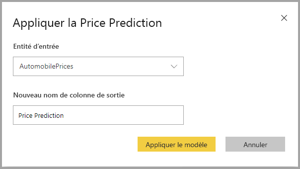

Lorsqu’un modèle de régression est appliqué, il ajoute trois colonnes de sortie à l’entité de sortie enrichie : **RegressionResult**, **RegressionExplanation** et **ExplanationIndex**. Le préfixe est spécifié pour les noms de colonnes de l’entité lorsque le modèle est appliqué.

La colonne **RegressionResult** contient la valeur prédite de l’enregistrement d’après les champs d’entrée. La colonne **RegressionExplanation** explique l’influence que les caractéristiques d’entrée ont eu sur **RegressionResult**.

## Étapes suivantes

Cet article donne une vue d’ensemble du Machine Learning automatisé pour les dataflows dans le service Power BI. Les articles suivants peuvent également vous être utiles.

- [Tutoriel : Créer un modèle Machine Learning dans Power BI ](service-tutorial-build-machine-learning-model.md)
- [Tutoriel : Utilisation de Cognitive Services dans Power BI](service-tutorial-use-cognitive-services.md)
- [Tutoriel : Appeler un modèle Machine Learning Studio (classique) dans Power BI (préversion)](service-tutorial-invoke-machine-learning-model.md)
- [Cognitive Services dans Power BI](service-cognitive-services.md)
- [Intégration d’Azure Machine Learning dans Power BI](service-machine-learning-integration.md)

Pour plus d’informations sur les flux de données, lisez les articles suivants :

- [Créer et utiliser des flux de données dans Power BI](service-dataflows-create-use.md)
- [Utilisation d’entités calculées sur Power BI Premium](service-dataflows-computed-entities-premium.md)
- [Utilisation de flux de données avec des sources de données locales](service-dataflows-on-premises-gateways.md)
- [Ressources du développeur pour les flux de données Power BI](service-dataflows-developer-resources.md)
- [Flux de données et intégration à Azure Data Lake (préversion)](service-dataflows-azure-data-lake-integration.md)
