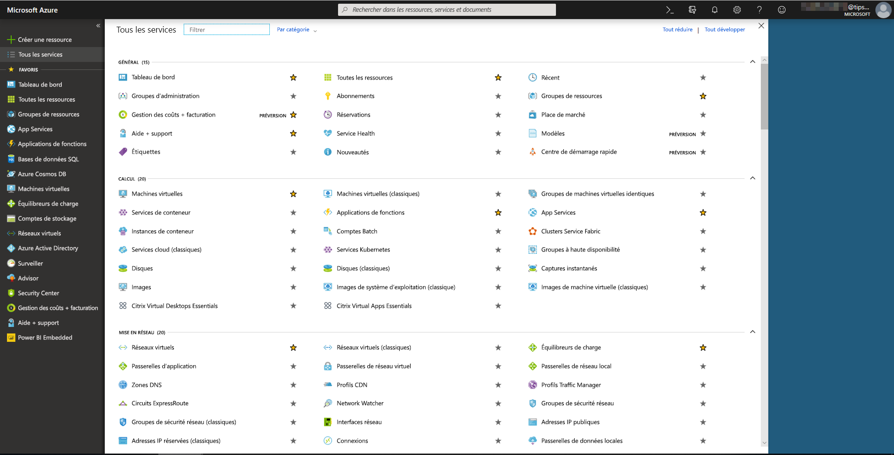
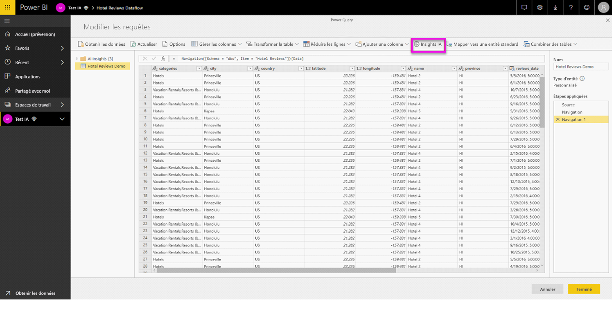

# Intégration d’Azure Machine Learning dans Power BI

De nombreuses organisations utilisent des modèles **Machine Learning** pour bénéficier d’insights et de prédictions sur leur activité. La possibilité de visualiser et d’appeler des insights à partir de ces modèles dans vos rapports, tableaux de bord et autres analyses peut aider à diffuser ces insights pour les utilisateurs professionnels qui en ont le plus besoin.  Power BI facilite désormais l’incorporation des insights tirés de modèles hébergés sur le service Azure Machine Learning avec des gestes simples de pointer-cliquer.

Pour utiliser cette fonctionnalité, un scientifique des données peut simplement autoriser l’analyste décisionnel à accéder au modèle Azure ML avec le portail Azure.  Ensuite, au début de chaque session, Power Query permet de découvrir tous les modèles Azure ML auxquels l’utilisateur a accès et les expose en tant que fonctions dynamiques de Power Query.  L’utilisateur peut alors appeler ces fonctions en y accédant à partir du ruban dans l’éditeur de Power Query, ou en appelant directement la fonction M. Power BI regroupe automatiquement les demandes d’accès lorsque vous appelez le modèle Azure ML pour un ensemble de lignes afin d’obtenir de meilleures performances.

Cette fonctionnalité est actuellement uniquement prise en charge pour les flux de données Power BI et pour Power Query en ligne dans le service Power BI.

Pour en savoir plus sur les flux de données, consultez [Préparation des données en libre-service dans Power BI](service-dataflows-overview.md).

Pour en savoir plus sur Azure Machine Learning, consultez :

- Vue d’ensemble :  [Qu’est-ce que le service Azure Machine Learning ?](https://docs.microsoft.com/azure/machine-learning/service/overview-what-is-azure-ml)
- Démarrages rapides et tutoriels pour Azure Machine Learning :  [Documentation Azure Machine Learning](https://docs.microsoft.com/azure/machine-learning/)

## Octroi de l’accès au modèle Azure ML à un utilisateur de Power BI

Pour accéder à un modèle Azure ML à partir de Power BI, l’utilisateur doit avoir un accès **en lecture** à l’abonnement Azure.  De plus :

- Pour les modèles Machine Learning Studio, accédez **en lecture** au service web Machine Learning Studio
- Pour les modèles Machine Learning Studio, accédez **en lecture** à l’espace de travail du service Machine Learning

Cet article décrit pas à pas comment autoriser un utilisateur de Power BI à accéder à un modèle hébergé sur le service Azure ML de telle manière que ce modèle soit accessible en tant que fonction de Power Query.  Pour plus d’informations, consultez [Gérer l’accès avec RBAC et le portail Azure](https://docs.microsoft.com/azure/role-based-access-control/role-assignments-portal).

1. Connectez-vous au [portail Azure](https://portal.azure.com).

2. Accédez à la page **Abonnements**. Vous pouvez trouver la page **Abonnements** via la liste **Tous les services** dans le menu du panneau de navigation du portail Azure.

    

3. Sélectionnez votre abonnement.

    

4. Sélectionnez **Access Control (IAM)** , puis sélectionnez le bouton **Ajouter**.

    

5. Sélectionnez le rôle **Lecteur**. Sélectionnez l’utilisateur de Power BI auquel vous souhaitez accorder l’accès au modèle Azure ML.

    

6. Sélectionnez **Enregistrer**.

7. Répétez les étapes 3 à 6 pour accorder l’accès **Lecteur** à l’utilisateur pour le service web Machine Learning Studio spécifique *ou* pour l’espace de travail du service Machine Learning hébergeant le modèle.

## Détection de schéma pour les modèles de service Machine Learning

Les scientifiques des données utilisent principalement Python pour développer, voire déployer, leurs modèles Machine Learning pour le service Machine Learning.  Contrairement à Machine Learning Studio, qui permet d’automatiser la tâche de création d’un fichier de schéma pour le modèle, dans le cas du service Machine Learning, le scientifique des données doit explicitement créer le fichier de schéma à l’aide de Python.

Ce fichier de schéma doit être inclus dans le service web déployé pour les modèles du service Machine Learning. Pour générer automatiquement le schéma pour le service web, vous devez fournir un exemple d’entrée/de sortie dans le script d’entrée pour le modèle déployé. Consultez la sous-section de la documentation du service [Azure Machine Learning relative à la génération automatique (facultative) d’un schéma Swagger dans les modèles de déploiement](https://docs.microsoft.com/azure/machine-learning/service/how-to-deploy-and-where#optional-automatic-schema-generation). Le lien inclut l’exemple de script d’entrée avec les instructions pour la génération du schéma. 

Plus précisément, les fonctions *\@input_schema* et *\@output_schema* dans le script d’entrée font référence aux formats des échantillons d’entrée et de sortie dans les variables *input_sample* et *output_sample*. Par ailleurs, elles utilisent ces échantillons pour générer une spécification OpenAPI (Swagger) pour le service web pendant le déploiement.

Ces instructions relatives à la génération du schéma en mettant à jour le script d’entrée doivent également être appliquées aux modèles créés à l’aide d’expériences de Machine Learning automatisé avec le SDK Azure Machine Learning.

> [!NOTE]
> Les modèles créés à l’aide de l’interface visuelle Azure Machine Learning service ne prennent actuellement pas en charge la génération de schéma, mais ils les prendront en charge dans des versions ultérieures. 

## Appel du modèle Azure ML dans Power BI

Vous pouvez appeler n’importe quel modèle Azure ML auquel vous avez le droit d’accéder directement à partir de l’éditeur Power Query dans votre flux de données. Pour accéder aux modèles Azure ML, sélectionnez le bouton **Modifier** pour l’entité que vous souhaitez enrichir avec des insights de votre modèle Azure ML, comme le montre l’image suivante.

La sélection du bouton **Modifier** ouvre l’éditeur Power Query pour les entités de votre flux de données.

Sélectionnez le bouton **Insights IA** dans le ruban, puis sélectionnez le dossier _Modèles Azure Machine Learning_ dans le menu du volet de navigation. Tous les modèles Azure ML auxquels vous avez accès sont répertoriés ici en tant que fonctions de Power Query. De plus, les paramètres d’entrée pour le modèle Azure ML sont automatiquement mappées en tant que paramètres de la fonction Power Query correspondante.

Pour appeler un modèle Azure ML, vous pouvez définir une des colonnes de l’entité sélectionnée en tant qu’entrée dans la liste déroulante. Vous pouvez également spécifier une valeur constante à utiliser comme entrée en basculant l’icône de la colonne à gauche de la boîte de dialogue d’entrée.

Sélectionnez **Appeler** pour afficher l’aperçu de la sortie du modèle Azure ML en tant que nouvelle colonne dans la table de l’entité. Vous voyez également l’appel de modèle comme étape appliquée pour la requête.

Si le modèle retourne plusieurs paramètres de sortie, ils sont regroupés en tant qu’enregistrement dans la colonne de sortie. Vous pouvez développer la colonne pour produire des paramètres de sortie individuels dans des colonnes distinctes.

Une fois que vous enregistrez votre flux de données, le modèle est appelé automatiquement lorsque ce flux de données est actualisé, pour toutes les lignes nouvelles ou mises à jour de la table de l’entité.

## Étapes suivantes

Cet article donne une vue d’ensemble de l’intégration de Machine Learning dans le service Power BI. Les articles suivants pourraient également être intéressants et utiles pour vous. 

* [Tutoriel : Appeler un modèle Machine Learning Studio dans Power BI](service-tutorial-invoke-machine-learning-model.md)
* [Tutoriel : Utilisation de Cognitive Services dans Power BI](service-tutorial-use-cognitive-services.md)
* [Cognitive Services dans Power BI](service-cognitive-services.md)

Pour plus d’informations sur les flux de données, lisez les articles suivants :
* [Créer et utiliser des flux de données dans Power BI](service-dataflows-create-use.md)
* [Utilisation d’entités calculées sur Power BI Premium](service-dataflows-computed-entities-premium.md)
* [Utilisation de flux de données avec des sources de données locales](service-dataflows-on-premises-gateways.md)
* [Ressources du développeur pour les flux de données Power BI](service-dataflows-developer-resources.md)
* [Flux de données et intégration à Azure Data Lake (préversion)](service-dataflows-azure-data-lake-integration.md)

