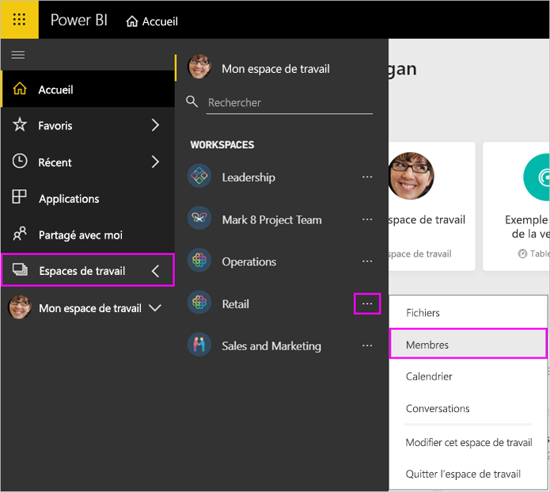

# Gérer l’espace de travail de votre application dans Power BI et Office 365

En tant que créateur ou administrateur d’un [espace de travail d’application dans Power BI](service-create-distribute-apps.md) ou dans Office 365, vous gérez certains aspects de l’espace de travail dans Power BI. Vous en gérez d’autres dans Office 365.

> [!NOTE]
> L’expérience des nouveaux espaces de travail en préversion change la relation entre les espaces de travail Power BI et les groupes Office 365. Vous ne créez plus automatiquement un groupe Office 365 chaque fois que vous créez un nouvel espace de travail. Pour plus d’informations, consultez [Création des nouveaux espaces de travail](service-create-the-new-workspaces.md).

Dans **Power BI**, vous pouvez :

* ajouter ou supprimer des membres d’un espace de travail d’application, ainsi que faire d’un membre d’un espace de travail un administrateur ;
* modifier le nom de l’espace de travail d’application ;
* supprimer l’espace de travail d’application.

Dans **Office 365**, vous pouvez :

* ajouter ou supprimer des membres de groupe de votre espace de travail d’application, notamment faire d’un membre un propriétaire ;
* modifiez le nom, l’image, la description et d’autres paramètres du groupe ;
* afficher l’adresse de messagerie du groupe ;
* supprimer le groupe.

Pour être administrateur ou membre d’un espace de travail d’application, vous devez disposer d’une [licence Power BI Pro](service-features-license-type.md). Les utilisateurs de votre application doivent également posséder une licence Power BI Pro, sauf si votre espace de travail d’application se trouve dans une capacité Power BI Premium. Pour plus de détails, consultez [Qu’est-ce que Power BI Premium ?](service-premium-what-is.md).

## Modifier l’espace de travail de votre application dans Power BI

1. Dans le service Power BI, sélectionnez la flèche située en regard de **Espaces de travail**, puis les points de suspension (…) en regard du nom de votre espace de travail, puis **Modifier cet espace de travail**.

   

   > [!NOTE]
   > Vous voyez l’option **Modifier cet espace de travail** seulement si vous êtes administrateur d’un espace de travail d’application.

1. Vous pouvez ici renommer l’espace de travail, ajouter ou supprimer des membres, ou supprimer l’espace de travail.

   

1. Sélectionnez **Enregistrer** ou **Annuler**.

## Modifier les propriétés d’espace de travail d’application Power BI dans Office 365

Vous pouvez également modifier les aspects d’un espace de travail d’application directement dans Outlook pour Office 365.

### Modifier les membres du groupe d’espaces de travail d’application

1. Dans le service Power BI, sélectionnez la flèche située en regard de **Espaces de travail**, puis les points de suspension (…) en regard du nom de votre espace de travail, puis **Membres**.

   

   Cela a pour effet d’ouvrir l’affichage de groupe Outlook pour Office 365 de l’espace de travail de votre application. Vous devrez peut-être vous connecter à votre compte d’entreprise.

1. Sélectionnez le rôle en regard du nom d’un collègue pour faire de la personne un **Membre** ou un **Propriétaire**. Sélectionnez la croix **X** pour supprimer la personne du groupe.

   

### Ajouter une image et définir d’autres propriétés de l’espace de travail

Quand vous distribuez votre application à partir de l’espace de travail d’application, l’image que vous ajoutez ici est l’image de votre application. Consultez la section [Ajouter une image à votre espace de travail d’application Office 365 (facultatif)](service-create-workspaces.md#add-an-image-to-your-office-365-app-workspace-optional) de l’article **Créer les nouveaux espaces de travail**.

1. Dans la vue Outlook pour Office 365 de votre espace de travail d’application, accédez à l’onglet **À propos de** et sélectionnez **Modifier**.

    
1. Vous pouvez modifier le nom, la description et la langue des notifications liées au groupe. Vous pouvez aussi ajouter une image et définir d’autres propriétés ici.

   

1. Sélectionnez **Enregistrer** ou **Ignorer**.

## Étapes suivantes

* [Publier une application dans Power BI](service-create-distribute-apps.md)

* D’autres questions ? [Posez vos questions à la communauté Power BI](http://community.powerbi.com/)
