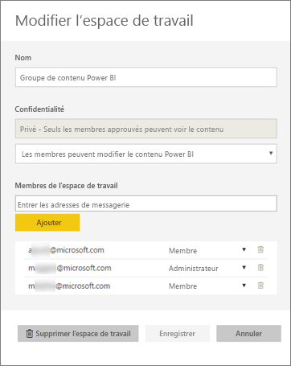
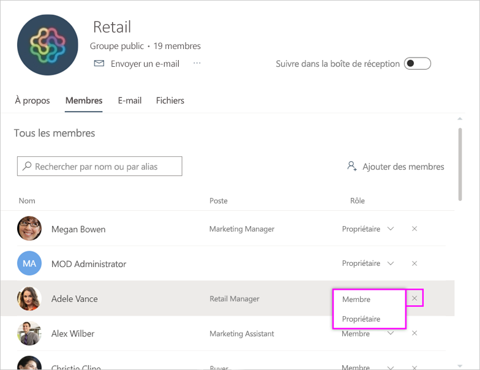
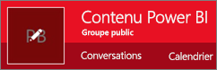
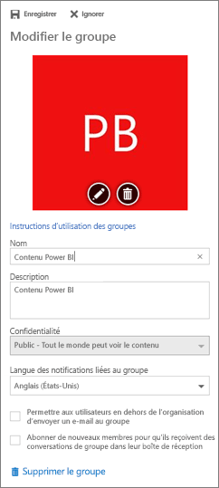

# Gérer l’espace de travail de votre application dans Power BI et Office 365
En tant que créateur ou administrateur d’un [espace de travail d’application dans Power BI](service-install-use-apps.md) ou dans Office 365, vous gérez certains aspects de l’espace de travail dans Power BI. Vous en gérez d’autres dans Office 365. 

**Dans Power BI** , vous pouvez :

* ajouter ou supprimer des membres d’un espace de travail d’application, ainsi que faire d’un membre d’un espace de travail un administrateur ;
* modifier le nom de l’espace de travail d’application ;
* supprimer l’espace de travail d’application.

**Dans Office 365** , vous pouvez :

* ajouter ou supprimer des membres de groupe de votre espace de travail d’application, y compris faire d’un membre un administrateur ;
* modifiez le nom, l’image, la description et d’autres paramètres du groupe ;
* afficher l’adresse de messagerie du groupe ;
* supprimer le groupe.

Pour être administrateur ou membre d’un espace de travail d’application, vous devez posséder une licence [Power BI Pro](service-free-vs-pro.md). Les utilisateurs de votre application doivent également posséder une licence Power BI Pro, sauf si votre espace de travail d’application se trouve dans une capacité Power BI Premium. Pour plus de détails, consultez [Qu’est-ce que Power BI Premium ?](service-premium.md).

## Modifier l’espace de travail de votre application dans Power BI
1. Dans le service Power BI, sélectionnez la flèche située en regard de **Espaces de travail**, puis les points de suspension (**…**) en regard du nom de votre espace de travail, puis **Modifier l’espace de travail**. 
   
   
   
   > [!NOTE]
   > Vous voyez l’option **Modifier l’espace de travail** uniquement si vous êtes un administrateur d’espace de travail d’application.
   > 
   > 
2. Vous pouvez ici ajouter ou supprimer des membres, ainsi que renommer ou supprimer l’espace de travail d’application. 
   
   
3. Sélectionnez **Enregistrer** ou **Annuler**.

## Modifier les propriétés d’espace de travail d’application Power BI dans Office 365
1. Dans le service Power BI, sélectionnez la flèche située en regard de **Espaces de travail**, puis les points de suspension (**…**) en regard du nom de votre espace de travail, puis **Membres**. 
   
   
   
   Cela a pour effet d’ouvrir l’affichage de groupe Outlook pour Office 365 de l’espace de travail de votre application.
   
   Vous devrez peut-être vous connecter à votre compte d’entreprise.
2. Cliquez sur les points de suspension (**…**) en regard du nom d’un membre pour faire de celui-ci un administrateur ou pour le supprimer de l’espace de travail d’application. 
   
   

## Ajouter une image et définir d’autres propriétés d’espace de travail dans le groupe Office 365
Lorsque vous distribuez votre application à partir de l’espace de travail d’application, l’image que vous ajoutez ici sera l’image de votre application. Consultez la section [Ajouter une image à votre application](service-create-distribute-apps.md#add-an-image-to-your-app-optional) de l’article [Créer et distribuer une application dans Power BI](service-create-distribute-apps.md).

1. Dans la vue Outlook pour Office 365 de votre espace de travail d’application, sélectionnez l’image de groupe pour modifier les propriétés de l’espace de travail de groupe.
   
   
2. Vous pouvez modifier le nom, la description et la langue, ajouter une image et définir d’autres propriétés.
   
   
3. Sélectionnez **Enregistrer** ou **Ignorer**.

## Étapes suivantes
* [Que sont les applications dans Power BI ?](service-install-use-apps.md)
* [Créer des applications et des espaces de travail d’application dans Power BI](service-create-distribute-apps.md)
* D’autres questions ? [Posez vos questions à la communauté Power BI](http://community.powerbi.com/)

