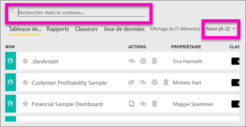
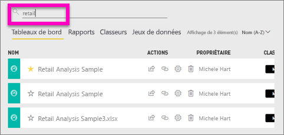
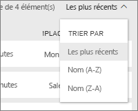
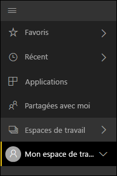
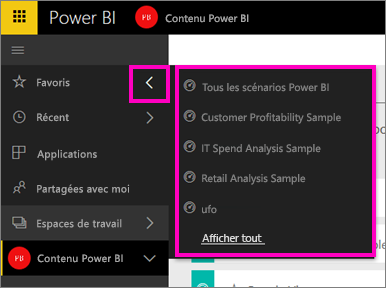

# Navigation : recherche et tri de votre contenu dans le service Power BI
Il existe plusieurs façons de parcourir votre contenu dans le service Power BI. Dans les espaces de travail, le contenu est organisé par type : tableaux de bord, rapports, classeurs et jeux de données.  De plus, le contenu est également organisé par utilisation : favori, récent, application, partagé avec moi et par défaut. Cette organisation du contenu vous permet de trouver rapidement ce dont vous avez besoin dans le service Power BI.  

>[!NOTE] 
>Cet article s’applique au service Power BI (app.powerbi.com), mais pas à Power BI Desktop.

## Navigation dans les espaces de travail

Le service Power BI sépare le contenu des espaces de travail par type : tableaux de bord, rapports, classeurs et jeux de données. Cette organisation est visible lorsque vous sélectionnez un espace de travail. Dans cet exemple, l’espace de travail d’application est nommé « Exemple d’application Ventes et marketing » et contient 2 tableaux de bord, 6 rapports, 1 classeur et 5 jeux de données.

________________________________________

## Recherche et tri dans les espaces de travail
Un espace de travail comporte quatre onglets de contenu : Tableaux de bord, Rapports, Classeurs et Jeux de données.  Chaque onglet contient un champ de recherche et un bouton de tri.  Lorsque vous commencez à utiliser le service Power BI, il se peut que vous ne les trouviez pas utiles, car vous n’avez qu’un ou deux éléments par onglet.  Pourtant, au fil du temps, vous pourriez vous retrouver avec un longue liste de contenus.  Utilisez les fonctions de recherche et le tri pour trouver facilement ce que vous avez besoin.

* Entrez un terme de recherche pour trouver une correspondance dans l’écran actuel.
  
   
* Sélectionnez le bouton de tri afin d’afficher les options pour la page actuelle. Les options sont de trier par nom ou par propriétaire.
  
   

## Navigation avec la barre de navigation gauche
Le volet de navigation gauche classifie votre contenu de manière à accélérer et à faciliter encore davantage la recherche de ce dont vous avez besoin.  

Le contenu que vous créez pour votre propre usage est disponible dans **Mon espace de travail**, celui que vous créez et partagez avec un groupe est disponible dans un **espace de travail d’application**, celui partagé avec vous est disponible dans **Partagé avec moi** et celui que vous avez consulté en dernier est disponible dans **Récents**.

De plus, vous pouvez marquer le contenu comme [favori](service-dashboard-favorite.md) et [par défaut](service-dashboard-featured.md). Choisissez le tableau de bord que vous prévoyez d’afficher le plus souvent et définissez-le comme votre tableau de bord *par défaut*. Chaque fois que vous ouvrez le service Power BI, ce tableau de bord s’affiche en premier. Vous disposez de plusieurs tableaux de bord et applications que vous consultez souvent ? Si vous les définissez en tant que favoris, ils sont toujours disponibles dans votre barre de navigation de gauche.

.

## Considérations et résolution des problèmes
* Pour les jeux de données, l’option **Trier par** n’est pas disponible par propriétaire.

## Étapes suivantes
[Power BI – Concepts de base](service-basic-concepts.md)

D’autres questions ? [Posez vos questions à la communauté Power BI](http://community.powerbi.com/)