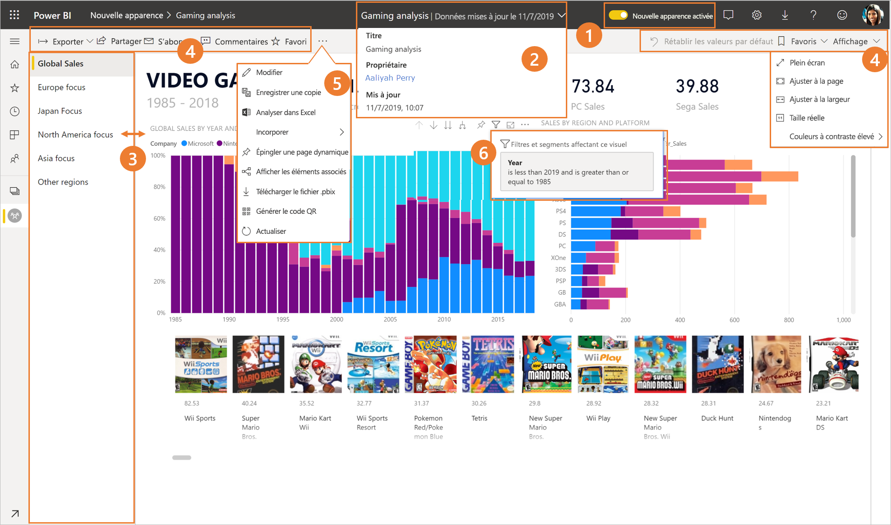
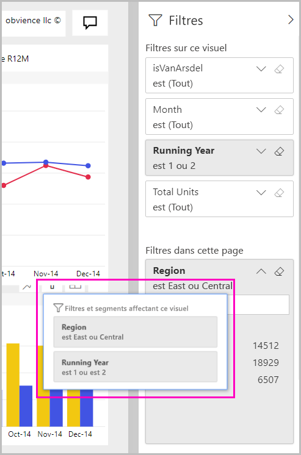

# Nouvelle apparence du service Power BI

Le service Power BI (app.powerbi.com) a une nouvelle apparence qui facilite l’affichage et l’utilisation de vos rapports. La nouvelle présentation est une expérience moderne qui est plus simple et qui s’appuie sur votre connaissance des autres produits Microsoft. Dans le service Power BI, nous avons fait du contenu de rapport le focus principal en optant pour un thème de couleur plus clair et en mettant à jour les icônes. Voici une vue d’ensemble des modifications apportées à la nouvelle présentation. Pour plus d’informations, reportez-vous aux sections numérotées :

## Présentation rapide des modifications

Cette animation illustre les modifications apportées à la présentation des rapports.

## 1. Accepter la nouvelle présentation

Tout utilisateur du service Power BI peut choisir d’accepter la nouvelle présentation. Il suffit de faire glisser le curseur de **Nouvelle apparence désactivée** vers **Nouvelle apparence activée**.

Si vous devez revenir à l’ancienne apparence, il vous suffit de le refaire glisser vers **désactivée** . Si vous ne voyez pas cette option, sélectionnez le menu des points de suspension dans le coin supérieur droit.

## 2. Afficher les détails d’un rapport 

Consultez rapidement les détails tels que la date de la dernière actualisation et les informations de contact, directement dans la bannière supérieure.  Ouvrez le menu pour afficher des détails supplémentaires sur le rapport. Vous pouvez même envoyer un e-mail au propriétaire du rapport.

## 3. Liste verticale de pages 
Les noms des pages de rapport sont désormais répertoriés dans un volet vertical. Ils sont bien visibles, difficiles à manquer, et les parcourir revient à naviguer dans Word et PowerPoint. Vous pouvez augmenter ou diminuer le reste de la zone de rapport en redimensionnant le volet vertical.

## 4. Barre d’action simplifiée 

La barre d’action mise à jour dans la partie supérieure comporte les commandes les plus pertinentes pour les consommateurs de rapports. Il est plus facile d’exporter, de s’abonner, de collaborer avec d’autres utilisateurs et d’examiner plus en détail les filtres et les signets.

## 5. Où se trouvent les commandes de rapport ?

Nous n’avons pas supprimé les fonctionnalités de l’ancienne présentation. Vous trouverez les commandes supplémentaires telles que Modifier, Enregistrer une copie, etc. en développant le menu Points de suspension (...) dans la barre d’action. En outre, vous pouvez accéder aux métriques d’utilisation dans la liste de contenu.

### Où se trouvent les actions du menu Fichier ?

Vous recherchez les actions du menu **Fichier** ? À présent, les actions qui se trouvaient dans le menu **Fichier** figurent également dans le menu Points de suspension (...). 

## 6. Nouvelle expérience de filtre

Les mises à jour récentes telles que l’affichage des filtres appliqués et le nouveau volet des filtres sont disponibles par défaut avec la nouvelle présentation. Même si les concepteurs de rapports n’ont pas procédé à la mise à niveau vers la nouvelle expérience de filtres, le nouveau volet des filtres s’affiche.

## Expérience de la nouvelle présentation du tableau de bord 

Les tableaux de bord possèdent également une barre d’action simplifiée, tout comme les rapports et les applications, pour assurer une expérience cohérente tout en conservant les différences fonctionnelles. Voici une procédure pas à pas des actions dans un tableau de bord.
 

## Aucune modification en mode Édition 

Nous avons maintenu l’expérience de création similaire à celle de Desktop. Les modifications apportées à la nouvelle présentation s’appliquent uniquement au mode Lecture.

## Étapes suivantes

[Power BI pour les consommateurs](consumer/end-user-consumer.md)
