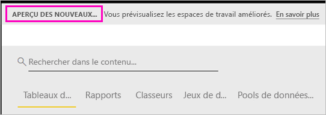

# Organiser le travail dans les nouveaux espaces de travail (préversion) dans Power BI

Les espaces de travail sont des espaces de collaboration qui vous permettent de créer des collections de tableaux de bord et des rapports avec vos collègues. Vous pouvez ensuite regrouper ces collections dans des *applications* et les distribuer dans toute votre organisation ou à des personnes ou groupes spécifiques. Power BI introduit une nouvelle expérience d’espace de travail en préversion. 

Avec la préversion des nouveaux espaces de travail, vous pouvez désormais :

- Affecter des rôles d’espace de travail à des groupes d’utilisateurs : groupes de sécurité, listes de distribution, groupes Office 365 et personnes individuelles.
- Créer un espace de travail dans Power BI sans créer un groupe Office 365.
- Utiliser des rôles d’espace de travail plus granulaires, pour une gestion plus flexible des autorisations dans un espace de travail.

Découvrez-en plus sur la manière de [créer l’un des nouveaux espaces de travail](service-create-the-new-workspaces.md).
 
Quand vous créez un des nouveaux espaces de travail, vous ne créez pas de groupe Office 365 associé sous-jacent. Toute l’administration des espaces de travail se fait dans Power BI et non pas dans Office 365. Vous pouvez toujours ajouter un groupe Office 365 à l’espace de travail pour continuer à gérer l’accès des utilisateurs au contenu via des groupes Office 365. Cependant, vous pouvez en plus utiliser des groupes de sécurité et des listes de distribution, et ajouter des personnes une par une directement dans Power BI, ce qui représente un moyen souple de gérer l’accès à l’espace de travail. L’administration de l’espace de travail se trouvant à présent dans Power BI, ce sont les administrateurs Power BI qui choisissent quels membres de l’organisation peuvent créer des espaces de travail. Dans les **paramètres d’espace de travail** du portail d’administration, les administrateurs peuvent autoriser ou non les membres d’une organisation à créer des espaces de travail. Il peuvent également limiter la création aux membres de groupes de sécurité spécifiques.

Découvrez-en plus sur le [portail d’administration Power BI](service-admin-portal.md).

## Déployer les nouveaux espaces de travail

Pendant la période de la préversion, les espaces de travail anciens et nouveaux peuvent coexister côte à côte, et vous pouvez créer des espaces des deux types. À la fin de la préversion des nouveaux espaces de travail et une fois qu’ils seront en disponibilité générale, les anciens espaces de travail pourront continuer à exister pendant un certain temps. Vous ne pourrez plus en créer et vous devez vous préparer à migrer vos espaces de travail vers l’infrastructure des nouveaux espaces de travail. Ne vous inquiétez pas : vous disposerez de plusieurs mois pour effectuer la migration.

## Rôles dans les nouveaux espaces de travail

Vous ajoutez des groupes d’utilisateurs ou des personnes individuelles aux nouveaux espaces de travail en tant que membres, contributeurs ou administrateurs. Tous les utilisateurs d’un groupe d’utilisateurs reçoivent le rôle que vous avez défini. Si une personne fait partie de plusieurs groupes d’utilisateurs, elle reçoit le niveau d’autorisation le plus élevé fourni par le rôle.

Toutes les personnes que vous ajoutez à un espace de travail doivent avoir une licence Power BI Pro. Dans l’espace de travail, ces utilisateurs peuvent collaborer sur des tableaux de bord et des rapports que vous prévoyez de publier pour un public plus large, ou même pour votre organisation tout entière. Si vous voulez distribuer du contenu à d’autres utilisateurs au sein de votre organisation, vous pouvez leur attribuer des licences Power BI Pro ou placer l’espace de travail dans une capacité Power BI Premium.

Les rôles vous permettent de gérer qui peut faire quoi dans un espace de travail, ce qui permet aux équipes de collaborer. Les nouveaux espaces de travail vous permettent d’affecter des rôles à des personnes individuelles et à des groupes d’utilisateurs : groupes de sécurité, groupes Office 365 et listes de distribution. 

Quand vous affectez des rôles à un groupe d’utilisateurs, les personnes individuelles du groupe ont accès au contenu. Si vous imbriquez des groupes d’utilisateurs, tous les utilisateurs qui en font partie ont les autorisations associées. Un utilisateur qui est dans plusieurs groupes d’utilisateurs ayant des rôles différents reçoit le niveau d’autorisation le plus élevé qui leur est accordé. 

Les nouveaux espaces de travail offrent trois rôles : administrateurs, membres et contributeurs.

**Les administrateurs peuvent :**

- Mettre à jour et supprimer l’espace de travail. 
- Ajouter/supprimer des personnes, y compris d’autres administrateurs.
- Faire tout ce que les membres peuvent faire.

**Les membres peuvent :** 

- Ajouter des membres ou d’autres rôles avec des autorisations inférieures.
- Publier et mettre à jour une application.
- Partager un élément ou une application.
- Permettre à d’autres utilisateurs de repartager des éléments.
- Faire tout ce que les contributeurs peuvent faire.

**Les contributeurs peuvent :** 

- Créer, modifier et supprimer du contenu dans l’espace de travail. 
- Publier des rapports sur l’espace de travail, supprimer du contenu.
- Ils ne peuvent pas donner accès au contenu à de nouvelles personnes. Ils ne peuvent pas partager du nouveau contenu, mais ils peuvent en partager avec une personne avec laquelle l’espace de travail, l’élément ou l’application sont déjà partagés. 
- Ils ne peuvent pas modifier les membres du groupe.
 
Nous créons des flux de travail Demander l’accès dans l’ensemble du service, pour que les utilisateurs qui n’ont pas d’accès puissent le demander. Les flux de travail Demander l’accès existent actuellement pour les tableaux de bord, les rapports et les applications.

## Convertir les anciens espaces de travail en nouveaux espaces de travail

Pendant la période de préversion, vous ne pouvez pas convertir automatiquement vos anciens espaces de travail en nouveaux espaces. Vous pouvez cependant créer un espace de travail et publier votre contenu sur le nouvel emplacement. 

Quand les nouveaux espaces de travail seront en disponibilité générale, vous pourrez choisir de migrer les anciens automatiquement. À un moment donné après la disponibilité générale, vous devrez les migrer.

## En quoi les nouveaux espaces de travail diffèrent-ils des espaces de travail actuels ?

Avec les nouveaux espaces de travail, nous proposons une nouvelle conception de certaines fonctionnalités. Voici les modifications que vous pouvez considérer comme définitives avec la préversion. 

* La création d’espaces de travail ne créera pas d’entités correspondantes dans Office 365, contrairement aux espaces de travail actuels. (Vous pouvez toujours ajouter un groupe Office 365 à votre espace de travail en lui affectant un rôle). 
* Dans les espaces de travail actuels, vous pouvez seulement ajouter des personnes individuelles aux listes de membres et d’administrateurs. Dans les nouveaux espaces de travail, vous pouvez ajouter plusieurs groupes de sécurité Active Directory, des listes de distribution ou des groupes Office 365 à ces listes, ce qui facilite la gestion des utilisateurs. 
- Vous pouvez créer un pack de contenu d’organisation à partir d’un espace de travail actuel. Vous ne pouvez pas en créer un à partir des nouveaux espaces de travail.
- Vous pouvez consommer un pack de contenu d’organisation à partir d’un espace de travail actuel. Vous ne pouvez pas en consommer un à partir des nouveaux espaces de travail.
- Dans la préversion, certaines fonctionnalités ne sont pas encore activées pour les nouveaux espaces de travail. Pour plus d’informations, consultez la section suivante [Fonctionnalités planifiées pour les nouveaux espaces de travail](service-new-workspaces.md#planned-new-workspace-preview-features).

## Considérations et limitations

Limitations à connaître :

- Les espaces de travail peuvent contenir un maximum de 1 000 jeux de données ou 1 000 rapports par jeu de données. 
- Une personne disposant d’une licence Power BI Pro peut être membre de 250 espaces de travail au maximum.

## Fonctionnalités planifiées pour les nouveaux espaces de travail en préversion

Au moment où nous lançons la préversion, nous sommes encore en train de développer d’autres fonctionnalités pour les nouveaux espaces de travail, qui ne sont donc pas encore disponibles :

- Pas de bouton **Quitter l’espace de travail**.
- Les métriques d’utilisation ne sont pas encore prises en charge.
- Fonctionnement de Premium : vous pouvez affecter et créer des espaces de travail dans une capacité Premium, mais pour déplacer un espace de travail entre des capacités, accédez aux paramètres de l’espace de travail.
- L’incorporation de composants WebPart de SharePoint n’est pas encore prise en charge.
- Pas de bouton **OneDrive** pour les groupes Office 365 dans Obtenir des données/Fichiers.

## Fonctionnalités d’espace de travail fonctionnant différemment

Certaines fonctionnalités agissent différemment dans les nouveaux espaces de travail. Ces différences sont intentionnelles et basées sur le feedback que nous avons reçu des clients. Elles permettent une approche plus souple de la collaboration avec des espaces de travail :

- Les membres peuvent ou non repartager : remplacé par le rôle Contributeur
- Espaces de travail en lecture seule : au lieu d’accorder aux utilisateurs un accès en lecture seule à un espace de travail, vous affecterez les utilisateurs à un rôle Visiteur prochainement disponible, qui permet un accès en lecture seule similaire au contenu dans un espace de travail.

## Problèmes connus

Comme il s’agit d’une fonctionnalité en préversion, elle est soumise à certaines limitations que vous devez connaître. Les problèmes suivants sont connus et des correctifs sont en cours de développement :

- Les utilisateurs ou les groupes d’utilisateurs gratuits ajoutés comme destinataires des abonnements aux e-mails peuvent ne pas recevoir des e-mails qui devraient leur être envoyés. Le problème se produit quand l’un des nouveaux espaces de travail se fait dans une capacité Premium, mais que l’espace Mon espace de travail de l’utilisateur qui crée l’abonnement n’est pas dans une capacité Premium. Si l’espace Mon espace de travail est dans une capacité Premium, les utilisateurs et les groupes d’utilisateurs gratuits reçoivent bien les e-mails.
- Après le déplacement d’un espace de travail d’une capacité Premium vers une capacité partagée, les utilisateurs et les groupes d’utilisateurs gratuits continuent parfois de recevoir des e-mails qu’ils ne devraient pas recevoir. Le problème se produit quand l’espace Mon espace de travail de l’utilisateur qui crée l’abonnement est dans une capacité Premium.

## Étapes suivantes
* [Créer les nouveaux espaces de travail (préversion) dans Power BI](service-create-the-new-workspaces.md)
* [Créer les espaces de travail actuels](service-create-workspaces.md)
* [Installer et utiliser des applications dans Power BI](service-create-distribute-apps.md)
* Vous avez des questions ? [Essayez d’interroger la communauté Power BI](http://community.powerbi.com/)
