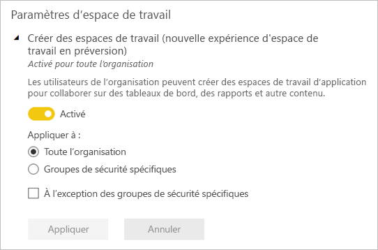

# Organiser le travail dans les nouveaux espaces de travail dans Power BI

 Les *espaces de travail* sont des espaces de collaboration qui vous permettent de créer des collections de tableaux de bord, de rapports et de rapports paginés avec vos collègues. La nouvelle expérience de l’espace de travail vous permet de mieux gérer l’accès au contenu. Cet article décrit les nouveaux espaces de travail, et en quoi ils diffèrent des espaces de travail classiques.  Comme avec les espaces de travail classiques, vous les utilisez pour créer et distribuer des applications. Découvrez-en plus sur la manière de [créer une nouvelle expérience d’espace de travail](service-create-the-new-workspaces.md).

La nouvelle expérience d’espace de travail est désormais en disponibilité générale (GA) et constitue désormais l’espace de travail par défaut. Vous pouvez toujours créer et utiliser des [espaces de travail classiques](service-create-workspaces.md) basés sur des groupes Office 365. 

> [!NOTE]
> Pour appliquer la sécurité au niveau des lignes (RLS) pour les utilisateurs qui parcourent le contenu dans un espace de travail, utilisez le rôle Lecteur. Pour appliquer la sécurité au niveau des lignes sans donner accès à l’espace de travail, publiez une application Power BI pour ces utilisateurs ou utilisez le partage pour distribuer le contenu.

Avec les nouveaux espaces de travail, vous pouvez :

- Affecter des rôles d’espace de travail à des groupes d’utilisateurs : groupes de sécurité, listes de distribution, groupes Office 365 et personnes individuelles.
- Créer un espace de travail dans Power BI sans créer un groupe Office 365.
- Utiliser des rôles d’espace de travail plus granulaires, pour une gestion plus flexible des autorisations dans un espace de travail.
- L’administrateur Power BI peut contrôler qui peut créer des espaces de travail dans Power BI.

Quand vous créez un des nouveaux espaces de travail, vous ne créez pas de groupe Office 365 associé sous-jacent. Toute l’administration des espaces de travail se fait dans Power BI et non pas dans Office 365. Dans la nouvelle expérience d’espace de travail, vous pouvez ajouter un groupe Office 365 à la liste d’accès de l’espace de travail pour continuer à gérer l’accès des utilisateurs au contenu via des groupes Office 365.

## Gérer des espaces de travail (nouvelle expérience d’espace de travail)
L’administration de la nouvelle expérience d’espace de travail se trouve à présent dans Power BI, les administrateurs Power BI choisissent quels membres de l’organisation peuvent créer des espaces de travail. Ils peuvent également gérer et récupérer des espaces de travail à l’aide du portail d’administration Power BI ou des applets de commande PowerShell. Pour les espaces de travail classiques basés sur les groupes Office 365, l’administration continue à se produire dans le portail d’administration Office 365 et Azure Active Directory.

Dans **Paramètres de l’espace de travail** dans le portail d’administration, les administrateurs peuvent utiliser le paramètre Créer des espaces de travail (nouvelle expérience d’espace de travail) pour autoriser tout le monde ou personne au sein d’une organisation à créer des espaces de travail de la nouvelle expérience d’espace de travail. Il peuvent également limiter la création aux membres de groupes de sécurité spécifiques.

> [!NOTE]
> Par défaut, le paramètre Créer des espaces de travail (nouvelle expérience d’espace de travail) est défini pour autoriser uniquement les utilisateurs pouvant créer des groupes Office 365 à créer de nouveaux espaces de travail dans Power BI. Veillez à définir une valeur dans le portail d’administration Power BI pour garantir que les utilisateurs appropriés peuvent créer des espaces de travail de la nouvelle expérience d’espace de travail.

La [liste des espaces de travail est disponible](service-admin-portal.md#workspaces) dans le portail d’administration Power BI. 

## Nouveaux espaces de travail côte à côte avec les espaces de travail classiques

Les nouveaux espaces de travail mis à niveau et les espaces de travail classiques coexistent, et vous pouvez créer l’un ou l’autre type. La nouvelle expérience d’espace de travail est le type d’espace de travail par défaut. Power BI continue à répertorier tous les groupes Office 365 dont l’utilisateur est membre dans Power BI pour éviter de modifier les flux de travail existants. Pour savoir comment créer un nouvel espace de travail, lisez [Créer de nouveaux espaces de travail](service-create-the-new-workspaces.md). Pour savoir comment créer un espace de travail classique, lisez [Créer des espaces de travail classiques](service-create-workspaces.md).

## Rôles dans les nouveaux espaces de travail

Pour accorder l’accès à un nouvel espace de travail, ajoutez des groupes d’utilisateurs ou des individus à l’un des rôles de l’espace de travail : lecteurs, membres, collaborateurs ou administrateurs. Tous les utilisateurs d’un groupe d’utilisateurs reçoivent le rôle que vous avez défini. Si une personne fait partie de plusieurs groupes d’utilisateurs, elle reçoit le niveau d’autorisation le plus élevé fourni par les rôles qui lui sont attribués.

Les rôles vous permettent de gérer qui peut faire quoi dans un espace de travail, ce qui permet aux équipes de collaborer. Les nouveaux espaces de travail vous permettent d’affecter des rôles à des personnes individuelles et à des groupes d’utilisateurs : groupes de sécurité, groupes Office 365 et listes de distribution. 

Quand vous affectez des rôles à un groupe d’utilisateurs, les personnes individuelles du groupe ont accès au contenu. Si vous imbriquez des groupes d’utilisateurs, tous les utilisateurs qui en font partie ont les autorisations associées.

Voici les quatre rôles : administrateurs, membres, contributeurs et lecteurs. Toutes ces fonctionnalités, à l’exception de la dernière, nécessitent une licence Power BI Pro.

|Fonctionnalité   | Administrateur  | Membre  | Contributeur  | Lecteur |
|---|---|---|---|---|
| Mettre à jour et supprimer l’espace de travail.  | X  |   |   |   | 
| Ajouter/supprimer des personnes, y compris d’autres administrateurs.  | X  |   |   |   |
| Ajouter des membres ou d’autres rôles avec des autorisations inférieures.  |  X | X  |   |   |
| Publier et mettre à jour une application. |  X | X  |   |   |
| Partager un élément ou une application. |  X | X  |   |   |
| Permettre à d’autres utilisateurs de repartager des éléments. |  X | X  |   |   |
| Créer, modifier et supprimer du contenu dans l’espace de travail.  |  X | X  | X  |   |
| Publier des rapports sur l’espace de travail, supprimer du contenu.  |  X | X  | X  |   |
| Créer un rapport dans un autre espace de travail à partir d’un jeu de données de cet espace de travail. |  X | X  | X  |   |
| Copier un rapport. | X | X | X |  |
| Voir et utiliser un élément. |  X | X  | X  | X  |

> [!NOTE]
>Pour copier un rapport, et créer un rapport dans un autre espace de travail à partir d’un jeu de données de cet espace de travail, les utilisateurs doivent remplir quelques exigences supplémentaires :
>- Ils doivent avoir une licence Power BI Pro. Voir la section suivante, [Gestion des licences](#licensing), pour plus de détails.
>- Ils doivent avoir l’autorisation Générer pour le jeu de données. Pour les jeux de données de cet espace de travail, les utilisateurs ayant un rôle d’administrateur, de membre ou de contributeur héritent l’autorisation Générer de leur rôle dans l’espace de travail.
 
## Licensing
Toutes les personnes que vous ajoutez à un espace de travail dans la capacité partagée doivent avoir une licence Power BI Pro. Dans l’espace de travail, ces utilisateurs peuvent collaborer sur des tableaux de bord et des rapports que vous prévoyez de publier pour un public plus large, ou même pour votre organisation tout entière. 

Si vous voulez distribuer du contenu à d’autres utilisateurs au sein de votre organisation, vous pouvez leur attribuer des licences Power BI Pro ou placer l’espace de travail dans une capacité Power BI Premium.

Lorsque l’espace de travail se trouve dans une capacité Power BI Premium, les utilisateurs avec le rôle Lecteur peuvent accéder l’espace de travail même s’ils n’ont pas de licence Power BI Pro. Toutefois, si vous attribuez à ces utilisateurs un rôle supérieur comme Administrateur, Membre ou Contributeur, ils seront invités à lancer la version d’essai de Power BI Pro pour accéder à l’espace de travail. Pour tirer parti du rôle Lecteur pour les utilisateurs sans licences Pro, vérifiez que les utilisateurs avec le rôle Lecteur n’ont pas d’autres rôles dans l’espace de travail, individuellement ou via un groupe d’utilisateurs. 

> [!NOTE]
> La publication de rapports dans la nouvelle expérience d’espace de travail est soumise à une application plus stricte des règles de gestion des licences existantes. Les utilisateurs qui tentent de publier à partir de Power BI Desktop ou d’autres outils clients sans licence Pro voient l’erreur « Seuls les utilisateurs avec des licences Power BI Pro peuvent publier sur cet espace de travail ».

## Différences entre les anciens et les nouveaux espaces de travail

Dans les nouveaux espaces de travail, certaines fonctionnalités ont été repensées. Voici les modifications que vous pouvez considérer comme définitives. 

* La création de ces espaces de travail ne crée pas de groupes Office 365 comme le font les espaces de travail classiques. Toutefois, vous pouvez maintenant utiliser un groupe Office 365 pour donner aux utilisateurs l’accès à votre espace de travail en lui attribuant un rôle. 
* Dans les espaces de travail classiques, vous pouvez seulement ajouter des personnes individuelles aux listes de membres et d’administrateurs. Dans les nouveaux espaces de travail, vous pouvez ajouter plusieurs groupes de sécurité Active Directory, des listes de distribution ou des groupes Office 365 à ces listes, ce qui facilite la gestion des utilisateurs. 
- Vous pouvez créer un pack de contenu d’organisation à partir d’un espace de travail classique. Vous ne pouvez pas en créer un à partir des nouveaux espaces de travail.
- Vous pouvez consommer un pack de contenu d’organisation à partir d’un espace de travail classique. Vous ne pouvez pas en consommer un à partir des nouveaux espaces de travail.

## Liste de contacts de l’espace de travail
La nouvelle fonctionnalité **Liste de contacts** vous permet de spécifier les utilisateurs qui reçoivent une notification concernant les problèmes qui se produisent dans l’espace de travail. Par défaut, tout utilisateur ou groupe spécifié comme administrateur de l’espace de travail est averti, mais vous pouvez personnaliser la liste. Les utilisateurs ou groupes répertoriés dans la liste de contacts seront affichés dans l’interface utilisateur (IU) pour aider les utilisateurs à obtenir de l’aide concernant l’espace de travail. 

En savoir plus sur la [définition de la liste de contacts de l’espace de travail](service-create-the-new-workspaces.md#workspace-contact-list).

## OneDrive de l’espace de travail
La fonctionnalité OneDrive de l’espace de travail vous permet de configurer un groupe Office 365 dont le stockage fichier de la bibliothèque de documents SharePoint est disponible pour les utilisateurs de l’espace de travail. Le groupe doit être créé en dehors de Power BI. 

Power BI ne synchronise pas les autorisations des utilisateurs ou des groupes qui sont configurés pour avoir accès à l’espace de travail avec l’appartenance au groupe Office 365. La meilleure pratique consiste à gérer l’accès à l’espace de travail via le même groupe Office 365 dont vous configurez le stockage de fichiers dans ce paramètre. 

En savoir plus sur comment [définir et accéder à OneDrive de l’espace de travail](service-create-the-new-workspaces.md#workspace-onedrive).  
   
## Audit
Les activités suivantes sont auditées par Power BI pour les espaces de travail de la nouvelle expérience de l’espace de travail.

| Nom convivial |   Nom de l’opération |
|---|---|
| Dossier Power BI créé | CreateFolder |
| Dossier Power BI supprimé | DeleteFolder |
| Dossier Power BI mis à jour | UpdateFolder |
| Accès au dossier Power BI mis à jour| UpdateFolderAccess |

En savoir plus sur [l’audit Power BI](service-admin-auditing.md#activities-audited-by-power-bi).

## Considérations et limitations

Limitations à connaître :

- Les espaces de travail peuvent contenir un maximum de 1 000 jeux de données ou 1 000 rapports par jeu de données. 
- Une personne disposant d’une licence Power BI Pro peut être membre de 1 000 espaces de travail au maximum.
- Power BI Publisher pour Excel n’est pas pris en charge.

## Fonctionnalités d’espace de travail fonctionnant différemment

Certaines fonctionnalités agissent différemment dans les nouveaux espaces de travail. Ces différences sont intentionnelles et basées sur le feedback que nous avons reçu des clients. Elles permettent une approche plus souple de la collaboration avec des espaces de travail :

- Application de la gestion des licences : La publication de rapports dans la nouvelle expérience de l’espace de travail applique les règles de gestion des licences existantes qui nécessitent une licence Power BI Pro pour les utilisateurs collaborant dans les espaces de travail ou partageant du contenu avec d’autres personnes dans le service Power BI. Les utilisateurs sans licence Pro voient l’erreur « Seuls les utilisateurs avec des licences Power BI Pro peuvent publier sur cet espace de travail ».
- Les membres peuvent ou non repartager : remplacé par le rôle Contributeur
- Espaces de travail en lecture seule : Au lieu d’accorder aux utilisateurs un accès en lecture seule à un espace de travail, attribuez aux utilisateurs le rôle Lecteur, qui permet un accès en lecture seule similaire au contenu dans un espace de travail.
- Les utilisateurs avec une licence Pro peuvent accéder à l’espace de travail si celui-ci se trouve dans une capacité Power BI Premium, même si les utilisateurs n’ont que le rôle Lecteur.
- Pour permettre aux utilisateurs avec le rôle Lecteur d’exporter des données, vérifiez qu’ils ont l’autorisation Générer sur les jeux de données dans l’espace de travail. Découvrez plus en détail l’[autorisation de génération pour les jeux de données](service-datasets-build-permissions.md).
- Pas de bouton **Quitter l’espace de travail**.

## Forum Aux Questions

**Les liens vers le contenu existant sont-ils affectés par la nouvelle expérience de l’espace de travail en disponibilité générale**

Non. Les liens vers des éléments existants dans les espaces de travail classiques ne sont pas affectés par la nouvelle expérience de l’espace de travail. La disponibilité générale (GA) de la nouvelle expérience de l’espace de modifie change l’espace de travail par défaut que vous créez, mais ne modifie pas les espaces de travail existants. 

**Les espaces de travail existants sont-ils mis à niveau vers la nouvelle expérience de l’espace de travail avec la disponibilité générale**

Non. La disponibilité générale de la nouvelle expérience de l’espace de travail remplace uniquement le type d’espace de travail par défaut par la nouvelle expérience de l’espace de travail. Les espaces de travail classiques existants basés sur des groupes Office 365 restent inchangés.

**Les espaces de travail sont-ils toujours créés automatiquement pour les groupes Office 365**

Oui. Étant donné que nous prenons en charge les deux types d’espaces de travail côte à côte, nous continuons à répertorier tous les groupes Office 365 auxquels l’utilisateur a accès dans la liste des espaces de travail.

## Étapes suivantes
* [Créer les nouveaux espaces de travail dans Power BI](service-create-the-new-workspaces.md)
* [Créer les espaces de travail classiques](service-create-workspaces.md)
* [Installer et utiliser des applications dans Power BI](service-create-distribute-apps.md)
* Vous avez des questions ? [Essayez d’interroger la communauté Power BI](http://community.powerbi.com/)
