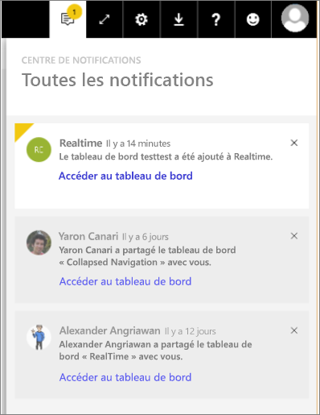

# Notifications Power BI
Le centre de notifications est un flux séquentiel d’informations sur votre expérience Power BI. Ouvrez-le pour voir les messages sur les nouveaux tableaux de bord partagés avec vous, les modifications apportées à votre espace de groupe, les informations sur les événements et réunions Power BI, les alertes que vous avez définies, et bien plus encore. Vous pouvez [définir des alertes dans le service Power BI](service-set-data-alerts.md), ainsi que dans les applications mobiles Power BI.

Regardez Amanda passer en revue les notifications qu’elle a reçues, les gérer et y répondre. Suivez ensuite les instructions sous la vidéo pour essayer par vous-même.

<iframe width="560" height="315" src="https://www.youtube.com/embed/bZMSv5KAlcE" frameborder="0" allowfullscreen></iframe>

1. Quand vous vous connectez à Power BI, les nouvelles notifications qui ont été envoyées hors ligne sont ajoutées à votre flux. En l’absence de nouvelles notifications, Power BI affiche une bulle jaune avec le nombre de nouveaux éléments.
   
   
2. Dans la barre de menus Power BI, sélectionnez l’icône Notifications.
   
   
3. Les notifications sont affichées avec les plus récentes en haut et les messages non lus en surbrillance. Elles sont conservées pendant 90 jours, sauf si vous les supprimez plus tôt ou atteignez la limite maximale de 100.
   
   
4. Pour faire disparaître une notification, sélectionnez l’icône X.

### Étapes suivantes
* [Alertes de données dans le service Power BI](service-set-data-alerts.md)
* [Créer un flux Microsoft Flow déclenché par une alerte de données Power BI](service-flow-integration.md)
* [Définir des alertes de données dans l’application iPhone (Power BI pour iOS)](mobile-set-data-alerts-in-the-mobile-apps.md)
* [Définir des alertes dans l’application mobile Power BI pour Windows 10](mobile-set-data-alerts-in-the-mobile-apps.md)
* D’autres questions ? [Posez vos questions à la communauté Power BI](http://community.powerbi.com/)

