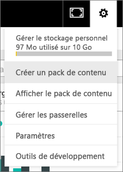
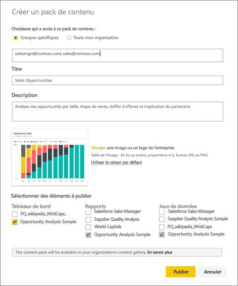
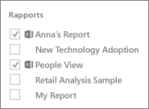
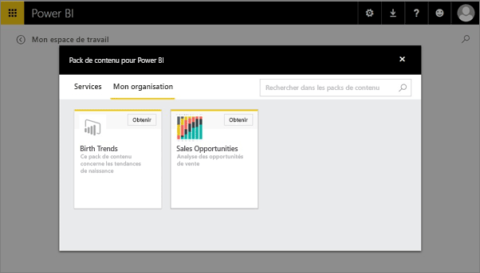

# Créer et publier un pack de contenu d’organisation Power BI (tutoriel)
> [!NOTE]
> Avez-vous déjà entendu parler des nouvelles *applications*? Les applications sont la nouvelle méthode pour distribuer du contenu à un large public dans Power BI. Nous recommandons d’utiliser des applications plutôt que des packs de contenu d’organisation ou des espaces de travail en lecture seule. En savoir [plus sur les applications](service-install-use-apps.md).
> 
> 

Dans ce didacticiel, vous allez créer un pack de contenu d’organisation, en donner l’accès à un groupe spécifique et le publier dans la bibliothèque de packs de contenu de votre organisation sur Power BI.

La création de packs de contenu est différente du partage de tableaux de bord ou de la collaboration sur ces derniers dans un groupe. Pour déterminer l’option la plus adaptée à votre situation, consultez [Comment partager des tableaux de bord, rapports et vignettes ?](service-how-to-collaborate-distribute-dashboards-reports.md).

> [!NOTE]
> Pour créer un pack de contenu d’organisation, vos collègues et vous devez avoir un [compte Power BI Pro](https://powerbi.microsoft.com/pricing).
> 
> 

Supposons que vous êtes responsable de la mise en production chez Contoso et que vous préparez le lancement d’un nouveau produit.  Vous avez créé un tableau de bord avec des rapports que vous aimeriez partager avec vos collègues qui travaillent sur le lancement. Vous voulez regrouper les tableaux de bord et les rapports dans une solution que vos collègues peuvent utiliser. 

Comment procéder ? Dans le [service Power BI](https://powerbi.com), accédez à **Obtenir des données > Exemples > Exemple Analyse des opportunités** > **Se connecter** pour obtenir votre propre copie. 

1. Dans le volet de navigation de gauche, sélectionnez le tableau de bord **Exemple Analyse des opportunités** .
2. Dans la barre de navigation supérieure, sélectionnez l’icône d’engrenage  > **Créer un pack de contenu**.    
   
3. Dans la fenêtre **Créer un pack de contenu** , entrez les informations suivantes.  
   
   N’oubliez pas que la bibliothèque de packs de contenu de votre organisation peut contenir plusieurs centaines de packs de contenu publiés pour l’organisation ou des groupes. Prenez le temps de donner un nom explicite à votre pack de contenu, d’ajouter une description utile et de sélectionner le public adéquat.  Utilisez des mots qui faciliteront la recherche de votre pack de contenu.
   
   1.  Sélectionnez **Groupes spécifiques**, puis entrez les adresses e-mail complètes de chaque membre, des [groupes Office 365](https://support.office.com/article/Create-a-group-in-Office-365-7124dc4c-1de9-40d4-b096-e8add19209e9), des groupes de distribution ou des groupes de sécurité. Par exemple :
      
         salesmgrs@contoso.com; sales@contoso.com
      
      Pour ce didacticiel, essayez d’utiliser votre propre adresse e-mail ou celle de votre groupe.
   
   2.  Nommez le pack de contenu **Opportunités de ventes**.
   
      > [!TIP]
      > Envisagez d’inclure le nom du tableau de bord dans le nom du pack de contenu. De cette manière, vos collègues trouveront le tableau de bord plus facilement une fois connectés à votre pack de contenu.
      > 
      > 
   
   3.  Il est recommandé d’ajouter une **description**. Ainsi, vos collègues pourront trouver plus facilement les packs de contenu dont ils ont besoin. Outre la description, ajoutez des mots clés que vos collègues pourront utiliser pour trouver le pack de contenu. Ajoutez vos informations de contact au cas où vos collègues auraient des questions ou besoin d’aide.
   
   4.  **Téléchargez une image ou un logo** pour permettre aux membres du groupe de trouver plus facilement le pack de contenu. Il est plus facile de repérer une image que du texte. Nous avons utilisé une image de la vignette d’histogramme empilé 100 % « Opportunity Count » (Nombre d’opportunités) dans la capture d’écran ci-dessous.
   
   5.  Sélectionnez le tableau de bord **Exemple Analyse des opportunités** pour l’ajouter au pack de contenu.  Power BI ajoute automatiquement le rapport et le jeu de données associés. Vous pouvez en ajouter d’autres, si vous le souhaitez.
   
      > [!NOTE]
      >  Seuls les tableaux de bord, rapports, jeux de données et classeurs que vous pouvez modifier sont répertoriés. Par conséquent, ceux qui sont partagés avec vous ne sont pas dans la liste.
      > 
      > 
   
       
   
   6. Si vous avez des classeurs Excel, ils s’affichent sous Rapports, avec une icône Excel. Vous pouvez les ajouter également au pack de contenu.
   
     
   
      > [!NOTE]
      > Si des membres du groupe ne peuvent pas afficher le classeur Excel, vous devrez peut-être [partager le classeur avec eux dans OneDrive Entreprise](https://support.office.com/en-us/article/Share-documents-or-folders-in-Office-365-1fe37332-0f9a-4719-970e-d2578da4941c).
      > 
      > 
4. Sélectionnez **Publier** pour ajouter le pack de contenu à la bibliothèque de packs de contenu d’organisation du groupe.  
   
   Un message de confirmation s’affichera si la publication s’est correctement déroulée. 
5. Quand les membres de votre groupe accèdent à **Obtenir des données > Mon organisation**, ils cliquent dans la zone de recherche et tapent « Opportunités de ventes ».
   
    
6. Ils voient votre pack de contenu.  
    
   
   > [!TIP]
   > L’URL qui s’affiche dans votre navigateur est l’adresse unique de ce pack de contenu.  Vous voulez informer vos collègues de la disponibilité de ce nouveau pack de contenu ?  Collez l’URL dans un message électronique.
   > 
   > 
7. Ils peuvent sélectionner **Se connecter** pour être en mesure de [voir et utiliser votre pack de contenu](service-organizational-content-pack-copy-refresh-access.md). 

### Étapes suivantes
* [Présentation des packs de contenu d’organisation](service-organizational-content-pack-introduction.md)  
* [Gérer, mettre à jour et supprimer des packs de contenu d’organisation](service-organizational-content-pack-manage-update-delete.md)  
* [Créer un groupe dans Power BI](service-create-distribute-apps.md)  
* [Qu’est-ce que OneDrive Entreprise ?](https://support.office.com/en-us/article/What-is-OneDrive-for-Business-187f90af-056f-47c0-9656-cc0ddca7fdc2)
* D’autres questions ? [Posez vos questions à la communauté Power BI](http://community.powerbi.com/)

