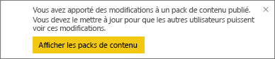
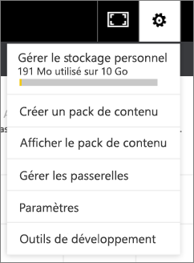

# Gérer, mettre à jour et supprimer des packs de contenu d’organisation
> [!NOTE]
> Vous ne pouvez pas créer des packs de contenu d’organisation ou les installer dans les expériences des nouveaux espaces de travail en préversion. C’est donc le bon moment pour mettre à niveau vos packs de contenu vers des applications, si vous n’avez pas encore commencé à le faire. Découvrez plus d’informations sur [l’expérience des nouveaux espaces de travail](service-create-the-new-workspaces.md).
> 

Vous pouvez faire des packages de vos tableaux de bord, rapports, classeurs Excel et jeux de données, et les partager avec vos collègues dans des [packs de contenu d’organisation](service-organizational-content-pack-introduction.md). Vos collègues peuvent les utiliser en tant que tels, ou ils peuvent créer leurs propres copies.

La création de packs de contenu est différente du partage de tableaux de bord ou de la collaboration sur ces derniers dans un groupe. Pour déterminer l’option la plus adaptée à votre situation, consultez [Comment partager des tableaux de bord, rapports et vignettes ?](service-how-to-collaborate-distribute-dashboards-reports.md).

Vous pouvez uniquement effectuer les tâches du pack de contenu d’organisation suivantes si vous êtes son créateur :

* republier ;
* restreindre ou étendre l’accès au pack de contenu ;
* définir et modifier l’actualisation planifiée ;
* supprimer le pack de contenu.

## Modifier et republier un pack de contenu d’organisation
Si vous apportez des modifications à un tableau de bord, rapport ou classeur Excel du pack de contenu d’origine, Power BI vous invite à le republier. En outre, en tant que créateur du pack de contenu, vous pourrez mettre à jour les options que vous avez sélectionnées depuis la fenêtre Créer un pack de contenu lors de la création du pack de contenu d’origine. 

## Republier un pack avec du nouveau contenu
Quand vous apportez une modification au tableau de bord que vous avez inclus dans un pack de contenu, puis que vous enregistrez cette modification, Power BI vous rappelle de le mettre à jour pour que les autres utilisateurs puissent voir les modifications. Par exemple, vous pouvez épingler une nouvelle vignette ou seulement changer le nom du tableau de bord.

1. Sélectionnez **Afficher les packs de contenu** dans le message.
   
   
2. Vous pouvez aussi sélectionner l’icône représentant une roue dentée dans le coin supérieur droit  et sélectionner **Afficher le pack de contenu**.
   
   
   
   Remarquez l’icône d’avertissement .  Ceci vous indique que vous avez modifié le pack de contenu et qu’il ne correspond plus à ce qui vous avez publié.
3. Sélectionnez **Modifier**.  
4. Apportez les modifications nécessaires dans la fenêtre **Mettre à jour le pack de contenu** , puis sélectionnez **Mettre à jour**. Un message **Réussite** s’affiche.
   
   * Pour les membres du groupe qui n’ont pas personnalisé le pack de contenu, la mise à jour est automatiquement appliquée.
   * Les membres du groupe qui ont personnalisé le pack de contenu reçoivent une notification indiquant la disponibilité d’une nouvelle version.  Ils peuvent accéder à AppSource et obtenir le pack de contenu mis à jour sans perdre leur version personnalisée.  Ils ont alors deux versions : la version personnalisée et le pack de contenu mis à jour.  Dans la version personnalisée, toutes les mosaïques du pack de contenu d’origine auront disparu.  Toutefois, les vignettes épinglées provenant d’autres rapports seront toujours affichées. Cependant, si le propriétaire du pack de contenu supprime le jeu de données sur lequel le pack est basé, tout le rapport sera supprimé.  

## Modifier le public : développer ou restreindre l’accès
Les créateurs de packs de contenu peuvent désormais développer ou restreindre l’accès aux packs de contenu.  Par exemple, vous avez publié un pack de contenu pour un public large et vous venez de décider d’en restreindre l’accès à un groupe moins large.  

1. Sélectionnez l’icône représentant une roue dentée , puis choisissez **Afficher les packs de contenu**.
2. Sélectionnez **Modifier**. 
3. Apportez les modifications nécessaires dans la fenêtre **Mettre à jour le pack de contenu** , puis sélectionnez **Mettre à jour**. Par exemple, supprimez le groupe de distribution d’origine dans le champ **Groupes spécifiques** et remplacez-le par un autre groupe de distribution (qui contient moins de membres).
   
   Un message de réussite s’affiche.
   
   Pour tout collègue ne faisant pas partie du nouvel alias :
   
   * Pour les membres du groupe qui n’ont pas personnalisé le pack de contenu, le tableau de bord et les rapports associés à ce pack de contenu ne sont plus disponibles et le pack de contenu n’apparaît pas dans le volet de navigation.
   * Pour les membres du groupe qui ont personnalisé le pack de contenu, à la prochaine ouverture du tableau de bord personnalisé, toutes les vignettes du pack de contenu d’origine auront disparu.  Toutefois, les vignettes épinglées provenant d’autres rapports seront toujours affichées. Les rapports et le jeu de données associés au pack de contenu d’origine ne sont plus disponibles et le pack de contenu n’apparaît pas dans le volet de navigation.   

## Actualiser un pack de contenu d’organisation
En tant que créateur de packs de contenu, vous pouvez [planifier l’actualisation des jeux de données](refresh-data.md).  Quand vous créez et chargez le pack de contenu, la planification d’actualisation est chargée avec les jeux de données. Si vous modifiez la planification de l’actualisation, vous devez republier le pack de contenu (voir ci-dessus).

## Supprimer un pack de contenu d’organisation d’AppSource
Vous pouvez uniquement supprimer un pack de contenu à partir d’AppSource si vous l’avez créé. Si vous avez créé un pack de contenu d’organisation dans un espace de travail d’application et que vous décidez ensuite de supprimer cet espace de travail, veillez à supprimer d’abord le pack de contenu. Si vous supprimez l’espace de travail sans supprimer d’abord le pack de contenu, vous perdez tout accès à ces packs de contenu et vous devrez contacter le support technique de Microsoft pour obtenir de l’aide. 

> [!TIP]
> Vous pouvez [supprimer votre connexion à un pack de contenu](service-organizational-content-pack-disconnect.md) que vous n’avez pas créé. Cela n’a pas pour effet de supprimer le pack de contenu d’AppSource.
> 
> 

1. Pour supprimer un pack de contenu d’AppSource, accédez à l’espace de travail d’application où vous avez créé le pack de contenu, sélectionnez l’icône représentant une roue dentée , puis **Afficher les packs de contenu**.
2. Sélectionnez **Supprimer \> Supprimer**. 
   
   * Pour les membres du groupe qui n’ont pas personnalisé le pack de contenu, le tableau de bord et les rapports associés à ce pack de contenu sont automatiquement supprimés. Ils ne sont plus disponibles et le pack de contenu n’apparaît pas dans le volet de navigation.
   * Pour les membres du groupe qui ont personnalisé le pack de contenu, à la prochaine ouverture du tableau de bord personnalisé, toutes les vignettes du pack de contenu d’origine auront disparu.  Toutefois, les vignettes épinglées provenant d’autres rapports seront toujours affichées. Les rapports et le jeu de données associés au pack de contenu d’origine ne sont plus disponibles et le pack de contenu n’apparaît pas dans le volet de navigation.   

## Étapes suivantes
* [Introduction aux packs de contenu d’organisation](service-organizational-content-pack-introduction.md)
* [Créer et distribuer une application dans Power BI](service-create-distribute-apps.md) 
* D’autres questions ? [Posez vos questions à la communauté Power BI](http://community.powerbi.com/)

