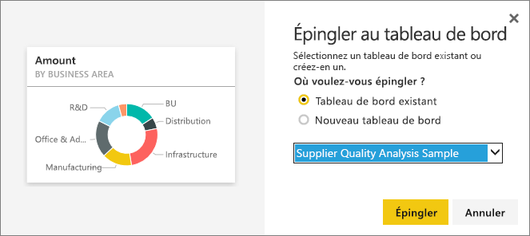

# Épingler une vignette d’un tableau de bord vers un autre
L’une des méthodes disponibles pour ajouter une nouvelle [vignette de tableau de bord](service-dashboard-tiles.md) est de la copier à partir d’un autre tableau de bord. Chacune de ces vignettes fait office de lien qui, quand vous cliquez dessus, vous renvoie là où elle a été créée (soit dans Q&R, soit dans un rapport). 

> [!NOTE]
> Vous ne pouvez pas épingler les vignettes d’un tableau de bord partagé.

## Épingler une vignette sur un autre tableau de bord
1. [Obtenez des données](service-get-data.md). Cet exemple fait appel au modèle [Analyse des dépenses informatiques](sample-it-spend.md).
2. Ouvrez un [tableau de bord](service-dashboards.md).
3. Pointez sur la vignette que vous voulez épingler, sélectionnez le bouton de sélection (...), puis choisissez **Épingler la vignette**.  
   
   
4. Épinglez la vignette à un tableau de bord existant ou à un nouveau tableau de bord. 
   
   * **Tableau de bord existant**: sélectionnez le nom du tableau de bord dans la liste déroulante.
   * **Nouveau tableau de bord**: tapez le nom du nouveau tableau de bord.
   
   
5. Sélectionnez **Épingler**.
   Un message apparaît (en haut à droite) pour vous indiquer que la visualisation a bien été ajoutée, sous forme de vignette, au tableau de bord sélectionné.
   
   
6. Sélectionnez **Accéder au tableau de bord** pour afficher la vignette épinglée. Vous pouvez dès lors [renommer, redimensionner, lier et déplacer](service-dashboard-edit-tile.md) la visualisation épinglée.

## Étapes suivantes
[Vignettes dans Power BI](service-dashboard-tiles.md)  
[Tableaux de bord dans Power BI](service-dashboards.md)  
D’autres questions ? [Posez vos questions à la communauté Power BI](http://community.powerbi.com/)

