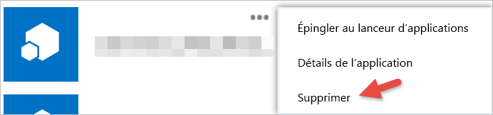

# Prise en main d’applications tierces
Avec Power BI, vous pouvez utiliser une application créée par une société ou une personne autres que Microsoft. Par exemple, vous pouvez utiliser une application tierce qui intègre les vignettes de Power BI dans une application web personnalisée. Lorsque vous utilisez une application tierce, vous êtes invité à accorder à cette application certaines autorisations d’accès à votre compte Power BI et à vos ressources. Il est important que seules les applications que vous connaissez et qui sont dignes de confiance bénéficient d’autorisations. Vous pouvez révoquer à tout moment les autorisations accordées à une application. Consultez la page [Révoquez les autorisations accordées à une application tierce](#revoke).

Voici les différents types d’accès dont peut bénéficier une application.

## Autorisations d’application Power BI
* **Afficher tous les tableaux de bord**
  
  * Cette autorisation permet à une application d’afficher tous les tableaux de bord auxquels vous avez accès. Cela inclut les tableaux de bord que vous possédez, ceux provenant de packs de contenu, ainsi que ceux qui ont été partagés avec vous et qui se trouvent dans des groupes auxquels vous appartenez. L’application ne peut pas modifier le tableau de bord. Cette autorisation peut notamment être utilisée par une application pour incorporer le contenu de votre tableau de bord à ses expériences.
* **Afficher tous les rapports**
  
  * Cette autorisation permet à une application d’afficher tous les rapports auxquels vous avez accès. Cela inclut les rapports que vous possédez, ceux provenant de packs de contenu, ainsi que ceux se trouvant dans des groupes auxquels vous appartenez. Étant donné qu’elle est autorisée à afficher le rapport, l’application peut également voir les données qu’il contient. L’application ne peut pas modifier les rapports. Cette autorisation peut notamment être utilisée par une application pour incorporer le contenu de votre rapport à ses expériences.
* **Afficher tous les jeux de données**
  
  * Cette autorisation permet à une application de répertorier tous les jeux de données auxquels vous avez accès. Cela inclut les jeux de données que vous possédez, ceux provenant de packs de contenu, ainsi que ceux se trouvant dans des groupes auxquels vous appartenez. Une application peut voir les noms et la structure de tous vos jeux de données, y compris les noms des tables et des colonnes. Cette autorisation donne le droit de lire les données d’un jeu de données. L’autorisation ne donne pas à l’application le droit de faire des ajouts à un jeu de données ou de le modifier.
* **Lire et écrire tous les jeux de données**
  
  * Cette autorisation permet à une application de répertorier tous les jeux de données auxquels vous avez accès. Cela inclut les jeux de données que vous possédez, ceux provenant de packs de contenu, ainsi que ceux se trouvant dans des groupes auxquels vous appartenez. Une application peut voir les noms et la structure de tous vos jeux de données, y compris les noms des tables et des colonnes. Cette autorisation donne le droit de lire et d’écrire des données dans un jeu de données. L’application peut aussi créer des jeux de données et modifier des jeux de données existants. Cette autorisation est couramment utilisée par une application pour envoyer des données directement à Power BI.
* **Afficher les groupes d’un utilisateur**
  
  * Cette autorisation permet à l’application de répertorier tous les groupes dont vous êtes membre. Elle peut utiliser cette autorisation, ainsi que d’autres autorisations répertoriées, pour afficher ou mettre à jour le contenu de ce groupe donné. L’application ne peut pas modifier le groupe.

<a name="revoke"/>

## Révoquez les autorisations accordées à une application tierce
Pour révoquer des autorisations accordées à une application tierce, accédez au site Mes applications Office 365.

Sur le site **Mes applications Office 365**, procédez comme suit pour révoquer des autorisations de tiers :

1. Accédez au [site Mes applications Office 365](https://portal.office.com/myapps)
2. Sur la page **Mes applications**, recherchez l’application tierce.
3. Pointez sur la vignette de l’application, cliquez sur le bouton **(…)**, puis cliquez sur **Supprimer**.
   
   

