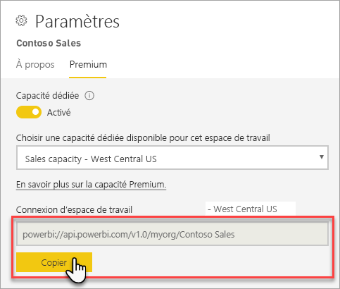

# Se connecter à des jeux de données avec des applications et des outils clients (préversion)

Les espaces de travail et les jeux de données Power BI Premium prennent en charge les connexions *en lecture seule* à partir d’applications et d’outils Microsoft et tiers. Par défaut, les connexions sont activées

> [!NOTE]
> Cet article est uniquement destiné à présenter la connectivité en lecture seule à des espaces de travail et des jeux de données Power BI Premium. Il n’est *pas* destiné à fournir des informations détaillées sur la programmabilité, des outils et des applications spécifiques, l’architecture ainsi que la gestion des espaces de travail et des jeux de données. Les sujets décrits ici nécessitent une bonne connaissance de l’architecture et de l’administration des bases de données de modèles tabulaires Analysis Services.

## Protocole

Power BI Premium utilise le protocole [XML for Analysis](https://docs.microsoft.com/bi-reference/xmla/xml-for-analysis-xmla-reference) (XMLA) pour les communications entre des applications clientes et le moteur qui gère vos espaces de travail et jeux de données. Ces communications s’effectuent via ce qui est communément appelé « points de terminaison XMLA ». XMLA est le même protocole de communication que celui utilisé par le moteur Microsoft Analysis Services, qui, sous le capot, exécute la modélisation sémantique, la gouvernance, le cycle de vie et la gestion des données de Power BI. 

La grande majorité des applications et des outils clients ne communiquent pas explicitement avec le moteur à l’aide de points de terminaison XMLA. Au lieu de cela, ils utilisent des bibliothèques clientes telles que MSOLAP, ADOMD et AMO comme intermédiaire entre l’application cliente et le moteur, qui communique exclusivement à l’aide de XMLA.

## Outils pris en charge

Les outils suivants prennent en charge l’accès en lecture seule aux espaces de travail et jeux de données Power BI Premium :

**SQL Server Management Studio (SSMS)**  : prend en charge les requêtes DAX, MDX, XMLA et TraceEvent. Exige la version 18.0. Téléchargement disponible [ici](https://docs.microsoft.com/sql/ssms/download-sql-server-management-studio-ssms). 

**SQL Server Profiler** : inclus avec SSMS 18.0 (préversion), cet outil fournit le suivi et le débogage des événements serveur. Vous pouvez capturer et enregistrer des données relatives à chaque événement dans un fichier ou une table pour les analyser ultérieurement. Bien qu’officiellement déprécié pour SQL Server, Profiler continue à être inclus dans SSMS. Il reste pris en charge pour Analysis Services, et à présent Power BI Premium. Pour en savoir plus, consultez [SQL Server Profiler](https://docs.microsoft.com/sql/tools/sql-server-profiler/sql-server-profiler).

**DAX Studio** : outil open source de la communauté pour l’exécution et l’analyse de requêtes DAX dans Analysis Services. Exige la version 2.8.2 ou une version ultérieure. Pour en savoir plus, consultez [daxstudio.org](https://daxstudio.org/).

**Tableaux croisés dynamiques Excel** : la version Démarrer en un clic d’Office 16.0.11326.10000 ou version ultérieure est nécessaire.

**Tiers** : inclut des applications et des outils de visualisation de données clients qui peuvent se connecter aux jeux de données, les interroger et les consommer dans Power BI Premium. La plupart des outils nécessitent les dernières versions des bibliothèques clientes MSOLAP, mais certains peuvent utiliser ADOMD.

## Bibliothèques clientes

Les bibliothèques clientes sont nécessaires pour les applications et outils clients pour se connecter à des espaces de travail Power BI Premium. Les bibliothèques clientes utilisées pour se connecter à Analysis Services sont également prises en charge dans Power BI Premium. Les applications clientes Microsoft comme Excel, SQL Server Management Studio (SSMS) et SQL Server Data Tools (SSDT) installent tous les trois des bibliothèques clientes et les mettent à jour en même temps que les mises à jour standard de l’application. Dans certains cas, en particulier avec les applications et les outils tiers, vous devrez peut-être installer des versions plus récentes des bibliothèques clientes. Les bibliothèques clientes sont mises à jour tous les mois. Pour en savoir plus, consultez [Bibliothèques clientes pour la connexion à Analysis Services](https://docs.microsoft.com/azure/analysis-services/analysis-services-data-providers).

## Connexion à un espace de travail Premium

Vous pouvez vous connecter à des espaces de travail attribués à des capacités dédiées Premium. Les espaces de travail attribués à une capacité dédiée ont une chaîne de connexion au format d’URL. 

Pour obtenir la chaîne de connexion d’espace de travail dans Power BI, dans **Paramètres d’espace de travail**, sous l’onglet **Premium**, dans **Connexion d’espace de travail**, cliquez sur **Copier**.

Les connexions d’espace de travail utilisent le format d’URL suivant pour traiter un espace de travail comme s’il s’agissait d’un nom de serveur Analysis Services :   
`powerbi://api.powerbi.com/v1.0/[tenant name]/[workspace name]` 

Par exemple, `powerbi://api.powerbi.com/v1.0/contoso.com/Sales Workspace`

### Pour se connecter dans SSMS

Dans **Se connecter au serveur** > **Type de serveur**, sélectionnez **Analysis Services**. Dans **Nom du serveur**, entrez l’URL. Dans **Authentification**, sélectionnez **Active Directory - Authentification universelle avec prise en charge de MFA**, puis dans **Nom d’utilisateur**, entrez votre ID d’utilisateur d’organisation. 

Une fois que vous êtes connecté, l’espace de travail est affiché en tant que serveur Analysis Services, et les jeux de données de l’espace de travail sont affichés en tant que bases de données.  

### Catalogue initial

Pour certains outils, comme SQL Server Profiler, vous devrez peut-être spécifier un *catalogue initial*. Spécifiez un jeu de données (une base de données) dans votre espace de travail. Dans **Se connecter au serveur**, cliquez sur **Options**. Dans la boîte de dialogue **Se connecter au serveur**, sous l’onglet **Propriétés de connexion**, dans **Connexion à une base de données**, entrez le nom du jeu de données.

### Nom d’espace de travail en double

Quand vous vous connectez à un espace de travail portant le même nom qu’un autre espace de travail, l’erreur suivante peut s’afficher : **Impossible de se connecter à powerbi://api.powerbi.com/v1.0/[nom_locataire]/[nom_espace_de_travail].**

Pour contourner cette erreur, spécifiez, en plus du nom de l’espace de travail, l’ObjectIDGuid, qui peut être copié à partir de l’objectID de l’espace de travail dans l’URL. Ajoutez l’ID d’objet (objectID) à l’URL de connexion. Par exemple, « powerbi://api.powerbi.com/v1.0/myorg/Contoso Sales - 9d83d204-82a9-4b36-98f2-a40099093830 »

### Nom de jeu de données en double

Quand vous vous connectez à un jeu de données portant le même nom qu’un autre jeu de données du même espace de travail, ajoutez le GUID du jeu de données à son nom. Vous pouvez obtenir le nom *et* le GUID du jeu de données quand vous vous connectez à l’espace de travail dans SSMS. 

### Retards dans les jeux de données affichés

Lors de la connexion à un espace de travail, les changements des jeux de données nouveaux, supprimés et renommés peuvent mettre jusqu’à 5 minutes à s’afficher. 

### Jeux de données non pris en charge

Les jeux de données suivants ne sont pas accessibles à l’aide de points de terminaison XMLA. Ces jeux de données ne s’affichent*pas* sous l’espace de travail dans SSMS ou dans d’autres outils : 

- Jeux de données avec une connexion active à des modèles Analysis Services. 
- Jeux de données avec des données push à l’aide de l’API REST.
- Jeux de données de classeur Excel. 

Les jeux de données suivants ne sont pas pris en charge dans le service Power BI :   

- Jeux de données avec une connexion active à un jeu de données Power BI.

### Rôles et appartenances à des rôles

Actuellement, les rôles de modèle et les appartenances aux rôles ne sont pas détectables ou affichées à l’aide de points de terminaison XMLA.

## Désactiver la connectivité

Par défaut, la connectivité du point de terminaison XMLA est activée pour la charge de travail Jeux de données. Vous pouvez désactiver la connectivité dans les [paramètres de charge de travail](service-admin-premium-workloads.md#workload-settings).

## Journaux d'audit 

Quand des applications et outils clients se connectent à un espace de travail, l’accès via les points de terminaison XMLA est journalisé dans les journaux d’audit Power BI sous l’opération **GetWorkspaces**. Pour en savoir plus, consultez [Audit Power BI](service-admin-auditing.md).

## Voir aussi

[Informations de référence sur Analysis Services](https://docs.microsoft.com/bi-reference/#pivot=home&panel=home-all)   
[SQL Server Management Studio](https://docs.microsoft.com/sql/ssms/sql-server-management-studio-ssms)   
[Protocole tabulaire SQL Server Analysis Services](https://docs.microsoft.com/openspecs/sql_server_protocols/ms-ssas-t/b98ed40e-c27a-4988-ab2d-c9c904fe13cf)   
[Vues de gestion dynamique (DMV)](https://docs.microsoft.com/sql/analysis-services/instances/use-dynamic-management-views-dmvs-to-monitor-analysis-services)   

D’autres questions ? [Essayez d’interroger la communauté Power BI](https://community.powerbi.com/)
