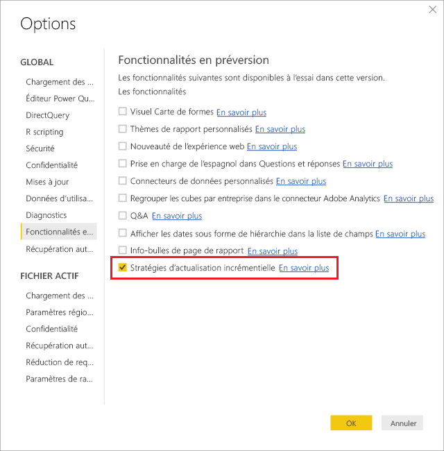
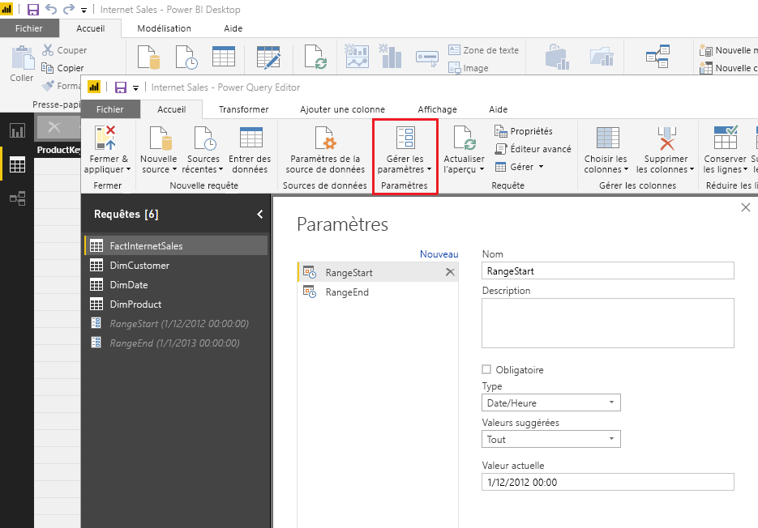
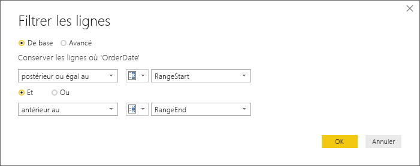
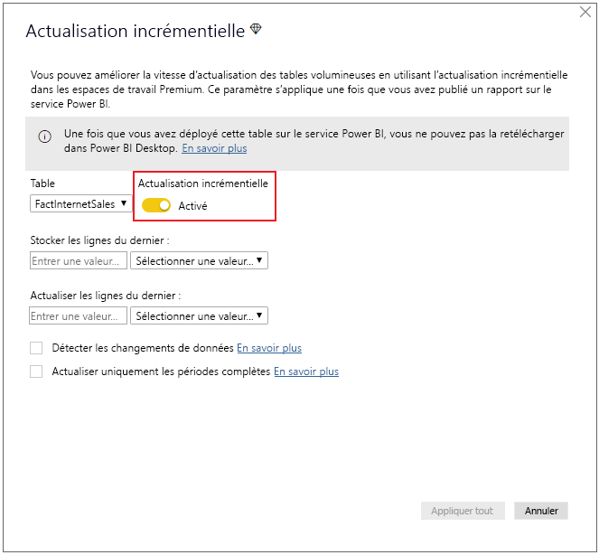
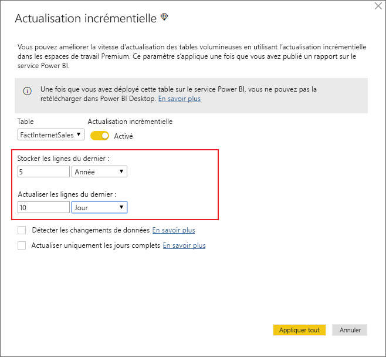
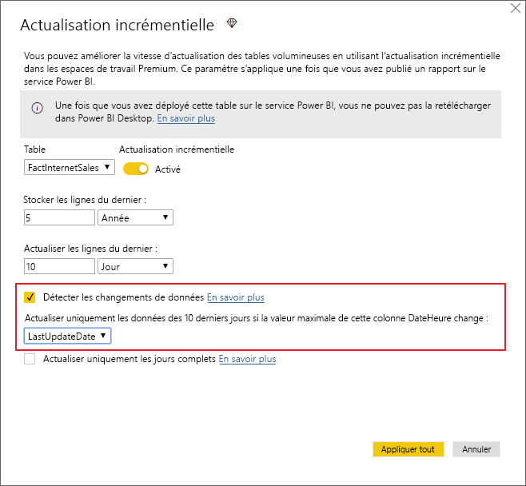
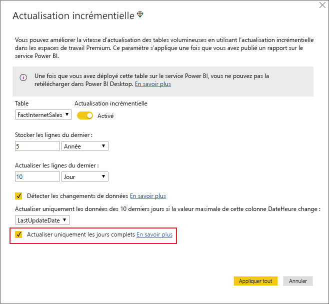

# <a name="incremental-refresh-in-power-bi-premium"></a>Actualisation incrémentielle dans Power BI Premium

L’actualisation incrémentielle permet d’utiliser des jeux de données très volumineux dans le service Power BI Premium, en offrant les avantages suivants :

- **Les actualisations sont plus rapides.** Seules les données qui ont changé sont actualisées. Par exemple, vous pouvez actualiser uniquement les données des 5 derniers jours dans un jeu de données de 10 ans.

- **Les actualisations sont plus fiables.** Vous n’avez notamment pas besoin de conserver des connexions longues à des systèmes sources volatiles.

- **La consommation des ressources est réduite.** Comme il y a moins de données à actualiser, la consommation globale de mémoire et d’autres ressources diminue.

## <a name="how-to-use-incremental-refresh"></a>Comment utiliser l’actualisation incrémentielle

Les stratégies d’actualisation incrémentielle sont définies dans Power BI Desktop et sont appliquées après avoir été publiées sur le service Power BI.

Commencez par activer l’actualisation incrémentielle dans les fonctionnalités en préversion.



### <a name="filter-large-datasets-in-power-bi-desktop"></a>Filtrer des jeux de données volumineux dans Power BI Desktop

Les jeux de données volumineux, contenant potentiellement des milliards de lignes, ne peuvent parfois pas être ajoutés dans Power BI Desktop, généralement à cause de la limitation des ressources disponibles sur les PC de bureau des utilisateurs. Ces jeux de données sont par conséquent souvent filtrés avant d’être importés dans Power BI Desktop. C’est toujours le cas, même avec l’actualisation incrémentielle.

#### <a name="rangestart-and-rangeend-parameters"></a>Paramètres RangeStart et RangeEnd

Pour utiliser l’actualisation incrémentielle dans le service Power BI, vous devez filtrer les données à l’aide de paramètres date/heure Power Query définis avec les noms réservés respectant la casse **RangeStart** et **RangeEnd**.

Une fois publiées, les valeurs des paramètres sont automatiquement remplacées par le service Power BI. Vous n’avez pas besoin de les définir dans les paramètres du jeu de données du service.

Il est important que le filtre soit poussé vers le système source lorsque des requêtes sont envoyées pour les opérations d’actualisation. Le filtre peut être rapproché des données seulement si la source de données prend en charge le « Query folding ». La plupart des sources de données qui prennent en charge les requêtes SQL prennent également en charge le « Query folding ». Ce n’est généralement pas le cas des sources de données telles que les fichiers plats, les objets blob, le web et les flux OData. Étant donné les différents niveaux de prise en charge du Query folding pour chaque source de données, nous vous recommandons de vérifier que la logique du filtre est incluse dans les requêtes sources. Dans les cas où le filtre n’est pas pris en charge par le back-end de source de données, il ne peut pas être rapproché des données. Dans ces cas, le moteur de mashup compense et applique le filtre localement, ce qui peut nécessiter la récupération du jeu de données complet à partir de la source de données. Cette opération peut ralentir sensiblement l’actualisation incrémentielle, et le processus peut manquer de ressources dans le service Power BI ou dans la passerelle de données locale éventuellement utilisée.

Le filtre est utilisé pour partitionner les données en plages dans le service Power BI. Il n’est pas conçu pour prendre en charge la mise à jour de la colonne de date filtrée. Une mise à jour sera interprétée comme une insertion et une suppression (et non pas comme une mise à jour). Si la suppression se produit dans la plage historique et pas dans la plage incrémentielle, elle ne sera pas récupérée. Cela peut entraîner des échecs d’actualisation des données en raison de conflits de clé de partition.

Dans l’éditeur Power Query, sélectionnez **Gérer les paramètres** pour définir les paramètres avec les valeurs par défaut.



Une fois que vous avez défini les paramètres, vous pouvez appliquer le filtre en sélectionnant l’option de menu **Filtre personnalisé** pour une colonne.


Vérifiez que les lignes sont filtrées quand la valeur de colonne *est postérieure ou égale à* **RangeStart** et *antérieure* à **RangeEnd**.



> [!TIP]
> Les paramètres doivent avoir le type de données date/heure, mais ils peuvent être convertis pour répondre aux exigences de la source de données. Par exemple, la fonction Power Query suivante convertit une valeur date/heure en une valeur similaire à une clé de substitution de type entier au format *aaaammjj*, ce qui est courant pour les entrepôts de données. La fonction peut être appelée à l’étape du filtre.
>
> `(x as datetime) => Date.Year(x)*10000 + Date.Month(x)*100 + Date.Day(x)`

Sélectionnez **Fermer et appliquer** dans l’éditeur Power Query. Vous devez avoir un sous-ensemble du jeu de données dans Power BI Desktop.

### <a name="define-the-refresh-policy"></a>Définir la stratégie d’actualisation

L’actualisation incrémentielle est disponible dans le menu contextuel des tables, à l’exception des modèles Connexion active.


#### <a name="incremental-refresh-dialog"></a>Boîte de dialogue Actualisation incrémentielle

La boîte de dialogue Actualisation incrémentielle s’affiche. Utilisez le bouton bascule pour activer la boîte de dialogue.



> [!NOTE]
> Si l’expression Power Query pour la table ne fait pas référence aux paramètres avec des noms réservés, le bouton bascule est désactivé.

Le texte d’en-tête décrit ce qui suit :

- L’actualisation incrémentielle est prise en charge uniquement pour les espaces de travail sur une capacité Premium. Les stratégies d’actualisation sont définies dans Power BI Desktop. Elles sont appliquées par les opérations d’actualisation dans le service.

- Si vous pouvez télécharger le fichier PBIX contenant une stratégie d’actualisation incrémentielle à partir du service Power BI, le fichier ne s’ouvre pas dans Power BI Desktop. Vous ne pourrez bientôt plus du tout le télécharger. Cela ne sera peut-être plus le cas dans une version future, mais sachez que la taille de ces jeux de données peut augmenter considérablement, au point qu’il ne soit plus possible de les télécharger ni de les ouvrir sur un PC de bureau classique.

#### <a name="refresh-ranges"></a>Plages d’actualisation

L’exemple suivant définit une stratégie d’actualisation pour stocker les données de cinq années calendaires complètes, ainsi que les données de l’année en cours jusqu’à la date actuelle et actualiser 10 jours de données de manière incrémentielle. La première opération d’actualisation charge les données historiques. Les actualisations suivantes sont incrémentielles et effectuent les opérations suivantes (si elles sont planifiées pour s’exécuter tous les jours).

- Ajout d’un nouveau jour de données.

- Actualisation des données des dix derniers jours avant la date actuelle.

- Suppression des années calendaires qui sont antérieures aux cinq années précédant la date actuelle. Par exemple, si la date actuelle est le 1er janvier 2019, l’année 2013 est supprimée.

La première actualisation effectuée dans le service Power BI peut être plus longue, car toutes les données des cinq années calendaires complètes doivent être importées. Les actualisations suivantes sont généralement très rapides.



**Quand vous avez terminé la définition de ces plages, vous pouvez passer directement à l’étape de publication suivante. Les autres menus déroulants concernent des fonctionnalités avancées.**

### <a name="advanced-policy-options"></a>Options de stratégie avancée

#### <a name="detect-data-changes"></a>Détecter les changements de données

L’actualisation incrémentielle des données des dix derniers jours est évidemment beaucoup plus rapide qu’une actualisation complète des données des cinq années. Toutefois, ce processus peut encore être amélioré. Si vous cochez la case **Détecter les changements de données**, vous pouvez sélectionner une colonne date/heure à utiliser pour identifier et actualiser uniquement les jours où les données ont changé. Cela suppose que cette colonne existe dans le système source, généralement à des fins d’audit. **Cela ne doit pas être la même colonne que celle utilisée pour partitionner les données avec les paramètres RangeStart/RangeEnd.** La valeur maximale de cette colonne est évaluée pour chacune des périodes définies dans la plage incrémentielle. Si cette valeur n’a pas changé depuis la dernière actualisation, la période n’a pas besoin d’être actualisée. Dans l’exemple, cela peut réduire les jours concernés par l’actualisation incrémentielle de dix à deux.



> [!TIP]
> Dans la conception actuelle, la colonne utilisée pour détecter les changements de données doit être persistante et mise en mémoire cache. Essayez l’une des techniques suivantes pour réduire la consommation de mémoire et la cardinalité.
>
> Conservez uniquement la valeur maximale de cette colonne persistante au moment de l’actualisation, éventuellement à l’aide d’une fonction Power Query.
>
> Diminuez la précision à un niveau acceptable en fonction de vos exigences de fréquence d’actualisation.
>
> Nous prévoyons de permettre la définition de requêtes personnalisées pour détecter les changements de données dans une version ultérieure. Cela permettrait d’éviter totalement la persistance de la valeur de colonne.

#### <a name="only-refresh-complete-periods"></a>Actualiser uniquement les périodes complètes

Supposons que vous avez planifié l’actualisation à 4 h 00 chaque matin. Vous ne voudrez peut-être pas prendre en compte les données éventuellement ajoutées au système source pendant ces quatre heures. L’actualisation de certaines métriques métier, comme le nombre de barils par jour dans l’industrie du pétrole et du gaz, n’a aucun sens si elle concerne des jours partiels.

Un autre exemple est l’actualisation des données d’un système financier où les données du mois précédent sont approuvées le 12e jour calendaire du mois. Vous pouvez définir une plage incrémentielle d’un mois et planifier l’actualisation le 12e jour du mois. Avec cette option activée, les données du mois de janvier sont actualisées le 12 février, par exemple.



> [!NOTE]
> Les opérations d’actualisation dans le service sont effectuées selon l’heure UTC. Cela peut déterminer la date d’effet de l’actualisation et impacter les périodes complètes. Nous prévoyons d’ajouter la possibilité d’ignorer la date d’effet pour une opération d’actualisation.

## <a name="publish-to-the-service"></a>Publier sur le service

L’actualisation incrémentielle est une fonctionnalité disponible uniquement dans Premium. Dans la boîte de dialogue Publier, vous pouvez donc uniquement sélectionner un espace de travail sur une capacité Premium.


Vous pouvez désormais actualiser le modèle. La première actualisation peut être plus longue en raison de l’importation des données d’historique. Les actualisations suivantes peuvent être beaucoup plus rapides si elles sont effectuées à l’aide de l’actualisation incrémentielle.

## <a name="query-timeouts"></a>Délais d’expiration des requêtes

L’article sur la [résolution des problèmes d’actualisation](https://docs.microsoft.com/power-bi/refresh-troubleshooting-refresh-scenarios) explique que les opérations d’actualisation dans le service Power BI sont soumises à des délais d’expiration. Les requêtes peuvent également être limitées par le délai d’expiration par défaut pour la source de données. La plupart des sources relationnelles permettent d’ignorer les délais d’expiration dans l’expression M. Par exemple, l’expression ci-dessous utilise la [fonction d’accès aux données de SQL Server](https://msdn.microsoft.com/query-bi/m/sql-database) pour définir le délai à deux heures. Chaque période définie par les plages de la stratégie soumet une requête qui respecte le paramètre de délai d’expiration de la commande.

```
let
    Source = Sql.Database("myserver.database.windows.net", "AdventureWorks", [CommandTimeout=#duration(0, 2, 0, 0)]),
    dbo_Fact = Source{[Schema="dbo",Item="FactInternetSales"]}[Data],
    #"Filtered Rows" = Table.SelectRows(dbo_Fact, each [OrderDate] >= RangeStart and [OrderDate] < RangeEnd)
in
    #"Filtered Rows"
```
