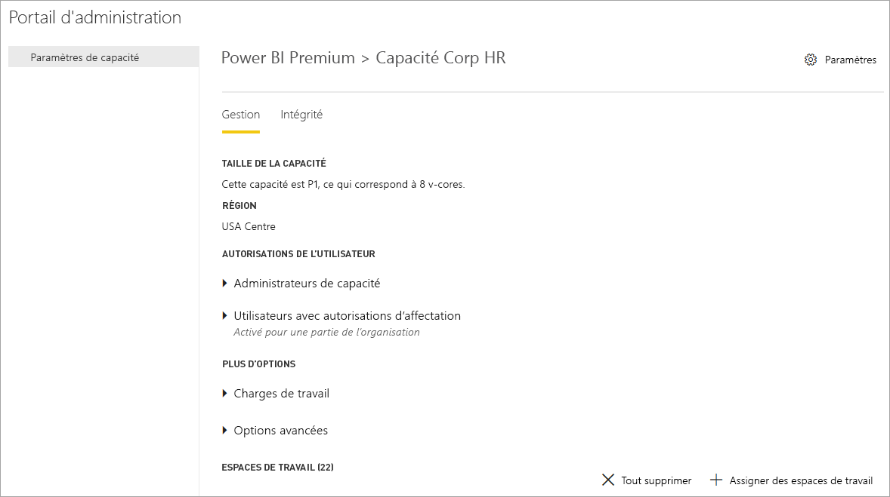

# Qu’est-ce que Power BI Premium ?

Power BI Premium fournit des ressources dédiées et améliorées pour exécuter le service Power BI pour votre organisation. Par exemple :

- Mise à l’échelle et des performances supérieures
- Possibilité de licence de capacité
- Unifier libre-service et entreprise BI
- Étendre la BI locaux avec Power BI Report Server
- Prise en charge pour la résidence des données par région (zone géographique multiple)
- Partager des données avec d’autres personnes sans acheter une licence par utilisateur

Cet article n’est pas destiné à fournir des informations détaillées sur toutes les fonctionnalités de Power BI Premium - en fait, elle touche simplement la surface. Le cas échéant, des liens vers des articles supplémentaires avec des informations plus détaillées sont fournies.

## Abonnements et licences

Power BI Premium est un abonnement à Office 365 au niveau du client disponible dans deux familles de références SKU (Stock-Keeping Unit) :

- **EM** références (SKU) (EM1-EM3) pour l’incorporation, nécessitant un engagement annuel, avec facturation mensuelle.
- **P** références (SKU) (P1-P3) pour les fonctionnalités d’incorporation et d’entreprise, nécessitant un engagement mensuel ou annuel, facturés tous les mois et inclut une licence pour installer Power BI Report Server en local.

Une autre approche consiste à acheter un **Azure Power BI Embedded** abonnement, qui a un seul **A** famille de référence (SKU) (A1-A6) pour l’incorporation et la capacité de test à des fins d’uniquement. Toutes les références (SKU) fournissent des v-cores pour créer des capacités, mais les références SKU EM sont limitées pour l’incorporation de la plus petite échelle. EM1, EM2, A1 et A2 références (SKU) avec moins de quatre cœurs ne s’exécutent pas sur une infrastructure dédiée.

Bien que cet article porte sur les références SKU P, une grande partie de ce qui est décrit concerne également les références SKU A. Contrairement à l’abonnement Premium références (SKU), les références SKU Azure ne nécessitent aucune durée d’engagement et sont facturées par heure. Ils offrir élasticité complète l’activation de la mise à l’échelle des, mettre à l’échelle vers le bas, pause, reprendre et suppriment. 

Azure Power BI Embedded est en grande partie hors de portée pour cet article, mais il est décrit dans la [approches de test](service-premium-capacity-optimize.md#testing-approaches) section de l’article de capacités Premium optimisation comme une option pratique et économique pour tester et mesurer les charges de travail. Pour en savoir plus sur les références SKU Azure, consultez [Azure Power BI Embedded Documentation](https://azure.microsoft.com/services/power-bi-embedded/).

### Achat

Les abonnements de Power BI Premium peuvent être achetés par les administrateurs dans le centre d’administration Microsoft 365. Plus précisément, uniquement les administrateurs généraux Office 365 ou facturation peut acheter des références (SKU). Lors de l’achat, le client reçoit un nombre correspondant de v-cores pour affecter à des capacités, connu sous le nom *regroupement v-core*. Par exemple, l’achat d’une référence SKU P3 fournit au locataire 32 v-cores. Pour plus d’informations, consultez [comment acheter Power BI Premium](service-admin-premium-purchase.md).

## Capacités dédiées

Avec Power BI Premium, vous obtenez *dédié capacités*. Contrairement à une capacité partagée où des charges de travail exécutant sur les ressources de calcul partagées avec d’autres clients, une capacité dédiée est pour une utilisation exclusive par une organisation. Elle a isolé avec des ressources de calcul dédiés qui offrent des performances fiables et cohérents pour le contenu hébergé. 

Espaces de travail se trouvent au sein de capacités. Chaque utilisateur Power BI dispose d’un espace de travail personnel appelé **mon espace de travail**. Espaces de travail supplémentaires peuvent être créées pour permettre la collaboration et déploiement, et ils sont appelés **espaces de travail application**. Par défaut, les espaces de travail, y compris les espaces de travail personnels, sont créés dans une capacité partagée. Lorsque vous avez des capacités Premium, espaces de travail Mes espaces de travail et d’application peuvent être affectés à capacités Premium.

### Nœuds de capacité

Comme décrit dans la [abonnements et les licences](#subscriptions-and-licensing) section, il existe deux familles de référence (SKU) de Power BI Premium : **EM** et **P**. Toutes les références SKU Power BI Premium sont disponibles en tant que capacité *nœuds*, chacune représentant un ensemble de ressources constitué de processeur, mémoire et stockage. En plus de ressources, chaque référence (SKU) a des limites opérationnelles sur le nombre de connexions DirectQuery et de la connexion active par seconde et actualise le nombre de modèles parallèles.

Le traitement s’effectue par un nombre défini de v-cores, répartis entre les principales et frontales.

**V-cores principaux** sont responsables de la fonctionnalité de Power BI core, y compris le traitement de requêtes, gestion du cache, en cours d’exécution R services, actualisation de modèle, traitement en langage naturel (Q & A) et rendu côté serveur de rapports et d’images. V-cores principaux sont affectés à une quantité fixe de mémoire qui est principalement utilisé pour les modèles d’hôte, également appelé active jeux de données.

**V-cores du serveur frontal** sont responsables pour le web service, tableau de bord et rapport de gestion de documents, gestion de droits d’accès, planification, API, chargements et téléchargements et généralement pour tout ce qui concerne l’utilisateur des expériences.

Stockage est défini sur **100 To par nœud de capacité**.

Les ressources et les limites de chaque référence (SKU) Premium (et dimensionnés de façon équivalente une référence (SKU)) sont décrites dans le tableau suivant :

| Nœuds de capacité | Total des v-cores | Cœurs virtuels backend | RAM (GO) | Cœurs virtuels frontend | Connexions actives/DirectQuery (par seconde) | Parallélisme de l’actualisation de modèle |
| --- | --- | --- | --- | --- | --- | --- |
| EM1/A1 | 1 | 0.5 | 2.5 | 0.5 | 3.75 | 1 |
| EM2/A2 | 2 | 1 | 5 | 1 | 7.5 | 2 |
| EM3/A3 | 4 | 2 | 10 | 2 | 15 | 3 |
| P1/A4 | 8 | 4 | 25 | 4 | 30 | 6 |
| P2/A5 | 16 | 8 | 50 | 8 | 60 | 12 |
| P3/A6 | 32 | 16 | 100 | 16 | 120 | 24 |
| | | | | | | |

### Charges de travail de la capacité

Charges de travail de la capacité sont accessibles aux utilisateurs des services. Par défaut, Premium et capacités Azure prennent en charge uniquement un jeu de données la charge de travail associé de l’exécution de requêtes de Power BI. La charge de travail du jeu de données ne peut pas être désactivée. Charges de travail supplémentaires peuvent être activées pour [AI (Services cognitifs)](https://powerbi.microsoft.com/blog/easy-access-to-ai-in-power-bi-preview/), [flux de données](service-dataflows-overview.md#dataflow-capabilities-on-power-bi-premium), et [paginés](paginated-reports-save-to-power-bi-service.md). Ces charges de travail sont pris en charge dans les abonnements Premium uniquement. 

Chaque charge de travail supplémentaire permet la configuration de la mémoire maximale (en pourcentage de mémoire totale disponible) qui peut être utilisée par la charge de travail. Valeurs par défaut pour la mémoire maximale sont déterminés par la référence (SKU). Vous pouvez optimiser les ressources disponibles de votre capacité en activant uniquement ces charges de travail supplémentaires lorsqu’ils sont utilisés. Et vous pouvez modifier les paramètres uniquement lorsque vous avez déterminé les paramètres par défaut ne répondent pas aux besoins en ressources votre capacité de mémoire. Charges de travail peuvent être activés et configurés pour un administrateurs de capacité par capacité à l’aide de **les paramètres de capacité** dans le [portail d’administration](service-admin-portal.md) ou à l’aide de la [API REST de capacités](https://docs.microsoft.com/rest/api/power-bi/capacities).  

Pour plus d’informations, consultez [configurer des charges de travail dans une capacité Premium](service-admin-premium-workloads.md). 

### La fonction des capacités

À tout moment, le service Power BI rend le meilleur parti de ressources de capacité sans toutefois dépasser les limites imposées sur la capacité.

Opérations de la capacité sont classées comme étant *interactive* ou *arrière-plan*. Opérations interactives incluent les demandes de rendu et de répondre aux interactions de l’utilisateur (filtrage, Q & r l’interrogation, etc.). En règle générale, l’interrogation de modèle Importer la mémoire est gourmandes en ressources, tandis que l’interrogation des modèles DirectQuery et une connexion directe est sollicitant beaucoup le processeur. Opérations d’arrière-plan incluent de flux de données et importer des actualisations de modèle et la mise en cache de requête de tableau de bord.

Il est important de comprendre qu’opérations interactives toujours auront la priorité sur les opérations d’arrière-plan pour garantir la meilleure expérience utilisateur possible. Si les ressources sont insuffisantes, les opérations d’arrière-plan sont ajoutées à une file d’attente pour le traitement lors de la libérer des ressources. Opérations d’arrière-plan, telles que les actualisations du jeu de données, peuvent être un processus intermédiaire arrêté par le service Power BI et ajouté à une file d’attente.

Modèles d’importation doivent être entièrement chargées en mémoire afin qu’ils peuvent être interrogés ou actualisés. Le service Power BI gère la mémoire utilisation à l’aide de sophistiqué des algorithmes pour garantir une utilisation maximale de mémoire disponible et peut provoquer la survalidation la capacité : Il est possible pour une capacité stocker l’importation de nombreux modèles (jusqu'à 100 To par capacité Premium), lors de leur stockage sur disque combiné dépasse la mémoire pris en charge (et de mémoire supplémentaire est nécessaire pour l’interrogation et l’actualisation), puis ils tous Impossible de charger dans la mémoire à le même temps.

Modèles d’importation sont par conséquent chargées dans et supprimés de la mémoire en fonction de l’utilisation. Un modèle d’importation est chargé lorsqu’il est interrogée (opération interactive) et ne sont pas encore en mémoire, ou quand il doit pour être actualisé (opération d’arrière-plan).

La suppression d’un modèle à partir de la mémoire est appelée *éviction*. C’est une opération que Power BI peut effectuer rapidement selon la taille des modèles. Si la capacité ne rencontre pas de toute pression de mémoire, les modèles sont simplement chargés en mémoire et y restent. Toutefois, lors de la mémoire disponible est insuffisante pour charger un modèle, le service Power BI devez d’abord libérer de mémoire. Elle libère de la mémoire en détectant les modèles qui sont devenus inactifs en recherchant des modèles qui n’ont pas été utilisés au cours des trois dernières minutes \[ [1](#endnote-1)\]et ensuite supprimer les. S’il n’y a aucun modèle inactif à supprimer, le service Power BI cherche à supprimer les modèles chargés pour les opérations d’arrière-plan. En dernier recours, après 30 secondes de tentatives ayant échoué \[ [1](#endnote-1)\], consiste à faire échouer l’opération interactive. Dans ce cas, l’utilisateur du rapport est averti de l’échec avec une suggestion pour essayer à nouveau peu de temps. Dans certains cas, les modèles peuvent être déchargées de la mémoire en raison d’opérations de service.

Il est important de souligner qu’éviction du jeu de données est un comportement normal et prévu. Il s’efforce d’optimiser l’utilisation de mémoire par le chargement et le déchargement des modèles dont les tailles combinées peuvent dépasser la mémoire disponible. Il s’agit par conception et totalement transparente pour les utilisateurs de rapport. Taux d’éviction haute ne signifie pas nécessairement que la capacité est insuffisamment allocation des ressources. Ils peuvent, toutefois, constituer un problème si la victime de réactivité de l’actualisation ou de la requête en raison des taux d’éviction haute.

Les actualisations de modèles d’importation sont toujours beaucoup de mémoire comme modèles doivent être chargées en mémoire. Mémoire supplémentaire est requise pour le traitement. Une actualisation complète peut utiliser environ double la quantité de mémoire requise par le modèle. Cela garantit que le modèle peut être interrogé même pendant le traitement, étant donné que les requêtes sont envoyées au modèle existant, jusqu'à ce que l’actualisation est terminée et les nouvelles données de modèle seront disponibles. Actualisation incrémentielle nécessitera moins de mémoire peut se terminer plus rapidement et par conséquent, peut réduire considérablement la pression sur les ressources de capacité. Actualisations peuvent également être sollicitant beaucoup le processeur pour les modèles, en particulier ceux avec des transformations complexes de Power Query, ou des tables ou des colonnes calculées qui sont complexes ou sont basées sur des tables volumineuses.

Actualisations, comme les requêtes, nécessitent le modèle d’être chargées en mémoire. Si la mémoire est insuffisante, le service Power BI va tenter de suppression de modèles inactifs, et si cela n’est pas possible (comme tous les modèles sont actifs), le travail d’actualisation est en file d’attente. Les actualisations sont généralement sollicitant beaucoup le processeur, voire plus encore que les requêtes. Pour cette raison, il existe des limites de capacité sur le nombre d’actualisations simultanées, la valeur est 1,5 fois le nombre de v-cores principaux, arrondi par excès. S’il existe des actualisations simultanées trop nombreuses, une actualisation planifiée est mises en attente. Lorsque ces situations se produisent, il est plus long pour l’actualisation soit terminée. À la demande actualise telles que celles déclenchée par une requête de l’utilisateur ou un appel d’API réessaiera trois fois \[ [1](#endnote-1)\]. S’il reste pas suffisamment de ressources, l’actualisation échoue puis.

Notes de la section :   
\[1\] susceptibles d’être modifiées.

### Support régional

Lors de la création d’une nouvelle capacité, les administrateurs généraux Office 365 et Power BI service peut spécifier une région où les espaces de travail attribués à la capacité résidera. Il s’agit **Multigéographiques**. Avec plusieurs zones géographiques, les organisations peuvent répondre aux exigences en matière de résidence des données en déployant le contenu aux centres de données dans une région spécifique, même si elle est différente de la région dans laquelle réside l’abonnement Office 365. Pour plus d’informations, consultez [prise en charge de plusieurs zones géographiques pour Power BI Premium](service-admin-premium-multi-geo.md).

### Gestion de la capacité

La gestion de capacités Premium implique la création ou suppression de capacités, affectation d’administrateurs, affectation d’espaces de travail, les charges de travail, la surveillance et effectuer des ajustements pour optimiser les performances de la capacité de configuration. 

Les administrateurs généraux Office 365 et les administrateurs de service Power BI peuvent créer des capacités Premium à partir de v-cores disponibles, ou modifier les capacités Premium existantes. Lors de la création d’une capacité, taille de la capacité et de la région géographique sont spécifiés, et au moins un administrateur est affecté. 

Lors de la création des capacités, la plupart des tâches d’administration s’effectuent dans le [portail d’administration](service-admin-portal.md).

Les administrateurs de capacité peuvent affecter les espaces de travail à la capacité, gérer les autorisations utilisateur et affecter les autres administrateurs. Les administrateurs de capacité peuvent également configurer des charges de travail, ajuster des allocations de mémoire et si nécessaire, redémarrez une capacité de réinitialisation des opérations dans le cas d’une surcharge de capacité.

Les administrateurs de capacité peuvent également vous assurer qu'une capacité est en cours d’exécution sans heurts. Elles peuvent surveiller le droit de contrôle d’intégrité de capacité dans le portail d’administration ou à l’aide de l’application de métriques de capacité Premium.

Pour en savoir plus sur la création capacités, affectation d’administrateurs et affectez des espaces de travail, consultez [capacités Premium de la gestion des](service-premium-capacity-manage.md). Pour en savoir plus sur les rôles, consultez [rôles d’administrateur lié à Power BI](service-admin-administering-power-bi-in-your-organization.md#administrator-roles-related-to-power-bi).

### Monitoring

Surveillance des capacités Premium fournit les administrateurs disposant d’une compréhension du fonctionnement des capacités. Capacités peuvent être surveillées à l’aide du portail d’administration et le [métriques de capacité Power BI Premium application](https://app.powerbi.com/groups/me/getapps/services/capacitymetrics).

Surveillance dans le portail fournit un aperçu rapide avec les mesures de haut niveau indiquant la charge placée et les ressources utilisées par votre capacité, une moyenne, au cours des sept derniers jours. 

Le **métriques de capacité Power BI Premium** application fournit les informations plus approfondies des performances de vos capacités. L’application fournit un tableau de bord de haut niveau et des rapports détaillés.

À partir du tableau de bord de l’application, vous pouvez cliquer sur une cellule de métrique pour ouvrir un rapport détaillé. Les rapports fournissent des métriques détaillées et la fonctionnalité de filtrage pour consulter des détails sur les informations les plus importantes vous devront conserver vos capacités de bon fonctionnement.

Pour en savoir plus sur les capacités de surveillance, consultez [surveillance dans le portail d’administration Power BI](service-admin-premium-monitor-portal.md) et [surveillance avec l’application de métriques de capacité Power BI Premium](service-admin-premium-monitor-capacity.md).

### Optimisation des capacités

L’utilisation optimale de vos capacités est essentielle pour garantir aux utilisateurs d’obtenir les performances et vous obtenez le meilleur parti de votre investissement Premium. En surveillant les métriques clés, les administrateurs peuvent déterminer la meilleure façon de résoudre les goulots d’étranglement et prendre les mesures nécessaires. Pour plus d’informations, consultez [capacités Premium optimisation](service-premium-capacity-optimize.md) et [scénarios de capacité Premium](service-premium-capacity-scenarios.md).

### Capacités API REST

L’API REST de Power BI incluent une collection de [capacités API](https://docs.microsoft.com/rest/api/power-bi/capacities). Avec les API, les administrateurs peuvent gérer par programmation de nombreux aspects de vos capacités Premium, y compris l’activation et désactivation des charges de travail, affectation d’espaces de travail à une capacité et bien plus encore.

## Jeux de données volumineux

En fonction de la référence (SKU), Power BI Premium prend en charge le téléchargement de fichiers modèle Power BI Desktop (.pbix) avec un maximum de **10 Go** taille. Lors du chargement, le modèle peut ensuite être publié à un espace de travail affecté à une capacité Premium. Le jeu de données peut ensuite être actualisé jusqu'à **12 Go** taille.

### Considérations relatives à la taille

Les modèles volumineux peuvent consommer beaucoup de ressources. Vous devez avoir au moins une référence SKU P1 pour tous les modèles supérieurs à 1 Go. Bien que la publication de modèles de grande taille aux espaces de travail assorties de références SKU A jusqu'à A3 pourrait travail, l’actualisation de leur sera pas.

Le tableau suivant décrit les références SKU recommandées pour différentes tailles de fichiers .pbix :

   |Référence SKU  |Taille de fichier .pbix   |
   |---------|---------|
   |P1    | < 3 Go        |
   |P2    | < 6 Go        |
   |P3, P4, P5    | jusqu’à 10 Go   |

La référence (SKU) A4 Power BI Embedded est égale à la référence P1, A5 = P2 et A6 = P3. Notez que la publication de grands modèles pour des références SKU A et EM peut retourner des erreurs qui ne sont pas spécifiques à l’erreur de limitation de taille de modèle dans la capacité partagée. Les erreurs d’actualisation pour les grands modèles dans les références SKU A et EM sont susceptibles de pointer vers des expirations de délai. 

Vos fichiers .pbix représentent des données dans un *fortement compressées état*. Les données seront probablement développées plusieurs fois lors de leur chargement en mémoire, et dès lors peuvent être encore développées plusieurs fois au moment de l’actualisation.

Actualisation planifiée de jeux de données volumineux peut prendre beaucoup de temps et consommer beaucoup de ressources. Il est important de ne planifier pas trop grand nombre d’actualisations. Il est recommandé de [actualisation incrémentielle](service-premium-incremental-refresh.md) est configuré, car il est plus rapide et plus fiables et consomme moins de ressources.

Le chargement d’état initial de jeux de données volumineux peut prendre beaucoup de temps s’il a été un certain temps depuis la dernière fois que le jeu de données a été utilisé. Une barre de chargement indique la progression pour les rapports dont le chargement est plus long.

Alors que la mémoire par requête et les contraintes de temps sont beaucoup plus élevées dans la capacité Premium, il est recommandé de qu'utiliser des filtres et les segments pour limiter les éléments visuels pour afficher uniquement ce qui est nécessaire.

## Actualisation incrémentielle

Actualisation incrémentielle fournit une partie intégrante d’avoir et de maintenance des jeux de données volumineux dans Power BI Premium. Actualisation incrémentielle présente de nombreux avantages, par exemple, les actualisations sont plus rapides, car seules les données qui a modifié doit être actualisée. Actualisations sont plus fiables, car il est inutile de conserver des connexions de longs aux sources de données volatiles. La consommation des ressources est réduite car moins de données à actualiser réduit la consommation globale de mémoire et d’autres ressources. Stratégies d’actualisation incrémentielle sont définies dans **Power BI Desktop**et appliquées lors de la publication à un espace de travail dans une capacité Premium. 

Pour plus d’informations, consultez [incrémentiel d’actualisation dans Power BI Premium](service-premium-incremental-refresh.md).

## Rapports paginés

Rapports paginés, pris en charge sur P1-P3 et A4_A6 références (SKU), sont basées sur la technologie de langage RDL (Report Definition) de SQL Server Reporting Services. Bien que basé sur la technologie RDL, il n’est pas le même que le serveur de rapports Power BI, qui est une plateforme de création de rapports téléchargeable que vous pouvez installer en local, également inclus avec Power BI Premium. Rapports paginés sont mis en forme pour tenir sur une page qui peut être imprimée ou partagée. Données sont affichées dans une table, même si la table s’étend sur plusieurs pages. À l’aide de la version gratuite [ **Générateur de rapports Power BI** ](https://go.microsoft.com/fwlink/?linkid=2086513) application de bureau de Windows, l’auteur utilisateurs paginé signale et publiez-les sur le service.

Dans Power BI Premium, les rapports de Paginated sont une charge de travail qui doit être activé pour une capacité à l’aide du portail d’administration. Les administrateurs de capacité peuvent activer, puis spécifiez la quantité de mémoire sous forme de pourcentage des ressources de mémoire globale de la capacité. Contrairement à d’autres types de charges de travail, Premium est exécuté sur des rapports paginés dans un espace de relation contenant-contenu au sein de la capacité. Mémoire maximale spécifiée pour cet espace est utilisé si la charge de travail est active ou non. La valeur par défaut est de 20 %. 

Pour plus d’informations, consultez [paginés dans Power BI Premium](paginated-reports-report-builder-power-bi.md). Pour en savoir plus sur l’activation de la charge de travail rapports Paginated, consultez [configurer des charges de travail](service-admin-premium-workloads.md).

## Power BI Report Server
 
Inclus avec Power BI Premium, Power BI Report Server est un *local* serveur de rapports avec un portail web. Vous pouvez générer votre BI environnement local et distribuer des rapports derrière le pare-feu de votre organisation. Serveur de rapports donne aux utilisateurs accès riche, interactive et les fonctionnalités de création de rapports d’entreprise de SQL Server Reporting Services. Les utilisateurs peuvent Explorer les données visuelles et repérez rapidement les tendances à prendre de meilleures décisions plus rapides. Serveur de rapports fournit la gouvernance selon vos propres conditions. Si et quand le moment venu, Power BI Report Server facilite la migration vers le cloud, où votre organisation tire pleinement parti de toutes les fonctionnalités de Power BI Premium.

Pour plus d’informations, consultez [Power BI Report Server](report-server/get-started.md).

## Partage de contenu illimité

Avec Premium, tout le monde, si elles sont à l’intérieur ou en dehors de votre organisation peuvent afficher votre contenu Power BI, y compris les rapports paginés et interactives sans acheter de licences individuelles. 

Premium permet la large diffusion de contenu par les utilisateurs Pro sans nécessiter des licences Pro pour les destinataires qui permet d’afficher le contenu. Licences Pro sont requis pour les créateurs de contenu. Créateurs de se connecter aux sources de données, les données de modèle et créer des rapports et tableaux de bord qui est empaquetés en tant qu’applications de l’espace de travail. 

Pour plus d’informations, consultez [gestion des licences Power BI](service-admin-licensing-organization.md).

## Connectivité des outils (version préliminaire)

En coulisses, l’entreprise éprouvé de Microsoft **moteur Vertipaq Analysis Services** alimente des jeux de données Power BI. Analysis Services fournit la programmabilité et prennent en charge de l’outil et l’application cliente via les API qui prennent en charge le protocole XMLA open standard et les bibliothèques clientes. Actuellement, les jeux de données Power BI Premium prend en charge *en lecture seule* opérations à partir de Microsoft et les applications clientes de tiers et les outils via **les points de terminaison XMLA**. 

Outils de Microsoft SQL Server Management Studio et SQL Server Profiler et des applications tierces telles que DAX Studio et les applications de visualisation de données, et se connecter à et interroger des jeux de données Premium à l’aide de XMLA, DAX, MDX, vues de gestion dynamique et suivi des événements. 

Pour plus d’informations, consultez [se connecter à des jeux de données avec les applications clientes et des outils](service-premium-connect-tools.md).

## Accusés de réception

Peter Myers, données plateforme MVP et expert BI indépendant avec [Solutions au niveau du bit](https://www.bitwisesolutions.com.au/), et le Microsoft Power BI Customer Advisory Team (CAT) sont des contributeurs fréquents pour cet article.

## Étapes suivantes

> [!div class="nextstepaction"]
> [La gestion des capacités Premium](service-premium-capacity-manage.md)

D’autres questions ? [Essayez d’interroger la communauté Power BI](https://community.powerbi.com/)

||||||
