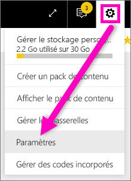
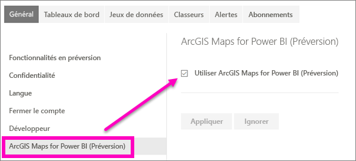

# Inscrivez-vous pour accéder aux fonctionnalités en version préliminaire de Power BI
## Que sont les*fonctionnalités en version préliminaire*?
Dans le cadre des améliorations que nous apportons à Power BI, nous allons publier certaines nouvelles fonctionnalités en tant que *fonctionnalités en version préliminaire*. Vous pouvez activer et désactiver ces dernières afin de les essayer.

> [!TIP]
> Vous avez des questions ou des commentaires ? [Visitez le forum de la communauté Power BI](http://community.powerbi.com/t5/Navigation-Preview-Forum/bd-p/NavigationPreview).
> 
> 

## Versions préliminaires actuellement disponibles
**Préversion d’ArcGIS Maps pour Power BI** : l’association d’ArcGIS Maps et Power BI porte le mappage au-delà de la simple présentation de points sur une carte, pour accéder à un nouveau niveau.
[Découvrez ArcGIS Maps par ESRI dans le service Power BI et Power BI Desktop](power-bi-visualization-arcgis.md).

## Activer et désactiver la fonctionnalité en préversion ArcGIS
1. Ouvrez le menu Paramètres en sélectionnant l’icône d’engrenage dans le coin supérieur droit de votre écran Power BI, puis choisissez **Paramètres**.
   
   .
2. Sélectionnez l’onglet **Général** et sélectionnez **Fonctionnalités en version préliminaire**.
   
   
3. Sélectionnez le bouton radio **Activé** pour essayer la nouvelle expérience. Cliquez sur **Appliquer**.
4. Pour désactiver les fonctionnalités en version préliminaire, suivez les étapes 1 et 2 ci-dessus, puis à l’étape 3, sélectionnez **Désactivé** > **Appliquer**.

## Étapes suivantes
[Nouvelle expérience de navigation Power BI](service-the-new-power-bi-experience.md)

Vous avez des questions ou des commentaires ? [Visitez le forum de la communauté Power BI](http://community.powerbi.com/t5/Navigation-Preview-Forum/bd-p/NavigationPreview).

