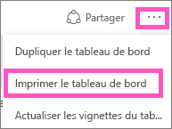
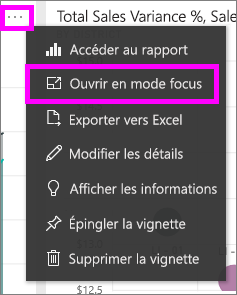
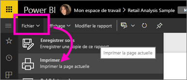

# Impression depuis le service Power BI
Imprimer un tableau de bord entier, une vignette de tableau de bord, une page de rapport ou un visuel de rapport à partir du service Power BI. Les rapports ne peuvent être imprimés qu’une page à la fois. Vous ne pouvez peut pas imprimer l’intégralité du rapport en une fois.

> [!NOTE]
> L’impression est disponible uniquement dans le service Power BI et non dans Power BI Desktop.
> 
> 

Regardez Amanda imprimer à partir de son tableau de bord et de son rapport. Suivez ensuite les instructions détaillées sous la vidéo pour essayer vous-même.

<iframe width="560" height="315" src="https://www.youtube.com/embed/jtlLGRKBvXY" frameborder="0" allowfullscreen></iframe>

## Imprimez un tableau de bord
1. Ouvrez le tableau de bord que vous souhaitez imprimer.
2. Dans le coin supérieur droit, sélectionnez les ellipses (…), puis **Imprimer le tableau de bord**.
   
    
3. La fenêtre d’impression de votre navigateur s’ouvre. Choisissez les paramètres et la destination d’impression, puis sélectionnez **Imprimer**.
   
   > [!NOTE]
   > La boîte de dialogue d’impression qui s’affiche dépend du navigateur que vous utilisez.
   > 
   
    

## Imprimez une vignette de tableau de bord
1. [Ouvrez la vignette en mode Focus](service-focus-mode.md) en sélectionnant les points de suspension et en choisissant l’icône Focus .
   
    
2. Ouvrez la vignette en [mode Plein écran](service-fullscreen-mode.md) en sélectionnant l’icône Plein écran  dans la barre de navigation supérieure.
3. Pointez sur la vignette pour afficher le menu Options
   
    
4. Sélectionnez l’icône Impression .     
   
   > [!NOTE]
   > La boîte de dialogue d’impression qui s’affiche dépend du navigateur que vous utilisez.
   > 
   > 

## Imprimez une page de rapport
Vous pouvez imprimer les rapport une seule page à la fois.

1. Ouvrez le rapport en mode Lecture ou Edition.
2. Sélectionnez **Fichier** > **Imprimer** pour imprimer la page de rapport active.
   
    
3. La fenêtre d’impression de votre navigateur s’ouvre.
   
   > [!NOTE]
   > La boîte de dialogue d’impression qui s’affiche dépend du navigateur que vous utilisez.
   > 
   > 

## Imprimez un visuel de rapport
1. [Ouvrez le visuel en mode Focus](service-focus-mode.md) en pointant sur la vignette et en sélectionnant l’icône Focus  en haut à droite.
2. Suivez les étapes 2 à 3 sous *Imprimer une page de rapport* ci-dessus.

## Considérations et résolution des problèmes
* Q : Je ne trouve pas le bouton **Imprimer**.    
* R : Si vous utilisez Power BI Desktop, l’impression n’est pas prise en charge.  L’impression fonctionne uniquement dans le service Power BI.
* Q : Je ne peux pas imprimer toutes les pages de rapport à la fois.    
* R : C’est exact. Vous ne pouvez imprimer qu’une page de rapport à la fois.
* Q : Je ne peux pas imprimer au format PDF.    
* R : Vous ne voyez cette option que si vous avez déjà configuré le pilote PDF dans votre navigateur.    
* Q : Ce que je vois lorsque je sélectionne **Imprimer** ne correspond pas à ce qui est affiché ici.    
* R : Les fenêtres d’impression varient selon la version du navigateur et des logiciels.
* Q : Mon impression n’est pas dimensionnée correctement.  Mon tableau de bord ne tient pas sur la page. Autres questions sur la mise à l’échelle et l’orientation.    
* R : Nous ne pouvons pas garantir que la copie imprimée aura exactement la même apparence que dans le service Power BI. Les fonctionnalités telles que la mise à l’échelle, les marges, les détails des visuels, l’orientation et la taille ne sont pas contrôlées par Power BI. Pour résoudre des problèmes de ce type, reportez-vous à la documentation de votre navigateur.      

## Étapes suivantes
[Partager des tableaux de bord et des rapports avec des collègues et d’autres utilisateurs](service-share-dashboards.md)

D’autres questions ? [Posez vos questions à la communauté Power BI](http://community.powerbi.com/)

