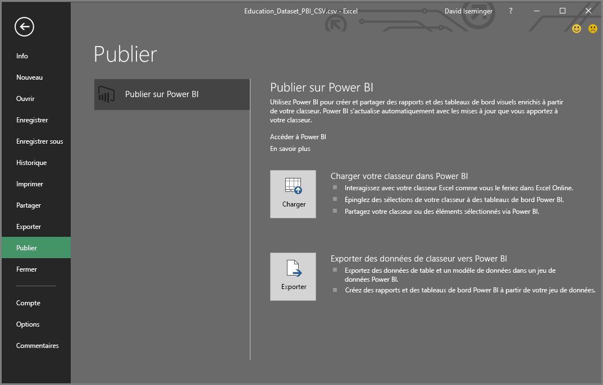

# Publier sur Power BI à partir d’Excel 2016
Avec Excel 2016, vous pouvez publier vos classeurs Excel directement sur votre site [Power BI](https://powerbi.microsoft.com), où vous pouvez créer des rapports interactifs et des tableaux de bord basés sur les données de votre classeur. Vous pouvez ensuite partager vos informations avec d’autres personnes au sein de votre organisation.

Veuillez lire les observations suivantes avant de continuer :

* Pour que vous puissiez publier sur Power BI, votre classeur doit être enregistré dans OneDrive Entreprise.
* Le compte que vous utilisez pour vous connecter à Office, OneDrive Entreprise et Power BI doit être le même.
* Vous ne pouvez pas publier un classeur vide ou dont aucun contenu n’est pris en charge par Power BI.
* Vous ne pouvez pas publier de classeurs chiffrés ou protégés par mot de passe, ou qui bénéficient de la gestion de la protection des informations.
* La publication sur Power BI requiert qu’une authentification moderne soit activée (valeur par défaut). Si elle est désactivée, l’option Publier n’est pas disponible dans le menu Fichier.

## Pour publier votre classeur Excel
Dans Excel, sélectionnez **Fichier** > **Publier**.

### Publication de fichier local
Depuis la mise à jour de février 2017, Excel 2016 prend en charge la publication de fichiers Excel locaux. Ceux-ci ne doivent pas nécessairement être enregistrés sur OneDrive Entreprise ou SharePoint Online.

> [!IMPORTANT]
> Seul Excel 2016 avec un abonnement Office 365 offre l’expérience de publication de fichiers locaux. La fonction « Publier » d’une installation autonome d’Excel 2016 nécessite l’enregistrement du classeur Excel sur OneDrive Entreprise ou SharePoint Online.
> 
> 

Lorsque vous sélectionnez **Publier**, vous pouvez sélectionner l’espace de travail sur lequel publier. Il peut s’agir de votre espace de travail personnel ou d’un espace de travail de groupe auquel vous avez accès.

Vous pouvez obtenir votre classeur dans Power BI de deux façons.

Une fois publié, il est conservé en tant que copie dans Power BI, séparé du fichier local. Si vous souhaitez mettre à jour le fichier dans Power BI, vous devez republier la version mise à jour. Vous pouvez actualiser les données et définir l’actualisation planifiée sur le classeur ou le jeu de données dans Power BI.

### Publication à partir d’Excel version autonome
Si le classeur n’est pas encore enregistré dans OneDrive, vous devez commencer par le faire. Sélectionnez Enregistrer dans le cloud, puis choisissez un emplacement sur OneDrive Entreprise.

Une fois votre classeur enregistré sur OneDrive, lorsque vous sélectionnez **Publier**, deux options vous sont proposées pour importer votre classeur dans Power BI.

#### Télécharger votre classeur dans Power BI
Lorsque vous choisissez cette option, votre classeur apparaît dans Power BI comme il le ferait dans Excel Online. Mais contrairement à Excel Online, Power BI offre des fonctionnalités permettant d’épingler les éléments de vos classeurs sur vos tableaux de bord.

Vous ne pouvez pas modifier votre classeur quand celui-ci est ouvert dans Power BI. Toutefois, si vous devez apporter des modifications, vous pouvez sélectionner **Modifier**, puis choisir de modifier le classeur dans Excel Online ou de l’ouvrir dans Excel sur votre ordinateur. Toutes les modifications apportées sont enregistrées dans le classeur sur OneDrive.

Lorsque vous téléchargez, aucun jeu de données n’est créé dans Power BI. Votre classeur apparaît sous Rapports dans le volet de navigation de votre espace de travail. Les classeurs téléchargés dans Power BI comportent une icône Excel spéciale, qui les identifie comme classeurs Excel ayant été téléchargés.

Choisissez cette option si vous avez uniquement des données dans des feuilles de calcul, ou si vous avez des tableaux croisés dynamiques et des graphiques que vous voulez afficher dans Power BI.
L’utilisation de l’option Télécharger à partir de la fonctionnalité Publier sur Power BI d’Excel équivaut à utiliser Obtenir des données > Fichier > OneDrive Entreprise > Se connecter, gérer et afficher Excel dans Power BI à partir de Power BI dans votre navigateur.

#### Exporter des données de classeur vers Power BI
Lorsque vous choisissez cette option, toutes les données prises en charge des tables et/ou modèles de données sont exportées dans un nouveau jeu de données dans Power BI. Si vous avez des feuilles Power View, celles-ci sont recréées dans Power BI sous forme de rapports.

Vous pouvez continuer à modifier votre classeur. Lorsque vos modifications sont enregistrées, elles sont synchronisées avec le jeu de données dans Power BI, généralement une heure plus tard environ. Pour un résultat immédiat, vous pouvez simplement sélectionner de nouveau Publier afin d’exporter aussitôt vos modifications. Les visualisations présentes dans vos rapports et tableaux de bord sont également mises à jour.

Choisissez cette option si vous avez utilisé la fonctionnalité Obtenir et transformer ou Power Pivot pour charger vos données dans un modèle de données, ou si votre classeur contient des feuilles Power View avec des visualisations que vous voulez afficher dans Power BI.

L’utilisation de l’option Exporter à partir de la fonctionnalité Publier sur Power BI d’Excel équivaut à utiliser Obtenir des données > Fichier > OneDrive Entreprise > Exporter des données Excel dans Power BI à partir de Power BI dans votre navigateur.

## Publication
Lorsque vous choisissez l’une de ces options, Excel se connecte à Power BI avec votre compte actuel, puis publie votre classeur sur votre site Power BI. Gardez un œil sur la barre d’état dans Excel. Elle indique la progression des opérations.

Lorsque vous avez terminé, vous pouvez accéder à Power BI directement dans Excel.

## Étapes suivantes
[Données Excel dans Power BI](service-excel-workbook-files.md)  
D’autres questions ? [Posez vos questions à la communauté Power BI](https://community.powerbi.com/)

