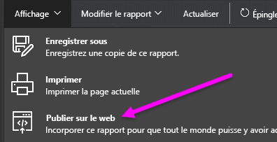
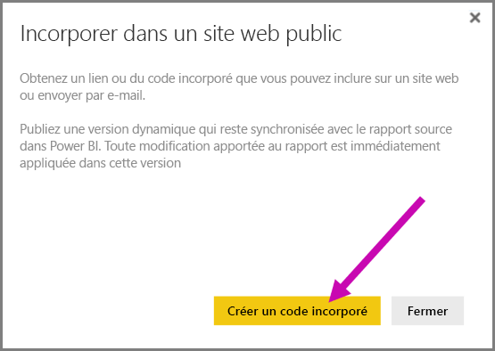
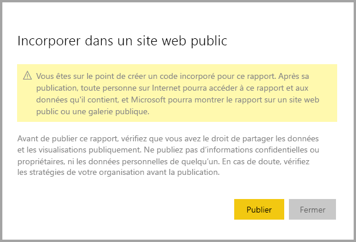
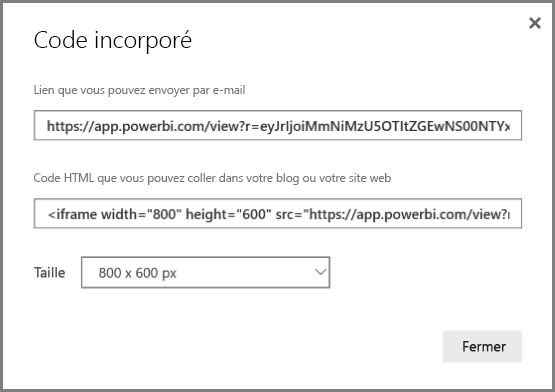
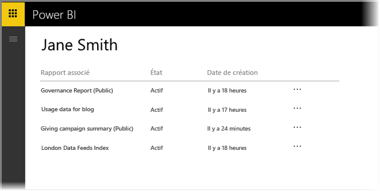
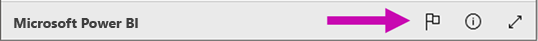

# Publication sur le web à partir de Power BI

Avec l’option **Publier sur le web** de Power BI, vous pouvez facilement incorporer des visualisations Power BI interactives en ligne, par exemple dans des billets de blog ou des sites web, par le biais d’e-mails ou des réseaux sociaux, sur l’appareil de votre choix. Vous pouvez également modifier, mettre à jour ou actualiser vos visuels publiés, ou bien annuler leur partage.

> [!WARNING]
> Quand vous utilisez **Publier sur le web**, tout le monde sur Internet peut voir le rapport ou visuel que vous publiez. Aucune authentification n’est nécessaire et cela inclut les données de niveau de détail qui sont agrégées dans vos rapports. Avant de publier un rapport, vérifiez que vous voulez bien partager les données et les visualisations publiquement. Ne publiez pas d’informations confidentielles ou propriétaires. En cas de doute, vérifiez les stratégies de votre organisation avant la publication.

>[!Note]
>Pour incorporer votre contenu en toute sécurité dans un portail interne ou site web, utilisez les options [Incorporer](service-embed-secure.md) ou [Incorporer dans SharePoint Online](service-embed-report-spo.md). Cela garantit que toutes les autorisations et la sécurité des données sont appliquées lorsque vos utilisateurs affichent vos données internes.

## Comment utiliser Publier sur le web

**Publier sur le web** est disponible pour les rapports que vous pouvez modifier dans vos espaces de travail personnel et de groupe.  Cette option n’est pas disponible pour les rapports partagés avec vous ni ceux qui s’appuient sur la sécurité au niveau des lignes pour sécuriser les données. Consultez la section [**Limitations**](#limitations) ci-dessous pour obtenir la liste complète des situations où l’option **Publier sur le web** n’est pas prise en charge. Lisez l’**avertissement** plus haut dans cet article avant d’utiliser la fonctionnalité **Publier sur le web**.

La courte vidéo suivante illustre son fonctionnement. Ensuite, essayez vous-même cette fonctionnalité dans les étapes ci-dessous.

<iframe width="560" height="315" src="https://www.youtube.com/embed/UF9QtqE7s4Y" frameborder="0" allowfullscreen></iframe>

Les étapes suivantes décrivent comment utiliser **Publier sur le web**.

1. Ouvrez un rapport dans votre espace de travail que vous pouvez modifier et sélectionnez **Fichier > Publier sur le web**.

   
   
2. Contactez votre [administrateur Power BI](service-admin-role.md) s’il ne vous a pas autorisé à créer des codes incorporés

   
   
   Pour obtenir de l’aide sur la recherche de la personne qui peut activer la fonctionnalité Publier sur le web dans votre organisation, [consultez ces conseils](#how-to-find-your-power-bi-administrator).

3. Passez en revue le contenu de la boîte de dialogue et sélectionnez **Créer un code incorporé**.

   

4. Lisez l’avertissement, illustré ici, puis confirmez que les données peuvent être incorporées dans un site web public. Le cas échéant, sélectionnez **Publier**.

   

5. Une boîte de dialogue s’affiche avec un lien. Vous pouvez envoyer ce lien par e-mail, l’incorporer dans le code (comme un iFrame) ou le coller directement dans une page web ou un blog.

   

6. Si vous avez déjà créé un code incorporé pour un rapport et que vous sélectionnez **Publier sur le web**, vous ne verrez pas les boîtes de dialogue des étapes 2 à 4. Au lieu de cela, la boîte de dialogue **Code incorporé** s’affiche :

   

   Vous pouvez créer un seul code incorporé pour chaque rapport.

## Trucs et astuces pour les modes d’affichage

Quand vous incorporez du contenu dans un billet de blog, vous avez généralement besoin de l’ajuster à une taille d’écran spécifique.  Vous pouvez ajuster la hauteur et la largeur de la balise iFrame selon vos besoins. Toutefois, vous devez vérifier que votre rapport tient dans la zone donnée de l’iFrame. C’est pourquoi vous devez également définir un mode d’affichage approprié quand vous modifiez le rapport.

Le tableau suivant fournit des instructions sur le mode d’affichage et les effets de son incorporation.

| Mode d’affichage | Son aspect quand il est incorporé |
| --- | --- |
|  |Le mode d’affichage **Ajuster à la page** respecte la hauteur et la largeur de page de votre rapport. Si vous définissez les proportions de votre page sur *Dynamique* (par exemple, 16:9 ou 4:3), votre contenu est ajusté au sein de l’iFrame. En cas d’incorporation dans un iFrame, l’utilisation de l’option **Ajuster à la page** risque de générer un *cadre*, où un fond gris est affiché dans des zones de l’iFrame après que le contenu a été mis à l’échelle de manière à s’ajuster à l’iFrame. Pour diminuer le cadre, définissez la hauteur et la largeur de l’iFrame de manière appropriée. |
|  |Avec le mode d’affichage **Taille réelle**, le rapport conserve sa taille telle qu’elle est définie dans la page de rapport. Des barres de défilement peuvent ainsi apparaître dans votre iFrame. Définissez la hauteur et la largeur de l’iFrame afin d’éviter les barres de défilement. |
|  |Avec le mode d’affichage **Ajuster à la largeur**, le contenu tient dans la zone horizontale de l’iFrame. Une bordure apparaît quand même, mais le contenu est mis à l’échelle pour utiliser tout l’espace horizontal disponible. |

## Conseils et astuces pour la hauteur et la largeur de l’iFrame

Un code incorporé **Publier sur le web** se présente comme l’exemple suivant :

 
Vous pouvez modifier manuellement la largeur et la hauteur pour vous assurer que le code s’adapte exactement à la page dans laquelle vous l’incorporez.

Pour obtenir un ajustement idéal, vous pouvez essayer d’ajouter 56 pixels à la hauteur de l’iFrame pour correspondre à la taille actuelle de la barre inférieure. Si la page de votre rapport utilise la taille dynamique, le tableau ci-dessous fournit des tailles que vous pouvez utiliser pour obtenir un ajustement sans cadre.

| Proportions | Taille | Dimensions (largeur x hauteur) |
| --- | --- | --- |
| 16:9 |Small |640 x 416 px |
| 16:9 |Medium |800 x 506 px |
| 16:9 |Large |960 x 596 px |
| 4:3 |Petite |640 x 536 px |
| 4:3 |Medium |800 x 656 px |
| 4:3 |Grande |960 x 776 px |

## Gérer des codes incorporés

Une fois que vous avez créé un code incorporé **Publier sur le web**, vous pouvez gérer vos codes à partir du menu **Paramètres** du service Power BI. Si vous gérez des codes incorporés, vous pouvez supprimer le visuel ou le rapport de destination d’un code (ce qui rend le code incorporé inutilisable) ou récupérer celui-ci.

1. Pour gérer vos codes incorporés **Publier sur le web** , ouvrez **Paramètres** et sélectionnez **Gérer des codes incorporés**.

   

2. Vos codes incorporés s’affichent.

   

3. Vous pouvez récupérer ou supprimer un code incorporé. Sa suppression désactive tous les liens vers ce rapport ou visuel.

   

4. Si vous sélectionnez **Supprimer**, vous êtes invité à confirmer.

   

## Mises à jour des rapports et actualisation des données

Après avoir créé et partagé votre code incorporé **Publier sur le web**, le rapport est mis à jour avec les modifications que vous apportez et le lien du code incorporé est immédiatement actif. Toute personne qui ouvre le lien peut l’afficher. Toutefois, après cette première action, environ une heure peut être nécessaire pour que les utilisateurs puissent voir les mises à jour des rapports ou des visuels. Pour en savoir plus, consultez la section [**Fonctionnement**](#howitworks) plus loin dans cet article. 

## Actualisation des données

Les actualisations de données sont répercutées automatiquement dans votre rapport ou élément visuel incorporé. Un délai d’environ une heure peut être nécessaire pour que les données actualisées soient visibles à partir des codes incorporés. Pour désactiver l’actualisation automatique, sélectionnez **Ne pas actualiser** dans la planification du jeu de données utilisé par le rapport.  

## Visuels personnalisés

Les éléments visuels personnalisés sont pris en charge par la fonctionnalité **Publier sur le web**. Quand vous utilisez la fonctionnalité **Publier sur le web**, les utilisateurs avec lesquels vous partagez votre visuel publié n’ont pas besoin d’activer les visuels personnalisés pour afficher le rapport.

## Limites

La fonctionnalité **Publier sur le web** est prise en charge pour la majeure partie des sources de données et rapports du service Power BI. Toutefois, les éléments suivants ne sont ni pris en charge ni disponibles avec la fonctionnalité **Publier sur le web** pour le moment :

- Rapports qui utilisent la sécurité au niveau des lignes
- Rapports qui utilisent une source de données de connexion active, notamment une source de données tabulaire Analysis Services hébergée localement, une source de données multidimensionnelle Analysis Services et Azure Analysis Services.
- Rapports partagés directement ou via un pack de contenu d’organisation
- Rapports d’un groupe dans lequel vous n’êtes pas un membre doté d’autorisations de modification
- Les visuels R ne sont actuellement pas pris en charge dans les rapports **Publier sur le web**.
- Exportation de données à partir de visuels dans un rapport qui a été publié sur le web.
- Visuels ArcGIS Maps for Power BI.
- Rapports contenant des mesures DAX au niveau du rapport.
- Modèles de requêtes de données à authentification unique.
- Informations confidentielles ou propriétaires sécurisées.
- [Jeux de données partagés et certifiés](service-datasets-share.md)
- La fonctionnalité d’authentification automatique fournie avec l’option **Incorporer** ne fonctionne pas avec l’API JavaScript Power BI. Pour l’API JavaScript Power BI, utilisez l’approche [les données appartiennent à l’utilisateur](developer/embed-sample-for-your-organization.md) pour l’incorporation.

## Paramètres de locataire

Le paramètre **Publier sur le web** fournit des options pour lesquelles les utilisateurs peuvent créer des codes incorporés.

Vous devrez contacter un administrateur Power BI pour créer un code incorporé lorsque l’option **Choisir comment fonctionnent les codes incorporés** est définie sur **Autoriser uniquement les codes incorporés existants** et que le paramètre **Publier sur le web** est **Activé**.

Les administrateurs Power BI peuvent activer ou désactiver la fonctionnalité **Publier sur le web**. Ils peuvent également restreindre l’accès à des groupes spécifiques, ce qui peut impacter votre capacité à créer un code incorporé. Les options présentées dans l’interface utilisateur varient en fonction de la nature du paramètre **Publier sur le web**.

|Caractéristique |Activée pour toute l’organisation |Désactivée pour toute l’organisation |Groupes de sécurité spécifiques   |
|---------|---------|---------|---------|
|**Publier sur le web** sous le menu **Fichier** du rapport|Activée pour tous|Non visible pour tous|Visible uniquement par les utilisateurs ou groupes autorisés.|
|**Gérer les codes d’incorporation** sous **Paramètres**|Activée pour tous|Activée pour tous|Activée pour tous.  Option * **Supprimer** uniquement pour les utilisateurs ou groupes autorisés. * **Obtenir les codes** activé pour tous.|
|**Codes d’incorporation** au sein du portail d’administration|L’état reflète l’une des valeurs suivantes : * Actif * Non pris en charge * Bloqué|L’état affiche **Désactivé**|L’état reflète l’une des valeurs suivantes : * Actif * Non pris en charge * Bloqué  Si un utilisateur n’est pas autorisé en fonction du paramètre de locataire, l’état affiche **violation**.|
|Rapports publiés existants|Tout activé|Tout désactivé|Les rapports continuent à être restitués pour tous.|

## Présentation de la colonne d’état du code incorporé

>[!Note]
>Examinez régulièrement les codes incorporés que vous avez publiés et supprimez ceux qui n’ont plus besoin d’être accessibles publiquement. 

La page **Gérer des codes incorporés** comprend une colonne d’état. Par défaut, les codes incorporés sont **actifs**, mais peuvent aussi présenter l’un des états listés ci-dessous.

| État | Description |
| --- | --- |
| **Actif** |Le rapport est à la disposition des utilisateurs Internet qui peuvent l’afficher et interagir avec. |
| **Bloqué** |Le contenu du rapport ne respecte pas les [conditions d’utilisation de Power BI](https://powerbi.microsoft.com/terms-of-service). Microsoft l’a bloqué. Si vous pensez que le contenu a été bloqué par erreur, contactez le support. |
| **Non pris en charge** |Le jeu de données du rapport utilise la sécurité au niveau des lignes ou une autre configuration non prise en charge. Pour obtenir la liste complète, consultez la section [**Limitations**](#limitations). |
| **Enfreint** |Le code incorporé est en dehors de la stratégie de locataire définie. Cela se produit généralement quand un code incorporé a été créé et que le paramètre de locataire **Publier sur le web** a été modifié de façon à exclure l’utilisateur qui possède le code incorporé. Si le paramètre de locataire est désactivé ou que l’utilisateur n’est plus autorisé à créer des codes incorporés, les codes incorporés existants affichent l’état **Enfreint**. |

## Comment signaler un problème lié à du contenu Publier sur le web

Pour signaler un problème lié à du contenu **Publier sur le web** incorporé dans un site web ou un blog, utilisez l’icône représentant un **drapeau** située dans la barre inférieure, comme illustré dans l’image suivante. Vous êtes invité à envoyer un e-mail à Microsoft pour expliquer votre problème. Microsoft évalue le contenu au regard des conditions d’utilisation de Power BI et prend les mesures nécessaires.

Pour signaler un problème, sélectionnez l’icône représentant un **drapeau** dans la barre inférieure du rapport **Publier sur le web** que vous êtes en train de consulter.

## Gestion des licences et tarification

Vous devez être un utilisateur de Microsoft Power BI pour utiliser la fonctionnalité **Publier sur le web**. Il n’est pas nécessaire que les lecteurs de votre rapport soient des utilisateurs de Power BI.

## Fonctionnement (détails techniques)

Quand vous créez un code incorporé à l’aide de la fonctionnalité **Publier sur le web**, vous permettez aux utilisateurs Internet de voir le rapport. Comme votre rapport est disponible publiquement, vous pouvez vous attendre à ce que des lecteurs le partagent facilement au moyen des réseaux sociaux. Quand les utilisateurs consultent le rapport, soit en ouvrant l’URL publique directe, soit en le consultant incorporé dans une page web ou un blog, Power BI met en cache la définition du rapport et les résultats des requêtes requises pour l’afficher. Cette approche garantit que le rapport est consultable par des milliers d’utilisateurs simultanés sans aucun impact sur les performances.

Le cache étant un cache à long terme, si vous mettez à jour la définition de rapport (par exemple, si vous changez son mode d’affichage) ou actualisez les données du rapport, les modifications se reflèteront dans la version du rapport consultée par vos utilisateurs au bout d’une heure environ. Il est donc recommandé d’anticiper votre travail et de créer le code incorporé **Publier sur le web** uniquement quand vous êtes satisfait des paramètres.

## Recherche de votre administrateur Power BI

Pour modifier les [paramètres de locataire Publier sur le web](#tenant-setting), vous devez collaborer avec [l’administrateur Power BI](service-admin-role.md) de votre organisation.

Pour les organisations de petite taille ou les personnes qui se sont inscrites à Power BI, vous n’avez peut-être pas encore un administrateur Power BI. Vous devez suivre notre [procédure de prise de contrôle de l’administrateur du locataire](https://docs.microsoft.com/azure/active-directory/users-groups-roles/domains-admin-takeover). Dès que vous disposez d’un administrateur Power BI, il peut activer la création d’un code incorporé.

En général, les organisations établies disposent déjà d’un administrateur Power BI. Les personnes avec l’un des rôles suivants peuvent agir en tant qu’administrateur Power BI :

- Administrateurs Office 365
- Administrateurs Azure Active Directory
- Utilisateurs avec le rôle d’administrateur du service Power BI dans Azure Active Directory

Vous devez [rechercher l’une de ces personnes](https://docs.microsoft.com/office365/admin/admin-overview/admin-overview#who-has-admin-permissions-in-my-business) au sein de votre organisation, car elle peut mettre à jour les paramètres.

## Étapes suivantes

- [Composant web du rapport SharePoint Online](service-embed-report-spo.md) 

- [Incorporer un rapport dans un site web ou portail sécurisé](service-embed-secure.md)

D’autres questions ? [Posez vos questions à la communauté Power BI](https://community.powerbi.com/)
