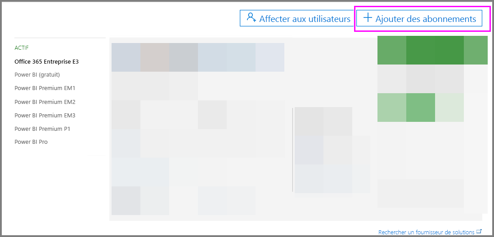
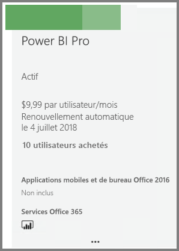

# Achat de Power BI Pro

Avec Power BI Pro, vous pouvez publier des rapports, partager des tableaux de bord, collaborer avec des collègues dans des espaces de travail et participer à d’autres activités associées. Pour plus d’informations sur la façon dont Power BI Pro peut bénéficier à votre entreprise, consultez [Power BI Pro dans votre organisation](service-power-bi-pro-in-your-organization.md).

## Achat de Power BI Pro via le Centre d’administration Office 365

Les administrateurs Office peuvent acheter Power BI Pro dans le cadre d’un abonnement Office 365 Entreprise E5 ou sous la forme d’un abonnement Power BI Pro distinct. Vous pouvez ensuite affecter des licences Power BI Pro aux utilisateurs appropriés. Pour plus d’informations sur l’affectation de licences, consultez [Affecter des licences à des utilisateurs dans Office 365](https://support.office.com/en-us/article/assign-licenses-to-users-in-office-365-for-business-997596b5-4173-4627-b915-36abac6786dc?ui=en-US&rs=en-US&ad=US).

Suivez ces étapes pour acheter Power BI Pro si vous êtes un administrateur Office :

1. Accédez au [Centre d’administration Office 365](https://portal.office.com/adminportal/home#/homepage).
2. Dans le volet de navigation gauche, sélectionnez Facturation, puis cliquez sur Abonnements.

    

3. Cliquez sur Ajouter des abonnements dans le coin supérieur droit de la page Abonnements.

    

4. Recherchez l’offre d’abonnement souhaitée :

    Sous Enterprise Suite, sélectionnez Office 365 Entreprise E5

    

    Sous Autres forfaits, sélectionnez Power BI Pro.

    

5. Placez le curseur sur les points de suspension (...) pour l’abonnement souhaité et sélectionnez Acheter maintenant.

    

6. Choisissez Paiement mensuel ou Paiement pour toute une année, en fonction de vos préférences de facturation.
7. Sous Combien d’utilisateurs voulez-vous ?, entrez le nombre de licences souhaitées, puis cliquez Commander maintenant ou sur Ajouter au panier, et finalisez la transaction.
8. Vérifiez que l’abonnement acquis est maintenant répertorié dans la page Abonnements.

   

> [!NOTE]
> Vous pouvez ajouter des licences supplémentaires après l’achat initial. Sélectionnez l’abonnement Power BI Pro dans la page Abonnements, puis cliquez sur Ajouter/supprimer des licences.
>

## Tarification

Pour les dernières informations tarifaires, consultez [Tarification de Power BI](https://powerbi.microsoft.com/en-us/pricing/).

## Étapes suivantes
[Inscription en libre-service à Power BI](service-admin-signing-up-for-power-bi-with-a-new-office-365-trial.md)
 
[Power BI (gratuit) dans votre organisation](service-admin-service-free-in-your-organization.md)
 
[Power BI Pro dans votre organisation](service-power-bi-pro-in-your-organization.md)
 
[Activation de la version d’essai Pro prolongée](service-extended-pro-trial.md)
 
[Affectation de licences Power BI Pro](service-assigning-power-bi-pro-licenses.md)
 
[Qu’est-ce que Power BI Premium ?](service-admin-premium-manage.md)
 
[Acheter Power BI Premium](service-admin-premium-purchase.md)
 
[Livre blanc sur Power BI Premium](https://aka.ms/pbipremiumwhitepaper)

D’autres questions ? [Essayez d’interroger la communauté Power BI](https://community.powerbi.com/)