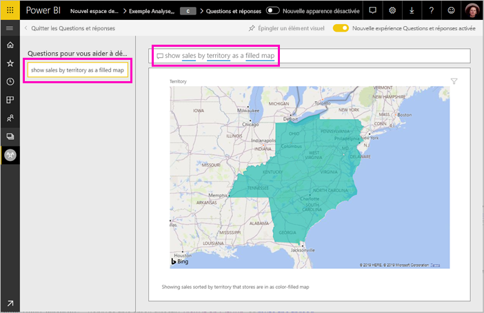

# Création de questions exemplaires pour les Q&R de Power BI
Si vous possédez un jeu de données, vous pouvez y ajouter vos propres questions exemplaires. Power BI Q & r affiche ces questions à vos collègues qui utilisent des rapports basés sur ce jeu de données.  Les questions exemplaires ont pour but de donner à vos collègues des idées sur les types de questions qu’ils peuvent poser concernant le jeu de données. Le choix des questions exemplaires que vous ajoutez vous appartient. Vous pouvez ajouter des questions fréquemment posées, des questions qui présentent des résultats intéressants ou des questions qui peuvent être difficiles à formuler.

> [!NOTE]
> Q questions proposées sont disponibles pour une utilisation dans le [application Microsoft Power BI pour iOS sur iPad, iPhone et iPod Touch](consumer/mobile/mobile-apps-ios-qna.md) et Power BI Desktop Q & A. La création de questions est uniquement disponible dans le service Power BI (app.powerbi.com).
> 

## Créer une question proposée

Cet article utilise [l’Exemple Analyse de la vente au détail](sample-datasets.md). Suivez ces instructions pas à pas pour essayer l’exploration d’un jeu de données vous-même.

1. Sur le tableau de bord, sélectionnez la zone de questions Questions et réponses.   Notez que les Q&R sont déjà utiles en affichant une liste de termes qui figurent dans le jeu de données.
2. Pour ajouter à cette liste, sélectionnez l’icône d’engrenage dans l’angle supérieur droit de Power BI.  
   
3. Sélectionnez **Paramètres** &gt; **Jeux de données** &gt; **Exemple Analyse de la vente au détail** &gt; **Questions exemplaires ds Q&R**.  
4. Sélectionnez **Ajouter une question**.
   
   
5. Tapez votre question dans la zone de texte, puis sélectionnez **Appliquer**.   Si vous le souhaitez, ajoutez une autre question en sélectionnant **Ajouter une question**.  
   
6. Revenez au tableau de bord de Power BI pour l’exemple « Retail Analysis Sample », puis placez le curseur dans la zone Q&R.   
   
7. La nouvelle question proposée **Sales by territory as a map** (Ventes par territoire sous forme de carte) figure en tête de la liste. Sélectionnez-la.  
8. La réponse s’affiche sous la forme d’une visualisation de carte remplie.  
   

## Étapes suivantes

- [Questions et réponses pour les consommateurs](consumer/end-user-q-and-a.md)  
- [Utiliser Q & r dans les tableaux de bord et rapports](power-bi-tutorial-q-and-a.md)  
- [Power BI – Concepts de base](consumer/end-user-basic-concepts.md)  

D’autres questions ? [Posez vos questions à la communauté Power BI](http://community.powerbi.com/)

