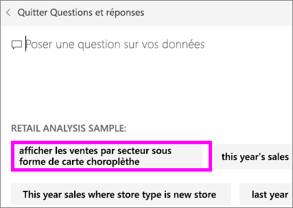
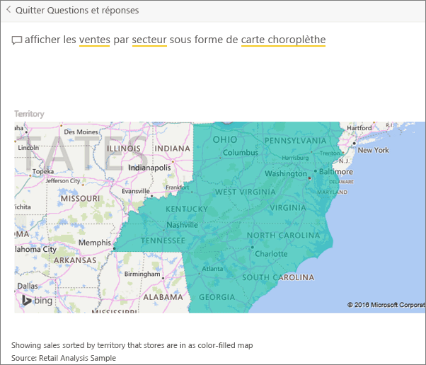

# Création de questions exemplaires pour les Q&R de Power BI
Si vous possédez un jeu de données, vous pouvez y ajouter vos propres questions exemplaires.  Questions et réponses dans Power BI affiche ces questions à ceux de vos collègues qui utilisent (*consomment*) votre jeu de données.  Les questions exemplaires ont pour but de donner à vos collègues des idées sur les types de questions qu’ils peuvent poser concernant le jeu de données. Le choix des questions exemplaires que vous ajoutez vous appartient. Vous pouvez ajouter des questions fréquemment posées, des questions qui présentent des résultats intéressants ou des questions qui peuvent être difficiles à formuler.

Regardez Will ajouter des questions proposées aux Q&R de Power BI et ensuite utiliser ces questions proposées pour explorer son jeu de données. Suivez ensuite les instructions détaillées sous la vidéo pour essayer vous-même.

<iframe width="560" height="315" src="https://www.youtube.com/embed/E1mIAyEXuF4" frameborder="0" allowfullscreen></iframe>

> [!NOTE]
> Les questions proposées par la fonctionnalité Questions et réponses sont disponibles dans l’[application Microsoft Power BI pour iOS sur les appareils iPad, iPhone et iPod Touch](mobile-apps-ios-qna.md) et la préversion de Questions et réponses dans Power BI Desktop. La création de questions n’est toutefois disponible que dans le service Power BI (app.powerbi.com).
> 

Cet article utilise [l’Exemple Analyse de la vente au détail](sample-datasets.md).

1. Sur le tableau de bord, sélectionnez la zone de questions Questions et réponses.   Notez que les Q&R sont déjà utiles en affichant une liste de termes qui figurent dans le jeu de données.
2. Pour compléter cette liste, sélectionnez l’icône d’engrenage dans le coin supérieur droit de Power BI.  
   
3. Sélectionnez **Paramètres** &gt; **Jeux de données** &gt; **Exemple Analyse de la vente au détail** &gt; **Questions exemplaires ds Q&R**.  
4. Sélectionnez **Ajouter une question**.
   
   
5. Tapez votre question dans la zone de texte, puis sélectionnez **Appliquer**.   Si vous le souhaitez, ajoutez une autre question en sélectionnant **Ajouter une question**.  
   
6. Revenez au tableau de bord de Power BI pour l’exemple « Retail Analysis Sample », puis placez le curseur dans la zone Q&R.   
   
7. La nouvelle question proposée **Sales by territory as a map** (Ventes par territoire sous forme de carte) figure en tête de la liste. Sélectionnez-la.  
8. La réponse s’affiche sous la forme d’une visualisation de carte remplie.  
   

### Étapes suivantes
[Q&R dans Power BI](power-bi-q-and-a.md)  
[Didacticiel : Présentation de Q&R de Power BI](power-bi-visualization-introduction-to-q-and-a.md)  
[Power BI – Concepts de base](service-basic-concepts.md)  
D’autres questions ? [Posez vos questions à la communauté Power BI](http://community.powerbi.com/)

