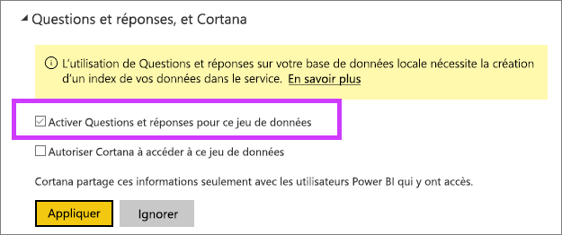

# Activer Questions et réponses pour les connexions actives
## Qu’est-ce que la passerelle de données locale ?  Qu’est-ce qu’une connexion active ?
Les jeux de données dans Power BI peuvent être importés dans Power BI ou vous pouvez établir une connexion active entre eux. La connexion active des jeux de données est souvent appelée « locale ». Les connexions actives sont gérées à l’aide d’une [passerelle](service-gateway-onprem.md), et les données et les requêtes sont envoyées dans les deux sens à l’aide de requêtes actives.

## Questions et réponses pour les jeux de données de la passerelle de données locale
Si vous souhaitez utiliser les Q&R avec des jeux de données auxquels vous accédez par le biais d’une passerelle, vous devez d’abord les activer.

Une fois activé, Power BI crée un index de votre source de données et charge un sous-ensemble de ces données dans Power BI pour permettre de poser des questions. L’opération de création de l’index initial peut prendre plusieurs minutes et Power BI effectue la maintenance et la mise à jour de l’index automatiquement à mesure que vos données évoluent. L’utilisation des Q&R avec ces jeux de données entraîne le même comportement qu’avec les données publiées sur Power BI. L’ensemble complet des fonctionnalités disponibles dans les Q&R est pris en charge dans les deux cas, notamment en cas d’utilisation de la source de données avec Cortana.

Lorsque vous posez des questions dans Power BI, les Q&R déterminent le meilleur visuel de construction ou de feuille de rapport à utiliser pour répondre à votre question à l’aide d’un index de votre jeu de données. Après avoir déterminé la meilleure réponse potentielle, les Q&R utilisent DirectQuery pour extraire des données actives à partir de la source de données à travers la passerelle pour remplir des graphiques et des diagrammes. Cela garantit que les résultats des Q&R Power BI affichent toujours les données les plus récentes directement à partir de la source de données sous-jacente.

Comme les Q&R Power BI utilisent des valeurs de texte et le schéma à partir de votre source de données pour déterminer comment interroger le modèle sous-jacent, les recherches de valeurs de texte spécifiques nouvelles ou supprimées (par exemple, en demandant un nom de client associé à un enregistrement de texte nouvellement ajouté) doivent pouvoir s’appuyer sur un index mis à jour avec les valeurs les plus récentes. Power BI met automatiquement à jour l’index de texte et de schéma dans une fenêtre de 60 minutes.

Pour plus d’informations, consultez :

* Qu’est-ce que la [passerelle de données locale](service-gateway-onprem.md) ?
* [Présentation de Q&R de Power BI](power-bi-q-and-a.md)

## Activer les Q&R
Une fois que vous avez configuré la passerelle de données, connectez-vous à vos données à partir de Power BI.  Créez un tableau de bord à l’aide de vos données locales ou téléchargez un fichier .pbix qui utilise des données locales.  Vous pouvez également disposer déjà des données locales dans des tableaux de bord, des rapports et des jeux de données qui ont été partagés avec vous.

1. En haut à droite de Power BI, sélectionnez l’icône de roue dentée , puis choisissez **Paramètres**.
   
   
2. Sélectionnez **Jeux de données**, puis choisissez le jeu de données à activer pour les Q&R.
   
   
3. Développez **Q&R et Cortana**, activez la case à cocher pour **activer les Q&R pour ce jeu de données** et choisissez **appliquer**.
   
    

## Quelles sont les données mises en cache et quelle est la politique de confidentialité ?
Lorsque vous activez les Q&R pour vos données locales, un sous-ensemble de données est mis en cache dans le service. Le but est d’assurer des performances de Q&R raisonnables. Power BI exclut les valeurs dépassant 24 caractères de la mise en cache. Le cache est supprimé après quelques heures une fois les Q&R désactivées en décochant la case permettant **d’activer les Q&R pour ce jeu de données**, ou lorsque vous supprimez votre jeu de données.

## Considérations et résolution des problèmes
La version préliminaire de cette fonctionnalité comprend plusieurs limitations :

* Initialement, la fonctionnalité n’est disponible que pour les sources de données tabulaires SQL Server 2016 Analysis Services. La fonctionnalité est optimisée pour travailler avec des données tabulaires. Certaines fonctionnalités sont disponibles pour les sources de données multidimensionnelles, mais l’expérience Questions et réponses complète n’est pas encore prise en charge pour ce type de données. D’autres sources de données prises en charge par la passerelle de données locale seront déployées au fil du temps.
* La prise en charge complète de la sécurité au niveau des lignes définie dans SQL Server Analysis Services n’est pas disponible initialement dans la préversion publique. Lorsque vous posez des questions dans les Q&R, la « saisie semi-automatique » des questions peut afficher de valeurs de chaînes auxquelles un utilisateur n’a pas accès. Toutefois, la sécurité au niveau des lignes définie dans le modèle est respectée pour les rapports et graphiques visuels. Aucune donnée numérique sous-jacente ne peut donc être exposée. Des options permettant de contrôler ce comportement seront disponibles dans des prochaines mises à jour.
* La sécurité au niveau objet (OLS) n’est pas prise en charge. Q&A ne respecte pas la sécurité au niveau objet et peut révéler les noms de tables ou de colonnes aux utilisateurs qui n’y ont pas accès. Vous avez tout intérêt à activer la sécurité au niveau des lignes (RLS) de façon à sécuriser aussi les valeurs de données. 
* Les connexions actives sont uniquement prises en charge avec la passerelle de données locale. Par conséquent, elles ne peuvent pas être utilisées avec la passerelle personnelle.

## Étapes suivantes
[Passerelle de données locale](service-gateway-onprem.md)  
[Gérer votre source de données - Analysis Services](service-gateway-enterprise-manage-ssas.md)  
[Power BI – Concepts de base](service-basic-concepts.md)  
[Présentation de Questions et réponses dans Power BI](power-bi-q-and-a.md)  

D’autres questions ? [Essayez d’interroger la communauté Power BI](http://community.powerbi.com/)

