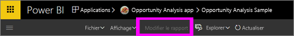
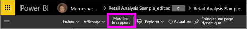
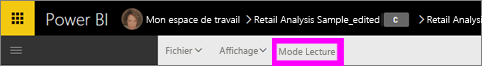

# Modes Lecture et Édition dans les rapports du service Power BI
Dans le service Power BI (mais pas dans Power BI Desktop), il existe deux modes d’utilisation et d’affichage des rapports : le mode Lecture et le mode Édition. Le mode Lecture est disponible pour tous les utilisateurs et il est spécialement conçu pour les *consommateurs* de données tandis que le mode Édition est disponible uniquement pour les propriétaires et les *créateurs* de rapports. 

## Mode Lecture des rapports

 Le mode Lecture permet d’explorer et d’exploiter le rapport. C’est un cadre amusant et une méthode sûre pour jouer et vous familiariser avec vos données. Le mode Lecture est conçu pour les *consommateurs* de rapports, à savoir les utilisateurs qui ouvrent des rapports à partir d’applications ou qui ont accès à des [rapports partagés](service-share-dashboards.md). Le mode Lecture permet de s’assurer que chaque consommateur unique d’un rapport spécifique voit le même rapport, les mêmes visualisations, avec les mêmes filtres appliqués.  Les consommateurs peuvent interagir avec les rapports, mais ne peuvent pas enregistrer les modifications.

>**Remarque** : dans certains cas, les consommateurs de rapports peuvent afficher diverses données en raison d’autorisations d’accès aux données et de la sécurité au niveau des lignes. 

## Mode Édition dans un rapport

Le mode Édition est uniquement disponible pour l’utilisateur qui a créé le rapport ou qui est [copropriétaire d’un rapport en tant que membre ou administrateur d’un espace de travail d’application](service-create-distribute-apps.md).

Le Mode Édition est conçu pour les *créateurs* de rapports. C’est l’emplacement où les créateurs importent des jeux de données et s’y connectent, explorent les données et créent des rapports et tableaux de bord. Le mode Édition permet aux *créateurs* d’affiner l’analyse de leurs données par l’ajout et la suppression des champs, la modification du type des visualisations, la création de nouvelles visualisations et l’ajout et la suppression des visualisations et des pages d’un rapport. Ils peuvent alors partager les rapports qu’ils créent avec des collègues.

## Mode Lecture et mode Édition
Ce graphique ne répertorie pas toutes les fonctionnalités de rapport du service Power BI ! Il répertorie uniquement les tâches de rapport qui ne sont pas disponibles **à la fois** en mode Lecture et en mode Édition. 

|Tâche  | Mode Lecture  | Mode Édition |
|-------------------------|-------|-------|
|**Rapports, en tant qu’ensemble**  |
||||
| [Créer ou modifier un rapport](service-report-create-new.md) | Non  | Oui |
| [Partager un rapport](service-share-reports.md)| Oui | Oui, ainsi que gérer les autorisations, notamment en attribuant d’autres autorisations de *propriétaire*. |
| [Créer des filtres permanents au niveau du visuel, du détail, de la page et du rapport à partir du volet Filtres](power-bi-report-add-filter.md) | Non  | Oui |
| [Utilisation du volet Filtres d’un rapport](power-bi-how-to-report-filter.md) | Oui, possibilité d’utiliser les filtres existants, mais les modifications ne sont pas enregistrées avec le rapport. | Oui |
| [Utiliser le volet Analytique d’un rapport](service-analytics-pane.md) | Non | Oui |
| [Options d’**affichage** des rapports](power-bi-report-display-settings.md) | Oui, à quelques exceptions près. | Oui, tous, y compris le quadrillage, l’alignement et le verrouillage. |
| [Créer une planification de l’actualisation](refresh-data.md) | Non  | Oui |
| [S’abonner à un rapport](service-report-subscribe.md) | Oui | Non |
| [Questions et réponses - Poser des questions dans des rapports](power-bi-q-and-a.md) | Non  | Oui |
| [Afficher les métriques d’utilisation](service-usage-metrics.md) | Oui, sur le canevas de rapport. | Oui, dans la liste des rapports (affichage de contenu) |
| [Afficher les éléments associés](service-related-content.md) | Oui, sur le canevas de rapport. | Oui, dans la liste des rapports (affichage de contenu) |
| [Enregistrer un rapport](service-report-save.md) | Oui, mais uniquement à l’aide de **Enregistrer sous**. | Oui |
| [Supprimer un rapport](service-delete.md) | Non  | Oui |
|**Page du rapport** |
||||
| [Ajouter ou renommer une page de rapport](power-bi-report-add-page.md)  | Non  | Oui  |
| [Dupliquer une page de rapport](power-bi-report-copy-paste-page.md) | Non  | Oui |
| [Supprimer une page de rapport](service-delete.md) | non | oui |
|**Utilisation des visualisations de rapports**|
||||
| [Ajouter des visualisations à un rapport](power-bi-report-add-visualizations-i.md) | Non  | Oui |
| [Ajouter des zones de texte et des formes à un rapport](power-bi-reports-add-text-and-shapes.md) | Non  | Oui |
| [Utiliser le volet Mise en forme du rapport](service-the-report-editor-take-a-tour.md) | Non | Oui |
| [Définir des interactions entre les visuels](service-reports-visual-interactions.md) | Non  | Oui |
| [Afficher les données utilisées pour créer la visualisation](service-reports-show-data.md) | Non  | Oui |
| [Configurer l’exploration](power-bi-visualization-drill-down.md) | Non  | Oui |
| [Modifier la visualisation utilisée](power-bi-report-change-visualization-type.md) | Non | Oui|
| [Supprimer une visualisation, une zone de texte ou une forme](service-delete.md)| Non | Oui |

## Basculer du mode Lecture au mode Édition et inversement
N’oubliez pas que seuls les propriétaires et les créateurs de rapports sont en mesure d’ouvrir un rapport en mode Édition.

1. Par défaut, un rapport s’ouvre généralement en mode Lecture. Vous êtes en mode Lecture si vous voyez une option **Modifier le rapport**. Si l’option **Modifier le rapport** est grisée, vous n’avez pas d’autorisations pour ouvrir le rapport en mode Édition.

   

2. Si l’option **Modifier le rapport** n’est pas grisée, sélectionnez-la pour ouvrir le rapport en mode Édition. 
   
   
   
   Le rapport est maintenant en mode Édition et utilise les mêmes [paramètres d’affichage](power-bi-report-display-settings.md) que ceux utilisés en mode Lecture.

2. Pour revenir au **mode Lecture**, sélectionnez le mode Lecture dans la barre de navigation supérieure.
   
    

### Étapes suivantes
Il existe de nombreuses façons d’interagir avec un rapport en mode Lecture, de découper vos données pour obtenir des informations détaillées et d’obtenir des réponses aux questions.  La rubrique suivante intitulée [Interagir avec un rapport en mode Lecture](service-interact-with-a-report-in-editing-view.md) décrit en détail certaines de ces méthodes.    
Revenez à [Rapports dans Power BI](service-reports.md)    
D’autres questions ? [Posez vos questions à la communauté Power BI](http://community.powerbi.com/) 

