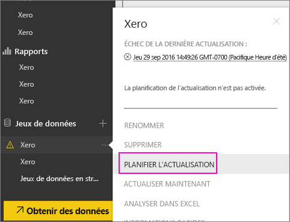
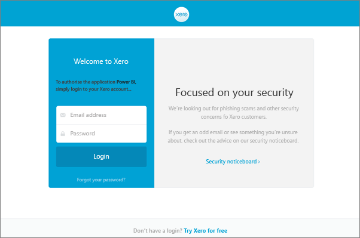

# Comment actualiser vos identifiants du pack de contenu Xerox si l’actualisation a échoué
Si vous utilisez le pack de contenu Xero Power BI, vous avez peut-être rencontré des problèmes relatifs à l’actualisation quotidienne du pack de contenu en raison d’un incident récent du service Power BI.

Pour voir si votre pack de contenu a été correctement actualisé, vérifiez le dernier état d’actualisation de votre jeu de données Xero, comme illustré dans la capture d’écran ci-dessous.

Si vous voyez que l’actualisation a échoué comme indiqué ci-dessus, suivez ces étapes pour renouveler les informations d’identification de votre pack de contenu.

1. Cliquez sur le bouton de sélection (...) en regard de votre jeu de données Xero, puis sur **Planifier l’actualisation**. Cela ouvre la page de paramètres du pack de contenu Xero.
   
    
2. Dans la page **Paramètres pour Xero**, sélectionnez **Informations d’identification de la source de données** > **Modifier les informations d’identification**.
   
    
3. Entrez le nom de votre organisation, puis sélectionnez **Suivant**.
   
    
4. Connectez-vous avec votre compte Xero.
   
    
5. Maintenant que vos informations d’identification sont mises à jour, vérifiez que la planification de l’actualisation est définie sur une exécution quotidienne. Pour ce faire, cliquez sur le bouton de sélection (...) en regard de votre jeu de données Xero, puis de nouveau sur **Planifier l’actualisation**.
   
    
6. Vous pouvez également choisir d’actualiser le jeu de données immédiatement. Cliquez sur le bouton de sélection (...) en regard de votre jeu de données Xero, puis sur **Actualiser maintenant**.
   
    

Si vous rencontrez encore des problèmes d’actualisation, n’hésitez pas à nous contacter à l’adresse [http://support.powerbi.com](http://support.powerbi.com) 

Pour en savoir plus sur le pack de contenu Xero pour Power BI, consultez la [page d’aide sur le pack de contenu Xero](service-connect-to-xero.md).

### Étapes suivantes
* D’autres questions ? [Posez vos questions à la communauté Power BI](http://community.powerbi.com/)

