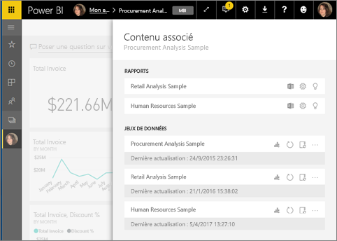
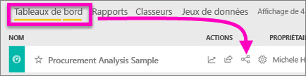
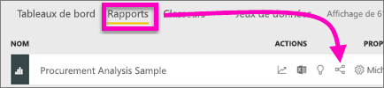
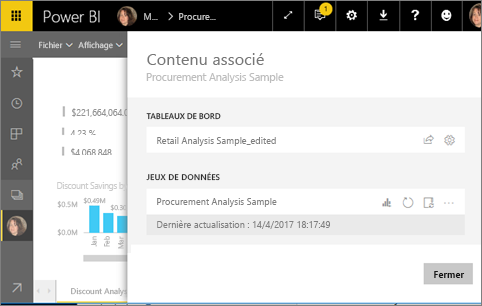
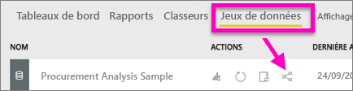

# Afficher un contenu associé dans le service Power BI
Le volet **Contenu associé** montre les interconnexions entre les éléments de contenu du service Power BI (tableaux de bord, rapports et jeux de données).  Et il s’améliore, car il permet d’effectuer des tâches courantes : actualisation, changement de nom, génération d’informations, et bien plus encore. Sélectionnez un rapport ou un tableau de bord pour l’ouvrir dans votre espace de travail Power BI.   

Comme vous l’avez probablement déjà remarqué, les rapports sont générés à partir de jeux de données. Leurs visualisations sont ensuite épinglées aux tableaux de bord, et les visuels des tableaux de bord sont reliés aux rapports. Mais comment savoir quels tableaux de bord hébergent les visualisations de votre rapport Marketing ? Et comment localiser ces tableaux de bord ? Votre tableau de bord d’approvisionnement utilise-t-il des visualisations de plusieurs jeu de données ? Si tel est le cas, quels sont leur noms et comment les ouvrir et les modifier ? Votre jeu de données HR est-il utilisé dans des rapports ou tableaux de bord, ou pouvez-vous le déplacer sans provoquer de rupture de lien ? Le volet **Contenu associé** répond à toutes ces questions.  En plus d’afficher le contenu associé, ce volet permet d’agir sur celui-ci et de naviguer aisément entre ses éléments.

> [!NOTE]
> La fonctionnalité Contenu associé ne fonctionne pas pour les jeux de données de streaming.
> 
> 

## Afficher le contenu associé d’un tableau de bord
Regardez Will pendant qu’il affiche le contenu associé d’un tableau de bord. Suivez ensuite les instructions détaillées sous la vidéo pour essayer par vous-même en utilisant l’exemple de jeu de données Analyse de l’approvisionnement.

<iframe width="560" height="315" src="https://www.youtube.com/embed/B2vd4MQrz4M#t=3m05s" frameborder="0" allowfullscreen></iframe>

Pour pouvoir ouvrir le volet **Contenu associé**, vous devez disposer au minimum de l’autorisation d’*Affichage* sur le tableau de bord concerné. Pour illustrer notre propos, nous utilisons l’[exemple Analyse de l’approvisionnement](sample-procurement.md).

**Méthode 1**

Dans un espace de travail, sélectionnez l’onglet **Tableaux de bord**, puis l’icône **Afficher les éléments associés** .

 

**Méthode 2**

Dans un tableau de bord ouvert, sélectionnez  dans la barre de menus supérieure.

Le volet **Contenu associé** s’ouvre. Il affiche tous les rapports dont des visualisations sont épinglées au tableau de bord ainsi que les jeux de données associés. Pour ce tableau de bord, les visualisations de 3 rapports différents sont épinglées, et ces rapports sont basés sur 3 jeux de données différents.

À ce stade, vous pouvez agir directement sur le contenu associé.  Par exemple, sélectionnez un nom de rapport pour ouvrir celui-ci.  Pour un rapport répertorié, sélectionnez une icône pour [analyser dans Excel](service-analyze-in-excel.md), [renommer](service-rename.md) ou [obtenir des informations](service-insights.md). Pour un jeu de données, sélectionnez une icône pour [créer un rapport](service-report-create-new.md), [actualiser](refresh-data.md), renommer, [analyser dans Excel](service-analyze-in-excel.md), [obtenir des informations](service-insights.md) ou ouvrir la fenêtre **Paramètres** du jeu de données.  

## Afficher le contenu associé d’un rapport
Pour pouvoir ouvrir le volet **Contenu associé**, vous devez disposer au minimum de l’autorisation d’*Affichage* sur le rapport concerné. Pour illustrer notre propos, nous utilisons l’[exemple Analyse de l’approvisionnement](sample-procurement.md).

**Méthode 1**

Dans un espace de travail, sélectionnez l’onglet **Rapports**, puis l’icône **Afficher les éléments associés** .

 
**Méthode 2**

Ouvrez le rapport en [Mode Lecture](service-reading-view-and-editing-view.md), puis, dans la barre de menus supérieure, sélectionnez .

Le volet **Contenu associé** s’ouvre. Il affiche le jeu de données associé et tous les tableaux de bord qui ont au moins une vignette épinglée du rapport. Pour ce rapport, des visualisations sont épinglées à 2 tableaux de bord.

À ce stade, vous pouvez agir directement sur le contenu associé.  Par exemple, sélectionnez un nom de tableau de bord pour ouvrir celui-ci.  Pour un tableau de bord quelconque répertorié dans la liste, sélectionnez une icône pour [partager le tableau de bord](service-share-dashboards.md) ou ouvrir la fenêtre **Paramètres** du tableau de bord. Pour le jeu de données, sélectionnez une icône pour [créer un rapport](service-report-create-new.md), [actualiser](refresh-data.md), renommer, [analyser dans Excel](service-analyze-in-excel.md), [obtenir des informations](service-insights.md) ou ouvrir la fenêtre **Paramètres** du jeu de données.  

## Afficher le contenu associé d’un jeu de données
Pour pouvoir ouvrir le volet **Contenu associé**, vous devez disposer au minimum de l’autorisation d’*Affichage* sur le jeu de données concerné. Pour illustrer notre propos, nous utilisons l’[exemple Analyse de l’approvisionnement](sample-procurement.md).

Dans un espace de travail, sélectionnez l’onglet **Jeux de données**, puis localisez l’icône **Afficher les éléments associés** .

Sélectionnez l’icône pour ouvrir le volet **Contenu associé**.

À ce stade, vous pouvez agir directement sur le contenu associé.  Par exemple, sélectionnez un nom de tableau de bord ou de rapport à ouvrir.  Pour un tableau de bord quelconque répertorié dans la liste, sélectionnez une icône pour [partager le tableau de bord](service-share-dashboards.md) ou ouvrir la fenêtre **Paramètres** du tableau de bord. Pour un rapport, sélectionnez une icône pour [analyser dans Excel](service-analyze-in-excel.md), [renommer](service-rename.md) ou [obtenir des informations](service-insights.md).  

## Limitations et résolution des problèmes
* Si votre navigateur n’offre pas un espace suffisant, vous ne voyez pas l’option **Afficher les éléments associés**, mais vous voyez toujours l’icône Afficher les éléments associés . Sélectionnez l’icône pour ouvrir le volet **Contenu associé**.
* Pour ouvrir le contenu associé d’un rapport, vous devez être en [Mode lecture](service-reading-view-and-editing-view.md).
* Le contenu connexe n’est pas disponible dans Power BI Desktop.
* La fonctionnalité Contenu associé ne fonctionne pas pour les jeux de données de streaming.

## Étapes suivantes
* [Prise en main du service Power BI](service-get-started.md)
* D’autres questions ? [Posez vos questions à la communauté Power BI](http://community.powerbi.com/)

