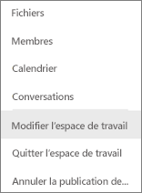

# Renommer pratiquement tout élément dans le service Power BI
Cet article explique comment renommer un tableau de bord, un rapport, une page de rapport, un classeur, un jeu de données, une application et un espace de travail dans le service Power BI.

**Puis-je modifier le nom ?**

| Type de contenu | Je suis l’auteur ou le créateur | Partagé avec moi |
| --- | --- | --- |
| Tableau de bord dans un espace de travail |Oui |Non |
| Rapport dans un espace de travail |Oui |Non |
| Classeur dans un espace de travail |Oui |Non |
| Jeu de données dans un espace de travail |Oui |Non |
| Espace de travail d’application |Oui, si vous êtes le propriétaire ou disposez d’autorisations d’administrateur |Non |
| Applications publiées |Pas dans l’écran de l’application, mais vous pouvez modifier le nom de l’application dans l’espace de travail de l’application, puis republier celle-ci sous le nouveau nom si vous disposez d’autorisations d’administrateur |Non |
| Contenu d’application (tableau de bord, rapport, classeur, jeu de données) |Pas dans l’écran de l’application, mais vous pouvez modifier le contenu de l’application dans l’espace de travail de l’application, puis republier celle-ci sous le nouveau nom si vous disposez d’autorisations d’administrateur |Non |
| Contenu de **Partagé avec moi** |Non |Non |

## Renommer un tableau de bord, un rapport ou un classeur
1. Démarrez dans un espace de travail, puis sélectionnez l’onglet **Tableaux de bord**, **apports** ou **Classeurs**. Pointez sur l’élément à renommer, puis sélectionnez l’icône d’engrenage . En l’absence d’icône d’engrenage, vous n’avez pas l’autorisation de renommer.
   
   
2. Dans la page Paramètres, tapez le nouveau nom, puis sélectionnez **Enregistrer**.
   
   

## Renommer un jeu de données
1. Démarrer dans un espace de travail, puis sélectionnez l’onglet **Jeux de données**.
   
   
2. Pointez sur l’élément à renommer, sélectionnez les points de suspension (…), puis choisissez **Renommer**.  
   
      
   
   > [!NOTE]
   > Les options dans la liste déroulante varient.
   > 
   > 
3. Dans la page Paramètres, tapez un nouveau nom, puis sélectionnez **Enregistrer**.
   
     

## Renommer un espace de travail d’application
Toute personne disposant d’autorisations d’administrateur peut renommer un espace de travail d’application.

1. Démarrez dans l’espace de travail que vous souhaitez renommer.
2. Dans l’angle supérieur droit, sélectionnez les points de suspension (…), puis choisissez **Modifier l’espace de travail**. Si vous ne voyez pas cette option, vous n’avez pas l’autorisation de renommer cet espace de travail. 
   
    
3. Tapez un nouveau nom d’espace de travail, puis sélectionnez **Enregistrer**.
   
   

## Renommer une page dans un rapport
Vous n’aimez pas le nom d’une page dans votre rapport Power BI ?  Un simple clic est nécessaire pour le modifier. Vous ne pouvez pas renommer des pages en [mode Édition de rapport](service-interact-with-a-report-in-editing-view.md).

1. Ouvrez le rapport en [mode Édition](service-reading-view-and-editing-view.md).
2. Repérez les onglets de page de rapport en bas de la fenêtre Power BI.
   
    
3. Ouvrez la page de rapport à renommer en sélectionnant l’onglet correspondant.
4. Double-cliquez sur le nom sous l’onglet pour le mettre en surbrillance.  
   
    
5. Tapez un nouveau nom de page de rapport, puis sélectionnez Entrée.
   
    

## Considérations et résolution des problèmes
* Si l’élément à renommer a été partagé avec vous ou fait partie d’un pack de contenu, vous ne voyez pas l’icône Engrenage et n’avez pas accès aux paramètres.
* Sous l’onglet **Jeux de données**, si vous ne voyez pas les points de suspension (…), développez la fenêtre de votre navigateur.

D’autres questions ? [Posez vos questions à la communauté Power BI](http://community.powerbi.com/)

