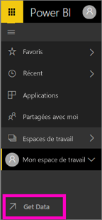

# Créer un rapport dans le service Power BI en important un jeu de données
Vous avez lu [apports dans Power BI](consumer/end-user-reports.md) et vous souhaitez maintenant créer vos propres rapports. Il existe différentes façons de créer un rapport. Dans cet article, nous allons commencer en créant un rapport de base dans le service Power BI à partir d’un jeu de données Excel. Une fois que vous comprenez les principes fondamentaux de création d’un rapport, consultez le [étapes suivantes](#next-steps) à la fin pour en savoir plus avancée des rubriques de rapport.  

## Conditions préalables
- [S’inscrire pour le service Power BI](service-self-service-signup-for-power-bi.md). Pour créer des rapports à l’aide de Power BI Desktop, consultez [affichage rapport Desktop](desktop-report-view.md). 
- [Télécharger le jeu de données Excel d’exemple Retail Analysis](http://go.microsoft.com/fwlink/?LinkId=529778) et l’enregistrer dans OneDrive entreprise ou localement.

## Importer le jeu de données
Cette méthode de création d’un rapport démarre avec un jeu de données et un canevas de rapport vide. Vous pouvez suivre la procédure dans le jeu de données Excel d’exemple analyse de vente au détail.

1. Nous allons créer le rapport dans un espace de travail du service Power BI, par conséquent, sélectionnez un espace de travail existant ou créer un.
   
   
2. En bas du volet de navigation gauche, sélectionnez **obtenir des données**.
   
   
3. Sélectionnez **Fichiers**, puis accédez à l’emplacement dans lequel vous avez enregistré l’exemple Analyse de la vente au détail.
   
    
4. Dans cet exercice, sélectionnez **Importer**.
   
   
5. Une fois le jeu de données importé, sélectionnez **Afficher le jeu de données**.
   
   
6. L’affichage d’un jeu de données a pour effet d’ouvrir l’éditeur de rapport.  Vous y voyez un canevas vide et des outils d’édition de rapports.
   
   

> [!TIP]
> Si vous n’êtes pas familiarisé avec le canevas de modification de rapport ou que vous avez besoin d’un rappel, [visite guidée de l’éditeur de rapport](service-the-report-editor-take-a-tour.md) avant de continuer. > 
> 

## Ajouter une jauge radiale au rapport
À présent que notre jeu de données est importé, commençons à répondre à quelques questions.  Notre Directrice marketing veut savoir où nous en sommes par rapport aux objectifs de ventes de cette année. Une jauge est un [bon choix de visualisation](visuals/power-bi-report-visualizations.md) pour l’affichage de ce type d’information.

1. Dans le volet Champs, sélectionnez **Sales (Ventes)**  > **This Year Sales (Ventes de cette année)**  > **Value (Valeur)** .
   
    
2. Convertissez le visuel en jauge en sélectionnant le modèle Jauge  dans le volet **Visualisations**.
   
    
3. Faites glisser **Sales (Ventes)**  > **This Year Sales (Ventes de cette année)**  > **Goal (Objectif)** dans la zone **Target value (Valeur cible)** . Il semble que nous sommes très proches de notre objectif.
   
    
4. Maintenant serait un bon moment pour enregistrer votre rapport.
   
   

## Ajouter un graphique en aires et un segment au rapport
Notre Directrice marketing a des questions supplémentaires à nous poser. Elle souhaite savoir comment se comportent les ventes de cette année par rapport à l’année dernière. Elle souhaite voir les résultats par district.

1. Tout d’abord, nous allons libérer de l’espace sur notre canevas. Sélectionnez la jauge et déplacez-la dans l’angle supérieur droit. Ensuite, faites glisser un des angles de la jauge, puis réduisez la taille de celle-ci.
2. Désélectionnez la jauge. Dans le volet Champs, sélectionnez **Sales (Ventes)**  > **This Year Sales (Ventes de cette année)**  > **Value (Valeur)** , puis sélectionnez **Sales (Ventes)**  > **Last Year Sales (Ventes de l’année dernière)** .
   
    
3. Convertissez le visuel en graphique en aires en sélectionnant le modèle Graphique en aires  dans le volet **Visualisations**.
4. Sélectionnez **Time** > **Period** (Période) pour l’ajouter au puits **Axe**.
   
    
5. Pour trier la visualisation par période, sélectionnez les points de suspension, puis choisissez **Trier par période**.
6. Nous allons à présent ajouter le segment. Sélectionnez une zone vide sur le canevas et choisissez le modèle Segment  . Nous disposons désormais d’un segment vide sur notre canevas.
   
        
7. Dans le volet Champs, sélectionnez **District** > **District**. Déplacez et redimensionnez le segment.
   
      
8. Utilisez le segment pour rechercher des modèles et des informations par secteur.
   
     

Continuer d’explorer vos données et d’ajouter des visualisations. Lorsque vous trouvez des informations particulièrement intéressantes, [épinglez-les à un tableau de bord](service-dashboard-pin-tile-from-report.md).

## Étapes suivantes

* Découvrez comment [épingler des visualisations à un tableau de bord](service-dashboard-pin-tile-from-report.md).   
* D’autres questions ? [Posez vos questions à la communauté Power BI](http://community.powerbi.com/)

