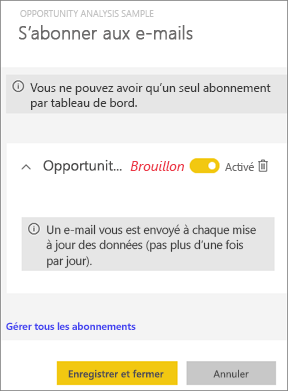
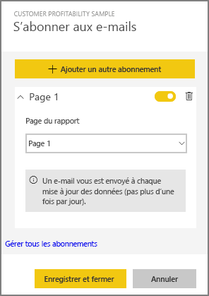
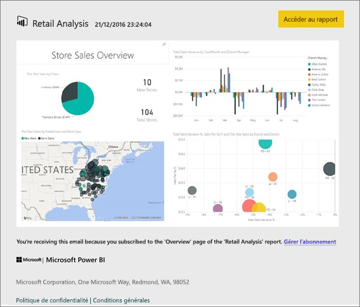
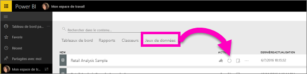

# S’abonner à un rapport ou tableau de bord Power BI
Vous pouvez à présent connaître encore plus facilement l’état de vos rapports et tableaux de bord les plus importants. Abonnez-vous aux pages de rapport et tableaux de bord qui vous intéressent le plus pour que Power BI envoie une capture instantanée dans votre boîte de réception. Indiquez à Power BI la fréquence à laquelle vous souhaitez recevoir des e-mails : de une fois par jour à une fois par semaine. La messagerie et la capture instantanée utilisent la langue définie dans les paramètres Power BI. Si aucune langue n’est définie, Power BI utilise la langue actuelle du navigateur.

Pour afficher ou définir vos préférences de langue, sélectionnez l’icône représentant une roue dentée  **> Paramètres > Général > Langue**.

> [!NOTE]
> Les abonnements peuvent être créés uniquement dans le service Power BI. Lorsque vous recevez le courrier électronique, celui-ci inclut un lien qui permet d’accéder au rapport/tableau de bord. Sur les appareils mobiles sur lesquels les applications Power BI sont installées, la sélection de ce lien lance l’application (par opposition à l’action par défaut qui ouvre le rapport ou le tableau de bord sur le site web Power BI).
> 
> 

Regardez la façon dont Sirui configure un abonnement par courrier à un rapport. Suivez ensuite les instructions détaillées sous la vidéo pour essayer vous-même.

<iframe width="560" height="315" src="https://www.youtube.com/embed/saQx7G0pxhc" frameborder="0" allowfullscreen></iframe>

## Configuration requise
La **création** d’un abonnement est une fonctionnalité Power BI Pro et vous devez avoir des autorisations d’affichage ou de modification du contenu (tableau de bord ou rapport).

## S’abonner à un tableau de bord

1. Ouvrez le tableau de bord.
2. Dans la barre de menus supérieure, sélectionnez **S’abonner** ou l’icône en forme d’enveloppe .
   
   
3. Utilisez le curseur jaune pour activer ou désactiver l’abonnement.  Lorsque vous définissez le curseur sur la position Désactivé, cela ne supprime pas l’abonnement. Pour supprimer l’abonnement, sélectionnez l’icône Corbeille.
   
   
4. Sélectionnez **Enregistrer et fermer** pour enregistrer l’abonnement. Une capture instantanée du tableau de bord vous est envoyée par e-mail chaque fois que les jeux de données sous-jacents changent. Si le tableau de bord s’actualise plusieurs fois par jour, vous recevez la capture instantanée par courrier après la première actualisation.
   
   
   
   > [!TIP]
   > Vous voulez voir l’e-mail tout de suite ? Déclenchez l’envoi d’un e-mail en actualisant l’un des jeux de données associés au tableau de bord (si vous n’êtes pas autorisé à modifier le jeu de données, vous devez demander à une personne disposant des autorisations nécessaires d’effectuer cette tâche pour vous). Pour identifier les jeux de données utilisés pour créer le tableau de bord, dans celui-ci, sélectionnez l’icône **Afficher les éléments associés**  afin d’ouvrir le **Contenu associé**, puis sélectionnez l’icône Actualiser . 
   > 
   > 
   
   

## S’abonner à une page de rapport
1. Ouvrez le rapport en [mode Lecture](service-reading-view-and-editing-view.md).
2. Dans la barre de menus supérieure, sélectionnez **S’abonner**.
   
   
3. Vous pouvez vous abonner à une page de rapport à la fois. Dans la liste déroulante, sélectionnez la page de rapport concernée.
   
   
   
   Continuez à ajouter des pages de rapport.
4. Utilisez le curseur jaune pour activer ou désactiver l’abonnement pour chaque page.  Lorsque vous définissez le curseur sur la position Désactivé, cela ne supprime pas l’abonnement. Pour supprimer l’abonnement, sélectionnez l’icône Corbeille.
   
   
5. Sélectionnez **Enregistrer et fermer** pour enregistrer l’abonnement. Vous recevez ensuite par e-mail une capture instantanée de chaque page de rapport lorsque le rapport est actualisé. Si le rapport n’est pas actualisé, vous ne recevez pas d’instantané par e-mail le jour en question.  Si le rapport s’actualise plusieurs fois par jour, vous recevez l’instantané par e-mail après la première actualisation.
   
   
   
   > [!TIP]
   > Vous voulez voir l’e-mail tout de suite ? Pour déclencher l’envoi d’un e-mail, ouvrez votre jeu de données et sélectionnez **Actualiser maintenant**. Si vous ne disposez pas des autorisations de modification du jeu de données, vous devez demander à un utilisateur doté de ces autorisations d’effectuer cette tâche pour vous.
   > 
   > 
   > 
   > 

## Détermination de la planification de l’envoi des courriers d’abonnement aux rapports
Le tableau suivant décrit la fréquence à laquelle vous recevez un e-mail. Tout dépend de la méthode de connexion du jeu de données sur lequel le rapport ou tableau de bord est basé (DirectQuery, connexion active, importation dans Power BI ou fichier Excel dans OneDrive ou SharePoint Online) et des options d’abonnement disponibles et activées (quotidien, hebdomadaire ou aucun).

|  | **DirectQuery** | **Connexion active** | **Actualisation planifiée (importation)** | **Fichier Excel dans OneDrive/SharePoint Online** |
| --- | --- | --- | --- | --- |
| **À quelle fréquence le rapport/tableau de bord est-il actualisé ?** |Toutes les 15 minutes |Toutes les 15 minutes, Power BI vérifie si le jeu de données a changé : si c’est le cas, le rapport est actualisé. |L’utilisateur sélectionne Aucun, Quotidien ou Hebdomadaire. L’option Quotidien peut correspondre à une fréquence de 8 fois par jour. L’option Hebdomadaire correspond en fait à une planification hebdomadaire que l’utilisateur crée et pour laquelle il définit l’actualisation (de une fois par semaine à tous les jours). |Une fois par heure |
| **Quel degré de contrôle a l’utilisateur sur la planification des e-mails d’abonnement ?** |Les options sont les suivantes : quotidienne ou hebdomadaire |Aucune option : l’utilisateur reçoit un e-mail si le rapport est actualisé, mais pas plus d’une fois par jour. |Si la planification de l’actualisation est quotidienne, les options sont Quotidienne ou Hebdomadaire.  Si la planification de l’actualisation est hebdomadaire, la seule option est Hebdomadaire. |Aucune option : l’utilisateur reçoit un e-mail dès que le jeu de données est mis à jour, mais pas plus d’une fois par jour. |

## Gérer vos abonnements
L’écran de gestion des abonnements est accessible de 2 façons.  La première méthode consiste à sélectionner **Gérer tous les abonnements** à partir de la boîte de dialogue **Abonnez-vous aux e-mails** (voir l’étape 3 ci-dessus). La deuxième consiste à sélectionner l’icône en forme de roue dentée Power BI  à partir de la barre de menus supérieure et à choisir **Paramètres**.

Les abonnements particuliers affichés dépendent de l’espace de travail actuellement actif.  Pour afficher tous les abonnements à la fois pour tous les espaces de travail, vérifiez que **Mon espace de travail** est actif. Pour comprendre le fonctionnement des espaces de travail, consultez [Espaces de travail dans Power BI](service-create-distribute-apps.md).

Un abonnement se termine si la licence Pro arrive à expiration, si le tableau de bord ou le rapport est supprimé par le propriétaire ou si le compte d’utilisateur utilisé pour créer l’abonnement est supprimé.

## Considérations et résolution des problèmes
* À l’heure actuelle, il est impossible de s’abonner aux rapports/tableaux de bord issus des packs de contenu ou applications Power BI. Mais il existe une solution : faites une copie du rapport/tableau de bord et ajoutez des abonnements à cette version à la place.
* Les abonnements aux pages de rapports sont liés au nom de la page de rapport. Si vous vous abonnez à une page de rapport et que vous la renommez, vous devez recréer votre abonnement.
* Pour les abonnements aux e-mails sur les jeux de données de la connexion active, vous recevez uniquement des e-mails lorsque les données changent. Par conséquent, si une actualisation se produit, mais que les données ne sont pas modifiées, Power BI ne vous envoie pas d’e-mail.
* Les abonnements aux courriers ne prennent pas en charge la plupart des [visuels personnalisés](power-bi-custom-visuals.md).  La seule exception est celle des éléments visuels personnalisés qui ont été [certifiés](power-bi-custom-visuals-certified.md).  
* Les abonnements aux e-mails sont envoyés avec l’état par défaut des filtres et des segments du rapport. Les modifications apportées aux états par défaut avant l’inscription à l’abonnement ne s’affichent pas dans l’e-mail.    
* Les abonnements par courrier ne sont pas encore pris en charge sur les pages de rapport créées par la fonctionnalité de connexion active au service de Power BI Desktop.    
* Pour les abonnements aux tableaux de bord en particulier, certains types de vignettes ne sont pas encore pris en charge,  notamment les vignettes de streaming, vidéo, de contenu web personnalisé.     
* Si vous partagez un tableau de bord avec un collègue en dehors de votre locataire, celui-ci n’est pas en mesure de s’abonner au tableau de bord ou aux pages de rapport associées. Par conséquent, si vous êtes aaron@xyz.com, vous pouvez partager avec anyone@ABC.com.  Mais anyone@ABC.com ne peut pas s’abonner au contenu partagé.    
* S’il s’agit d’abonnements à des tableaux de bord ou rapports incluant de très grandes images, l’abonnement peut échouer en raison de la limite de taille de la messagerie.    
* Power BI interrompt automatiquement l’actualisation des jeux de données associés aux tableaux de bord et rapports qui n’ont pas été consultés depuis plus de 2 mois.  Toutefois, si vous ajoutez un abonnement à un rapport ou un tableau de bord, il n’est pas interrompu même si le rapport ou tableau de bord n’est pas consulté.    
* Si vous ne recevez pas les courriers d’abonnement, vérifiez que votre nom d’utilisateur principal (UPN) est en mesure d’en recevoir. [L’équipe Power BI travaille sur l’assouplissement de cette exigence](https://community.powerbi.com/t5/Issues/No-Mail-from-Cloud-Service/idc-p/205918#M10163). Tenez-vous informé. 
* Les tableaux de bord et les rapports envoyés utilisent votre paramètre de langue Power BI. La langue par défaut est l’anglais. Pour afficher ou définir vos préférences de langue, sélectionnez l’icône représentant une roue dentée  **> Paramètres > Général > Langue**.

## Étapes suivantes
* D’autres questions ? [Essayez d’interroger la communauté Power BI](http://community.powerbi.com/)    
* [Lire le billet de blog](https://powerbi.microsoft.com/blog/introducing-dashboard-email-subscriptions-a-360-degree-view-of-your-business-in-your-inbox-every-day/)

